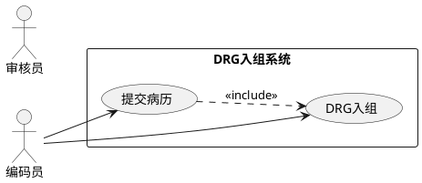

# output_schema.json — 文档结构规范

定义三类目标文档的章节树、图表要求、UML 语法指南和全局写作规则。`tools.py` 按 `doc_type` 裁剪后提交给 LLM 作为章节上下文，`workflow.py` 用于拆解章节和校验完整性。

## 顶层结构

```json
{
  "supported_output_formats": ["pdf"],
  "default_output_format": "pdf",
  "layout_spec_reference": "视觉规范见 output_layout.json",
  "plantuml_guide": { ... },
  "uml_diagram_guide": { ... },
  "global_tips": "...",
  "documents": [ ... ]
}
```

## plantuml_guide

PlantUML 用例图语法指南。LLM 生成用例图时参考此节。

| 关键字 | 渲染效果 | 说明 |
|--------|---------|------|
| `actor "名称"` | 火柴人 + 角色名 | 参与者 |
| `usecase "名称"` | 椭圆 + 用例名 | 用例 |
| `rectangle "名称" { }` | 矩形边界框 | 系统边界 |
| `-->` | 实线箭头 | 关联关系 |
| `..>` | 虚线箭头 | 依赖 (标注 `<<include>>`/`<<extend>>`) |

示例 (来自 `use_case_syntax.example`)：


## uml_diagram_guide

### diagram_types (9 种)

| 图表类型 | 语法 | 渲染工具 | 主要用途 |
|---------|------|---------|---------|
| 用例图 | `plantuml` | render_plantuml | 需求 — 系统功能边界 |
| 活动图 | `flowchart TD` / `stateDiagram-v2` | render_mermaid | 需求 — 业务流程 |
| 时序图 | `sequenceDiagram` | render_mermaid | 架构 — API 调用流程 |
| 类图 | `classDiagram` | render_mermaid | 架构 — 模块类结构 |
| 状态图 | `stateDiagram-v2` | render_mermaid | 需求/架构 — 状态机 |
| ER图 | `erDiagram` | render_mermaid | 架构 — 数据库设计 |
| 部署图 | `flowchart TD` + subgraph | render_mermaid | 架构 — 部署拓扑 |
| 甘特图 | `gantt` | render_mermaid | 测试 — 测试计划 |
| 组件图 | `flowchart TD` + subgraph | render_mermaid | 架构 — 组件依赖 |

### diagram_principles

7 条通用规则：
1. 基于实际代码/需求，不凭空捏造
2. 每图必须有标题和编号
3. 包含图例说明
4. 使用项目实际名称
5. 关系标注用中文
6. 用例图 → ```plantuml + render_plantuml；其他 → ```mermaid + render_mermaid
7. 复杂图表适当简化

## global_tips

LLM 写作全局规则 (9 条)，摘要:

| # | 规则 |
|---|------|
| 1 | required: true 必须生成 |
| 2 | required: false 仅资料不足时可省略 |
| 3 | 资料足够时尽量生成 |
| 4 | 用例图 → PlantUML，其他 → Mermaid |
| 5 | 图表/表格必须紧跟粗体标题，按章编号 |
| 6 | 图片路径直接使用工具返回值 |
| 7 | 元数据由 LLM 生成 |
| 8 | Mermaid → ```mermaid，PlantUML → ```plantuml |
| 9 | 所有视觉规范见 output_layout.json |

## documents[]

### 需求规格说明书

| 一级章节 | required | 图表 |
|---------|----------|------|
| 引言 | true | — |
| 总体描述 | true | 用例图 (系统整体功能) |
| 具体需求 | true | 活动图 (功能需求)、时序图 (软件接口)、状态图 (业务状态模型) |
| 附录 | false | — |

子章节包含 `目的`、`范围`、`定义/缩写/术语`、`参考资料`、`用户特征`、`约束条件`、`假设与依赖`、`功能需求 (带 FR 模板)`、`性能需求`、`安全性需求`、`可靠性需求`、`可维护性需求`、`外部接口需求`、`业务状态模型`、`设计约束`、`需求跟踪矩阵`、`待定需求清单`。

### 架构设计文档

| 一级章节 | required | 图表 |
|---------|----------|------|
| 引言 | true | — |
| 总体结构 | true | 组件图、系统上下文图 |
| 模块详细设计 | true | 类图、时序图 |
| 数据设计 | true | ER图、数据流图 |
| 技术选型 | true | — |
| 部署视图 | true | 部署图 |
| 附录 | false | — |

### 测试文档

| 一级章节 | required | 图表 |
|---------|----------|------|
| 引言 | true | — |
| 测试策略 | true | — |
| 测试环境与工具 | true | 部署图 |
| 测试用例设计 | true | — |
| 测试执行计划 | true | 甘特图、状态图 |
| 测试报告模板 | false | — |

### section 字段说明

每个章节节点包含:

| 字段 | 类型 | 说明 |
|------|------|------|
| `level` | int | 标题层级 (1-5) |
| `title` | string | 章节标题 |
| `description` | string | 章节内容描述 |
| `required` | bool | 是否必须生成 |
| `diagram` | bool | 是否需要图表 |
| `diagram_types` | []string | 需要的图表类型 (对应 uml_diagram_guide) |
| `tips` | string | 给 LLM 的写作提示 |
| `tools` | []string | 推荐使用的工具 (render_plantuml / render_mermaid) |
| `children` | []object | 子章节 (递归同结构) |

标题含 `模板`/`可重复`/`示例`/`依此类推` 的章节不参与 Phase 3.5 的 Schema 合规校验，因为 LLM 会将其替换为实际内容。
