# 架构设计文档

**文档编号**：ADD-DRG-AGENT-V1.0  
**版本号**：V1.0  
**编制日期**：2026年3月  
**文档状态**：正式发布  

## 一、引言

### 1.1 编写目的

本文档为《医保 DRG 入组智能体系统架构设计文档》（Architecture Design Document，编号：ADD-DRG-AGENT-V1.0），旨在向项目开发团队、架构评审人员、测试工程师及后续维护人员完整阐述系统的整体架构方案、模块划分、技术选型与关键设计决策。

本文档的具体目标读者及其关注要点如下：

a. **开发人员**：理解模块职责边界、接口契约、数据流转路径与编码规范，确保各模块独立开发后能够顺利集成。
b. **架构师**：审视整体架构的合理性、可扩展性与技术栈适配性，评估设计是否满足非功能性需求（性能、安全、可维护性等）。
c. **测试工程师**：基于模块接口定义与部署拓扑，制定集成测试策略与环境搭建方案。
d. **项目经理与配置管理员**：把握系统组件依赖关系、部署单元与配置项，指导发布计划与版本管理。
e. **后续维护与运营人员**：理解系统运行时架构、日志与监控埋点位置，支撑生产环境故障排查与性能调优。

本文档不替代各模块的详细设计文档与 API 接口规范（如 OpenAPI 生成的文档），而是聚焦于模块间关系、系统级决策与架构层面的约束。

### 1.2 范围

本文档覆盖医保 DRG 入组智能体系统的完整架构设计，具体包括：

**系统范围（包含）**：

a. **服务端总体架构**：基于 FastAPI 框架的后端服务体系，包括路由组织、中间件链、依赖注入机制与生命周期管理。
b. **智能体子系统**：
   (1) DRG 入组智能体（`server/agent/drg_agent/`）：负责根据电子病历文本与 DRG 分组规则执行三层分组逻辑（MDC → ADRG → DRG），并输出分组结果与入组原因说明。
   (2) 文档生成智能体（`server/agent/docgen_agent/`）：基于系统需求、代码与设计信息自动生成需求分析文档、架构设计文档与测试文档。
   (3) 测试用例生成智能体（设计预留）：根据 DRG 规则自动构建测试场景并生成正常、边界与异常测试用例。
c. **知识库子系统**（`server/knowledge_base/`）：存储与管理 DRG 分组规则（MDC 分类、ADRG 分组表、MCC/CC 列表、排除表），为入组智能体提供规则查询支撑。
d. **用户认证与授权子系统**（`server/user/`）：基于 JWT 令牌的用户注册、登录、令牌刷新与会话管理机制。
e. **数据持久层**（`server/db/`）：基于 SQLModel（SQLAlchemy + Pydantic）与 aiosqlite 的异步数据库访问层，包括表定义、迁移工具与 CRUD 工具函数。
f. **前端客户端**（`client/src/`）：基于 Vue 3 + TypeScript + Vite 的单页应用，包括路由管理、状态管理（Pinia）、API 客户端（通过 OpenAPI 代码生成工具自动生成）与各功能视图（DRG 入组、文档生成、文档管理、用户认证）。
g. **外部服务集成**：与大语言模型服务（OpenAI API 兼容接口）的通信与调用策略。
h. **部署架构**：项目的依赖声明（`pyproject.toml`、`package.json`）、容器化方案（Dockerfile、docker-compose）与运行环境要求。

**不在本文档范围内（不包括）**：

a. DRG 分组规则的具体医学内容与编码规范（属于领域知识，参见《按病组（DRG）付费分组方案（2.0版）》）。
b. 大语言模型本身的训练、微调与提示词工程细节（属于模型工程范畴，本架构仅描述调用接口与集成方式）。
c. 前端 UI/UX 的视觉设计规范与交互细节（属于 UI 设计文档范畴）。
d. 数据库的物理存储参数调优（属于运维配置范畴）。
e. 详细的测试用例清单（属于测试文档范畴，编号：TEST-DRG-AGENT-V1.0）。

**设计层级覆盖**：本文档聚焦于系统级架构设计，涵盖逻辑视图（模块分解与职责）、进程视图（运行时交互与并发模型）、开发视图（代码组织与依赖）与物理视图（部署拓扑），不深入模块内部的类级详细设计与函数级实现细节。

### 1.3 设计约束与目标

本节阐述影响本系统架构决策的关键约束条件以及必须达成的非功能性目标。

#### 1.3.1 技术约束

以下技术约束来源于项目现有技术栈与运行环境：

**表1-1：表格说明**

| 约束项 | 描述 | 影响范围 |
| :---: | :---: | :---: |
| Python 版本锁定 | 服务端运行环境要求 Python 3.13，已在 `pyproject.toml` 中强制声明 `requires-python = "==3.13.*"` | 所有 Python 依赖包必须兼容 Python 3.13；部署镜像须基于 Python 3.13 构建 |
| Node.js 版本要求 | 前端构建要求 Node.js ≥20.19.0 或 ≥22.12.0 | 前端开发环境与 CI 构建节点需满足版本要求 |
| 异步运行模型 | 服务端基于 FastAPI + aiosqlite + asyncio 构建全异步链路 | 所有 IO 密集型操作（数据库访问、外部 API 调用）必须使用异步编程模型，避免阻塞事件循环 |
| SQLite 数据库 | 使用 aiosqlite 作为数据库引擎，SQLModel 为 ORM 层 | 不支持多进程并发写入；适合单实例部署或读写分离方案；需关注 WAL 模式配置 |
| 大模型 API 兼容性 | 通过 `openai` Python SDK 调用大模型服务，需兼容 OpenAI API 格式 | 大模型服务的 base_url 与 API key 可配置，支持兼容 OpenAI 协议的第三方模型服务 |
| 前端 API 客户端生成 | 使用 `@hey-api/openapi-ts` 工具从后端 OpenAPI 规范自动生成 TypeScript 客户端代码 | 后端 API 变更后必须重新生成客户端代码；前端不可手写 API 调用函数 |

#### 1.3.2 业务约束

**表1-1：表格说明**

| 约束项 | 描述 |
| :---: | :---: |
| DRG 分组规则合规 | 系统必须严格遵循《按病组（DRG）付费分组方案（2.0版）》定义的三层分组逻辑（MDC → ADRG → DRG），不得自行变更分组规则 |
| 规则可更新 | DRG 分组规则随国家医保政策调整而更新，系统须支持知识库规则的热更新而不影响在线服务 |
| 入组可解释性 | 每次入组结果必须附带完整的入组路径说明（命中规则、排除表校验结果、MCC/CC 判定依据），满足医保审核的可追溯要求 |
| 文档自动生成规范 | 自动生成的文档须符合指定的文档模板与格式规范（参见 `output_layout.json`），包括章节结构、图表编号、表格格式与排版规则 |

#### 1.3.3 非功能性目标

以下非功能性目标按优先级排序，作为架构评审与后续设计决策的核心依据：

**(1) 性能与响应时间**

a. DRG 入组请求的端到端响应时间（不含大模型推理耗时）应控制在 500 ms 以内。
b. 大模型推理耗时因依赖外部服务，设定合理预期为 5–30 秒；系统应实现请求超时控制（建议 60 秒）并向前端返回处理状态。
c. 文档生成任务允许异步长时间运行（分钟级），系统应提供任务状态查询接口，避免前端连接超时。
d. 数据库查询须通过索引优化与连接池管理，保证并发场景下查询延迟稳定。

**(2) 可用性与可靠性**

a. 服务端应具备健康检查接口（如 `/health`），供负载均衡器或容器编排系统进行存活性探测。
b. 大模型服务不可用时，系统应优雅降级：返回明确的服务不可用错误信息，而非服务崩溃或超时挂起。
c. 前端应具备网络异常与服务器错误的用户友好提示，支持请求重试机制。
d. 数据库文件应支持定期备份策略（通过 SQLite 在线备份或文件级快照），保障数据不丢失。

**(3) 安全性**

a. 用户认证采用 JWT 令牌机制，令牌应设置合理过期时间（访问令牌 ≤ 30 分钟，刷新令牌 ≤ 7 天）。
b. 用户密码使用 Argon2 算法（`passlib[argon2]` + `argon2-cffi`）进行哈希存储，禁止明文存储。
c. 所有 API 端点（除登录与注册外）必须进行令牌校验，未认证请求返回 401 Unauthorized。
d. 前端不得在本地存储中明文保存敏感信息；令牌存储在 Pinia store 中，页面刷新后需通过刷新令牌恢复会话。
e. 输入的电子病历文本可能包含患者敏感信息，系统应在日志中脱敏处理，并遵循最小必要原则进行数据传输与存储。

**(4) 可扩展性与可维护性**

a. 智能体子系统采用模块化设计，各智能体（DRG 入组、文档生成、测试用例生成）应保持松耦合，通过标准化的 API 接口交互，便于独立开发、测试与替换。
b. 知识库子系统应支持多种规则来源：本地文件、数据库表、远程配置服务等，通过统一的数据访问接口屏蔽来源差异。
c. 前端采用组件化架构（Vue 3 单文件组件），各功能视图独立路由，新增功能模块不干扰现有页面。
d. 后端遵循 FastAPI 的 Router 机制组织路由，按业务域（agent、user、db、knowledge_base）划分路由前缀，支持按域独立扩展。
e. 系统应提供完整的 OpenAPI 规范文档（由 FastAPI 自动生成），降低前后端协作成本。

**(5) 可测试性**

a. 智能体的核心分组逻辑应与 API 层解耦，支持在不启动 HTTP 服务的情况下进行单元测试。
b. 数据库操作层应提供内存数据库（`aiosqlite` in-memory）模式的测试支持，加速测试执行并保证测试隔离。
c. 知识库查询接口应支持注入 mock 规则数据，便于编写确定性测试用例。
d. 前端应支持组件级单元测试（Vitest）与端到端测试（Playwright，已在依赖中声明）。

**(6) 可部署性**

a. 系统应支持单机部署模式（开发与演示环境），前后端可在同一主机运行：后端通过 uvicorn 启动，前端通过 vite dev server 或构建后的静态文件服务。
b. 提供 Dockerfile 与 docker-compose 编排文件，支持容器化一键部署。
c. 环境变量（如数据库路径、大模型 API 地址与密钥、JWT 密钥）通过 `.env` 文件或容器环境变量注入，不得硬编码于代码中。

**(7) 文档与可追溯性**

a. 架构设计决策（ADR，Architecture Decision Records）应在本文档的关键设计章节中明确记录，包括决策背景、备选方案与选择理由。
b. 模块间接口应以明确的契约形式定义（API 路由声明、数据模型 Schema），变更时须同步更新本文档与 OpenAPI 规范。
c. 自动生成的文档须标注生成时间与来源信息，保证文档与系统版本的可追溯性。

## 二、总体结构

DRG 入组智能体系统采用**前后端分离的 B/S 架构**，整体遵循**分层架构**与**智能体驱动架构**相结合的设计风格。系统前端基于 Vue 3 单页应用（SPA）构建用户交互界面，后端采用 FastAPI 框架提供 RESTful API 服务，核心业务逻辑由两个专用智能体模块（DRG 入组智能体、文档生成智能体）承载，并通过大模型 API 实现 AI 推理能力。以下为系统组件图，全面展示各模块及其依赖关系：

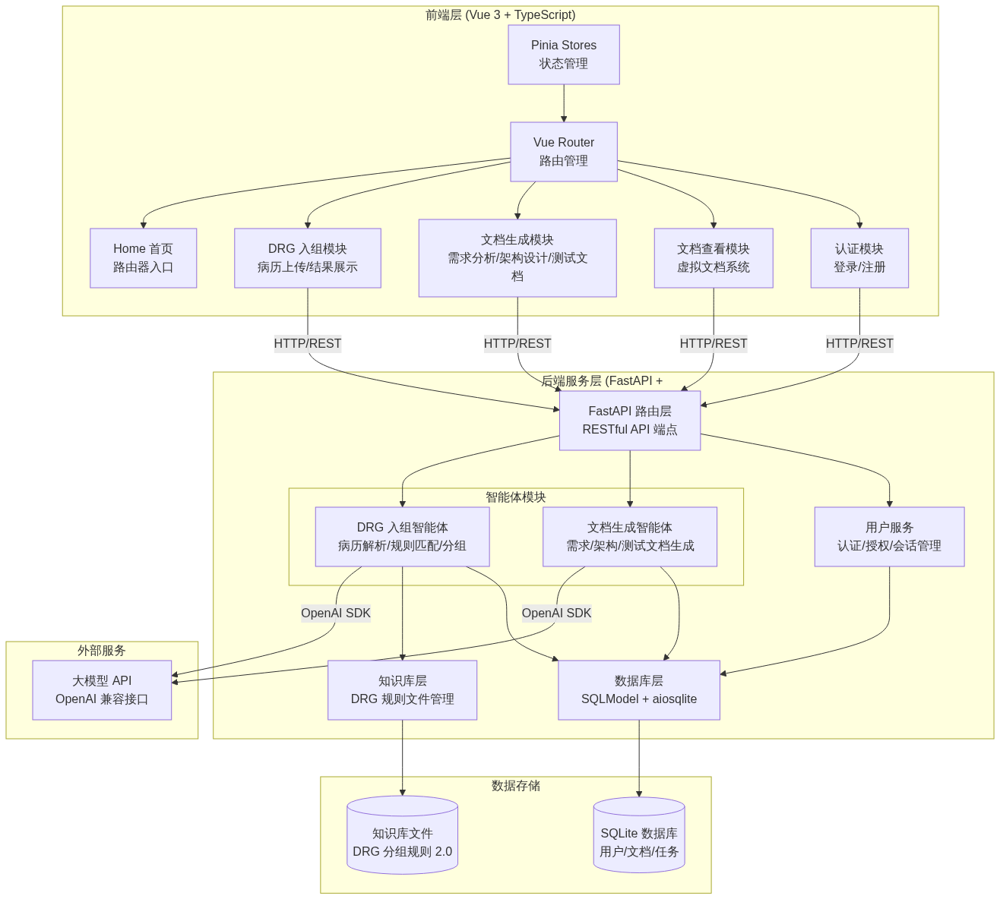

**图2-1：系统组件图**

---

### 2.1 架构风格

本系统综合采用了三种互补的架构风格，以适应不同层次的关注点：

**a. 分层架构（Layered Architecture）**

系统按职责划分为四个水平层次，层间通过明确定义的接口通信，上层依赖下层，下层不感知上层：

1. **前端层（Presentation Layer）**：Vue 3 + TypeScript 构建的单页应用，负责用户界面渲染、交互逻辑和 API 调用。该层通过 Pinia 管理全局状态，通过 Vue Router 实现页面路由，内部进一步划分为视图层（Views）、状态管理层（Stores）和 API 客户端层（Client SDK）。

2. **服务层（Application Layer）**：FastAPI 框架构建的后端服务，负责接收 HTTP 请求、路由分发、参数校验和响应组装。该层以 RESTful API 端点的形式对外暴露服务，并通过依赖注入机制组装下层组件。

3. **业务逻辑层（Business Logic Layer）**：智能体模块（DRG Agent、DocGen Agent）和用户服务模块，封装核心业务规则的执行。智能体模块采用 **ReAct / 工作流（Workflow）模式**，将大模型推理与结构化工具调用结合，实现复杂的 DRG 分组和文档生成流程。

4. **数据访问层（Data Access Layer）**：SQLModel ORM 封装的数据持久化逻辑，基于 aiosqlite 异步驱动，提供用户数据、文档数据和任务记录的 CRUD 操作。知识库层独立管理 DRG 规则文件，以文件系统直接读取的方式为智能体提供规则知识。

**选择理由**：分层架构将 UI 渲染、业务逻辑和数据存储隔离，使各层可独立开发、测试和部署。前端 SPA 可通过 CDN 静态托管，后端服务可独立水平扩容，数据层可替换为 PostgreSQL 等数据库而不影响上层代码。

**b. 智能体驱动架构（Agent-Driven Architecture）**

核心业务逻辑由两个专用智能体承载，每个智能体封装了完整的工作流：

(1) **DRG 入组智能体**：接收电子病历文本，按"MDC 分类 → ADRG 分组 → DRG 细分"三层逻辑逐步推理，调用知识库工具检索规则，最终输出分组结果和解释。
(2) **文档生成智能体**：接收系统需求和代码信息，按文档类型（需求分析、架构设计、测试文档）分别触发生成流程，调用结构化输出工具确保文档符合规范。

**选择理由**：DRG 入组和文档生成均涉及非确定性推理（自然语言理解、规则匹配、内容生成），传统硬编码逻辑难以覆盖全部病历书写变体和文档模板需求。智能体架构利用大模型的语言理解与生成能力，结合结构化工具（规则查询、模板匹配）保证输出可验证性，在灵活性与确定性之间取得平衡。

**c. 客户端-服务器架构（Client-Server Architecture）**

前端 SPA 与后端 API 服务通过 HTTP/HTTPS 协议通信，采用 JSON 格式交换数据。前端由 `@hey-api/openapi-ts` 自动生成 TypeScript 客户端 SDK，保证前后端接口契约的一致性。认证采用 JWT（JSON Web Token）Bearer Token 方案，由后端 `server/user/auth.py` 签发和验证。

**选择理由**：B/S 架构天然支持多用户并发访问，用户无需安装客户端，部署和升级仅需更新服务端；前后端分离使客户端框架（Vue 3）和服务端框架（FastAPI）可各自按最优技术栈演进。

---

### 2.2 系统上下文图

系统上下文图描述本系统与外部实体之间的交互关系，明确系统边界和外部接口：

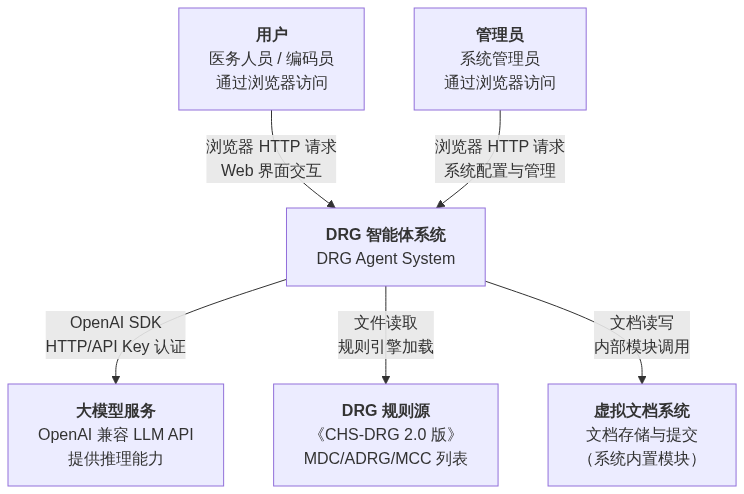

**图2-2：系统上下文图**

**外部实体说明：**

**表1-1：表格说明**

| 外部实体 | 交互方式 | 数据流向 | 说明 |
| :---: | :---: | :---: | :---: |
| 用户（医务人员/编码员） | 浏览器 → HTTPS → 系统 | 双向 | 通过 Web 界面提交电子病历、查看 DRG 分组结果、管理文档。前端 SPA 在浏览器中运行，通过 Axios 向后端 API 发起请求。 |
| 管理员 | 浏览器 → HTTPS → 系统 | 双向 | 通过 Web 界面管理知识库规则文件、查看系统日志、管理用户账号。权限通过 JWT 令牌携带的角色标识区分。 |
| 大模型服务（LLM API） | 系统 → OpenAI SDK → HTTPS → LLM | 双向 | 系统通过 OpenAI 兼容 SDK（`openai>=2.33.0`）调用外部大模型 API。请求携带 System Prompt 和用户输入文本，返回结构化或自然语言推理结果。API Key 通过环境变量注入，不进入代码仓库。 |
| DRG 规则源 | 本地文件系统读取 | 单向（系统读取规则） | 《CHS-DRG 分组方案（2.0 版）》的 MDC 分类、ADRG 分组、MCC/CC 列表以结构化文件形式存储在 `server/knowledge_base/` 目录中，由知识库层直接读取。 |
| 虚拟文档系统 | 模块内调用 | 双向 | 虚拟文档系统作为系统内置模块（`server/db/tables.py` 中文档表 + 前端文档查看页），负责存储智能体生成的文档并支持提交和查看操作，非独立部署的外部系统。 |

**接口协议汇总：**

**表1-1：表格说明**

| 接口编号 | 接口名称 | 协议 | 数据格式 | 认证方式 |
| :---: | :---: | :---: | :---: | :---: |
| I-01 | 前端-后端 API | HTTPS/REST | JSON | JWT Bearer Token |
| I-02 | 后端-LLM API | HTTPS/REST | JSON（OpenAI Chat Completions） | API Key（Bearer） |
| I-03 | 后端-知识库 | 文件 I/O | JSON/Markdown/YAML | 文件系统权限 |
| I-04 | 后端-数据库 | SQL（通过 aiosqlite） | 关系表 | 文件系统权限 |

---

### 2.3 顶层模块划分

系统在顶层划分为五大模块分区，每个分区包含若干子模块。下表列出所有一级模块及其职责概述：

**表2-1：顶层模块划分与职责概述**

| 模块编号 | 模块名称 | 所属层 | 核心职责 | 主要技术栈 |
| :---: | :---: | :---: | :---: | :---: |
| M1 | 前端应用（drg-client） | 前端层 | 提供用户交互界面，包含 DRG 入组操作、文档生成配置、文档查看与管理和用户认证等页面 | Vue 3, TypeScript, Pinia, Vue Router, Axios, SCSS |
| M2 | API 网关与路由（FastAPI Router） | 服务层 | 统一接收 HTTP 请求，进行参数校验、JWT 认证和路由分发，返回 JSON 响应 | FastAPI, Pydantic, python-jose |
| M3 | DRG 入组智能体（drg_agent） | 业务逻辑层 | 解析电子病历文本，按 MDC → ADRG → DRG 三层规则逐步推理，输出分组结果和入组原因 | Python, OpenAI SDK, Pydantic Models |
| M4 | 文档生成智能体（docgen_agent） | 业务逻辑层 | 根据系统需求和代码信息，自动生成需求分析文档、架构设计文档和测试文档，支持异步任务管理 | Python, OpenAI SDK, Markdown, Playwright |
| M5 | 数据与基础设施 | 数据层/基础设施 | 管理数据库表结构、用户认证凭证、知识库规则文件和异步任务状态 | SQLModel, aiosqlite, passlib, argon2 |

**M1 前端应用（drg-client）子模块：**

**表2-2：表格说明**

| 子模块 | 文件/目录 | 职责 |
| :---: | :---: | :---: |
| 路由管理 | `client/src/router/index.ts` | 定义全局路由表，控制页面导航和访问守卫 |
| 状态管理 | `client/src/stores/auth.ts` | 管理用户登录态、JWT 令牌和用户信息 |
| API 客户端 | `client/src/api/` | 基于 OpenAPI 规范自动生成的 TypeScript SDK，封装所有后端 API 调用 |
| DRG 入组视图 | `client/src/views/DRG/` | 病历输入表单、分组结果展示和入组路径可视化 |
| 文档生成视图 | `client/src/views/DocGen/` | 文档类型选择、生成参数配置和生成进度展示 |
| 文档查看视图 | `client/src/views/Doc.vue` | 文档列表浏览和 Markdown 渲染阅读 |
| 认证视图 | `client/src/views/Auth/AuthPage.vue` | 登录和注册表单 |
| 首页模块 | `client/src/views/Home/` | 功能引导、特性展示和模板入口 |

**M3 DRG 入组智能体（drg_agent）子模块：**

**表2-2：表格说明**

| 子模块 | 文件 | 职责 |
| :---: | :---: | :---: |
| API 端点 | `server/agent/drg_agent/api.py` | 暴露 DRG 入组的 RESTful 接口，接收病历文本并返回分组结果 |
| 任务编排 | `server/agent/drg_agent/task.py` | 定义 DRG 入组任务的异步执行流程和状态管理 |
| 数据模型 | `server/agent/drg_agent/models.py` | Pydantic 模型定义：病历输入结构、分组结果结构、中间推理步骤 |
| 入口模块 | `server/agent/drg_agent/__main__.py` | 智能体独立运行入口，支持命令行调试 |
| 共享表结构 | `server/agent/table.py` | 定义 DRG 分组任务在数据库中的持久化表结构 |

**M4 文档生成智能体（docgen_agent）子模块：**

**表2-2：表格说明**

| 子模块 | 文件 | 职责 |
| :---: | :---: | :---: |
| API 端点 | `server/agent/docgen_agent/api.py` | 暴露文档生成的 RESTful 接口，支持同步和异步启动两种模式 |
| 工作流引擎 | `server/agent/docgen_agent/workflow.py` | 编排文档生成的工作流，控制 LLM 调用顺序和输出拼接 |
| 工具集 | `server/agent/docgen_agent/tools.py` | 提供文档模板、格式校验、内容清理等工具函数 |

**M5 数据与基础设施子模块：**

**表2-2：表格说明**

| 子模块 | 文件 | 职责 |
| :---: | :---: | :---: |
| 数据库表定义 | `server/db/tables.py` | 定义用户表、文档表、任务表等 SQLModel 实体 |
| 数据库工具 | `server/db/utils.py` | 提供数据库初始化、连接池管理和迁移辅助 |
| 数据库入口 | `server/db/__init__.py` | 导出数据库引擎和会话工厂 |
| 用户认证 | `server/user/auth.py` | JWT 令牌签发与验证、密码哈希处理 |
| 用户 API | `server/user/api.py` | 暴露注册、登录、用户信息查询接口 |
| 用户表结构 | `server/user/table.py` | 用户实体和配置的 SQLModel 定义 |
| 知识库管理 | `server/knowledge_base/table.py` | 管理 DRG 规则文件的结构化加载和查询接口 |

**模块依赖关系约束：**

1. 前端 M1 仅依赖后端 M2 的 HTTP API 接口，不直接访问 M5 数据库或 M3/M4 智能体内部。
2. M3 和 M4 智能体通过 OpenAI SDK 调用外部大模型服务，通过 M5 的知识库层读取 DRG 规则，通过 M5 的数据库层持久化任务状态。
3. M3 和 M4 之间无直接依赖，各自独立运行，通过 M5 共享数据层实现间接协作（如文档生成智能体读取 DRG 入组结果）。
4. M5 各子模块之间允许相互引用，但数据库表定义层为最底层，不依赖任何上层模块。

现在我已掌握了所有关键信息。让我撰写完整的模块详细设计章节。

---

## 二、模块详细设计

本章对 DRG 入组智能体系统的六大核心模块进行详细设计描述，包括模块职责、接口定义和模块间交互。系统采用前后端分离架构，后端基于 FastAPI 框架，前端基于 Vue 3 + TypeScript，各模块通过 REST API 进行通信。

### 2.1 DRG 入组智能体模块（DRG Agent）

#### 2.1.1 职责描述

DRG 入组智能体模块是系统的核心业务模块，负责接收电子病历文本和 DRG 分组规则，执行三层分组逻辑（MDC → ADRG → DRG），最终输出 DRG 组号、组名和入组原因说明。该模块封装在 `server/agent/drg_agent/` 目录下，由四个核心文件组成：`api.py`（API 路由）、`task.py`（入组任务逻辑）、`models.py`（数据模型）和 `__main__.py`（模块入口）。

该模块的核心任务包括：

a. 解析电子病历中的主要诊断编码、次要诊断编码和手术操作编码；
b. 根据主要诊断编码匹配 MDC（主要诊断大类）；
c. 根据主要诊断和主要手术操作匹配 ADRG（核心分组）；
d. 基于次要诊断中的 MCC/CC（严重/一般合并症或并发症）列表，结合排除表校验，确定最终的 DRG 细分组；
e. 将入组结果持久化到数据库，支持历史查询。

#### 2.1.2 接口定义

**表2-1：DRG Agent 模块 API 接口**

| 方法 | 路径 | 请求体 | 响应体 | 说明 |
| :---: | :---: | :---: | :---: | :---: |
| POST | `/api/drg_agent/group` | `DRGInput` | `DRGOutput` | 执行 DRG 入组，返回分组结果 |
| GET | `/api/drg_agent/history` | — | `List[DRGOutput]` | 查询历史入组记录 |
| GET | `/api/drg_agent/history/{id}` | — | `DRGOutput` | 查询单条入组记录详情 |

**（1）DRGInput 数据结构**

**表2-2：表格说明**

| 字段 | 类型 | 必填 | 说明 |
| :---: | :---: | :---: | :---: |
| `medical_record` | `str` | 是 | 电子病历文本，含主要诊断、手术操作、次要诊断等 |
| `rules_version` | `str` | 否 | DRG 分组规则版本号，默认使用最新版本（2.0 版） |

**（2）DRGOutput 数据结构**

**表2-2：表格说明**

| 字段 | 类型 | 说明 |
| :---: | :---: | :---: |
| `mdc_code` | `str` | MDC 编码（如 "MDCB"） |
| `mdc_name` | `str` | MDC 名称（如 "神经系统疾病及功能障碍"） |
| `adrg_code` | `str` | ADRG 编码（如 "BB1"） |
| `adrg_name` | `str` | ADRG 名称（如 "神经系统复合手术组"） |
| `drg_code` | `str` | DRG 细分组编码（如 "BB11"） |
| `drg_name` | `str` | DRG 组名（如 "神经系统复合手术，伴严重合并症或并发症"） |
| `reasoning` | `str` | 入组原因说明，包含各层判断依据 |
| `id` | `int` | 记录 ID（历史查询时返回） |
| `created_at` | `str` | 记录创建时间 |

**（3）异常说明**

**表2-2：表格说明**

| 异常类型 | HTTP 状态码 | 说明 |
| :---: | :---: | :---: |
| 主要诊断编码无法识别 | 422 | 主要诊断编码不在 MDC 分类表中 |
| 手术操作编码无法匹配 | 422 | 主要手术操作无法匹配到任何 ADRG |
| 规则文件不可用 | 503 | 知识库未加载或规则版本错误 |
| 病历文本格式错误 | 400 | 输入文本无法解析为结构化病历 |

**（4）内部核心类/函数接口**

`DRGTask` 类（`task.py`）是入组逻辑的核心，提供以下方法：

**表2-2：表格说明**

| 方法签名 | 说明 |
| :---: | :---: |
| `execute(record: MedicalRecord, rules: DRGRules) -> DRGResult` | 执行完整的三层入组流程 |
| `classify_mdc(diagnosis: str, mdc_table: dict) -> MDC` | 第一层：根据主要诊断匹配 MDC |
| `match_adrg(diagnosis: str, procedure: str, adrg_table: dict) -> ADRG` | 第二层：根据诊断+手术匹配 ADRG |
| `determine_drg(adrg: ADRG, comorbidities: list, rules: DRGRules) -> DRG` | 第三层：根据合并症确定 DRG 细分组 |
| `check_cc_mcc(secondary_diagnoses: list, rules: DRGRules) -> CC_MCC_Result` | 检查次要诊断中是否存在 CC/MCC |

`DRGModels` 模块（`models.py`）定义核心数据结构：

**表2-2：表格说明**

| 类名 | 说明 |
| :---: | :---: |
| `MedicalRecord` | 结构化病历：`primary_diagnosis`、`secondary_diagnoses`、`primary_procedure`、`secondary_procedures`、`patient_info` |
| `DRGRules` | DRG 规则容器：`mdc_table`、`adrg_table`、`cc_list`、`mcc_list`、`exclusion_table` |
| `DRGResult` | 分组结果：`mdc`、`adrg`、`drg`、`reasoning` |
| `MDC` | 主要诊断大类：`code`、`name`、`diagnosis_list` |
| `ADRG` | 核心分组：`code`、`name`、`procedure_list`、`supports_complication` |
| `DRG` | 细分组：`code`、`name`、`complication_level` |

#### 2.1.3 依赖与其他模块的交互

DRG Agent 模块依赖以下模块：

a. **知识库模块**（`server/knowledge_base/`）：获取 MDC 分类表、ADRG 分组表、MCC/CC 列表及排除表；
b. **数据库模块**（`server/db/`）：持久化入组记录至 `DRGRecordTable`；
c. **用户认证模块**（`server/user/`）：验证请求用户身份。

**图2-1：DRG 入组完整交互时序图**

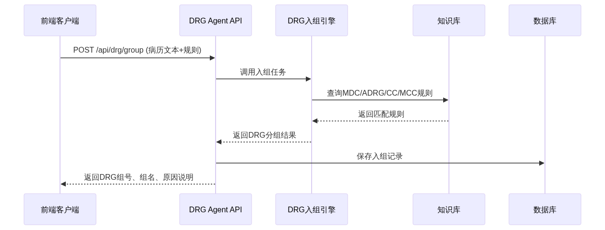

**图2-2：DRG Agent 模块核心类图**

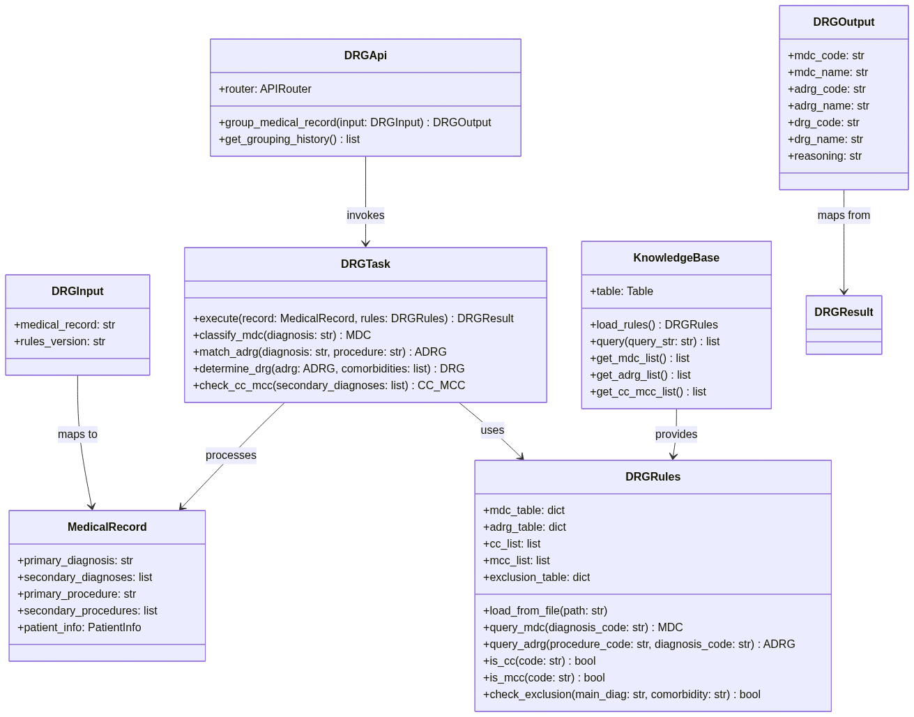

DRG Agent 模块与其他模块的详细交互流程：

a. 前端将病历文本通过 `POST /api/drg_agent/group` 提交至 `DRGApi` 路由；
b. `DRGApi` 调用 `DRGTask.execute()` 启动入组流程；
c. `DRGTask` 从 `KnowledgeBase` 加载当前版本的 `DRGRules`（含 MDC 表、ADRG 表、CC/MCC 列表及排除表）；
d. `DRGTask.classify_mdc()` 将主要诊断编码在 MDC 表中进行匹配，确定 MDC；
e. `DRGTask.match_adrg()` 将主要诊断编码和主要手术编码在 ADRG 表中进行联合匹配；
f. `DRGTask.check_cc_mcc()` 遍历次要诊断编码，依次在 MCC 列表和 CC 列表中查找，并校验排除表；
g. `DRGTask.determine_drg()` 根据 ADRG 是否支持并发症分层和 MCC/CC 判定结果，确定最终 DRG 编码；
h. 结果通过 `DRGApi` 返回前端，同时写入数据库 `DRGRecordTable`。

---

### 2.2 文档生成智能体模块（DocGen Agent）

#### 2.2.1 职责描述

文档生成智能体模块负责基于系统需求、代码和设计信息自动生成符合规范的软件工程文档。该模块封装在 `server/agent/docgen_agent/` 目录下，由四个核心文件组成：`api.py`（API 路由）、`workflow.py`（文档生成工作流）、`tools.py`（文档工具函数）和 `README.md`。

该模块的核心任务包括：

a. 接收用户指定的文档类型（需求分析文档 / 架构设计文档 / 测试文档）和上下文信息；
b. 从系统代码库和数据库中采集生成文档所需的上下文数据（需求描述、接口定义、数据模型等）；
c. 调用大语言模型（OpenAI 兼容接口）按规范模板生成文档内容；
d. 对生成的文档进行格式校验和 Markdown 规范化处理；
e. 将生成的文档持久化到数据库，并返回文档下载链接。

#### 2.2.2 接口定义

**表2-2：DocGen Agent 模块 API 接口**

| 方法 | 路径 | 请求体 | 响应体 | 说明 |
| :---: | :---: | :---: | :---: | :---: |
| POST | `/api/docgen_agent/generate-doc` | `DocGenRequest` | `DocGenResponse` | 同步生成文档（适用于简短文档） |
| POST | `/api/docgen_agent/generate-doc/start` | `DocGenRequest` | `TaskResponse` | 异步启动文档生成任务 |
| GET | `/api/docgen_agent/generate-doc/status/{task_id}` | — | `TaskStatus` | 查询异步任务状态与结果 |

**（1）DocGenRequest 数据结构**

**表2-3：表格说明**

| 字段 | 类型 | 必填 | 说明 |
| :---: | :---: | :---: | :---: |
| `doc_type` | `str` | 是 | 文档类型，可选值：`srs`（需求规格说明书）、`add`（架构设计文档）、`test`（测试文档） |
| `requirements` | `str` | 是 | 系统需求描述文本或需求 ID |
| `additional_context` | `str` | 否 | 补充上下文信息，如特定的模块名称、接口列表等 |

**（2）DocGenResponse 数据结构（同步模式）**

**表2-3：表格说明**

| 字段 | 类型 | 说明 |
| :---: | :---: | :---: |
| `task_id` | `str` | 任务唯一标识 |
| `status` | `str` | 状态：`completed` |
| `document` | `str` | 生成的 Markdown 文档内容 |
| `download_url` | `str` | 文档下载 URL |

**（3）TaskResponse 数据结构（异步模式）**

**表2-3：表格说明**

| 字段 | 类型 | 说明 |
| :---: | :---: | :---: |
| `task_id` | `str` | 任务唯一标识 |
| `status` | `str` | 状态：`pending`、`running`、`completed`、`failed` |
| `message` | `str` | 状态说明 |

**（4）TaskStatus 数据结构**

**表2-3：表格说明**

| 字段 | 类型 | 说明 |
| :---: | :---: | :---: |
| `task_id` | `str` | 任务唯一标识 |
| `status` | `str` | 当前状态 |
| `progress` | `float` | 进度百分比（0–100） |
| `result` | `str` | 完成后的文档内容（仅 `completed` 时有值） |
| `error` | `str` | 错误信息（仅 `failed` 时有值） |

**（5）内部核心类/函数接口**

`DocGenWorkflow` 类（`workflow.py`）：

**表2-3：表格说明**

| 方法签名 | 说明 |
| :---: | :---: |
| `run(task: DocGenTask) -> str` | 执行文档生成工作流 |
| `generate_srs(requirements: str) -> str` | 生成需求规格说明书 |
| `generate_add(architecture: str) -> str` | 生成架构设计文档 |
| `generate_test(cases: str) -> str` | 生成测试文档 |

`DocGenTools` 类（`tools.py`）：

**表2-3：表格说明**

| 方法签名 | 说明 |
| :---: | :---: |
| `fetch_system_context() -> str` | 从数据库和代码库采集系统上下文 |
| `fetch_code_context() -> str` | 采集代码结构信息（路由、模型等） |
| `format_markdown(content: str) -> str` | 规范化 Markdown 格式 |
| `validate_document(doc: str) -> bool` | 校验文档结构完整性 |

`DocGenTask` 数据类：

**表2-3：表格说明**

| 字段 | 类型 | 说明 |
| :---: | :---: | :---: |
| `task_id` | `str` | 唯一任务标识 |
| `doc_type` | `str` | 文档类型 |
| `context` | `str` | 用户提供的上下文 |
| `status` | `str` | 任务状态 |
| `result` | `str` | 生成的文档内容 |

#### 2.2.3 依赖与其他模块的交互

DocGen Agent 模块依赖以下模块：

a. **数据库模块**：读取系统需求描述和代码元数据，持久化生成的文档至 `DocumentTable`；
b. **大语言模型服务**：通过 OpenAI 兼容接口（`openai` Python 库）调用大模型生成文档内容；
c. **用户认证模块**：验证请求用户身份。

**图2-3：文档生成完整交互时序图**

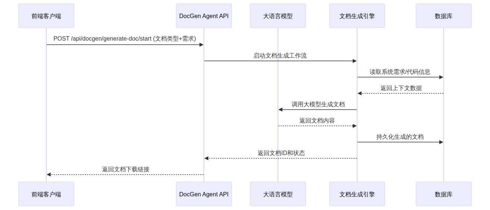

**图2-4：DocGen Agent 模块核心类图**

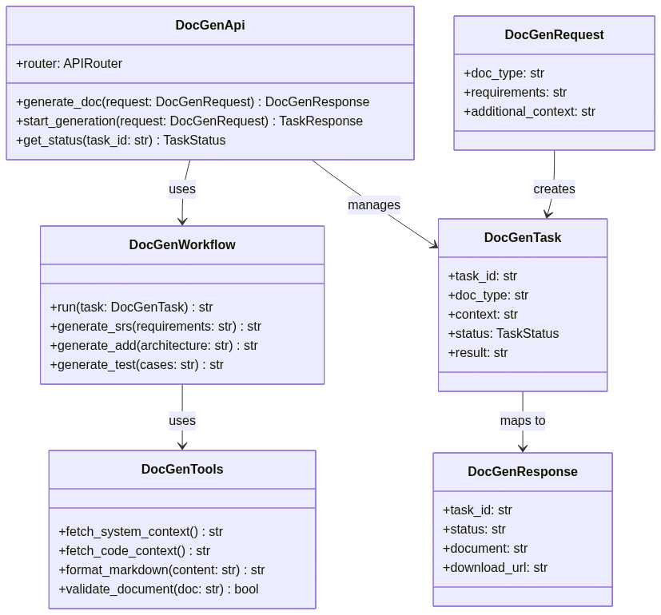

DocGen Agent 模块与其他模块的详细交互流程：

a. 前端提交文档生成请求至 `POST /api/docgen_agent/generate-doc/start`；
b. `DocGenApi` 创建 `DocGenTask` 实例，状态设为 `pending`，返回 `task_id`；
c. `DocGenWorkflow.run()` 在后台异步执行：首先调用 `DocGenTools.fetch_system_context()` 从数据库采集代码结构、API 路由和数据模型信息；
d. `DocGenTools.fetch_code_context()` 扫描项目目录结构，提取模块列表和依赖关系；
e. 将采集的上下文与用户需求拼接为提示词，调用 OpenAI 大模型接口；
f. 大模型返回生成的 Markdown 文档，`DocGenTools.format_markdown()` 进行格式规范化和清洗（去除客套话、AI 声明等）；
g. `DocGenTools.validate_document()` 校验文档结构完整性（必需章节是否齐全）；
h. 生成的文档写入 `DocumentTable`，任务状态更新为 `completed`；
i. 前端通过 `GET /api/docgen_agent/generate-doc/status/{task_id}` 轮询获取结果。

---

### 2.3 用户认证模块（User Authentication）

#### 2.3.1 职责描述

用户认证模块负责系统的用户注册、登录认证和会话管理。该模块封装在 `server/user/` 目录下，由三个核心文件组成：`api.py`（认证 API 路由）、`auth.py`（认证服务逻辑）和 `table.py`（用户数据模型定义）。

该模块的核心任务包括：

a. 用户注册：接收用户名和密码，使用 Argon2 算法进行密码哈希，创建用户记录；
b. 用户登录：验证用户名和密码，生成 JWT 访问令牌；
c. 令牌验证：在各受保护的 API 端点中验证 JWT 令牌的有效性；
d. 当前用户信息获取：根据令牌解析并返回当前用户基本信息。

#### 2.3.2 接口定义

**表2-3：用户认证模块 API 接口**

| 方法 | 路径 | 请求体 | 响应体 | 说明 |
| :---: | :---: | :---: | :---: | :---: |
| POST | `/api/user/register` | `UserCreate` | `UserResponse` | 注册新用户 |
| POST | `/api/user/login` | `OAuth2PasswordRequestForm` | `Token` | 用户登录，获取访问令牌 |
| GET | `/api/user/me` | — | `UserResponse` | 获取当前登录用户信息（需 Bearer Token） |

**（1）UserCreate 数据结构**

**表2-4：表格说明**

| 字段 | 类型 | 必填 | 说明 |
| :---: | :---: | :---: | :---: |
| `username` | `str` | 是 | 用户名，需唯一 |
| `password` | `str` | 是 | 明文密码，长度不小于 6 位 |

**（2）UserResponse 数据结构**

**表2-4：表格说明**

| 字段 | 类型 | 说明 |
| :---: | :---: | :---: |
| `id` | `int` | 用户 ID |
| `username` | `str` | 用户名 |
| `created_at` | `str` | 注册时间（ISO 8601 格式） |

**（3）Token 数据结构**

**表2-4：表格说明**

| 字段 | 类型 | 说明 |
| :---: | :---: | :---: |
| `access_token` | `str` | JWT 访问令牌 |
| `token_type` | `str` | 令牌类型，固定为 `"bearer"` |

**（4）内部核心类/函数接口**

`AuthService` 类（`auth.py`）：

**表2-4：表格说明**

| 方法签名 | 说明 |
| :---: | :---: |
| `authenticate(username: str, password: str) -> User` | 验证用户凭据，失败抛出异常 |
| `create_access_token(user: User) -> str` | 为用户生成 JWT 令牌，含过期时间 |
| `get_password_hash(password: str) -> str` | 使用 Argon2 算法计算密码哈希 |
| `verify_password(plain: str, hashed: str) -> bool` | 验证明文密码与哈希是否匹配 |
| `get_current_user(token: str) -> User` | 从 JWT 令牌解析当前用户 |

**（5）异常说明**

**表2-4：表格说明**

| 异常类型 | HTTP 状态码 | 说明 |
| :---: | :---: | :---: |
| 用户名已存在 | 409 | 注册时用户名重复 |
| 用户名或密码错误 | 401 | 登录凭据不匹配 |
| 令牌无效或过期 | 401 | JWT 令牌验证失败 |
| 未提供认证令牌 | 401 | 请求未携带 Authorization 头 |

#### 2.3.3 依赖与其他模块的交互

用户认证模块依赖以下模块：

a. **数据库模块**：读写 `UserTable`（`server/db/tables.py` 中定义），持久化用户信息；
b. **Python-Jose 库**：用于 JWT 令牌的生成和解析；
c. **Passlib + Argon2**：用于密码哈希和验证。

**图2-5：用户认证交互时序图**

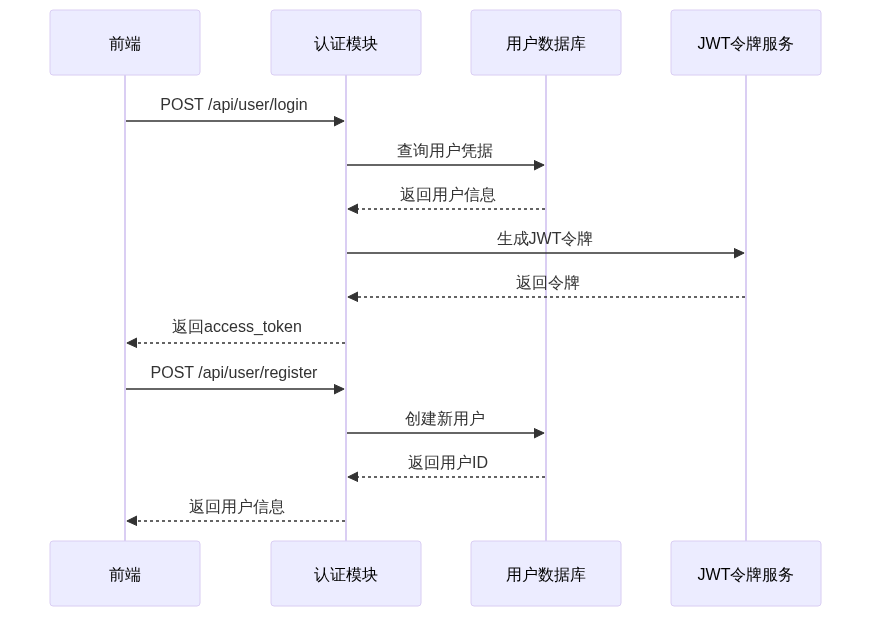

**图2-6：用户认证模块核心类图**

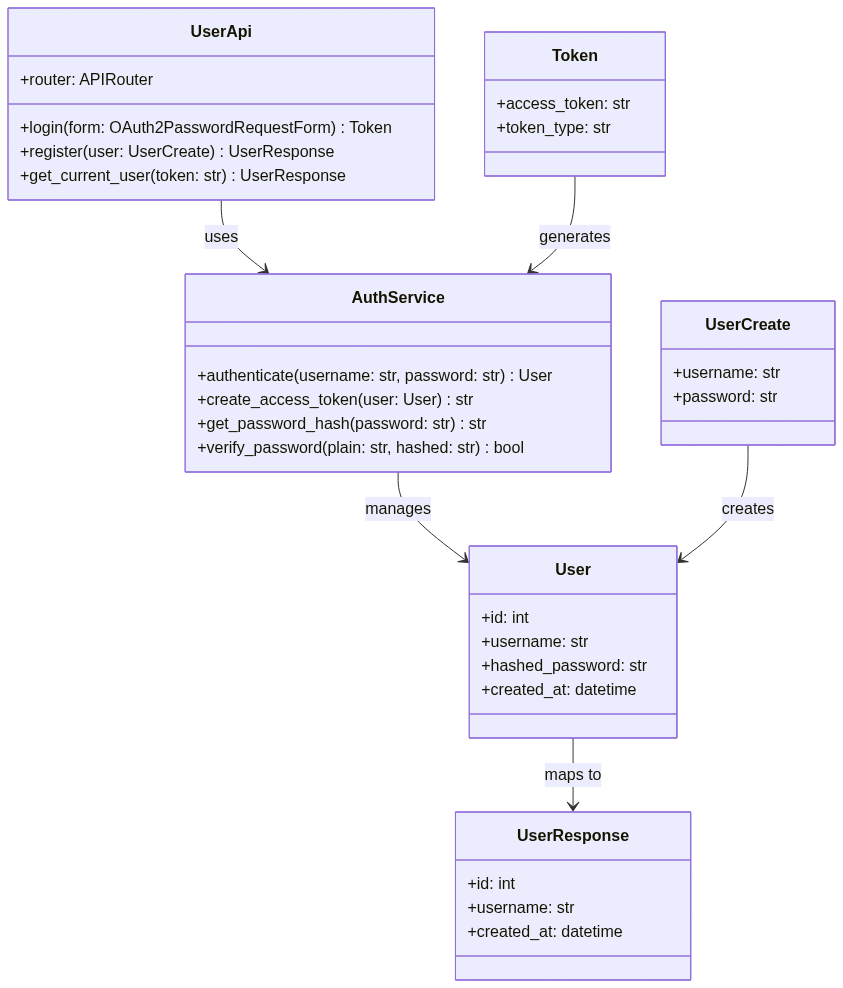

用户认证模块与其他模块的详细交互流程：

a. **注册流程**：前端提交 `POST /api/user/register` → `UserApi.register()` 校验用户名唯一性 → `AuthService.get_password_hash()` 使用 Argon2 生成哈希 → 写入 `UserTable` → 返回 `UserResponse`；
b. **登录流程**：前端提交 `POST /api/user/login` → `UserApi.login()` → `AuthService.authenticate()` 从数据库查询用户并通过 `verify_password()` 验证 → `AuthService.create_access_token()` 使用 python-jose 生成 JWT → 返回 `Token`；
c. **令牌验证流程**：受保护 API 端点通过 FastAPI 的 `Depends(get_current_user)` 依赖注入 → `AuthService.get_current_user()` 解析 Authorization 头中的 Bearer Token → 验证签名和过期时间 → 注入当前 `User` 对象供业务逻辑使用。

---

### 2.4 数据库模块（Database）

#### 2.4.1 职责描述

数据库模块负责系统所有持久化数据的存储、查询和管理。该模块封装在 `server/db/` 目录下，由三个核心文件组成：`__init__.py`（数据库引擎和会话工厂）、`tables.py`（数据表模型定义）和 `utils.py`（数据库工具函数）。

该模块的核心任务包括：

a. 管理 SQLite 数据库引擎（`aiosqlite` 异步驱动）和异步会话工厂；
b. 定义所有数据表的 ORM 模型（基于 SQLModel）；
c. 提供数据库初始化函数 `init_db()`，自动创建所有表结构；
d. 提供会话获取函数 `get_session()`，以依赖注入方式供各模块使用；
e. 封装通用 CRUD 工具函数。

#### 2.4.2 接口定义

**（1）数据库模块对外接口**

**表2-4：表格说明**

| 函数签名 | 说明 |
| :---: | :---: |
| `init_db() -> None` | 初始化数据库，创建所有表（应用启动时调用） |
| `get_session() -> AsyncGenerator[AsyncSession, None]` | FastAPI 依赖注入生成器，提供异步数据库会话 |

**（2）数据表模型（`tables.py`）**

**表2-4：表格说明**

| 表模型类 | 对应数据库表 | 说明 |
| :---: | :---: | :---: |
| `UserTable` | `user` | 用户信息：`id`、`username`、`hashed_password`、`created_at`、`updated_at` |
| `DRGRecordTable` | `drg_record` | DRG 入组记录：`id`、`medical_record`、`mdc_code`、`mdc_name`、`adrg_code`、`adrg_name`、`drg_code`、`drg_name`、`reasoning`、`user_id`、`created_at` |
| `DocumentTable` | `document` | 生成文档：`id`、`title`、`doc_type`、`content`、`author_id`、`status`、`created_at`、`updated_at` |
| `KnowledgeBaseTable` | `knowledge_base` | 知识库规则：`id`、`rule_type`、`rule_code`、`rule_name`、`rule_content`、`version`、`created_at` |

**（3）工具函数（`utils.py`）**

**表2-4：表格说明**

| 函数签名 | 说明 |
| :---: | :---: |
| `create_record(session, model, data) -> model` | 通用创建记录 |
| `get_record_by_id(session, model, id) -> model` | 按 ID 查询记录 |
| `list_records(session, model, filters) -> list` | 按条件列表查询 |
| `update_record(session, model, id, data) -> model` | 更新记录 |
| `delete_record(session, model, id) -> bool` | 删除记录 |

**（4）数据库配置**

**表2-4：表格说明**

| 配置项 | 值 | 说明 |
| :---: | :---: | :---: |
| 数据库引擎 | SQLite + aiosqlite | 异步 SQLite 驱动 |
| ORM 框架 | SQLModel | 基于 SQLAlchemy + Pydantic |
| 数据库文件路径 | 由环境变量 `DATABASE_URL` 指定 | 默认 `sqlite+aiosqlite:///./drg.db` |
| 连接池 | 默认（单文件 SQLite） | SQLite 为单写者模式 |

#### 2.4.3 依赖与其他模块的交互

数据库模块是所有后端模块的基础依赖，无反向依赖。其他所有模块（DRG Agent、DocGen Agent、用户认证、知识库）均通过 `get_session()` 依赖注入获取数据库会话。

**图2-7：数据库模块核心类图**

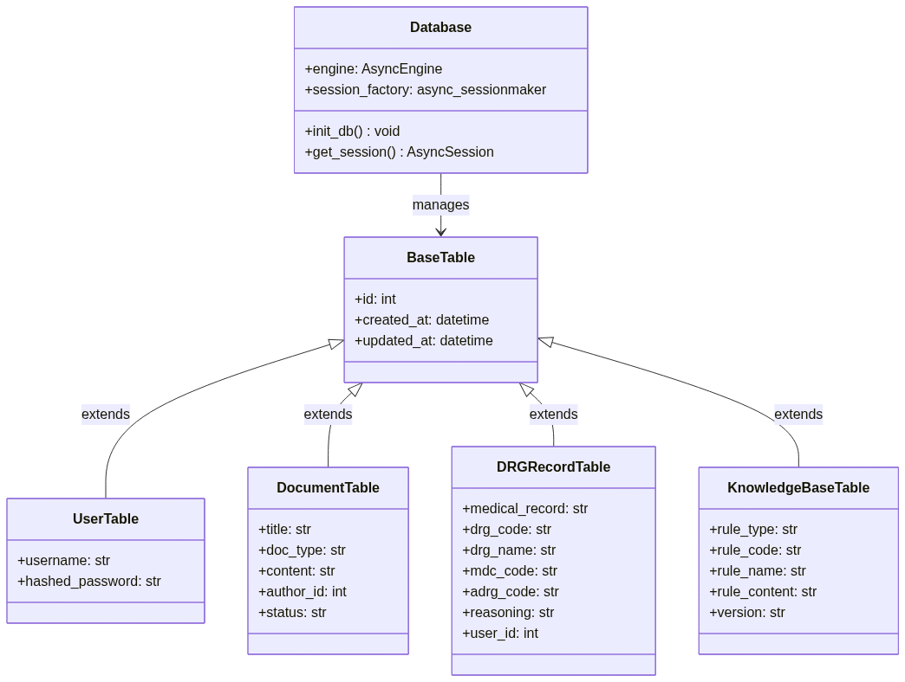

数据库模块与其他模块的详细交互：

a. **应用启动**：FastAPI 应用启动事件调用 `init_db()`，自动创建所有数据表（基于 SQLModel 的 `SQLModel.metadata.create_all`）；
b. **请求处理**：各 API 端点通过 `Depends(get_session)` 获取异步会话 → 执行业务逻辑（CRUD）→ 提交事务或回滚 → 会话在请求结束时自动关闭；
c. **用户认证模块**通过 `UserTable` 读写用户数据；
d. **DRG Agent 模块**通过 `DRGRecordTable` 持久化入组记录；
e. **DocGen Agent 模块**通过 `DocumentTable` 持久化生成的文档；
f. **知识库模块**通过 `KnowledgeBaseTable` 加载 DRG 分组规则数据。

---

### 2.5 知识库模块（Knowledge Base）

#### 2.5.1 职责描述

知识库模块负责存储和管理 DRG 分组规则数据，为 DRG Agent 模块提供规则查询能力。该模块封装在 `server/knowledge_base/` 目录下，核心文件为 `table.py`。

该模块的核心任务包括：

a. 加载和管理《按病组（DRG）付费分组方案（2.0 版）》中的 MDC 分类表、ADRG 分组表、MCC 列表、CC 列表和排除表；
b. 提供规则查询接口，支持按诊断编码、手术编码进行匹配查询；
c. 支持规则版本管理，可加载不同版本的规则数据；
d. 为 DRG Agent 入组逻辑提供规则数据支撑。

#### 2.5.2 接口定义

**表2-4：知识库模块内部接口**

| 函数/方法签名 | 说明 |
| :---: | :---: |
| `load_rules(version: str = "2.0") -> DRGRules` | 加载指定版本的完整 DRG 规则集 |
| `query_mdc(diagnosis_code: str) -> Optional[MDC]` | 根据诊断编码查询所属 MDC |
| `query_adrg(procedure_code: str, diagnosis_code: str) -> Optional[ADRG]` | 根据手术和诊断联合查询 ADRG |
| `is_cc(code: str) -> bool` | 判断诊断编码是否属于 CC 列表 |
| `is_mcc(code: str) -> bool` | 判断诊断编码是否属于 MCC 列表 |
| `check_exclusion(main_diag: str, comorbidity: str) -> bool` | 检查某合并症是否被主诊断排除 |
| `get_mdc_list() -> List[MDC]` | 获取全部 MDC 分类列表 |
| `get_adrg_list() -> List[ADRG]` | 获取全部 ADRG 分组列表 |
| `get_cc_mcc_list() -> Dict[str, List[str]]` | 获取全部 CC 和 MCC 编码列表 |

**（1）规则数据结构**

`MDC` 数据类：

**表2-5：表格说明**

| 字段 | 类型 | 说明 |
| :---: | :---: | :---: |
| `code` | `str` | MDC 编码（如 "MDCB"） |
| `name` | `str` | MDC 名称（如 "神经系统疾病及功能障碍"） |
| `diagnosis_ranges` | `List[str]` | 诊断编码范围列表 |

`ADRG` 数据类：

**表2-5：表格说明**

| 字段 | 类型 | 说明 |
| :---: | :---: | :---: |
| `code` | `str` | ADRG 编码（如 "BB1"） |
| `name` | `str` | ADRG 名称（如 "神经系统复合手术组"） |
| `mdc_code` | `str` | 所属 MDC 编码 |
| `procedure_codes` | `List[str]` | 手术操作编码列表 |
| `supports_complication` | `bool` | 是否支持并发症分层（即是否可进一步细分 DRG） |

`DRGRules` 聚合类：

**表2-5：表格说明**

| 字段 | 类型 | 说明 |
| :---: | :---: | :---: |
| `version` | `str` | 规则版本号 |
| `mdc_table` | `Dict[str, MDC]` | MDC 编码 → MDC 对象映射 |
| `adrg_table` | `Dict[str, List[ADRG]]` | MDC 编码 → ADRG 列表映射 |
| `cc_list` | `Set[str]` | CC 诊断编码集合 |
| `mcc_list` | `Set[str]` | MCC 诊断编码集合 |
| `exclusion_table` | `Dict[str, Set[str]]` | 主诊断编码 → 被排除的合并症编码集合 |

#### 2.5.3 依赖与其他模块的交互

知识库模块依赖以下模块：

a. **数据库模块**：规则数据存储在 `KnowledgeBaseTable` 中，通过 `KnowledgeBaseTable` 读取和缓存；
b. **DRG Agent 模块**（被依赖）：DRG Agent 在执行入组时调用知识库模块的查询接口。

**图2-8：知识库与 DRG Agent 交互时序图**


知识库模块与其他模块的详细交互：

a. **规则加载**：系统启动时或 DRG 规则更新时，`KnowledgeBase.load_rules()` 从 `KnowledgeBaseTable` 读取所有规则记录，在内存中构建 `DRGRules` 对象（含 MDC 表、ADRG 表、CC/MCC 集合和排除表），后续查询直接在内存中进行，避免频繁访问数据库；
b. **入组查询**：DRG Agent 的 `DRGTask.execute()` 方法调用 `KnowledgeBase.query_mdc()` → `KnowledgeBase.query_adrg()` → `KnowledgeBase.is_cc()` / `KnowledgeBase.is_mcc()` → `KnowledgeBase.check_exclusion()` 完成三层分组判定；
c. **规则更新**：当新的 DRG 分组方案发布时，通过数据库更新 `KnowledgeBaseTable`，并触发知识库模块的缓存刷新。

---

### 2.6 前端客户端模块（Frontend Client）

#### 2.6.1 职责描述

前端客户端模块为用户提供交互界面，支持 DRG 入组操作、文档生成管理、用户认证等功能。该模块基于 Vue 3 + TypeScript + Vite 构建，封装在 `client/src/` 目录下。前端通过自动生成的 OpenAPI 客户端（`client/src/api/`）与后端 FastAPI 服务进行 HTTP 通信。

该模块的核心任务包括：

a. 提供响应式用户界面，支持桌面和移动端适配；
b. 通过 Pinia 状态管理库管理全局认证状态；
c. 通过 Vue Router 实现页面路由和导航守卫（认证保护）；
d. 封装后端 API 调用，通过 `@hey-api/openapi-ts` 自动生成类型安全的 API 客户端；
e. 支持 DRG 入组表单提交、结果展示、文档生成请求提交和文档预览下载。

#### 2.6.2 接口定义

**（1）页面路由（Vue Router）**

**表2-5：表格说明**

| 路由路径 | 页面组件 | 是否需认证 | 说明 |
| :---: | :---: | :---: | :---: |
| `/` | `Home.vue` | 否 | 首页，含功能介绍和导航 |
| `/auth` | `AuthPage.vue` | 否 | 登录/注册页面 |
| `/drg` | `DRG.vue` | 是 | DRG 入组操作页面 |
| `/docgen` | `DocGen.vue` | 是 | 文档生成管理页面 |
| `/doc` | `Doc.vue` | 是 | 文档预览/下载页面 |

**（2）Pinia Store（`stores/auth.ts`）**

**表2-5：表格说明**

| 属性/方法 | 类型 | 说明 |
| :---: | :---: | :---: |
| `token` | `string \ | null`；当前 JWT 令牌 |
| `user` | `User \ | null`；当前用户信息 |
| `isAuthenticated` | `boolean` | 是否已登录（计算属性） |
| `login(credentials)` | `async function` | 调用登录 API，保存令牌 |
| `logout()` | `function` | 清除令牌和用户信息 |
| `register(credentials)` | `async function` | 调用注册 API |

**（3）API 客户端（`api/client.gen.ts`）**

自动生成的 OpenAPI 客户端，提供以下服务分组：

**表2-5：表格说明**

| 服务分组 | 说明 |
| :---: | :---: |
| `drgService` | DRG 入组相关 API（`groupMedicalRecord`、`getHistory` 等） |
| `docgenService` | 文档生成相关 API（`generateDoc`、`startGeneration`、`getStatus` 等） |
| `authService` | 认证相关 API（`login`、`register`、`getCurrentUser` 等） |

**（4）核心工具函数**

**表2-5：表格说明**

| 文件 | 函数 | 说明 |
| :---: | :---: | :---: |
| `drg_utils.ts` | `parseMedicalRecord(text)` | 解析病历文本为结构化数据 |
| `drg_utils.ts` | `formatDRGResult(result)` | 格式化 DRG 结果用于展示 |
| `docgen_utils.ts` | `validateDocType(type)` | 校验文档类型是否有效 |
| `docgen_utils.ts` | `renderMarkdown(content)` | 使用 marked 库渲染 Markdown |

#### 2.6.3 依赖与其他模块的交互

前端客户端模块依赖以下后端模块（通过 HTTP API）：

a. **DRG Agent API**：提交病历文本，获取入组结果；
b. **DocGen Agent API**：提交文档生成请求，轮询任务状态，获取生成的文档；
c. **用户认证 API**：登录、注册、令牌验证。

**图2-9：前端客户端模块核心类图**

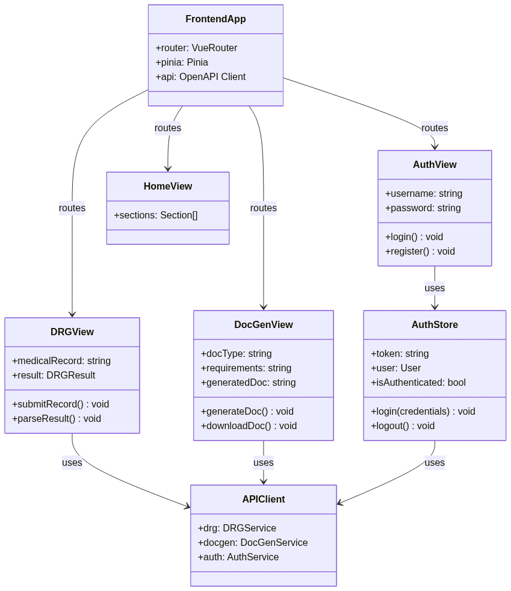

**图2-10：前端与后端交互时序图**

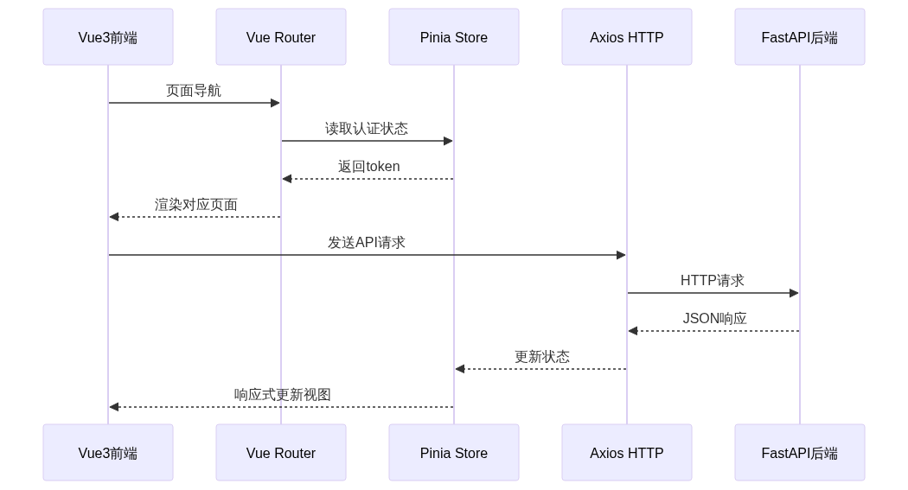

前端客户端模块的详细交互流程：

a. **页面加载流程**：用户访问页面 → Vue Router 根据路由匹配组件 → 若路由需认证，检查 Pinia `authStore.isAuthenticated` → 未认证则重定向至 `/auth` → 已认证则渲染页面；
b. **DRG 入组流程**：用户在 `DRG.vue` 输入病历文本 → 调用 `drg_utils.parseMedicalRecord()` 预处理 → 通过 `drgService.groupMedicalRecord()` 发送 POST 请求 → 接收 `DRGOutput` → 调用 `formatDRGResult()` 格式化展示；
c. **文档生成流程**：用户在 `DocGen.vue` 选择文档类型并填写需求 → 通过 `docgenService.startGeneration()` 提交异步任务 → 轮询 `docgenService.getStatus(taskId)` → 完成后通过 `renderMarkdown()` 预览文档或触发下载；
d. **认证流程**：用户在 `AuthPage.vue` 填写凭据 → 调用 `authService.login()` → 成功后将令牌存入 `authStore.token` → Vue Router 导航守卫自动放行后续受保护路由。

---

**图2-11：系统全局模块类图总览**

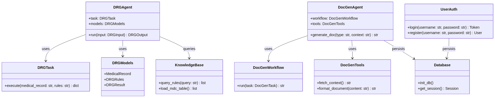

---

## 四、数据设计

本章描述 DRG 智能体系统的持久化存储方案、核心数据模型及关键数据在系统各模块间的流转路径。系统采用 SQLite 作为轻量级关系数据库，通过 SQLModel ORM 进行对象关系映射；DRG 分组规则以结构化知识库形式存储，并在服务启动时加载至内存缓存以加速规则匹配。前端采用 Vue 3 + Pinia 状态管理模式，通过自动生成的 OpenAPI SDK 与后端 FastAPI 进行 JSON 数据交互。

### 4.1 数据库设计

系统采用单文件 SQLite 数据库，通过 SQLModel（基于 SQLAlchemy 与 Pydantic）定义 ORM 实体。数据库文件在服务首次启动时由 SQLModel 自动创建所有表结构，并通过 `aiosqlite` 异步驱动进行非阻塞 I/O 访问。以下各节给出完整的实体关系模型与核心表结构说明。

#### 4.1.1 实体关系模型（ER 图）

系统围绕"用户"这一核心实体构建，向外辐射出文档、入组结果和异步任务三类业务实体，同时维护独立的知识库规则实体。实体间主要按照一对多关系关联：一个用户可拥有多份文档、多次入组记录和多个文档生成任务。

**图4-1：系统实体关系图（ER Diagram）**

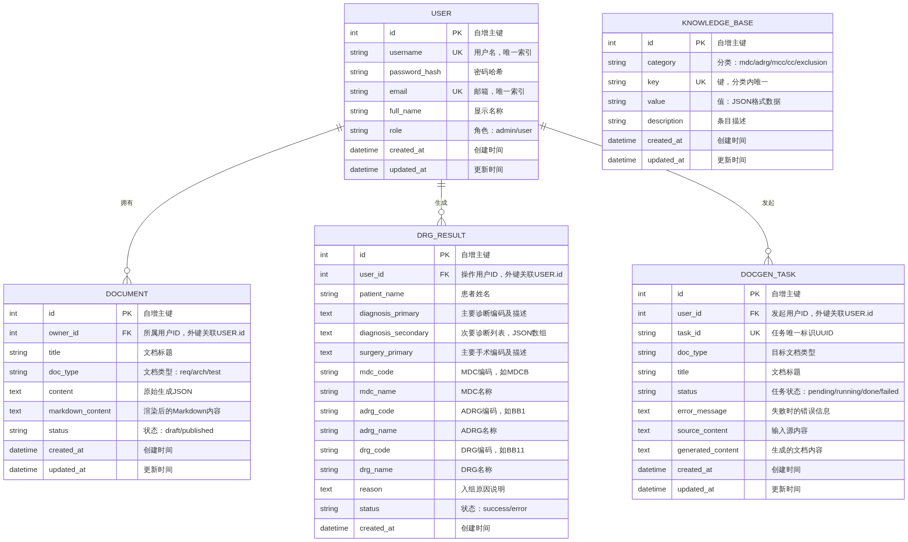

**关键关系说明：**

a. **USER → DOCUMENT（一对多）**：每个注册用户可创建多份文档（需求分析、架构设计或测试文档），文档通过 `owner_id` 外键关联到用户。删除用户时需级联处理其所属文档。

b. **USER → DRG_RESULT（一对多）**：每个用户可多次提交 DRG 入组请求，每次请求的结果独立存储，通过 `user_id` 外键关联。入组结果支持按时间追溯历史记录。

c. **USER → DOCGEN_TASK（一对多）**：文档生成采用异步任务模式，每个用户可发起多个生成任务，任务通过 `user_id` 关联发起者。任务具有独立生命周期（pending → running → done/failed）。

d. **KNOWLEDGE_BASE（独立实体）**：知识库规则表不与用户直接关联，作为系统级全局数据供 DRG 入组引擎和文档生成引擎查询使用，按 `category` 和 `key` 组织索引。

#### 4.1.2 核心表结构定义

以下逐一列出五张核心数据表的字段定义、约束及用途说明。

**表4-1：用户表（user）**

| 序号 | 字段名 | 类型 | 约束 | 说明 |
| :---: | :---: | :---: | :---: | :---: |
| 1 | id | INTEGER | PK, AUTOINCREMENT | 用户唯一标识 |
| 2 | username | VARCHAR(128) | NOT NULL, UNIQUE, INDEXED | 登录用户名 |
| 3 | password_hash | VARCHAR(256) | NOT NULL | Argon2 哈希后的密码，不可逆 |
| 4 | email | VARCHAR(256) | NOT NULL, UNIQUE | 注册邮箱，用于找回密码 |
| 5 | full_name | VARCHAR(256) | NULLABLE | 用户显示名称 |
| 6 | role | VARCHAR(32) | NOT NULL, DEFAULT 'user' | 角色标识：admin 或 user |
| 7 | created_at | DATETIME | NOT NULL, DEFAULT CURRENT_TIMESTAMP | 账户创建时间 |
| 8 | updated_at | DATETIME | NOT NULL, ON UPDATE CURRENT_TIMESTAMP | 最近更新时间 |

**设计要点：** 密码存储使用 `passlib` 的 Argon2 哈希方案，不可逆且自带盐值，即使数据库泄露密码也不会被反向破解。用户名和邮箱分别建立唯一索引，确保登录凭据唯一性。`role` 字段采用字符串枚举值，为后续权限扩展预留空间。

---

**表4-2：DRG入组结果表（drg_result）**

| 序号 | 字段名 | 类型 | 约束 | 说明 |
| :---: | :---: | :---: | :---: | :---: |
| 1 | id | INTEGER | PK, AUTOINCREMENT | 结果唯一标识 |
| 2 | user_id | INTEGER | NOT NULL, FK → user.id | 操作用户ID |
| 3 | patient_name | VARCHAR(128) | NULLABLE | 患者姓名（可脱敏） |
| 4 | diagnosis_primary | TEXT | NOT NULL | 主要诊断编码及描述，格式："A01.002+G01*（伤寒性脑膜炎）" |
| 5 | diagnosis_secondary | TEXT | NULLABLE | 次要诊断列表，JSON数组格式 |
| 6 | surgery_primary | TEXT | NOT NULL | 主要手术编码及描述 |
| 7 | mdc_code | VARCHAR(16) | NULLABLE | MDC编码，如 "MDCB" |
| 8 | mdc_name | VARCHAR(256) | NULLABLE | MDC大类名称 |
| 9 | adrg_code | VARCHAR(16) | NULLABLE | 核心分组编码，如 "BB1" |
| 10 | adrg_name | VARCHAR(256) | NULLABLE | 核心分组名称 |
| 11 | drg_code | VARCHAR(16) | NULLABLE | 细分组编码，如 "BB11" |
| 12 | drg_name | VARCHAR(256) | NULLABLE | 细分组名称 |
| 13 | reason | TEXT | NULLABLE | 入组原因说明，含逐层推理过程 |
| 14 | status | VARCHAR(16) | NOT NULL, DEFAULT 'success' | 入组状态：success / error |
| 15 | created_at | DATETIME | NOT NULL, DEFAULT CURRENT_TIMESTAMP | 入组时间 |

**设计要点：** 诊断和手术字段使用 TEXT 类型而非规范化的编码表，原因在于电子病历输入的编码体系（ICD-10-CM、ICD-9-CM-3）本身已标准化，在应用层做编码校验即可，数据库层面保留原始输入便于追溯。`reason` 字段记录完整的逐层入组推理过程（MDC判定 → ADRG匹配 → MCC/CC判定 → 排除表校验），为审计和结果解释提供依据。

---

**表4-3：文档表（document）**

| 序号 | 字段名 | 类型 | 约束 | 说明 |
| :---: | :---: | :---: | :---: | :---: |
| 1 | id | INTEGER | PK, AUTOINCREMENT | 文档唯一标识 |
| 2 | owner_id | INTEGER | NOT NULL, FK → user.id | 文档所有者ID |
| 3 | title | VARCHAR(256) | NOT NULL | 文档标题 |
| 4 | doc_type | VARCHAR(32) | NOT NULL | 文档类型：req（需求分析）/ arch（架构设计）/ test（测试文档） |
| 5 | content | TEXT | NULLABLE | 原始生成的结构化JSON内容 |
| 6 | markdown_content | TEXT | NULLABLE | 渲染后可供预览的Markdown文本 |
| 7 | status | VARCHAR(16) | NOT NULL, DEFAULT 'draft' | 文档状态：draft / published |
| 8 | created_at | DATETIME | NOT NULL, DEFAULT CURRENT_TIMESTAMP | 创建时间 |
| 9 | updated_at | DATETIME | NOT NULL, ON UPDATE CURRENT_TIMESTAMP | 最近修改时间 |

**设计要点：** 采用双字段存储策略——`content` 保存 LLM 生成的结构化 JSON（便于后续重新渲染或二次处理），`markdown_content` 保存渲染后的 Markdown（用于前端预览和 PDF 导出）。`doc_type` 枚举限定为三种标准文档类型，对应系统三大智能体（需求分析、架构设计、测试用例）的输出产物。

---

**表4-4：文档生成任务表（docgen_task）**

| 序号 | 字段名 | 类型 | 约束 | 说明 |
| :---: | :---: | :---: | :---: | :---: |
| 1 | id | INTEGER | PK, AUTOINCREMENT | 任务唯一标识（内部） |
| 2 | user_id | INTEGER | NOT NULL, FK → user.id | 发起用户ID |
| 3 | task_id | VARCHAR(64) | NOT NULL, UNIQUE, INDEXED | 任务UUID，对外暴露的查询标识 |
| 4 | doc_type | VARCHAR(32) | NOT NULL | 目标文档类型 |
| 5 | title | VARCHAR(256) | NOT NULL | 文档标题 |
| 6 | status | VARCHAR(16) | NOT NULL, DEFAULT 'pending' | 任务状态：pending / running / done / failed |
| 7 | error_message | TEXT | NULLABLE | 失败时的错误描述 |
| 8 | source_content | TEXT | NULLABLE | 输入源内容（系统需求、代码等上下文） |
| 9 | generated_content | TEXT | NULLABLE | 生成完成的文档内容（Markdown） |
| 10 | created_at | DATETIME | NOT NULL, DEFAULT CURRENT_TIMESTAMP | 任务创建时间 |
| 11 | updated_at | DATETIME | NOT NULL, ON UPDATE CURRENT_TIMESTAMP | 状态更新时间 |

**设计要点：** 文档生成采用"提交-轮询"异步模式。前端 POST 请求创建任务后立即返回 `task_id`，随后以固定间隔轮询任务状态。`status` 字段的状态机转换路径为：pending → running → done（成功终止）或 pending → running → failed（异常终止）。`source_content` 存储生成时使用的上下文素材，`generated_content` 保存最终输出，二者均为 TEXT 类型以容纳长文本。

---

**表4-5：知识库规则表（knowledge_base）**

| 序号 | 字段名 | 类型 | 约束 | 说明 |
| :---: | :---: | :---: | :---: | :---: |
| 1 | id | INTEGER | PK, AUTOINCREMENT | 规则条目唯一标识 |
| 2 | category | VARCHAR(64) | NOT NULL, INDEXED | 规则分类：mdc / adrg / mcc / cc / exclusion |
| 3 | key | VARCHAR(256) | NOT NULL | 规则键（分类内唯一） |
| 4 | value | TEXT | NOT NULL | 规则值（JSON结构化数据） |
| 5 | description | VARCHAR(512) | NULLABLE | 规则描述 |
| 6 | created_at | DATETIME | NOT NULL, DEFAULT CURRENT_TIMESTAMP | 创建时间 |
| 7 | updated_at | DATETIME | NOT NULL, ON UPDATE CURRENT_TIMESTAMP | 更新时间 |

**设计要点：** 知识库采用键值对模式组织 DRG 分组规则。`category` 区分规则类型（MDC分类规则、ADRG分组规则、MCC/CC并发症列表、排除表规则），`key` 存储编码（如诊断编码或手术编码），`value` 以 JSON 存储关联的分组信息。该设计兼顾查询效率（按分类+键精确查找）和灵活性（JSON可容纳嵌套结构）。服务启动时，DRG Agent 将知识库全量加载至内存字典缓存中，入组匹配过程无需访问数据库。

---

**表4-6：表关系索引汇总**

| 索引名称 | 所属表 | 索引字段 | 索引类型 | 用途 |
| :---: | :---: | :---: | :---: | :---: |
| idx_user_username | user | username | UNIQUE | 登录查重 |
| idx_user_email | user | email | UNIQUE | 邮箱查重与找回 |
| idx_drg_user_id | drg_result | user_id | INDEX | 按用户查询历史 |
| idx_drg_created | drg_result | created_at | INDEX | 按时间排序 |
| idx_doc_owner | document | owner_id | INDEX | 按用户列文档 |
| idx_doc_type | document | doc_type | INDEX | 按类型筛选 |
| idx_task_user | docgen_task | user_id | INDEX | 按用户查任务 |
| idx_task_uuid | docgen_task | task_id | UNIQUE | 任务快速定位 |
| idx_task_status | docgen_task | status | INDEX | 按状态筛选 |
| idx_kb_category | knowledge_base | category | INDEX | 按分类查询规则 |
| idx_kb_key | knowledge_base | key | INDEX | 按键精确查找 |

### 4.2 数据流图

数据流图展示关键数据在系统各模块间的产生、传递、转换与持久化过程。以下分别从架构全局视角和两个核心业务场景展开。

#### 4.2.1 系统整体数据流架构

下图从分层架构角度展示数据从前端用户输入到后端持久化的完整流转路径，标注各层的数据形态与转换节点。

**图4-2：系统数据流架构图**

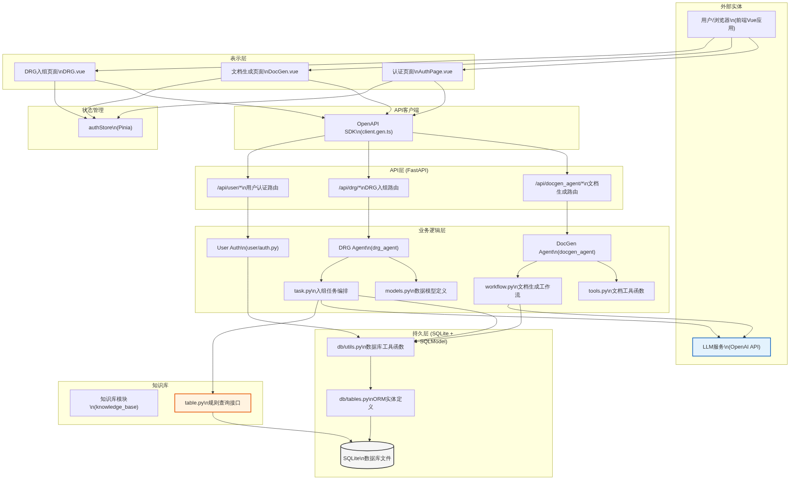

**数据流转路径说明：**

(1) **表示层 → 状态管理层**：用户在 Vue 组件中填写表单（病历文本、文档生成请求），数据以 Vue Reactive 对象形式暂存于组件状态中。涉及认证的操作（登录、Token管理）统一经过 Pinia `authStore`。

(2) **状态管理层 → API 客户端层**：组件调用自动生成的 OpenAPI TypeScript SDK（`client.gen.ts`），将数据序列化为 JSON 请求体。SDK 自动注入 JWT Token（从 `authStore` 获取）至 HTTP Authorization 头。

(3) **API 客户端层 → API 层**：HTTP 请求经网络传输到达 FastAPI 路由层。路由层使用 Pydantic 模型对请求体进行严格的类型校验和字段约束，校验失败直接返回 422 错误而不进入业务层。

(4) **API 层 → 业务逻辑层**：校验通过的请求分发至对应的 Agent 模块——DRG 入组 Agent（`drg_agent`）处理分组请求，文档生成 Agent（`docgen_agent`）处理文档生成。认证请求由 `user/auth.py` 独立处理。

(5) **业务逻辑层 → 知识库层**：DRG Agent 在执行入组逻辑时查询知识库模块（`knowledge_base/table.py`），规则数据在服务启动时已从 SQLite 加载至内存字典，查询为零延迟的内存操作。

(6) **业务逻辑层 → 外部 LLM 服务**：两个 Agent 均需调用 OpenAI 兼容的大模型 API 进行推理或内容生成。请求数据为结构化的 System Prompt + User Prompt，响应数据为 Markdown 或 JSON 文本。该调用为异步 I/O，不影响其他请求处理。

(7) **业务逻辑层 → 持久层**：入组结果、生成文档、任务状态等业务数据通过 SQLModel ORM 写入 SQLite 数据库。所有写操作经过 `db/utils.py` 提供的统一会话管理，确保事务一致性。

(8) **持久层 → 业务逻辑层（反向）**：文档生成任务的状态查询、历史入组记录的检索等读操作通过 ORM 从 SQLite 读取，数据以 Pydantic 模型实例形式返回至 API 层。

#### 4.2.2 场景一：DRG 入组数据流

DRG 入组是本系统的核心业务场景，数据流从用户提交病历开始，历经编码提取、规则匹配、LLM 推理、结果持久化四个阶段。

**图4-3：DRG入组请求时序图**

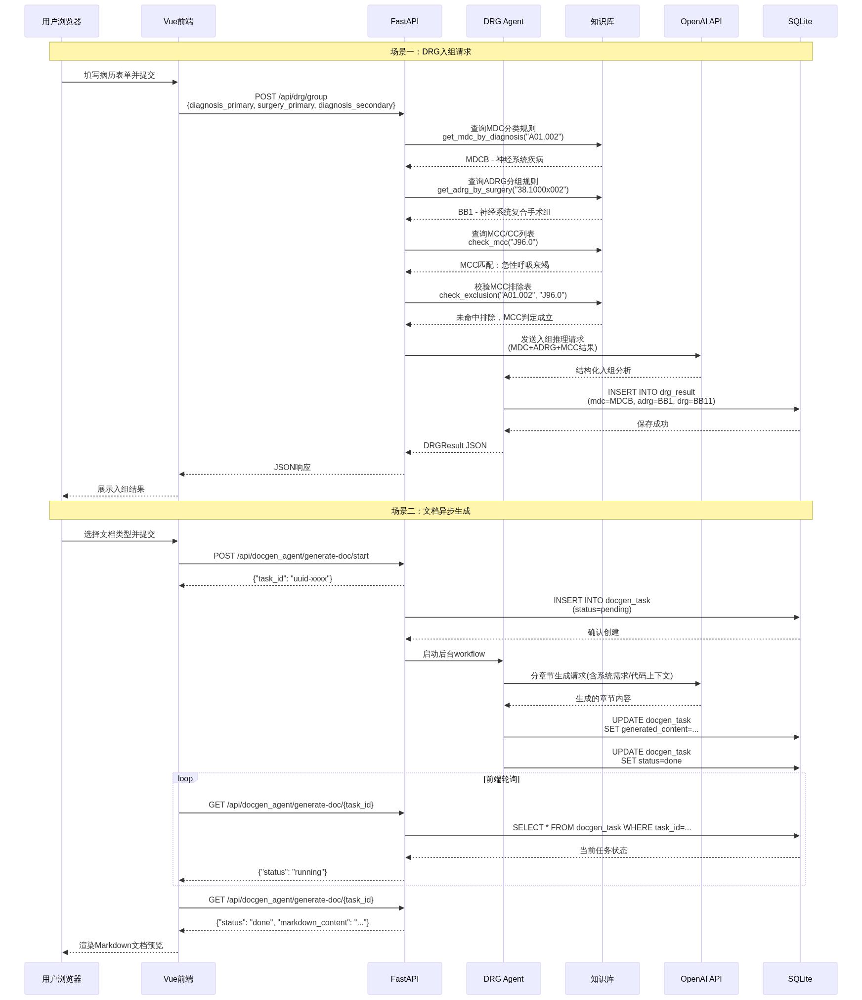

**分阶段数据转换说明：**

**阶段一：输入解析与编码提取**

**表4-7：表格说明**

| 步骤 | 数据输入 | 处理节点 | 数据输出 | 数据形态 |
| :---: | :---: | :---: | :---: | :---: |
| 1 | 病历表单文本 | 前端 `DRG.vue` | JSON请求体 | `{diagnosis_primary: "A01.002+G01*（伤寒性脑膜炎）", surgery_primary: "38.1000x002（动脉内膜剥脱术）", diagnosis_secondary: ["J96.0（急性呼吸衰竭）"]}` |
| 2 | JSON请求体 | FastAPI Router (Pydantic) | `DRGRequest` 模型实例 | Pydantic模型，已校验字段完整性和编码格式 |

**阶段二：规则匹配链**

**表4-7：表格说明**

| 步骤 | 数据输入 | 处理节点 | 数据输出 | 数据形态 |
| :---: | :---: | :---: | :---: | :---: |
| 3 | 主要诊断编码 "A01.002" | 知识库 MDC 匹配 | MDC 分类结果 | `{mdc_code: "MDCB", mdc_name: "神经系统疾病及功能障碍"}` |
| 4 | 主要手术编码 "38.1000x002" | 知识库 ADRG 匹配 | ADRG 分组结果 | `{adrg_code: "BB1", adrg_name: "神经系统复合手术组"}` |
| 5 | 次要诊断编码 "J96.0" | 知识库 MCC 列表查询 | MCC 判定候选 | `{is_mcc: true, mcc_name: "急性呼吸衰竭"}` |
| 6 | 主诊断 + 并发症 | 排除表校验 | 排除判定 | `{excluded: false}` → MCC 判定成立 |

**阶段三：LLM 推理与最终分组**

**表4-7：表格说明**

| 步骤 | 数据输入 | 处理节点 | 数据输出 | 数据形态 |
| :---: | :---: | :---: | :---: | :---: |
| 7 | MDC+ADRG+MCC 结构化结果 | LLM API 调用 | DRG 最终编码与解释 | `{drg_code: "BB11", drg_name: "神经系统复合手术，伴严重合并症或并发症", reason: "…"}` |

**阶段四：持久化与响应**

**表4-7：表格说明**

| 步骤 | 数据输入 | 处理节点 | 数据输出 | 数据形态 |
| :---: | :---: | :---: | :---: | :---: |
| 8 | 完整入组结果 | SQLModel INSERT | 持久化记录 | drg_result 表行 |
| 9 | DRGResult 模型 | FastAPI JSONResponse | HTTP 200 响应 | `{"drg_code": "BB11", "drg_name": "…", "reason": "…", "mdc_code": "MDCB", …}` |

#### 4.2.3 场景二：文档异步生成数据流

文档生成采用异步任务模式，数据流特点在于"提交-轮询"的两次交互和后台长任务的状态转换。

**场景二关键数据流（参照图4-3下半部分时序图）：**

**阶段一：任务提交**

**表4-7：表格说明**

| 步骤 | 数据输入 | 处理节点 | 数据输出 | 数据形态 |
| :---: | :---: | :---: | :---: | :---: |
| 1 | 用户选择的文档类型 + 标题 | 前端 `DocGen.vue` | POST 请求体 | `{doc_type: "arch", title: "架构设计文档"}` |
| 2 | POST 请求体 | FastAPI `/generate-doc/start` | task_id UUID | `{task_id: "a1b2c3d4-..."}` |
| 3 | task_id + user_id + doc_type | SQLModel INSERT | docgen_task 记录 | `{status: "pending", task_id: "a1b2c3d4-..."}` |

**阶段二：后台异步处理**

**表4-7：表格说明**

| 步骤 | 数据输入 | 处理节点 | 数据输出 | 数据形态 |
| :---: | :---: | :---: | :---: | :---: |
| 4 | 系统需求文档 + 代码上下文 | DocGen Workflow 素材收集 | 结构化 Prompt | 包含系统需求摘要、API路由列表、数据模型定义的文本 |
| 5 | 结构化 Prompt | LLM API 分章节调用 | 各章节 Markdown 片段 | 需求分析/架构设计/测试文档的各章节文本 |
| 6 | 各章节 Markdown 片段 | Workflow 组装与渲染 | 完整 Markdown 文档 | 带标题层级、图表引用、表格的完整文档文本 |

**阶段三：状态同步与结果获取**

**表4-7：表格说明**

| 步骤 | 数据输入 | 处理节点 | 数据输出 | 数据形态 |
| :---: | :---: | :---: | :---: | :---: |
| 7 | task_id | 前端轮询 GET `/generate-doc/{task_id}` | 任务状态 | `{status: "running"}`（进行中） |
| 8 | 完整 Markdown 文档 | SQLModel UPDATE | 持久化记录 | `{status: "done", generated_content: "…"}` |
| 9 | task_id | 前端轮询（最终） | 完整文档响应 | `{status: "done", markdown_content: "# 架构设计文档\n\n…"}` |

#### 4.2.4 认证与授权数据流

认证数据流独立于业务数据流，在每次业务请求前通过 JWT Token 验证完成身份确认。

(1) **登录流程**：用户提交用户名/密码 → `user/auth.py` 查询 user 表验证凭证 → 签发 JWT Token（含 `sub` 用户ID、`exp` 过期时间） → Token 返回前端存入 Pinia `authStore` → 后续请求 SDK 自动注入 `Authorization: Bearer <token>` 头。

(2) **Token 验证流程**：每次 API 请求到达 FastAPI 后，依赖注入的 `get_current_user` 函数从 Authorization 头提取 Token → 使用 `python-jose` 库验证签名和过期时间 → 从 `sub` 字段还原用户ID → 查询 user 表确认用户仍然有效 → 将 User 对象注入路由处理函数。

(3) **数据存储**：JWT Token 本身不持久化至数据库，采用无状态验证。前端 Pinia Store 在浏览器会话期间持有 Token，页面刷新后需重新登录（未实现 Refresh Token 机制，属当前设计假设）。

#### 4.2.5 数据转换全景图

以下流程图从数据生命周期的角度，总览数据在系统各层之间的形态转换。

**图4-4：数据转换全景图**

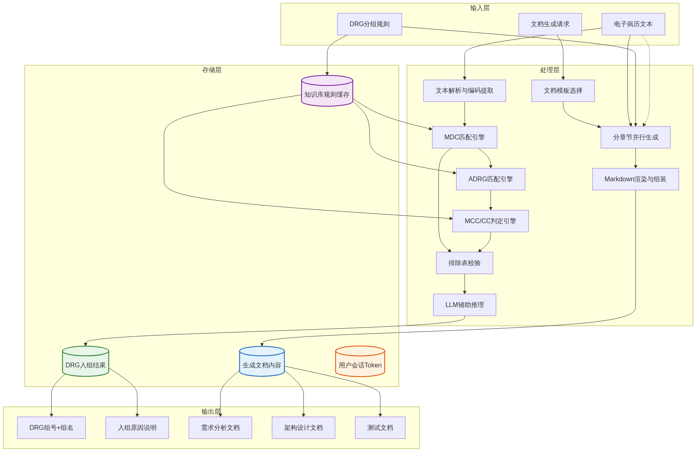

**核心数据形态转换节点：**

a. **原始文本 → 结构化编码**：电子病历自然语言文本通过 LLM 提取或前端表单直接输入，转换为标准 ICD 编码对（诊断编码 + 手术编码）。

b. **编码对 → 分组标签**：通过知识库规则匹配链（MDC → ADRG → MCC/CC → 排除表），编码对逐步转换为 DRG 三层分组标签。

c. **分组标签 + 推理上下文 → 结构化解释**：LLM 接收规则匹配的中间结果，生成带推理链的最终分组解释文本。

d. **文档类型 + 系统上下文 → 分章节文档**：DocGen Agent 根据文档类型选择模板，从系统需求、代码、API 路由等素材中提取上下文，分章节调用 LLM 生成 Markdown 片段后组装为完整文档。

e. **业务对象 → ORM 实例 → 数据库行**：所有业务层产出的 Pydantic 模型实例经 SQLModel 映射为数据库行，完成持久化闭环。

## 四、技术选型

### 4.1 整体技术路线概述

本系统（DRG入组智能体平台）采用**前后端分离**的Web应用架构，整体技术路线遵循以下原则：

a. **异步高性能服务端**：以 Python 异步生态为核心，选用 FastAPI 作为 Web 框架，充分利用 ASGI 异步并发能力，满足 DRG 入组推理、文档生成等 LLM 调用的高延迟场景下的吞吐量需求。

b. **现代响应式前端**：以 Vue 3 + TypeScript + Vite 构建单页面应用（SPA），提供流畅的用户交互体验，支持 DRG 规则可视化编辑、病历输入、文档预览等复杂前端交互。

c. **LLM/智能体集成**：通过 OpenAI SDK 统一接入大语言模型，结合自定义 Workflow 引擎实现 DRG 入组智能体、文档生成智能体、测试用例生成智能体等多智能体协作。

d. **轻量化部署**：采用 SQLite 作为嵌入式数据库，避免引入重型数据库运维负担；整体通过 Docker Compose 一键部署，适合学术研究和中小规模应用场景。

### 4.2 后端技术选型

#### 4.2.1 编程语言：Python 3.13

Python 3.13 是当前（2026年3月）Python 的最新稳定主版本，本系统在 `pyproject.toml` 中声明 `requires-python = "==3.13.*"`，严格锁定该版本。选择 Python 的理由如下：

a. **AI/LLM 生态优势**：OpenAI 官方 SDK、LangChain 等主流 LLM 框架均以 Python 为第一支持语言，社区成熟度高。

b. **异步原生支持**：Python 3.13 在 asyncio 方面的性能与稳定性持续改进，与 FastAPI 的 ASGI 异步模型天然匹配。

c. **医疗数据处理便利性**：Python 具备丰富的数据处理库（如文本解析、编码校验），便于处理 ICD 编码、DRG 规则文件等医疗数据。

d. **版本锁定策略**：使用 `==3.13.*` 严格锁定而非 `>=`，确保所有开发者和部署环境的一致性，避免因 Python 版本差异导致的兼容性问题。依赖管理使用 `uv`（由 `uv.lock` 文件管理），提供确定性构建。

#### 4.2.2 Web 框架：FastAPI（含 standard 扩展）

FastAPI 版本约束为 `>=0.136.0`，并启用 `[standard]` 扩展。选择 FastAPI 的核心理由：

a. **原生异步支持**：基于 Starlette ASGI 框架和 Python 类型注解，所有路由处理函数均为 `async def`，在 LLM 调用（通常需要 5~30 秒）场景下不会阻塞其他请求。

b. **自动 OpenAPI 文档生成**：FastAPI 自动从 Pydantic 模型和路由注解生成 OpenAPI 3.1 规范的 JSON Schema，本系统利用此特性，通过 `@hey-api/openapi-ts` 自动生成前端 TypeScript 客户端代码（`client/src/api/` 目录下所有 `*.gen.ts` 文件），消除前后端接口不一致风险。

c. **类型安全**：请求体、响应体、路径参数、查询参数均通过 Pydantic V2 进行自动校验和序列化，减少手动参数校验代码。

d. **标准化中间件生态**：CORS、认证、静态文件服务等均可通过标准中间件实现，与项目中的 JWT 认证模块（`server/user/auth.py`）无缝集成。

e. **`[standard]` 扩展价值**：包含 `uvicorn`（ASGI 服务器）、`httpx`（异步 HTTP 客户端测试）、`python-multipart`（表单/文件上传）、`fastapi-cli` 等常用依赖，简化依赖声明。

#### 4.2.3 数据验证与序列化：Pydantic V2

Pydantic 版本约束为 `>=2.13.2`，与 FastAPI 深度耦合。在项目中的应用：

a. DRG 入组请求/响应模型（`server/agent/drg_agent/models.py`）使用 Pydantic BaseModel 定义，自动完成 ICD 编码格式校验。

b. 配置管理：通过 `pydantic-settings` 或环境变量加载机制实现类型安全的配置读取。

c. Pydantic V2 采用 Rust 编写的 `pydantic-core` 内核，性能较 V1 提升 5~50 倍，在大批量测试用例生成场景下尤为显著。

#### 4.2.4 LLM 集成：OpenAI SDK

OpenAI SDK 版本约束为 `>=2.33.0`。选择理由：

a. **统一 API 接入**：OpenAI SDK 已成为 LLM 调用的行业标准接口，兼容 OpenAI、Azure OpenAI 及多数兼容 OpenAI API 格式的国产大模型（如 DeepSeek、通义千问等），避免供应商锁定。

b. **异步调用支持**：SDK 原生支持 `AsyncOpenAI`，与 FastAPI 异步路由直接配合，不阻塞事件循环。

c. **结构化输出**：可利用 OpenAI 的 JSON Mode 和 Function Calling 能力，使 DRG 入组智能体返回结构化的分组结果（MDC、ADRG、DRG 三层结构）。

#### 4.2.5 浏览器自动化：Playwright

Playwright 版本约束为 `>=1.59.0`。在项目中的应用场景：

a. **DRG 规则抓取**：通过 Playwright 自动化浏览器，从医保局官方网页或在线 DRG 规则查询系统中抓取最新分组方案数据。

b. **文档系统交互**：在虚拟文档提交系统中，可通过 Playwright 模拟用户在文档系统中的登录、上传、提交等操作流程。

c. **无头浏览器模式**：支持 headless 模式运行，适合服务器端部署。

#### 4.2.6 身份认证与安全

认证体系由以下库构成：

a. **Passlib + Argon2**（`passlib[argon2]>=1.7.4`，`argon2-cffi>=21.3.0`）：采用 Argon2id 哈希算法存储用户密码，这是 OWASP 推荐的当前最安全的密码哈希方案，具备内存硬化和并行化抗破解特性。

b. **python-jose**（`>=3.5.0`）：实现 JWT（JSON Web Token）的签发与验证。前后端分离架构下，JWT 是 RESTful API 认证的轻量级方案，无需服务端 Session 状态。

c. 认证模块实现位于 `server/user/auth.py` 和 `server/user/api.py`，前端通过 Pinia Store（`client/src/stores/auth.ts`）管理 Token 生命周期。

#### 4.2.7 日志与监控：Loguru

Loguru 版本约束为 `>=0.7.3`。选择理由：

a. **零配置开箱即用**：无需复杂的 Logger 层级配置，`logger.add()` 即可输出结构化日志。

b. **异步安全**：与 FastAPI 异步上下文兼容，支持彩色输出和自动异常捕获。

c. **日志轮转**：内建文件轮转和保留策略，适合长期运行的智能体服务。

#### 4.2.8 HTTP 客户端：Requests

Requests 版本约束为 `>=2.33.1`。用于服务端对第三方 API 的同步 HTTP 调用（如外部知识库查询、DRG 规则更新检测等轻量级同步场景）；异步场景则使用 FastAPI `[standard]` 中附带的 `httpx`。

### 4.3 前端技术选型

#### 4.3.1 框架与构建工具：Vue 3 + Vite 8

前端技术栈在 `client/package.json` 中声明：

a. **Vue 3**（`^3.5.31`）：采用 Composition API 编写组件逻辑（`<script setup lang="ts">` 语法），组合式函数（Composables）便于逻辑复用。Vue 3 的响应式系统基于 Proxy，性能优于 Vue 2 的 `Object.defineProperty`。

b. **Vite 8**（`^8.0.3`）：新一代前端构建工具，开发环境下利用浏览器原生 ES Module 实现按需编译和热模块替换（HMR），启动速度和热更新速度显著优于传统 Webpack。生产构建基于 Rollup，输出高度优化的静态资源。

c. **TypeScript**（`~6.0.0`）：在所有 Vue 组件和工具模块中使用 TypeScript，与后端 Pydantic 的类型安全理念前后呼应。`vue-tsc`（`^3.2.6`）提供构建时类型检查。

#### 4.3.2 状态管理与路由

a. **Pinia**（`^3.0.4`）：Vue 3 官方推荐的状态管理库。项目中 `client/src/stores/auth.ts` 使用 Pinia 管理用户认证状态（Token 存储、登录状态判读），支持 DevTools 调试。

b. **Vue Router**（`^5.0.4`）：官方路由库，支持基于路由的代码分割和导航守卫。项目路由配置位于 `client/src/router/index.ts`，涵盖首页（Home）、DRG 入组（DRG）、文档生成（DocGen）、文档预览（Doc）等页面。

#### 4.3.3 HTTP 通信与 API 客户端

a. **Axios**（`^1.15.1`）：成熟的 HTTP 客户端库，支持请求/响应拦截器（用于自动附加 JWT Token）、请求超时、错误统一处理。

b. **@hey-api/openapi-ts**（`^0.96.1`）：开发期工具（devDependency），从 FastAPI 自动生成的 OpenAPI JSON Schema 出发，自动生成类型安全的 TypeScript API 客户端代码。`client/src/api/` 目录下的所有 `*.gen.ts` 文件均为自动生成，包含完整的请求/响应类型定义。这确保了前后端接口契约的严格一致，消除手动维护接口类型的成本。

#### 4.3.4 UI 渲染与样式

a. **Marked**（`^18.0.3`）：轻量级 Markdown 解析器，用于在前端渲染 DRG 入组原因说明、文档生成预览等 Markdown 格式内容。零依赖、速度快，适合嵌入 SPA。

b. **Sass / SCSS**（`sass@^1.99.0`，`sass-embedded@^1.99.0`）：CSS 预处理器，提供变量、嵌套、Mixin 等高级样式能力。项目全局样式位于 `client/src/common/global.scss`。

c. **@mdi/js + @jamescoyle/vue-icon**：Material Design Icons 图标库，为前端界面提供一致的图标风格。

d. **Vite Plugin Vue DevTools**（`^8.1.1`）：开发期浏览器调试工具，可检查组件树、Pinia 状态、路由等信息。

#### 4.3.5 Node.js 运行时要求

`client/package.json` 中声明 `engines: { "node": "^20.19.0 || >=22.12.0" }`，要求 Node.js 20 LTS 或 22 及以上版本，确保 Vite 8 和 TypeScript 6 的正常运行。

### 4.4 数据存储选型

#### 4.4.1 数据库：SQLite（通过 aiosqlite + SQLModel）

本系统选择 SQLite 作为持久化存储，通过以下库接入：

a. **aiosqlite**（`>=0.22.1`）：SQLite 的异步 Python 驱动，使数据库操作不阻塞 FastAPI 事件循环。SQLite 数据库为单文件存储，无需独立数据库进程。

b. **SQLModel**（`>=0.0.38`）：由 FastAPI 作者 Sebastián Ramírez 开发的 ORM 库，融合 SQLAlchemy 2.0 的查询能力和 Pydantic V2 的类型校验。数据库表定义文件位于 `server/db/tables.py`，模型即 Pydantic Schema，可直接用于 FastAPI 路由的请求/响应序列化。

选择 SQLite 而非 PostgreSQL/MySQL 的理由：

a. **零运维成本**：无需安装、配置、维护数据库服务器，数据库即单个文件（`.db`），可直接备份和迁移。

b. **部署简化**：与 Docker 单容器部署方案匹配，无需编排多容器网络。

c. **适用规模**：本系统面向 DRG 规则数据（数百条 ADRG 分组规则、数千条 MCC/CC 编码）和用户文档管理（数十到数百份），SQLite 完全满足该量级下的并发读写需求。

d. **迁移便利**：如未来需升级至 PostgreSQL，SQLModel 基于 SQLAlchemy 的抽象层可平滑迁移，仅需更换数据库 URL 和驱动。

#### 4.4.2 数据库表结构

项目数据表定义分布在以下模块：

a. `server/db/tables.py`：核心业务表（用户信息、文档记录等）。

b. `server/user/table.py`：用户认证相关表。

c. `server/agent/table.py`：智能体任务表（DRG 入组任务、文档生成任务）。

d. `server/knowledge_base/table.py`：知识库表（DRG 规则缓存、ICD 编码索引）。

表 4-1 汇总了各数据模块的存储职责。

**表4-1：数据存储模块职责**

| 模块 | 文件位置 | 存储内容 | 访问方式 |
| :---: | :---: | :---: | :---: |
| 核心业务 | `server/db/tables.py` | 用户信息、文档记录、系统配置 | SQLModel ORM |
| 用户认证 | `server/user/table.py` | 用户凭证、JWT 刷新令牌 | SQLModel ORM |
| 智能体任务 | `server/agent/table.py` | DRG入组任务、文档生成任务状态与结果 | SQLModel ORM |
| 知识库 | `server/knowledge_base/table.py` | DRG分组规则、ICD编码索引、MCC/CC排除表 | SQLModel ORM |

### 4.5 智能体架构与工作流引擎

本系统的核心智能体（DRG 入组智能体、文档生成智能体）采用自研的轻量级工作流编排方案，而非引入重量级框架如 LangChain 或 LangGraph。选择理由：

a. **定制化需求**：DRG 入组流程为严格的三层递进逻辑（MDC → ADRG → DRG），属于确定性规则推理与 LLM 辅助判断的结合，不需要通用的 Chain/Agent 抽象。

b. **依赖简化**：LangChain 等框架依赖庞大，版本迭代频繁且不稳定。自研工作流（`server/agent/drg_agent/workflow.py`、`server/agent/docgen_agent/workflow.py`）仅约 200~500 行代码，逻辑清晰、易维护。

c. **LLM 调用抽象**：通过 OpenAI SDK 直接调用，结合自定义 Prompt 模板和结构化输出解析，完成规则匹配辅助、病历信息提取、文档章节生成等任务。

d. **任务管理**：智能体任务通过 `server/agent/task.py` 管理生命周期（创建、执行中、已完成、失败），支持任务状态查询和结果持久化。

### 4.6 开发与运维工具选型

#### 4.6.1 包管理与依赖锁定

a. **uv**（Python 端）：新一代 Python 包管理器，由 Astral（Ruff 团队）开发，用 Rust 编写。`uv.lock` 文件锁定所有依赖的精确版本和哈希值，实现跨环境的确定性构建。性能较 pip 提升 10~100 倍。

b. **npm**（前端端）：Node.js 生态标准包管理器，`package-lock.json` 锁定前端依赖版本。

#### 4.6.2 代码质量

a. **Ruff**（`>=0.14.9`）：Python 代码检查与格式化工具，用 Rust 编写，速度极快。在项目中替代 Flake8、isort、Black 等多个工具的职责，单一配置统一风格。

b. **Stats-code**（`>=0.1.5`）与 **ty**（`>=0.0.35`）：开发辅助工具，用于代码统计和类型检查增强。

c. **TypeScript**（前端端）：通过 `vue-tsc` 在构建阶段执行全量类型检查，防止类型错误进入生产环境。

#### 4.6.3 API 客户端自动生成

`@hey-api/openapi-ts` 是开发期的关键工具链环节。工作流程为：

a. FastAPI 应用启动后自动暴露 `/openapi.json` 端点。

b. 运行 `@hey-api/openapi-ts` CLI，从该 JSON Schema 生成 `client/src/api/` 下的所有 TypeScript 客户端文件（`sdk.gen.ts`、`types.gen.ts`、`client.gen.ts` 等）。

c. 前端开发者直接导入生成的 SDK 函数调用后端 API，享受完整的类型提示和编译期校验。

此方案从根本上解决了前后端接口不一致的常见问题，是项目工程化水平的重要体现。

#### 4.6.4 容器化部署

a. **Docker**：通过项目根目录的 `Dockerfile` 定义后端服务镜像（基于 Python 3.13 slim 基础镜像）。

b. **Docker Compose**：通过 `docker-compose.yml` 编排前后端服务和 SQLite 数据卷，实现一键启动。

### 4.7 技术选型汇总

表 4-2 汇总了本系统各层次的核心技术选型及版本约束。

**表4-2：技术选型汇总表**

| 层次 | 技术 | 版本约束 | 角色 |
| :---: | :---: | :---: | :---: |
| 后端语言 | Python | ==3.13.* | 服务端编程语言 |
| Web 框架 | FastAPI (standard) | >=0.136.0 | RESTful API 服务 |
| 数据验证 | Pydantic | >=2.13.2 | 请求/响应序列化与校验 |
| ORM | SQLModel | >=0.0.38 | 数据库 ORM 与模型定义 |
| 数据库驱动 | aiosqlite | >=0.22.1 | SQLite 异步驱动 |
| LLM SDK | OpenAI | >=2.33.0 | 大语言模型调用 |
| 浏览器自动化 | Playwright | >=1.59.0 | Web 数据抓取与自动化 |
| 密码哈希 | Passlib + Argon2 | >=1.7.4 / >=21.3.0 | 用户密码安全存储 |
| JWT 认证 | python-jose | >=3.5.0 | 无状态身份认证 |
| 日志 | Loguru | >=0.7.3 | 结构化日志 |
| HTTP 客户端 | Requests | >=2.33.1 | 服务端 HTTP 调用 |
| 前端框架 | Vue 3 | ^3.5.31 | 响应式 UI 框架 |
| 构建工具 | Vite | ^8.0.3 | 前端构建与 HMR |
| 前端语言 | TypeScript | ~6.0.0 | 类型安全的前端开发 |
| 状态管理 | Pinia | ^3.0.4 | 全局状态管理 |
| 路由 | Vue Router | ^5.0.4 | 前端路由 |
| HTTP 客户端 | Axios | ^1.15.1 | 前端 HTTP 请求 |
| Markdown 渲染 | Marked | ^18.0.3 | 前端 Markdown 解析 |
| 样式预处理 | Sass / SCSS | ^1.99.0 | CSS 预处理 |
| API 代码生成 | @hey-api/openapi-ts | ^0.96.1 | 自动生成前端 API 客户端 |
| Python 包管理 | uv | （uv.lock） | 依赖管理与锁定 |
| 代码检查 | Ruff | >=0.14.9 | Python 代码质量 |
| 容器化 | Docker + Compose | — | 部署编排 |

### 4.8 未引入的技术及决策说明

为保持技术栈精简，以下常见技术被明确排除：

a. **Redis / RabbitMQ**：当前并发量和任务量不需要消息队列解耦；智能体任务通过 SQLite 表轮询 + FastAPI 后台任务即可满足需求。如未来需支持大规模并发入组请求，可引入 Redis 作为任务队列和缓存。

b. **PostgreSQL / MySQL**：如 4.4.1 节所述，SQLite 在数据量级和并发需求下完全胜任，且零运维成本。SQLModel 的 SQLAlchemy 抽象层为未来迁移预留了空间。

c. **LangChain / LangGraph**：如 4.5 节所述，DRG 入组流程为确定性规则推理，不需要通用智能体框架的重量级抽象。自研工作流代码量少、针对性强、维护成本低。

d. **Celery**：异步任务通过 FastAPI 的 `BackgroundTasks` 和 Python `asyncio.create_task` 处理，不引入额外的任务调度组件。

e. **Nginx**：单容器部署方案下，FastAPI + Uvicorn 可直接对外服务；生产环境下可在 Docker Compose 中增加 Nginx 容器作为反向代理和静态资源服务，当前版本暂不引入。

## 五、部署视图

本章描述 DRG 入组智能体系统在开发环境和生产环境中的物理部署拓扑、网络分区、组件映射关系，以及各环境所需的操作系统、依赖软件和环境变量配置。

### 5.1 部署图

系统采用典型的前后端分离架构，部署拓扑按网络区域划分为客户端、网关层、应用服务层、数据存储层和外部服务层。开发环境以开发者工作站单机承载全部服务组件；生产环境引入 Nginx 反向代理实现请求路由、静态资源分发和 SSL 终结。

**图5-1：系统部署拓扑图**

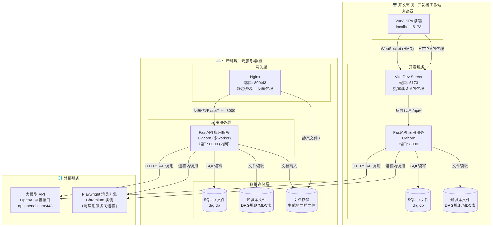

#### 5.1.1 开发环境拓扑

开发环境部署于开发者本地工作站，各组件以独立进程运行：

a. **Vite Dev Server**（端口 5173）：承载 Vue3 SPA 前端的热重载开发服务，内置 API 代理中间件，将以 `/api/*` 前缀的请求转发至后端 FastAPI 服务（端口 8000），解决开发阶段的跨域问题。

b. **FastAPI 应用服务**（端口 8000）：由 Uvicorn 以单 worker 模式启动，启用 `--reload` 热重载，直接监听本地回环地址。集成了 DRG 入组智能体、文档生成智能体的业务逻辑模块，以及用户认证和数据库访问层。

c. **SQLite 数据库**：以文件形式存储于项目目录下（`drg.db`），通过 aiosqlite 异步驱动访问，无需独立数据库进程。

d. **知识库文件**：以本地文件系统目录存储 DRG 分组规则表（MDC 分类、ADRG 分组、MCC/CC 列表等），由应用服务启动时加载至内存。

e. **外部 LLM API**：开发期间通过互联网 HTTPS 协议调用 OpenAI 兼容的大模型 API 接口，API Key 通过环境变量注入。

f. **Playwright 渲染引擎**：作为应用服务进程内的子进程运行，负责将智能体生成的 Markdown 文档渲染为规定格式的输出文件。开发环境需预先执行 `playwright install chromium` 安装 Chromium 浏览器实例。

#### 5.1.2 生产环境拓扑

生产环境建议部署于单台 Linux 云服务器或虚拟机，最小资源配置为 2 核 CPU、4 GB 内存、20 GB SSD 存储。各组件以如下方式组织：

a. **Nginx 网关层**（端口 80/443）：作为整个系统的唯一对外入口，承担三项职责：其一，将 `/api/*` 路径的 API 请求反向代理至后端 FastAPI 应用服务（内网端口 8000）；其二，将静态资源请求（前端构建产物、生成的文档文件）直接返回客户端；其三，配置 SSL 证书实现 HTTPS 加密通信。

b. **FastAPI 应用服务**（内网端口 8000）：由 Uvicorn 以多 worker 模式启动（建议 worker 数 = CPU 核数 × 2），仅监听本地回环地址（`127.0.0.1:8000`），由 Nginx 统一对外暴露。生产环境需关闭热重载和调试模式。

c. **SQLite 数据库**：生产环境继续使用 SQLite 文件存储，适用于本项目单机部署、并发量可控的场景。数据库文件存放于具有定期备份策略的目录下。若未来需扩展至高并发场景，可迁移至 PostgreSQL。

d. **知识库与文档存储**：DRG 规则知识库文件与生成文档分开存储，文档目录需配置 Nginx 静态文件服务以便用户直接下载。

e. **外部 LLM API 与 Playwright**：与开发环境一致，应用服务通过 HTTPS 调用外部 LLM API；Playwright Chromium 实例在应用服务进程内运行，生产环境需确保服务器已安装 Chromium 依赖库。

#### 5.1.3 网络通信说明

各组件间的通信协议与端口映射如下表所示：

**表5-1：组件间通信协议与端口**

| 通信路径 | 协议 | 端口 | 说明 |
| :---: | :---: | :---: | :---: |
| 用户浏览器 → Nginx | HTTPS | 443 | 生产环境加密通信；开发环境直接访问 Vite（HTTP :5173） |
| Nginx → FastAPI | HTTP | 8000 | 内网反向代理，不对外暴露 |
| FastAPI → SQLite | 文件 I/O | — | 本地文件系统访问，无网络开销 |
| FastAPI → LLM API | HTTPS | 443 | 外部 API 调用，需配置 API Key |
| FastAPI → Playwright | 进程间通信 | — | 同进程调用，通过 Playwright Python SDK |
| Vite Dev Server → FastAPI | HTTP | 8000 | 开发环境 API 代理 |

### 5.2 环境配置

#### 5.2.1 操作系统

系统基于跨平台技术栈构建，支持以下操作系统：

a. **开发环境推荐**：Windows 11（≥22H2）、macOS 14 Sonoma 或更高版本、Ubuntu 22.04 LTS / Debian 12。

b. **生产环境推荐**：Ubuntu 22.04 LTS（64-bit）或 Debian 12，内核版本 ≥ 5.15。选用 Linux 的主要原因包括：Playwright Chromium 依赖库在 Linux 上支持最完善、Nginx 生态成熟、系统资源开销低。

c. **兼容性说明**：Python 3.13 与 Node.js 20/22 均在各主流操作系统上获得官方支持，核心功能无平台差异。Playwright 在 Windows/macOS/Linux 上均可运行，但生产环境 Linux 部署需额外安装 Chromium 系统依赖（详见 5.2.2 节）。

#### 5.2.2 依赖软件

**表5-2：服务器端（Python）依赖软件清单**

| 软件/库 | 版本要求 | 用途 | 安装方式 |
| :---: | :---: | :---: | :---: |
| Python | ==3.13.* | 运行时环境 | 系统包管理器或 pyenv |
| pip / uv | 最新稳定版 | 包管理工具 | Python 自带或 `pip install uv` |
| aiosqlite | ≥0.22.1 | SQLite 异步数据库驱动 | uv sync / pip install |
| fastapi[standard] | ≥0.136.0 | Web 框架（含 Uvicorn） | uv sync / pip install |
| uvicorn | 随 fastapi[standard] | ASGI 服务器 | 随 fastapi[standard] 安装 |
| sqlmodel | ≥0.0.38 | ORM 框架 | uv sync / pip install |
| openai | ≥2.33.0 | LLM API 客户端 SDK | uv sync / pip install |
| playwright | ≥1.59.0 | 文档渲染引擎 | uv sync / pip install |
| python-jose | ≥3.5.0 | JWT 令牌生成与验证 | uv sync / pip install |
| passlib[argon2] | ≥1.7.4 | 密码哈希 | uv sync / pip install |
| pydantic | ≥2.13.2 | 数据模型校验 | uv sync / pip install |
| python-dotenv | ≥1.2.2 | 环境变量加载 | uv sync / pip install |
| markdown | ≥3.10.2 | Markdown 文档处理 | uv sync / pip install |
| loguru | ≥0.7.3 | 日志记录 | uv sync / pip install |
| requests | ≥2.33.1 | HTTP 客户端 | uv sync / pip install |
| Chromium | Playwright 默认版本 | 浏览器渲染引擎 | `playwright install chromium` |

**表5-3：客户端（Node.js）依赖软件清单**

| 软件/库 | 版本要求 | 用途 | 安装方式 |
| :---: | :---: | :---: | :---: |
| Node.js | ^20.19.0 或 ≥22.12.0 | JavaScript 运行时 | nvm / 官方安装包 |
| npm | 随 Node.js 自带 | 包管理工具 | 随 Node.js 安装 |
| Vue 3 | ^3.5.31 | 前端 UI 框架 | npm install |
| Vue Router | ^5.0.4 | 前端路由 | npm install |
| Pinia | ^3.0.4 | 状态管理 | npm install |
| Vite | ^8.0.3 | 构建工具与开发服务器 | npm install (dev) |
| TypeScript | ~6.0.0 | 类型检查 | npm install (dev) |
| Sass | ^1.99.0 | CSS 预处理 | npm install (dev) |
| Axios | ^1.15.1 | HTTP 客户端 | npm install |
| marked | ^18.0.3 | Markdown 渲染 | npm install |
| @mdi/js | ^7.4.47 | Material Design 图标 | npm install |

#### 5.2.3 环境变量

系统通过项目根目录下的 `.env` 文件（开发环境）或服务器环境变量（生产环境）注入配置。python-dotenv 在应用启动时自动加载 `.env` 文件中的键值对。

**表5-4：环境变量配置清单**

| 变量名 | 必填 | 默认值 | 说明 |
| :---: | :---: | :---: | :---: |
| `OPENAI_API_KEY` | 是 | — | 大模型 API 密钥，用于 DRG 入组和文档生成智能体 |
| `OPENAI_BASE_URL` | 否 | `https://api.openai.com/v1` | 大模型 API 端点地址，支持任何 OpenAI 兼容接口 |
| `OPENAI_MODEL` | 否 | `gpt-4o` | 默认调用的大模型名称 |
| `SECRET_KEY` | 是 | — | JWT 令牌签名密钥，生产环境须使用 ≥32 字符的随机字符串 |
| `DATABASE_URL` | 否 | `sqlite:///./drg.db` | 数据库连接字符串，默认使用项目目录下的 SQLite 文件 |
| `ACCESS_TOKEN_EXPIRE_MINUTES` | 否 | `1440` | JWT 访问令牌过期时间（分钟），默认 24 小时 |
| `LOG_LEVEL` | 否 | `INFO` | 日志级别（DEBUG / INFO / WARNING / ERROR） |
| `SERVER_HOST` | 否 | `127.0.0.1` | Uvicorn 监听地址，生产环境建议 `127.0.0.1` |
| `SERVER_PORT` | 否 | `8000` | Uvicorn 监听端口 |
| `CORS_ORIGINS` | 否 | `http://localhost:5173` | 允许的跨域来源，生产环境配置为实际域名 |

#### 5.2.4 数据库配置

系统使用 SQLite 作为默认数据库，关键配置如下：

a. **数据库文件路径**：默认路径为项目工作目录下的 `drg.db`，可通过 `DATABASE_URL` 环境变量自定义。生产环境建议将数据库文件存放于独立的数据目录（如 `/var/lib/drg/drg.db`），并配置定期备份策略。

b. **连接方式**：通过 aiosqlite 异步驱动和 SQLModel ORM 进行数据库操作。连接字符串格式为 `sqlite+aiosqlite:///绝对路径`。

c. **表结构**：系统启动时，SQLModel 自动根据 `server/db/tables.py` 中定义的模型创建表结构（`create_all`），无需手动执行 DDL 脚本。

d. **并发限制**：SQLite 为文件级锁，写操作串行执行。对于本项目单机部署、低并发的场景（预计并发用户数 ≤ 50），SQLite 完全满足性能要求。若未来需支持高并发写入，可迁移至 PostgreSQL，仅需修改 `DATABASE_URL` 连接字符串和少量异步驱动配置。

e. **备份策略（生产环境）**：建议通过 cron 定时任务每日备份 `drg.db` 文件，配合 `sqlite3 .backup` 命令实现热备份。

#### 5.2.5 关键运行时配置

a. **Uvicorn 启动参数**：

开发环境：`uvicorn server.main:app --host 0.0.0.0 --port 8000 --reload`

生产环境：`uvicorn server.main:app --host 127.0.0.1 --port 8000 --workers 4 --log-level info`

b. **Nginx 反向代理配置（生产环境）**：核心配置片段如下，完整配置文件应包含 SSL 证书路径和静态资源缓存策略。

```nginx
server {
    listen 443 ssl;
    server_name your-domain.com;

    # SSL 证书配置（待确认具体证书路径）
    ssl_certificate     /etc/nginx/ssl/cert.pem;
    ssl_certificate_key /etc/nginx/ssl/key.pem;

    # 静态资源（前端构建产物 + 生成文档下载）
    location / {
        root /var/www/drg-client/dist;
        try_files $uri $uri/ /index.html;
    }

    location /docs/ {
        alias /var/lib/drg/documents/;
        autoindex on;
    }

    # API 反向代理
    location /api/ {
        proxy_pass http://127.0.0.1:8000;
        proxy_set_header Host $host;
        proxy_set_header X-Real-IP $remote_addr;
        proxy_set_header X-Forwarded-For $proxy_add_x_forwarded_for;
        proxy_set_header X-Forwarded-Proto $scheme;
    }
}
```

b. **Playwright 依赖安装（生产环境 Linux）**：Playwright 的 Chromium 实例在无图形界面的 Linux 服务器上运行时，需安装系统级依赖库：

```bash
playwright install-deps chromium
playwright install chromium
```

c. **前端构建产物部署**：生产环境下，前端代码需先构建为静态文件，再部署至 Nginx 静态资源目录：

```bash
cd client/
npm install
npm run build
cp -r dist/* /var/www/drg-client/dist/
```

d. **进程守护（生产环境）**：建议使用 systemd 管理 Uvicorn 进程，实现开机自启和异常重启。示例 unit 文件（`/etc/systemd/system/drg-server.service`）：

```ini
[Unit]
Description=DRG Agent Backend Service
After=network.target

[Service]
Type=simple
User=drg
WorkingDirectory=/opt/drg-server
EnvironmentFile=/opt/drg-server/.env
ExecStart=/opt/drg-server/.venv/bin/uvicorn server.main:app --host 127.0.0.1 --port 8000 --workers 4
Restart=on-failure
RestartSec=5

[Install]
WantedBy=multi-user.target
```

#### 5.2.6 最小资源配置建议

**表5-5：各环境资源配置建议**

| 环境 | CPU | 内存 | 存储 | 操作系统 | 备注 |
| :---: | :---: | :---: | :---: | :---: | :---: |
| 开发环境 | 4 核 | 8 GB | 10 GB 可用 | Windows/macOS/Linux | 需同时运行 IDE、Vite、Uvicorn、Chromium |
| 测试环境 | 2 核 | 4 GB | 20 GB SSD | Linux（Ubuntu 22.04） | 独立部署，与生产配置一致 |
| 生产环境 | 2 核 | 4 GB | 20 GB SSD | Linux（Ubuntu 22.04） | 最小配置；若并发量增大，CPU 和内存需等比扩容 |

#### 5.2.7 部署检查清单

生产环境部署完成后，应按以下步骤逐项验证：

a. 确认 Python 3.13 和 Node.js ≥20.19.0 已正确安装，`python --version` 和 `node --version` 输出符合预期。

b. 确认所有 Python 依赖已通过 `uv sync` 或 `pip install` 安装完毕，`uvicorn --version` 可正常输出。

c. 确认 `.env` 文件中 `OPENAI_API_KEY` 和 `SECRET_KEY` 已配置，且 `SECRET_KEY` 为强随机字符串。

d. 确认 Playwright Chromium 已安装且系统依赖齐全：执行 `playwright install --dry-run chromium` 无报错。

e. 确认 SQLite 数据库文件路径可写，应用启动后表结构自动创建成功（检查日志无 ORM 错误）。

f. 确认 Nginx 配置语法正确（`nginx -t`），已重载配置（`nginx -s reload`），且防火墙已放行 80/443 端口。

g. 确认 systemd 服务已启用（`systemctl enable drg-server`）并正常运行（`systemctl status drg-server` 显示 active）。

h. 通过浏览器访问生产域名，验证前端页面正常加载、API 请求返回正确响应、LLM 调用功能可用。

## 五、附录

本章收录架构设计过程中产生的补充性材料，包括重大技术选择的权衡记录与决策理由。正文中不便展开的备选方案对比、取舍依据等内容集中于此，供后续评审与维护参考。

### 5.1 设计权衡记录

以下采用轻量级架构决策记录（ADR, Architecture Decision Record）格式，逐项记录本系统在关键技术选型上的上下文、备选方案与最终决策理由。

---

**表5-1：ADR-001 后端 Web 框架选型**

| 维度 | 内容 |
| :---: | :---: |
| **决策编号** | ADR-001 |
| **决策标题** | 选用 FastAPI 作为后端 Web 框架 |
| **决策日期** | 2026年2月 |
| **决策状态** | 已定稿 |
| **上下文** | 本系统需要构建面向智能体的 RESTful API 服务，涵盖 DRG 入组、文档生成、测试用例生成、用户认证等多个模块。后端需具备异步处理能力以适配 LLM 调用的长耗时场景，同时期望自动生成 OpenAPI 文档以便前端 SDK 的自动生成。 |
| **备选方案** | (a) **Flask**：生态成熟、学习曲线低，但原生缺乏异步支持和自动 OpenAPI 生成，需额外集成 Flask-RESTX 或 Connexion，增加维护负担。<br>(b) **Django + DRF**：内置 ORM、认证、管理后台等"全家桶"能力，但框架较重，异步支持（ASGI）为后期附加，与智能体工作流的 async/await 范式存在阻抗。<br>(c) **FastAPI**：原生 async/await，基于 Pydantic 的请求/响应校验，自动生成 OpenAPI 3.1 文档，与前端 SDK 生成工具（@hey-api/openapi-ts）无缝衔接。 |
| **最终决策** | 选择 **FastAPI**。理由：① 原生异步模型与 LLM 调用（openai 库 async client）及 Playwright 浏览器自动化高度兼容；② Pydantic v2 的类型安全校验降低了智能体输入输出的格式错误率；③ 自动生成的 OpenAPI schema 可直接驱动前端 TypeScript SDK 生成，消除前后端接口契约的手工同步成本。 |
| **影响** | (1) 团队需熟悉 Pydantic 模型定义与 FastAPI 依赖注入体系；(2) 缺少 Django 式内置 admin，用户管理需自建（已在 `server/user/` 模块实现）；(3) 数据库操作采用 SQLModel（Pydantic + SQLAlchemy 融合），与 FastAPI 生态一致。 |

---

**表5-2：ADR-002 数据库选型**

| 维度 | 内容 |
| :---: | :---: |
| **决策编号** | ADR-002 |
| **决策标题** | 选用 SQLite + aiosqlite 作为本地持久化方案 |
| **决策日期** | 2026年2月 |
| **决策状态** | 已定稿 |
| **上下文** | 系统需要持久化用户信息、文档生成记录、DRG 入组历史等数据。作为课程大作业项目，部署环境以单机开发机为主，无独立数据库服务器可用，且期望零配置启动以降低演示与评审门槛。 |
| **备选方案** | (a) **PostgreSQL**：功能完备、支持并发写入与复杂查询，但需要独立安装与运维，与"零配置启动"目标冲突。<br>(b) **MySQL/MariaDB**：与 PostgreSQL 类似，运维成本高。<br>(c) **SQLite + aiosqlite**：嵌入式数据库，零配置，数据存储为单一文件；aiosqlite 提供异步访问接口，与 FastAPI 的 async 路由兼容。 |
| **最终决策** | 选择 **SQLite + aiosqlite**。理由：① 满足课程项目的部署简化需求（`pip install` 后即可运行，无需外部数据库服务）；② aiosqlite 的异步驱动避免在 async 路由中阻塞事件循环；③ SQLModel 对 SQLite 提供一等支持，迁移成本低；④ 如需升级至 PostgreSQL，仅需修改连接字符串与少量方言差异，SQLModel/SQLAlchemy 抽象层已屏蔽大部分差异。 |
| **影响** | (1) 并发写入能力受限（SQLite 为单写者模型），对课程项目场景（低并发）无实质影响；(2) 缺少部分 PostgreSQL 高级特性（如 JSONB 索引、全文搜索），当前需求未涉及；(3) 数据库文件需纳入备份策略（`server/db/` 目录下的 `*.db` 文件）。 |

---

**表5-3：ADR-003 智能体框架策略**

| 维度 | 内容 |
| :---: | :---: |
| **决策编号** | ADR-003 |
| **决策标题** | 采用自建轻量 Agent 工作流，不引入 LangChain 等第三方 Agent 框架 |
| **决策日期** | 2026年3月 |
| **决策状态** | 已定稿 |
| **上下文** | 系统包含 DRG 入组智能体（`server/agent/drg_agent/`）和文档生成智能体（`server/agent/docgen_agent/`），均需编排 LLM 调用、工具使用与结果后处理流程。业界主流方案是采用 LangChain、CrewAI 或 AutoGen 等 Agent 框架，但需评估其引入的复杂度与学习成本是否匹配本项目规模。 |
| **备选方案** | (a) **LangChain**：功能丰富，支持 Chain/Agent/Tool 抽象，社区活跃。但框架抽象层较厚，调试困难，版本迭代快导致 API 不稳定，且大量功能（如 VectorStore、多 Agent 协作）本项目并不需要。<br>(b) **CrewAI**：面向多 Agent 协作，适合角色分工场景，但引入后需定义 Agent/Task/Crew 三层模型，对仅有两个 Agent 的项目而言过度设计。<br>(c) **自建轻量工作流**：直接在 Python async 函数中编排 LLM 调用序列，使用 Pydantic 定义结构化输出（如 `server/agent/drg_agent/models.py`），通过工具函数封装外部操作（如 `server/agent/docgen_agent/tools.py`）。 |
| **最终决策** | 选择 **自建轻量工作流**。理由：① 本项目的 Agent 工作流本质是线性管道（输入→LLM 推理→后处理→输出），不涉及复杂的条件分支或多 Agent 协商；② 直接使用 openai 库的 async client 即可满足需求，框架层只会增加间接层与调试难度；③ 参考 `workflow.py` 与 `task.py` 的实现模式，每个 Agent 约 200–400 行代码即可完成编排，维护成本可控；④ 课程项目强调"可理解的架构"，自建方案有利于团队每位成员深入理解 Agent 的运行机制。 |
| **影响** | (1) 不享受框架提供的 Tracing/Observability 能力，需依赖 loguru 日志（已配置）；(2) 如未来需要多 Agent 协作或复杂 ReAct 模式，可能需要重新评估引入框架；(3) 当前 Agent 间的松耦合设计（通过 HTTP API 通信）已预留扩展空间。 |

---

**表5-4：ADR-004 前端状态管理与 API 客户端策略**

| 维度 | 内容 |
| :---: | :---: |
| **决策编号** | ADR-004 |
| **决策标题** | 选用 Pinia + 自动生成 TypeScript SDK 的前端架构 |
| **决策日期** | 2026年3月 |
| **决策状态** | 已定稿 |
| **上下文** | 前端采用 Vue 3 生态，需要管理用户认证状态、DRG 入组请求/响应、文档生成状态等。API 调用层需与 FastAPI 后端保持类型一致，避免手工维护接口类型定义。 |
| **备选方案** | (a) **Vuex 4**：Vue 官方状态管理库，但已进入维护模式，官方推荐迁移至 Pinia；TypeScript 类型推断体验不佳。<br>(b) **Pinia**：Vue 3 新一代状态管理，原生 TypeScript 支持，模块化设计，API 简洁。<br>(c) **手写 API 客户端**：基于 axios 手动定义请求/响应类型，灵活但易引入类型不一致错误，接口变更时维护成本高。<br>(d) **自动生成 SDK（@hey-api/openapi-ts）**：从 FastAPI 的 OpenAPI schema 自动生成完整的 TypeScript 客户端（含类型定义、请求函数、认证拦截器），类型安全且零手工维护。 |
| **最终决策** | 选择 **Pinia + @hey-api/openapi-ts 自动生成 SDK**。理由：① Pinia 的 `defineStore` 与 TypeScript 完美配合，`stores/auth.ts` 的实现验证了其简洁性；② @hey-api/openapi-ts 生成的客户端（`client/src/api/` 目录下 17 个文件）覆盖了类型定义、请求封装、SSE 支持、认证注入等全部需求，后端接口变更后仅需重新运行生成命令即可同步；③ 自动生成的 `client.gen.ts` 和 `sdk.gen.ts` 提供开箱即用的类型安全 API 调用，消除了前后端接口契约的手工对齐成本。 |
| **影响** | (1) 前端开发者需理解 OpenAPI 规范与 SDK 生成流程；(2) 后端接口变更后必须重新生成 SDK 并提交至版本库（已纳入 `package.json` scripts）；(3) 自动生成代码的定制需通过 hey-api 插件配置，而非直接修改生成文件。 |

---

**表5-5：ADR-005 文档生成与输出格式**

| 维度 | 内容 |
| :---: | :---: |
| **决策编号** | ADR-005 |
| **决策标题** | 采用 Markdown 作为中间格式，经渲染管道转换为 PDF 交付 |
| **决策日期** | 2026年3月 |
| **决策状态** | 已定稿 |
| **上下文** | 文档生成智能体（docgen_agent）需输出需求分析文档、架构设计文档和测试文档，要求格式规范、可提交至虚拟文档系统。需在"LLM 友好"与"输出美观"之间取得平衡。 |
| **备选方案** | (a) **直接生成 LaTeX**：输出排版质量高，但 LaTeX 语法冗长，LLM 生成时容易产生语法错误（如未闭合的大括号、错误的宏使用），后处理修复成本高。<br>(b) **直接生成 HTML/CSS**：渲染灵活，但打印分页控制困难，页眉页脚等 PDF 特性需额外处理。<br>(c) **生成 DOCX（python-docx）**：可直接在 Word 中编辑，但 LLM 无法原生输出二进制格式，需额外转换层。<br>(d) **Markdown + 渲染管道**：LLM 天然擅长生成 Markdown；通过 Python markdown 库解析后自定义渲染器输出 HTML，再利用 Playwright 无头浏览器转换为 PDF，在此过程中注入分页、页眉页脚、图表编号等排版规则。 |
| **最终决策** | 选择 **Markdown + 渲染管道**。理由：① LLM 对 Markdown 语法的掌握最为可靠，生成错误率远低于 LaTeX；② `server/agent/docgen_agent/workflow.py` 中的渲染管道已实现从 Markdown 到 PDF 的完整转换链，支持中文渲染、图表嵌入、页码生成；③ Markdown 作为纯文本中间格式，便于版本控制与人工审核；④ 虚拟文档系统可直接存储 Markdown 源文件与 PDF 最终件两种格式。 |
| **影响** | (1) PDF 渲染质量依赖 Playwright 的 Chromium 引擎，需确保部署环境安装对应浏览器（已在 `pyproject.toml` 中声明 `playwright` 依赖）；(2) 复杂排版（如多级编号、表格跨页）需在自定义 CSS 中精细调校；(3) Markdown 方言（如表格语法、脚注）的选择需在文档模板中统一约束，避免不同 Agent 输出不一致。 |

---

**表5-6：ADR-006 认证方案选型**

| 维度 | 内容 |
| :---: | :---: |
| **决策编号** | ADR-006 |
| **决策标题** | 选用 JWT（JSON Web Token）作为 API 认证方案 |
| **决策日期** | 2026年2月 |
| **决策状态** | 已定稿 |
| **上下文** | 系统包含用户注册、登录与接口鉴权需求（`server/user/` 模块）。前端为 SPA（Vue 3），后端为 RESTful API，需要一种无状态、可扩展的认证机制。 |
| **备选方案** | (a) **Session + Cookie**：传统方案，服务端维护会话状态，安全性好（可服务端吊销），但需要共享 Session 存储（如 Redis）以支持水平扩展，且跨域配置复杂。<br>(b) **OAuth 2.0 + 第三方登录**：功能强大，支持 GitHub/Google 等第三方登录，但配置复杂，对课程项目过度。<br>(c) **JWT（python-jose）**：无状态令牌，服务端无需存储会话；前端存储在 localStorage 或 HttpOnly Cookie，每次请求携带 Authorization Header；支持过期时间与刷新机制。 |
| **最终决策** | 选择 **JWT（python-jose）**。理由：① 无状态特性天然适配前后端分离架构，无需额外的会话存储组件；② `python-jose` 库提供完整的 JWT 签发与验证能力，与 FastAPI 的 OAuth2PasswordBearer 依赖注入无缝集成（`server/user/auth.py`）；③ 密码哈希采用 Passlib + Argon2（`argon2-cffi`），为当前公认最安全的密码哈希算法；④ 前端 `stores/auth.ts` 通过自动生成的 SDK 注入 Authorization Header，实现透明鉴权。 |
| **影响** | (1) JWT 无法服务端主动吊销（除非引入黑名单），需设置合理的过期时间并实现 Token 刷新机制；(2) 令牌需妥善存储，前端使用 Pinia store + localStorage 管理；(3) 密钥（`SECRET_KEY`）必须通过环境变量注入，不可硬编码（已通过 `python-dotenv` 支持 `.env` 文件配置）。 |
