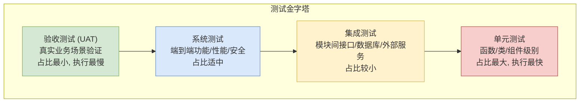

# 测试文档

**文档编号**：TEST-DRG-AGENT-V1.0  
**版本号**：V1.0  
**编制日期**：2026年3月  
**文档状态**：正式发布  

## 一、引言

### 1.1 测试目的

本文档旨在为 DRG 入组智能体系统（以下简称"本系统"）定义完整、系统的测试方案。本次测试的核心目的是在系统交付前，通过有计划的测试活动，全面验证系统是否满足需求规格说明书中定义的功能需求与非功能需求，并评估系统的质量水平。具体而言，本次测试围绕以下质量属性与目标展开：

(1) **功能正确性验证**：验证 DRG 入组智能体的核心入组逻辑是否正确。重点确认系统能够根据输入的电子病历文本（含主要诊断、手术操作、次要诊断等）和 DRG 分组规则，正确执行 MDC（主要诊断大类）分类、ADRG（核心分组）匹配、MCC/CC（严重合并症/并发症）判定，最终输出准确的 DRG 组号与组名。同时验证文档自动生成智能体能否基于系统需求、代码和设计信息生成符合规范的需求分析文档、架构设计文档和测试文档。

(2) **接口与集成可靠性验证**：验证前后端各 API 接口的请求与响应是否符合 OpenAPI 规范定义，确保 `/api/drg/*` 与 `/api/docgen_agent/*` 两大路由组下的所有端点在高并发和异常输入场景下均能稳定运行。验证前端 Vue.js 应用与后端 FastAPI 服务之间的数据交互是否正确、完整。

(3) **数据准确性与边界条件验证**：验证系统在处理不同诊断与手术组合时的入组结果准确性，包括正常场景（标准诊断加手术组合）、边界场景（合并症有无、多合并症并存、编码处于分类边界等）以及异常场景（ICD 编码错误、关键信息缺失、输入格式异常等）。确保系统对 MCC/CC 排除列表的校验逻辑符合《按病组（DRG）付费分组方案（2.0版）》的规范。

(4) **智能体行为与流程可靠性验证**：验证文档生成智能体与测试用例生成智能体的运行流程是否完整、可追踪。确认智能体支持运行创建、状态跟踪、中断、终止、提示注入以及运行轨迹追踪等功能，且在各状态转换过程中不出现数据丢失或状态不一致。

(5) **虚拟文档系统功能验证**：验证虚拟文档系统的文件接收、存储、提交与下载功能是否正常。确认文档的版本管理、文件完整性校验和权限控制符合设计要求。

(6) **安全性与访问控制验证**：验证系统在用户认证、令牌管理、接口鉴权等方面的安全性。确认敏感数据（如病历信息）在传输和存储过程中得到妥善保护，不存在未授权访问的风险。

(7) **性能与响应时效验证**：验证系统在正常负载下的响应时间是否满足用户体验要求。确认 DRG 入组请求的处理延迟处于可接受范围，文档生成任务在合理时间内完成，系统资源利用率在预期阈值内。

### 1.2 测试范围

本节明确列出本次测试活动涵盖的模块、功能与接口，以及明确排除在本次测试范围之外的项。测试范围的划分依据需求规格说明书、架构设计文档以及系统实际实现的 API 路由与前端组件。

**（一）包含在测试范围内的项**

a. **DRG 入组智能体核心功能**

(1) 入组任务创建接口（`POST /api/drg/task/create`）的功能与参数校验测试，包括必填字段验证、病历文本长度限制、编码格式校验等。

(2) 入组任务列表查询接口（`GET /api/drg/task/list`）的分页、排序与筛选功能测试。

(3) MDC 分类逻辑测试：覆盖《按病组（DRG）付费分组方案（2.0版）》中定义的各主要诊断大类（MDCA 至 MDCZ），验证主要诊断编码到 MDC 的映射准确性。

(4) ADRG 分组逻辑测试：验证主要诊断与主要手术操作的组合能否命中正确的核心分组（ADRG），覆盖外科组、非手术室操作组和内科组三大类 ADRG。

(5) DRG 细分组逻辑测试：验证 MCC/CC 判定逻辑，包括合并症识别、严重合并症区分、排除列表校验以及最终 DRG 组号的确定。

(6) 入组结果输出测试：验证返回结果中包含完整的 DRG 组号、组名、入组路径说明及各级分组依据。

b. **文档自动生成智能体功能**

(1) 文档生成启动接口（`POST /api/docgen_agent/generate-doc/start`）的参数传递与任务初始化测试。

(2) 文档类型支持测试：验证系统支持生成需求分析文档、架构设计文档和测试文档三种类型（`GET /api/docgen_agent/doc-types`）。

(3) 文档生成流程控制测试：验证运行轨迹追踪（`GET /api/docgen_agent/runs/{run_id}/trace`）、运行中断（`POST /api/docgen_agent/runs/{run_id}/interrupt`）、运行终止（`POST /api/docgen_agent/runs/{run_id}/terminate`）以及提示注入（`POST /api/docgen_agent/runs/{run_id}/hint`）等功能。

(4) 文档下载测试：验证生成的文档可通过 Markdown 格式（`GET /api/docgen_agent/runs/{run_id}/download`）、PDF 格式（`GET /api/docgen_agent/runs/{run_id}/download/pdf`）以及按文件名下载（`GET /api/docgen_agent/documents/{file_name}/download`）三种方式获取。

(5) 生成文档的内容规范性测试：验证生成的需求分析文档符合 SRS 模板结构、架构设计文档符合 ADD 模板结构、测试文档符合 TEST 模板结构。

c. **虚拟文档系统功能**

(1) 文档接收与存储功能测试：验证由文档生成智能体输出的文档能被虚拟文档系统正确接收并按规范路径存储。

(2) 文档提交与版本管理测试：验证文档的提交记录、版本追溯和状态流转功能。

(3) 文件完整性测试：验证存储的文档文件在写入和读取过程中不发生内容损坏或编码错误。

d. **前端用户界面与交互**

(1) DRG 入组任务创建页面的表单校验、提交与结果展示测试。

(2) 文档生成页面的任务管理、实时状态更新与下载交互测试。

(3) 前端路由（Vue Router）的导航与权限守卫测试。

(4) 前端状态管理（Pinia Store）的数据一致性与响应式更新测试。

e. **API 接口层通用测试**

(1) 请求参数校验测试：验证各接口对缺失参数、非法类型、越界值等异常输入的拦截能力。

(2) 认证与授权测试：验证受保护接口在无令牌、过期令牌、无效令牌场景下的拒绝访问行为。

(3) 响应格式一致性测试：验证所有接口的响应体结构符合统一的 API 响应格式规范。

(4) 错误处理与异常捕获测试：验证后端在数据库异常、大模型调用超时、文件系统错误等场景下的优雅降级与错误信息返回。

f. **数据持久化层测试**

(1) SQLite 数据库（基于 aiosqlite 与 SQLModel）的 CRUD 操作正确性测试。

(2) 数据模型（Pydantic 定义）的字段类型、默认值与约束校验测试。

(3) 数据库迁移与初始化的完整性测试。

**（二）明确排除在测试范围之外的项**

a. 底层大语言模型（LLM）的训练、微调与内部推理机制——本系统作为大模型应用层系统，不涉及模型本身的研发测试，此项由模型提供商负责。

b. 大模型推理结果的概率性一致性问题——由于大模型输出具有固有的不确定性，对于同一条病历的入组结果在不同运行中可能存在的细微文字差异（但 DRG 组号应一致），不纳入严格的确定性回归测试范围。

c. 生产环境级性能压力测试——本次测试仅在开发与预发布环境中进行负载验证，不包含万级并发以上的极限压力测试。如后续需要生产部署，应另行制定性能测试方案。

d. 第三方服务的可用性——系统依赖的外部大模型 API（如 OpenAI 兼容接口）的连通性与服务等级协议（SLA）不在本测试范围，测试环境将使用配置的 API 端点进行验证，但不对第三方服务的稳定性做保证。

e. 前端浏览器兼容性全覆盖测试——本次测试以 Chromium 内核浏览器（通过 Playwright）为主要验证环境，不覆盖所有主流浏览器的完整兼容性矩阵。

f. 移动端适配与响应式布局测试——本系统的前端主要面向桌面浏览器使用场景，移动端的界面适配与触控交互不在本次测试范围。

g. 安全性渗透测试——本次测试包含基本的安全功能验证（认证、授权、输入校验），但不包含专业级渗透测试与漏洞扫描。如需进行安全审计，应另行组织专项安全测试。

**（三）测试范围边界说明**

下表归纳了各系统模块的测试覆盖边界：

**表1-1：测试范围覆盖矩阵**

| 模块/组件 | 单元测试 | 集成测试 | 系统测试 | 说明 |
| :---: | :---: | :---: | :---: | :---: |
| DRG 入组核心逻辑 | ✓ | ✓ | ✓ | 含 MDC/ADRG/DRG 三层分组全路径 |
| 文档生成智能体 | ✓ | ✓ | ✓ | 含生成流程控制与内容校验 |
| 测试用例生成智能体 | ✓ | ✓ | ✓ | 含正常/边界/异常三类场景 |
| 虚拟文档系统 | — | ✓ | ✓ | 以集成测试为主 |
| FastAPI 接口层 | ✓ | ✓ | ✓ | 含参数校验与认证中间件 |
| Vue.js 前端组件 | ✓ | ✓ | ✓ | 使用 Playwright 进行端到端测试 |
| SQLite 数据层 | ✓ | ✓ | — | 单元测试覆盖数据模型与查询 |
| LLM API 调用层 | — | ✓ | ✓ | Mock 与真实调用结合验证 |
| 用户认证模块 | ✓ | ✓ | ✓ | 含 JWT 令牌生命周期测试 |

注：表中"✓"表示该项测试在本范围内，"—"表示不在该层级的测试范围。例如，虚拟文档系统不涉及独立的单元测试，其功能验证在集成测试与系统测试层面完成。

## 测试策略

DRG 入组智能体系统的测试策略遵循分层递进原则，自底向上覆盖单元测试、集成测试、系统测试和验收测试四个级别。各测试级别目标明确、范围独立、相互衔接，共同保障系统质量。测试金字塔模型要求单元测试占比最大、执行最快，集成测试次之，系统测试和验收测试聚焦关键业务场景。各级测试的层次关系如 **图3-1** 所示。



**图3-1：测试金字塔层次关系图**

### 单元测试策略

单元测试是测试体系的基础层，目标在于独立验证最小可测单元（函数、方法、类、Vue 组件）在隔离环境中的正确性。本系统包含 Python 后端（FastAPI）和 TypeScript 前端（Vue 3）两部分，需分别建立单元测试体系。

#### 3.1.1 后端单元测试

（1）**测试框架与工具**

a. 主测试框架：**pytest**（Python 生态标准测试框架），结合以下插件扩展能力：
   (1) `pytest-asyncio`：支持异步测试用例，适配 FastAPI 异步路由处理逻辑；
   (2) `pytest-cov`：生成代码覆盖率报告（HTML/XML/Terminal 多格式输出）；
   (3) `pytest-mock`：提供 `mocker` fixture，简化 Mock 对象创建；
   (4) `pytest-xdist`：支持多核并行执行，缩短测试执行时间。

b. 桩与模拟工具：
   (1) `unittest.mock`（标准库）：用于替换外部依赖（数据库连接、HTTP 客户端、大模型 API 调用）；
   (2) 对 `aiosqlite` 数据库操作的模拟：创建内存 SQLite 数据库替代真实数据库文件；
   (3) 对 `openai` 库的模拟：拦截大模型 API 调用并返回预设响应，确保测试可重复且无外部依赖。

c. 断言增强：使用 pydantic 内置的 `model_validate` 方法对模型输出进行结构校验。

（2）**测试范围**

**表1-2：表格说明**

| 测试对象 | 测试内容 | 优先级 |
| :---: | :---: | :---: |
| 数据模型（SQLModel/Pydantic） | 字段类型校验、必填约束、默认值、关系映射 | 高 |
| DRG 分组核心逻辑 | MDC 匹配、ADRG 分组、MCC/CC 判定、排除表校验 | **最高** |
| 文档生成逻辑 | 文档结构拼装、内容填充、格式校验 | 高 |
| API 路由处理函数 | 请求参数校验、响应模型序列化、异常处理 | 高 |
| 工具函数/辅助类 | 编码转换、日期格式化、字符串处理等 | 中 |
| 认证与授权逻辑 | 密码哈希验证、JWT 令牌生成与校验、权限检查 | 高 |

（3）**覆盖率要求**

**表1-2：表格说明**

| 模块 | 最低行覆盖率 | 最低分支覆盖率 | 说明 |
| :---: | :---: | :---: | :---: |
| DRG 分组核心模块（`agent/drg_agent/`） | 90% | 85% | 业务关键路径，必须充分覆盖 |
| 文档生成模块（`agent/docgen_agent/`） | 85% | 80% | 影响输出文档质量 |
| API 路由层（`api.py` 文件） | 80% | 75% | 覆盖所有端点和异常路径 |
| 数据模型层（`models/`） | 85% | — | 字段约束与验证逻辑 |
| 工具模块（`utils/`） | 75% | 70% | 辅助功能 |
| 整体项目 | **80%** | **75%** | 全局最低要求 |

（4）**命名与组织规范**

a. 测试文件命名：`test_<模块名>.py`，存放于对应模块目录下的 `tests/` 子目录或项目根 `tests/` 目录中镜像源码结构。

b. 测试函数命名：`test_<被测函数名>_<场景描述>`，如 `test_mdc_match_valid_diagnosis_returns_correct_mdc`。

c. 测试类命名：`Test<被测类名>`，如 `TestDrgGrouper`。

d. 每个测试函数遵循 AAA 模式（Arrange-Act-Assert），仅验证一个行为。

（5）**DRG 分组核心逻辑测试要点**

DRG 分组是本系统核心业务，单元测试需重点覆盖以下场景：

a. **MDC 匹配测试**：
   (1) 有效 ICD-10 编码匹配正确 MDC 大类（如 A01.002+G01* → MDCB）；
   (2) 无效或未知编码返回明确错误标识；
   (3) 边界编码（编码格式异常、特殊字符、空值）。

b. **ADRG 分组测试**：
   (1) 诊断+手术组合命中正确 ADRG（如 MDCB + 38.1000x002 → BB1）；
   (2) 仅诊断无手术的情况（内科 ADRG）；
   (3) 多手术组合的分组优先级。

c. **MCC/CC 判定测试**：
   (1) MCC 列表中包含的次要诊断正确触发严重合并症标记；
   (2) CC 列表中包含的次要诊断正确触发合并症标记；
   (3) 排除表校验：主诊断排除某并发症时，该并发症不计入；
   (4) 无任何合并症的默认分组。

d. **完整入组路径测试**：端到端验证从患者病历输入到最终 DRG 组号输出的全链路逻辑（在单元层面以 Mock 数据驱动）。

（6）**桩与模拟策略细节**

a. **大模型 API 模拟**：系统中 DRG 分组和文档生成可能调用 LLM 服务（通过 `openai` 库）。所有单元测试必须 Mock `openai.ChatCompletion.create` 及相关方法，返回预设的确定性响应，确保测试不依赖外部网络和 API 配额。

```python
mock_response = {
    "choices": [{
        "message": {
            "content": '{"mdc": "MDCB", "adrg": "BB1", "drg": "BB11"}'
        }
    }]
}
```

b. **数据库模拟**：使用 `aiosqlite` 连接内存数据库（`:memory:`），在测试前置步骤中创建表结构并插入测试数据，测试后自动释放。

c. **外部文档系统模拟**：文档提交到虚拟文档系统的 HTTP 请求使用 `responses` 库或 `unittest.mock` 拦截，返回模拟的成功/失败响应。

#### 3.1.2 前端单元测试

（1）**测试框架与工具**

a. 主测试框架：**Vitest**（与 Vite 原生集成，配置零开销），结合：
   (1) `@vue/test-utils`：Vue 组件挂载与交互测试；
   (2) `vitest-dom`：提供 DOM 相关的语义化断言（如 `toBeVisible()` / `toHaveTextContent()`）；
   (3) `happy-dom` 或 `jsdom`：提供浏览器 DOM 环境模拟。

b. 状态管理测试：Pinia Store 的单元测试可直接实例化 Store 并调用 actions/getters，无需挂载组件。

c. API 客户端模拟：使用 `vi.mock()` Mock `axios` 模块，返回预设 HTTP 响应。

（2）**测试范围**

**表1-2：表格说明**

| 测试对象 | 测试内容 | 优先级 |
| :---: | :---: | :---: |
| Pinia Store（状态管理） | State 初始化、Actions 异步流程、Getters 计算逻辑 | 高 |
| Vue 组合式函数（Composables） | 复用逻辑单元（如 `useAuth`、`useDrgTask`） | 高 |
| 工具函数 | 日期格式转换、枚举值映射、字符串截断等 | 中 |
| 基础 UI 组件 | 按钮、输入框、模态框等独立行为 | 中 |
| API 请求封装层 | 请求拦截器、错误统一处理、Token 注入 | 高 |
| 路由守卫逻辑 | 权限校验、重定向逻辑 | 高 |

（3）**覆盖率要求**

**表1-2：表格说明**

| 模块 | 最低行覆盖率 | 最低分支覆盖率 |
| :---: | :---: | :---: |
| Pinia Store | 85% | 80% |
| Composables | 85% | 80% |
| 工具函数 | 90% | 85% |
| API 封装层 | 80% | 75% |
| 路由配置 | 80% | 75% |
| 整体前端 | **75%** | **70%** |

（4）**组件测试原则**

a. 优先测试逻辑密集型组件（如表单校验、状态切换），纯展示型组件可降低测试优先级。

b. 使用 `shallowMount`（浅挂载）隔离测试目标组件，子组件以桩（Stub）替代。

c. 组件交互测试聚焦用户行为：点击、输入、提交、导航等，使用 `await wrapper.find('button').trigger('click')` 模拟。

---

### 集成测试策略

集成测试验证多个模块协同工作时的接口契约、数据流和交互逻辑是否正确。本系统采用**自底向上的增量式集成策略**，先验证底层服务和数据层的组合，再逐层向上集成 API 层和前端。

#### 3.2.1 集成测试层次

**表3-2：集成测试层次规划**

| 层次 | 集成范围 | 测试重点 |
| :---: | :---: | :---: |
| L1：数据层集成 | SQLModel + aiosqlite | ORM 映射正确性、CRUD 操作、事务完整性、迁移脚本 |
| L2：服务层集成 | DRG 智能体 + 数据层 + 规则引擎 | 分组逻辑与数据读写的配合、规则加载与匹配 |
| L3：API 层集成 | FastAPI 路由 + 服务层 + 认证中间件 | HTTP 请求-响应全链路、状态码、认证鉴权 |
| L4：跨智能体集成 | DRG 智能体 + 文档生成智能体 + 虚拟文档系统 | 智能体间数据传递、文档提交回调 |
| L5：前后端集成 | Vue 前端 + FastAPI 后端 | API 契约一致性、跨域处理、Token 传递 |

#### 3.2.2 集成测试方法与工具

（1）**L1 数据层集成**

a. 使用真实 `aiosqlite` 数据库文件（测试专用临时文件），不使用 Mock。

b. 测试内容：
   (1) 执行 SQLModel 的 `create_all` 后验证表结构完整性；
   (2) 插入、查询、更新、删除操作的端到端验证；
   (3) 外键约束和级联操作的验证；
   (4) 并发写入的数据一致性（使用 `asyncio.gather` 模拟并发）。

c. 工具：`pytest-asyncio` + `aiosqlite` + 临时文件（`tmp_path` fixture）。

（2）**L2 服务层集成**

a. DRG 智能体服务集成测试：
   (1) 加载真实 DRG 规则文件（MDC 分类表、ADRG 分组表、MCC/CC 列表），验证规则解析的完整性；
   (2) 使用真实病历样本作为输入，追踪分组全过程日志；
   (3) 验证规则文件更新后服务能正确重新加载。

b. 文档生成智能体集成测试：
   (1) 传入完整的系统需求和代码信息，验证生成的文档包含必需要素；
   (2) 验证 Markdown 输出的格式合规性（标题层级、表格结构）。

（3）**L3 API 层集成**

a. 工具：**FastAPI TestClient**（基于 `httpx`）+ `pytest-asyncio`。

b. 测试方法：
   (1) 启动完整的 FastAPI 应用实例（含中间件、路由、依赖注入）；
   (2) 使用 `TestClient` 发送 HTTP 请求，验证响应状态码、响应体结构和业务语义；
   (3) 验证异常场景：无效参数、缺失必填字段、未授权访问、资源不存在。

c. 关键测试接口：

**表3-3：表格说明**

| API 端点 | 集成测试场景 |
| :---: | :---: |
| `POST /api/drg/task/create` | 正常分组请求、无效病历、缺失诊断、编码格式错误 |
| `GET /api/drg/task/list` | 分页查询、空列表、过滤条件 |
| `POST /api/docgen_agent/generate-doc` | 正常文档生成、不支持的文档类型、空输入 |
| `GET /api/docgen_agent/runs/{run_id}/download` | 下载已生成文档、不存在的 run_id |
| `POST /api/auth/login` | 正确凭证、错误密码、禁用用户 |

d. 认证鉴权集成测试：
   (1) 未携带 Token 请求受保护接口返回 401；
   (2) 过期 Token 返回 401 且错误信息明确；
   (3) 权限不足用户访问管理接口返回 403。

（4）**L4 跨智能体集成**

a. 测试 DRG 分组结果自动传递给文档生成智能体的数据链路。

b. 测试虚拟文档系统的文件存储和检索：
   (1) 文档生成后自动提交至虚拟文档系统的完整流程；
   (2) 提交失败时的重试和错误记录机制（待补充：如项目未实现重试机制，则标记为待确认）。

（5）**L5 前后端集成**

a. 工具：**Playwright**（已在 `pyproject.toml` 中声明为依赖）或 Cypress。

b. 前端集成测试（API 契约测试）：
   (1) 使用 `openapi-ts`（已在 `devDependencies` 中声明）从 FastAPI 的 OpenAPI 规范自动生成 TypeScript 类型；
   (2) 编写合约测试验证前端请求体和后端响应体的类型一致性；
   (3) 前端 `axios` 拦截器注入的 Token 能否被后端正确解析。

#### 3.2.3 集成测试数据管理

a. **测试数据隔离**：每次集成测试运行前创建独立测试数据库，运行后销毁，确保测试间无干扰。

b. **Fixture 管理**：使用 pytest fixture 的 `scope` 参数控制数据生命周期——`function` 级别用于需要完全隔离的测试，`module` 级别用于共享只读参考数据的测试。

c. **测试数据来源**：
   (1) DRG 规则测试数据：从项目规则文件提取核心条目构建最小验证集；
   (2) 病历样本测试数据：基于需求文档中的实例（如伤寒性脑膜炎 + 动脉内膜剥脱术 + 急性呼吸衰竭）扩展构建覆盖各 MDC 的代表性样本集。

---

### 系统测试策略

系统测试在完整的部署环境中验证软件系统是否满足功能和非功能需求。本系统的系统测试涵盖功能测试、性能测试、安全测试、兼容性测试和可用性测试五个维度。

#### 3.3.1 功能测试

功能测试验证系统全部功能模块是否按需求规格说明书正确运行。

（1）**DRG 分组功能测试**

**表3-3：表格说明**

| 测试类别 | 测试场景 | 预期结果 |
| :---: | :---: | :---: |
| 正常场景 | 不同 MDC 大类的诊断+手术组合（覆盖至少每个 MDC 一个典型病例） | 正确输出 MDC、ADRG、DRG 三级分组结果 |
| 正常场景 | 仅诊断无手术的内科病例 | 输出内科 ADRG 分组，不报错 |
| 正常场景 | 多个次要诊断的组合（含 MCC+CC 混合） | 正确判定并发症等级，DRG 细分组正确 |
| 边界场景 | 次要诊断恰好包含一条 MCC（无其他合并症） | 正确识别 MCC，进入伴严重合并症 DRG |
| 边界场景 | 次要诊断包含 CC 但不含 MCC | 进入伴合并症 DRG，不误判为 MCC |
| 边界场景 | 主诊断直接排除该 MCC（命中排除表） | MCC 判定不成立，不应用 MCC 分层 |
| 边界场景 | 手术编码为罕见的扩展码（如 x002 后缀） | 正确匹配对应 ADRG |
| 异常场景 | 主要诊断编码不存在于规则库 | 返回明确错误信息"诊断编码未识别"，不崩溃 |
| 异常场景 | 主要手术编码不存在于规则库 | 返回明确错误信息或降级为内科分组 |
| 异常场景 | 病历文本为空 | 返回参数校验错误，状态码 422 |
| 异常场景 | 病历文本仅含无效字符或乱码 | 返回解析失败提示，不输出不可靠分组 |
| 异常场景 | 主要诊断含特殊字符（如 +、*、.） | 正确解析并匹配，参考实例 A01.002+G01* |
| 组合场景 | 同一诊断+不同手术组合的差异分组 | 分组结果合理区分 |

（2）**文档生成功能测试**

**表3-3：表格说明**

| 测试类别 | 测试场景 | 预期结果 |
| :---: | :---: | :---: |
| 正常场景 | 选择"需求规格说明书"类型，提供完整输入信息 | 生成含功能需求、用例等完整章节的文档 |
| 正常场景 | 选择"架构设计文档"类型 | 生成含整体结构、模块关系等内容的文档 |
| 正常场景 | 选择"测试文档"类型 | 生成含测试策略、测试方案等内容的文档 |
| 边界场景 | 输入信息仅包含最少必要字段 | 仍能生成基础结构，缺失项标注"待补充" |
| 异常场景 | 不支持的文档类型 | 返回 400 错误及支持的文档类型列表 |
| 异常场景 | 文档生成过程中断（API 超时） | 支持中断恢复，通过 `/runs/{id}/interrupt` 接口处理 |
| 功能测试 | 通过 `/runs/{id}/download` 下载已生成文档 | 返回正确的文档内容和 MIME 类型 |

（3）**虚拟文档系统功能测试**

**表3-3：表格说明**

| 测试类别 | 测试场景 | 预期结果 |
| :---: | :---: | :---: |
| 正常场景 | 文档自动提交至虚拟文档系统 | 文件成功存储，返回存储路径 |
| 正常场景 | 通过文件名下载已提交文档 | 返回正确文件内容 |
| 异常场景 | 提交时存储空间不足 | 返回明确错误信息 |

#### 3.3.2 性能测试

（1）**测试指标**

**表3-3：表格说明**

| 指标 | 目标值 | 测试方法 |
| :---: | :---: | :---: |
| DRG 单次分组响应时间 | ≤ 3 秒（P95） | 使用 100 条典型病历样本逐一请求，统计响应时间分布 |
| DRG 批量分组吞吐量 | ≥ 10 条/秒 | 并发提交 50 条病历，测量总完成时间 |
| 文档生成响应时间 | ≤ 30 秒（单个文档） | 因依赖大模型推理，该指标以监控为主，不作硬性限值 |
| API 接口响应时间（非 AI） | ≤ 500ms（P99） | 对 `/task/list`、`/doc-types` 等非 AI 接口进行压测 |
| 并发用户支持 | 10 并发用户无错误 | JMeter 或 Locust 模拟 10 个虚拟用户同时操作 |

（2）**测试工具**

a. **Locust**：Python 原生性能测试工具，可编写 Python 脚本定义用户行为，与项目技术栈一致。

b. **自定义性能监控**：在 DRG 分组和文档生成的关键路径插入 `time.perf_counter()` 计时点，记录各阶段耗时（诊断解析、规则匹配、并发症判定），用于瓶颈定位。

（3）**性能测试场景**

a. **负载测试**：从 1 并发逐步增加到 10 并发，观察响应时间和错误率的变化趋势。

b. **稳定性测试**：以 5 并发持续运行 30 分钟，验证无内存泄漏和性能衰减。

c. **峰值测试**：瞬间 20 并发（超出预期最大负载 2 倍），验证系统降级能力而非直接崩溃。

#### 3.3.3 安全测试

（1）**认证与授权**

**表3-3：表格说明**

| 测试项 | 测试方法 | 通过标准 |
| :---: | :---: | :---: |
| JWT Token 安全性 | 使用无效签名、过期 Token、篡改 Token 请求受保护接口 | 全部返回 401 Unauthorized |
| 密码存储安全 | 检查数据库中存储的密码是否为 Argon2 哈希（非明文） | 不可逆加密，无法还原明文 |
| 权限边界 | 低权限用户尝试访问管理接口 | 返回 403 Forbidden |
| Token 刷新机制 | Token 过期后使用刷新令牌获取新 Token | 流程正确，旧 Token 失效 |

（2）**输入安全**

**表3-3：表格说明**

| 测试项 | 测试方法 | 通过标准 |
| :---: | :---: | :---: |
| SQL 注入 | 在病历文本和参数中注入 SQL 语句（如 `'; DROP TABLE users;--`） | SQLModel 参数化查询阻止注入，数据不受影响 |
| XSS 跨站脚本 | 在病历文本中嵌入 `<script>alert(1)</script>` | 前端输出时正确转义，脚本不执行 |
| 超大输入 | 提交超过 10MB 的病历文本 | 返回 413 或明确的大小限制错误 |
| 路径遍历 | 文档下载路径中使用 `../../../etc/passwd` | 路径校验阻止非法访问，返回 400 |

（3）**依赖安全**

a. 使用 `pip-audit` 或 `safety` 扫描 Python 依赖的已知漏洞。

b. 使用 `npm audit` 扫描前端依赖的已知漏洞。

c. 通过标准：无高危（Critical/High）漏洞，中危（Medium）漏洞需在发布前评估和修复。

#### 3.3.4 兼容性测试

（1）**浏览器兼容性**

**表3-3：表格说明**

| 浏览器 | 最低版本 | 测试范围 |
| :---: | :---: | :---: |
| Chrome | 最新版本及前一个主要版本 | 全功能验证 |
| Edge | 最新版本 | 全功能验证 |
| Firefox | 最新版本 | 核心功能验证 |
| Safari | 最新版本 | 核心功能验证（Mac 环境） |

（2）**Python 版本兼容性**

a. 项目限定了 `requires-python = "==3.13.*"`，测试需在 Python 3.13.x 环境中执行。

b. 如后续放宽版本约束，需补充在 Python 3.11 / 3.12 上的兼容性验证。

（3）**操作系统兼容性**

**表3-3：表格说明**

| 操作系统 | 测试范围 |
| :---: | :---: |
| Windows 10/11 | 完整测试（开发主要平台） |
| Ubuntu 22.04+ | 完整测试（部署目标平台） |
| macOS（Apple Silicon） | 核心功能测试 |

#### 3.3.5 可用性测试

（1）**前端界面可用性**

a. 关键用户任务完成率测试：
   (1) 任务 1：提交一份病历并获取 DRG 分组结果——目标完成时间 ≤ 2 分钟；
   (2) 任务 2：生成一份需求规格说明书并下载——目标完成时间 ≤ 5 分钟；
   (3) 任务 3：查看历史分组记录——目标完成时间 ≤ 30 秒。

b. 错误提示的清晰性：提交无效病历后，错误提示应明确指出问题所在（如"主要诊断为必填项"），而非笼统的"系统错误"。

c. 加载状态可见性：AI 任务执行期间，前端显示明确的进度指示（如进度条、状态文本），用户可随时中断任务。

---

### 验收测试策略

验收测试（User Acceptance Testing, UAT）是系统交付前的最终验证环节，由用户或用户代表在模拟生产环境中执行，确认系统满足业务需求和预期使用方式。

#### 3.4.1 UAT 参与方式

（1）**测试人员组成**

**表3-3：表格说明**

| 角色 | 人数建议 | 职责 |
| :---: | :---: | :---: |
| 业务专家（医保/DRG 领域） | 1-2 人 | 验证 DRG 分组结果的业务准确性，评审病历样本的覆盖度 |
| 终端用户代表 | 2-3 人 | 执行日常使用场景，评估易用性和效率 |
| 测试协调员（项目组） | 1 人 | 准备测试环境、编写 UAT 测试脚本、记录问题和反馈 |

（2）**UAT 环境**

a. 独立于开发和测试环境的准生产环境，配置与生产环境一致。

b. 预置完整的 DRG 规则文件（与生产环境版本一致）。

c. 提供 20-30 份经过业务专家审核的真实/模拟病历样本作为测试数据集（其中 15 份为典型正常病例，5 份为边界病例，5 份为异常病例）。

（3）**UAT 执行方式**

a. **引导式测试**（首日）：由测试协调员带领用户代表按预设脚本逐一执行关键场景（约 10-15 个场景），确保核心功能无阻塞性缺陷。

b. **自由探索测试**（后续）：用户代表根据自身经验自由操作系统，记录使用感受和发现的问题。鼓励"想怎么用就怎么用"的探索式测试。

c. **反馈收集**：使用统一的问题记录模板，包含场景描述、操作步骤、预期结果、实际结果、严重程度（阻塞/严重/一般/建议）五个字段。

#### 3.4.2 UAT 通过标准

（1）**必要条件（全部满足方可通过）**

a. 所有预设的引导式测试场景全部通过，无阻塞性缺陷（即影响核心业务流程无法完成的缺陷）。

b. DRG 分组结果与业务专家人工分组结果的一致性 ≥ 95%（基于提供的测试数据集）。

c. 文档生成输出的结构完整性达到 100%（即生成的文档必须包含需求规定的全部必需章节，内容质量不作量化要求）。

d. 无数据丢失或数据损坏的情况。

（2）**充分条件（满足可加速通过）**

a. 自由探索测试中发现的一般性缺陷 ≤ 5 个。

b. 用户满意度评分（1-5 分制）平均 ≥ 3.5 分。

c. 关键任务的用户完成率（无外部帮助）≥ 90%。

（3）**缺陷分类与处理策略**

**表3-3：表格说明**

| 严重程度 | 定义 | UAT 处理策略 |
| :---: | :---: | :---: |
| 阻塞 | 核心业务流程无法完成，或导致数据丢失 | 必须修复并通过回归测试后方可继续 UAT |
| 严重 | 核心功能可完成但结果错误，或严重影响体验 | 必须修复，可并行进行其他场景测试 |
| 一般 | 非核心功能异常，或存在可接受的变通方案 | 记录并评估，可在后续版本修复 |
| 建议 | 改进建议，非功能缺陷 | 记录并纳入需求池，不作 UAT 阻塞条件 |

（4）**UAT 签核**

a. 所有必要条件满足后，由业务专家和用户代表在验收报告上签字确认。

b. 验收报告应包含：测试数据集清单、通过的场景列表、缺陷列表及处理状态、一致性统计结果、用户满意度评分汇总。

c. 签核后的验收报告作为系统交付的依据文件存档至虚拟文档系统。

#### 3.4.3 回归测试保障

UAT 期间修复缺陷后，必须执行以下回归测试：

a. **缺陷修复验证**：验证该缺陷已完全修复，且修复方案未引入新问题。

b. **关联场景回归**：执行与该缺陷相关的 3-5 个关联场景，确保修改不影响已有功能。

c. **核心场景冒烟测试**：执行预设的 5 个最高优先级引导式测试场景，验证系统整体可用性未受损。

d. 回归测试通过后，UAT 方可继续或完成签核。

## 三、测试环境与工具

本章描述 DRG 入组智能体系统测试所需的硬件配置、软件栈及测试工具链。测试环境采用与开发环境同机的单机部署方案，通过进程隔离与独立数据库实例实现测试数据与开发数据的分离。对于需要评估系统在生产环境性能的场景，另配置独立的性能测试环境。


**图3-1：测试环境拓扑图**

如图 3-1 所示，测试环境整体划分为四个逻辑区域：

a. **测试工作站**：承载自动化测试脚本的执行，包括 API 集成测试（pytest）、端到端浏览器测试（Playwright）以及性能压测（JMeter）；
b. **测试服务器**：以 Docker 容器化方式运行 FastAPI 后端服务，内部搭载 drg_agent（DRG 分组推理智能体）与 docgen_agent（文档自动生成智能体）两个核心模块；
c. **数据层**：包含独立的 SQLite 测试数据库（test_drg.db）及 LLM Mock 服务，后者用于模拟大模型 API 响应以消除外部依赖；
d. **浏览器环境**：Playwright 驱动 Chromium 浏览器访问前端页面，配合 Vue DevTools 进行前端调试与 UI 行为验证。

各组件间的通信链路由实线箭头表示有状态或数据依赖的调用关系，虚线箭头表示控制或调试辅助关系。图中 LLM Mock 服务是关键隔离点——所有来自 drg_agent 与 docgen_agent 的大模型请求均被重定向至此，确保测试可重复且不受外部 API 波动影响。

### 3.1 硬件环境

本系统测试在单台开发/测试工作站上完成。表 3-1 列出测试工作站的硬件配置建议，表 3-2 给出性能测试环境（独立部署）的最低硬件要求。

**表3-1：测试工作站硬件配置**

| 配置项 | 推荐配置 | 最低配置 | 说明 |
| :---: | :---: | :---: | :---: |
| CPU | Intel Core i7-13700H 或同等性能（14 核 20 线程） | Intel Core i5 或同等性能（4 核 8 线程） | Playwright 并行执行 E2E 测试时多核优势明显 |
| 内存 | 32 GB DDR5 | 16 GB DDR4 | JMeter 高并发压测及 Chromium 多标签页需较大内存 |
| 磁盘 | 512 GB NVMe SSD | 256 GB SATA SSD | SQLite 数据库文件及测试产物（截图、日志）需快速 I/O |
| 网络 | 千兆以太网 / Wi-Fi 6 | 百兆以太网 | 与 LLM Mock 服务及内部 API 通信均为本地回环，对带宽要求低 |

**表3-2：性能测试环境（独立部署）硬件配置**

| 配置项 | 推荐配置 | 说明 |
| :---: | :---: | :---: |
| CPU | 4 vCPU（云主机）或同等性能 | 模拟典型中小规模部署 |
| 内存 | 8 GB | FastAPI 异步工作进程 + SQLite 连接池 |
| 磁盘 | 40 GB SSD | 系统镜像 + 测试数据库 + 日志存储 |
| 操作系统 | Ubuntu 24.04 LTS（64 位） | 与生产目标 OS 保持一致 |

性能测试环境与功能测试环境物理分离，以避免 JMeter 压测产生的负载干扰功能测试中响应时间等指标的测量。当资源受限时，可采用 Docker Compose 在同一台物理机上以资源限制（`--cpus`、`--memory`）方式模拟独立部署。

### 3.2 软件环境

测试环境软件栈与开发环境保持一致，关键组件版本见表 3-3。所有版本号均源自项目依赖清单（`pyproject.toml`、`client/package.json`、`uv.lock`），确保测试结果与开发验证结果的可比性。

**表3-3：测试环境软件栈**

| 类别 | 软件名称 | 版本 | 用途 |
| :---: | :---: | :---: | :---: |
| 操作系统 | Windows 11 / Ubuntu 24.04 LTS | — | 测试工作站操作系统；Linux 用于性能测试环境 |
| 后端运行时 | Python | 3.13.x | FastAPI 服务运行环境 |
| 包管理器 | uv | 最新稳定版 | Python 依赖管理与虚拟环境 |
| Web 框架 | FastAPI | ≥0.136.0 | 后端 API 服务 |
| 异步数据库驱动 | aiosqlite | ≥0.22.1 | SQLite 异步访问 |
| ORM | SQLModel | ≥0.0.38 | 数据模型定义与迁移 |
| 大模型 SDK | openai | ≥2.33.0 | 对接 LLM API（测试中经 Mock 服务代理） |
| 前端运行时 | Node.js | ^20.19.0 或 ≥22.12.0 | Vue 前端构建与开发服务器 |
| 前端框架 | Vue | ^3.5.31 | 前端 UI 框架 |
| 前端语言 | TypeScript | ~6.0.0 | 前端类型安全 |
| 前端构建工具 | Vite | ^8.0.3 | 前端开发服务器与打包 |
| CSS 预处理器 | Sass / Sass-embedded | ^1.99.0 | 样式编译 |
| 前端 HTTP 库 | Axios | ^1.15.1 | 前端 API 请求 |
| Markdown 渲染 | Marked | ^18.0.3 | 文档内容前端渲染 |
| 认证库（后端） | python-jose | ≥3.5.0 | JWT 令牌管理 |
| 认证库（后端） | passlib[argon2] | ≥1.7.4 | 密码哈希验证 |
| 数据库 | SQLite | 3.x（随 Python 分发） | 关系数据存储 |
| 浏览器 | Chromium | 最新稳定版（Playwright 内置） | E2E 测试运行时 |
| 容器运行时 | Docker | ≥24.0 | 测试环境容器化与隔离 |

测试环境的隔离策略如下：

a. **数据库隔离**：测试使用独立的 SQLite 数据库文件 `test_drg.db`，与开发数据库 `drg.db` 完全分离；每次测试套件启动时执行数据库初始化脚本，保证测试数据的可重复性；
b. **LLM 调用隔离**：通过环境变量 `LLM_BASE_URL` 将大模型 API 端点指向本地 Mock 服务，Mock 服务依据预定义的规则-诊断-病历组合返回确定性响应，避免外部 API 调用带来的网络延迟、配额限制和成本开销；
c. **文件系统隔离**：测试生成的文件（文档输出、日志、截图）统一写入临时目录（`/tmp/drg_test/` 或 `%TEMP%\drg_test\`），测试完成后由框架自动清理。

### 3.3 测试工具

测试工具链覆盖单元测试、API 集成测试、端到端测试、性能测试、静态分析以及缺陷管理六个类别。工具选型遵循以下原则：（1）优先选择与项目技术栈原生集成的工具；（2）确保工具链在 Python 3.13 及 Node.js ≥20.19 环境下稳定运行；（3）性能测试工具需支持 HTTP/1.1 协议及 JSON 请求体的构造。

**表3-4：测试工具链总览**

| 类别 | 工具名称 | 版本 | 用途 | 集成方式 |
| :---: | :---: | :---: | :---: | :---: |
| 单元测试 | pytest | ≥8.0 | Python 后端单元测试 | pip 安装，配合 pytest-asyncio 支持异步测试 |
| 异步测试 | pytest-asyncio | ≥0.24 | FastAPI 异步端点的协程测试 | pytest 插件，自动发现 async 测试函数 |
| HTTP 测试客户端 | httpx | ≥0.28 | API 集成测试中的异步 HTTP 请求 | 替代 requests 以支持 FastAPI TestClient 的异步模式 |
| Mock 服务 | respx | ≥0.21 | 模拟 LLM API 及其他外部 HTTP 依赖 | 装饰器/上下文管理器方式拦截 httpx 请求 |
| 代码覆盖率 | coverage.py | ≥7.6 | Python 代码覆盖率统计 | pytest-cov 插件集成，生成 HTML/XML 报告 |
| 前端单元测试 | Vitest | ≥3.0 | Vue 组件与 Pinia Store 单元测试 | 与 Vite 原生集成，复用 vite.config.ts |
| 前端组件测试 | @vue/test-utils | ≥2.4 | Vue 3 组件挂载与交互测试 | 与 Vitest 配合使用 |
| E2E 测试 | Playwright | ≥1.59.0 | 浏览器端到端测试 | npm 安装，项目已依赖 playwright |
| E2E 测试（Python） | playwright（Python） | 与 Node 版本同步 | Python 脚本驱动的 Playwright 测试 | pip 安装，共享同一浏览器二进制 |
| API 契约测试 | Schemathesis | ≥3.0 | 基于 OpenAPI Schema 的自动模糊测试 | 读取 FastAPI 自动生成的 /openapi.json |
| 性能测试 | JMeter | ≥5.6 | HTTP 压力测试与并发模拟 | 独立安装，通过 JMX 脚本定义测试计划 |
| 性能监控 | psutil | ≥6.0 | 测试期间服务器资源监控 | Python 库，在 pytest fixture 中采集 CPU/内存指标 |
| 静态分析（Python） | Ruff | ≥0.14.9 | Python 代码风格检查与 lint | 项目 dev 依赖，已配置 pyproject.toml |
| 静态分析（前端） | vue-tsc | ^3.2.6 | TypeScript 类型检查 | 项目 dev 依赖，已集成至构建流程 |
| 安全扫描 | Bandit | ≥1.7 | Python 代码安全漏洞扫描 | pip 安装，CI 流水线中自动执行 |
| 缺陷管理 | 项目 Issue Tracker | — | Bug 记录、跟踪与关闭 | 随项目代码仓库（Git）的 Issue 功能 |
| 测试报告 | Allure | ≥2.30 | 测试结果可视化与趋势分析 | pytest-allure 插件，生成 HTML 报告 |

以下对各关键工具的配置与使用场景做进一步说明。

**(1) pytest + pytest-asyncio**

pytest 作为后端测试主框架，配置文件 `pyproject.toml` 中设定测试发现规则：

```
[tool.pytest.ini_options]
testpaths = ["tests"]
python_files = ["test_*.py", "*_test.py"]
asyncio_mode = "auto"
markers = [
    "unit: 单元测试",
    "integration: 集成测试",
    "slow: 耗时测试（含 LLM Mock 调用）",
    "e2e: 端到端测试",
]
```

通过 `asyncio_mode = "auto"`，pytest 自动识别异步测试函数并注入事件循环，无需手动 `@pytest.mark.asyncio` 装饰。`slow` 标记用于分组执行——快速单元测试在每次提交前运行，集成与慢速测试在 CI 流水线中每日执行。

**(2) Playwright**

Playwright 承担浏览器端 E2E 测试任务，覆盖以下关键用户路径：

a. DRG 分组任务创建 → 病历输入 → 分组结果展示；
b. 文档生成任务启动 → 实时追踪面板 → 文档下载；
c. 用户认证流程（登录/登出/令牌过期）；
d. 异常场景（网络断开、服务超时）的前端降级行为。

Playwright 配置文件 `playwright.config.ts` 设定三浏览器并行（Chromium、Firefox、WebKit），截图与视频录制仅在失败时启用以节省存储。测试数据使用独立的测试账号与预置病历模板。

**(3) JMeter**

性能测试计划涵盖以下场景：

a. **DRG 分组并发**：50/100/200 虚拟用户并发提交病历分组请求，验证异步处理能力；
b. **文档生成吞吐**：持续 5 分钟以固定速率（如 10 req/s）提交文档生成任务，观察队列积压与任务完成延迟；
c. **混合负载**：70% DRG 分组 + 20% 文档查询 + 10% 用户认证，模拟真实使用剖面。

JMeter 测试计划（`.jmx` 文件）与测试数据（CSV 参数化文件）纳入版本管理，存放于 `tests/performance/` 目录。

**(4) LLM Mock 服务**

Mock 服务基于 Flask 构建轻量 HTTP 服务，预置响应映射表。映射表以“（规则版本, MDC, 主要诊断编码, 手术编码, 合并症编码）”为键，返回确定性 DRG 分组结果。未命中映射的请求返回预设的默认响应（如“分组失败：诊断不在规则库中”），用于覆盖异常路径。Mock 服务启动脚本纳入 `conftest.py` 的 session 级别 fixture，在测试套件启动时自动拉起，测试结束后自动终止。

**(5) Allure 报告**

Allure 报告聚合三类测试结果：

a. **单元测试与集成测试**（pytest）：按模块（drg_agent、docgen_agent、api）分组展示通过率与失败用例详情；
b. **E2E 测试**（Playwright）：附加失败截图与视频，便于回溯 UI 行为；
c. **性能测试**（JMeter）：将 JMeter 生成的 JTL 结果转换为 Allure 可消费格式，呈现响应时间百分位分布与吞吐量趋势。

Allure 报告在 CI 流水线中作为构建产物（Artifact）归档，并提供静态页面链接供团队在线审阅。

## 四、测试用例设计

本章按场景类型组织测试用例，覆盖 DRG 入组智能体、文档自动生成智能体、测试用例生成智能体及虚拟文档系统四大功能模块。测试用例分为正常场景、边界场景和异常场景三类，每个用例包含唯一标识、所属模块、测试场景描述、前置条件、输入数据、预期输出及优先级等关键字段。

用例 ID 命名规范：`TC-[模块缩写]-[场景类型]-[序号]`，其中模块缩写取 DRG（入组）、DOC（文档生成）、TCG（测试用例生成）、VDS（虚拟文档系统）；场景类型取 N（正常）、B（边界）、E（异常）。

### 4.1 正常场景测试用例

正常场景测试用例覆盖主要业务流程，验证系统在典型输入条件下能否产生符合预期的输出。用例设计依据《按病组（DRG）付费分组方案（2.0 版）》中的分组规则，结合系统已实现的 API 接口（见测试环境章节所列接口清单）逐项编排。

**表4-1：DRG 入组正常场景测试用例**

| 用例ID | 所属模块 | 测试场景描述 | 前置条件 | 输入数据 | 预期输出 | 优先级 |
| :---: | :---: | :---: | :---: | :---: | :---: | :---: |
| TC-DRG-N-001 | DRG入组 | 标准内科病例：主要诊断+次要诊断（MCC），无手术操作 | DRG分组规则已加载；MCC列表已配置 | 主要诊断：A01.002+G01*（伤寒性脑膜炎）；次要诊断：J96.0（急性呼吸衰竭）；主要手术：无 | MDC=MDCB；ADRG=BZ1（神经系统其他疾患）；DRG=BZ11（伴MCC）；入组原因说明中明确标注MCC判定依据 | 高 |
| TC-DRG-N-002 | DRG入组 | 标准外科病例：主要诊断+主要手术+MCC，三层分组完整走通 | DRG分组规则已加载；MCC列表、排除表已配置 | 主要诊断：A01.002+G01*（伤寒性脑膜炎）；次要诊断：J96.0（急性呼吸衰竭）；主要手术：38.1000x002（动脉内膜剥脱术） | MDC=MDCB；ADRG=BB1（神经系统复合手术）；DRG=BB11（伴严重合并症或并发症）；入组原因说明逐层记录MDC→ADRG→DRG判定过程 | 高 |
| TC-DRG-N-003 | DRG入组 | 无合并症外科病例：仅主要诊断+主要手术，无次要诊断 | DRG分组规则已加载 | 主要诊断：K35.8（急性阑尾炎）；主要手术：47.09（阑尾切除术）；次要诊断：无 | MDC=MDCG（消化系统疾病及功能障碍）；ADRG=GD1（阑尾切除术）；DRG=GD15（阑尾切除术，无合并症）；入组原因说明标注"无CC/MCC" | 高 |
| TC-DRG-N-004 | DRG入组 | CC（一般合并症）判定：次要诊断命中CC列表且未被排除 | CC列表、排除表已配置 | 主要诊断：I10（原发性高血压）；次要诊断：E11.9（2型糖尿病）；主要手术：无 | MDC=MDCF（循环系统疾病及功能障碍）；DRG入组中CC判定成立；DRG后缀体现伴一般合并症 | 中 |
| TC-DRG-N-005 | DRG入组 | 主要诊断跨MDC边界：通过诊断编码正确路由到对应MDC | 所有MDC分类规则已加载 | 主要诊断：C34.9（肺癌）；主要手术：无 | MDC=MDCR（呼吸系统疾病及功能障碍）；诊断编码成功匹配MDCR分类表 | 中 |
| TC-DRG-N-006 | DRG入组 | 多手术记录：仅取主要手术编码进行ADRG匹配 | 手术优先级规则已配置 | 主要诊断：I20.0（不稳定型心绞痛）；主要手术：36.06（冠状动脉支架植入）；次要手术：37.22（心导管检查） | ADRG命中FM1（经皮冠状动脉介入治疗）；次要手术不干扰ADRG判定；入组原因中标注"以主要手术36.06匹配" | 中 |
| TC-DRG-N-007 | DRG入组 | 创建DRG入组任务（API） | 服务正常运行；认证令牌有效 | POST /api/drg/task/create，请求体含完整病历JSON | HTTP 200；返回task_id、创建时间戳；任务状态为pending | 高 |
| TC-DRG-N-008 | DRG入组 | 查询DRG任务列表（API） | 已存在至少一条历史任务 | GET /api/drg/task/list | HTTP 200；返回分页任务列表，含task_id、状态、创建时间 | 中 |

**表4-2：文档自动生成正常场景测试用例**

| 用例ID | 所属模块 | 测试场景描述 | 前置条件 | 输入数据 | 预期输出 | 优先级 |
| :---: | :---: | :---: | :---: | :---: | :---: | :---: |
| TC-DOC-N-001 | 文档生成 | 生成需求规格说明书：输入完整系统需求描述 | LLM服务可用；文档模板已配置 | POST /api/docgen_agent/generate-doc/start，doc_type="srs"，内容含完整功能需求、用例描述 | HTTP 200；返回run_id；任务完成后产出符合output_layout.json规范的Markdown文档，含功能需求、用例等章节 | 高 |
| TC-DOC-N-002 | 文档生成 | 生成架构设计文档：输入系统设计信息 | LLM服务可用；项目结构信息可读取 | doc_type="add"，内容含模块划分、依赖关系、路由清单、数据模型 | 产出文档含整体结构图、模块关系说明、接口清单；缺失信息标注"待确认" | 高 |
| TC-DOC-N-003 | 文档生成 | 生成测试文档：输入测试策略与用例信息 | LLM服务可用 | doc_type="test"，内容含测试策略、环境配置、用例概要 | 产出文档含测试策略、测试环境、测试用例设计、测试执行计划等完整章节 | 高 |
| TC-DOC-N-004 | 文档生成 | 文档下载：任务完成后下载生成的Markdown文件 | run_id对应任务状态为completed | GET /api/docgen_agent/runs/{run_id}/download | HTTP 200；返回Markdown文件流；Content-Disposition头含文件名 | 中 |
| TC-DOC-N-005 | 文档生成 | PDF导出：将生成文档转换为PDF | run_id对应任务状态为completed | GET /api/docgen_agent/runs/{run_id}/download/pdf | HTTP 200；返回PDF文件流；PDF格式符合output_layout.json渲染规范（分页、字体、表格边框等） | 中 |
| TC-DOC-N-006 | 文档生成 | 查询可用的文档类型 | 服务正常 | GET /api/docgen_agent/doc-types | HTTP 200；返回支持的文档类型列表（srs、add、test等） | 低 |

**表4-3：测试用例生成正常场景测试用例**

| 用例ID | 所属模块 | 测试场景描述 | 前置条件 | 输入数据 | 预期输出 | 优先级 |
| :---: | :---: | :---: | :---: | :---: | :---: | :---: |
| TC-TCG-N-001 | 测试用例生成 | 基于DRG规则生成正常场景用例：输入ADRG分组规则和病历样本 | LLM服务可用；DRG规则已结构化 | 规则：BB1（神经系统复合手术）分组条件；病历样本：A01.002+G01* + 38.1000x002 | 生成至少3条正常场景用例，覆盖不同诊断+手术组合；每条含用例ID、输入、预期输出 | 高 |
| TC-TCG-N-002 | 测试用例生成 | 生成边界场景用例：输入MCC/CC判定规则 | LLM服务可用；MCC/CC列表已提供 | 规则：MCC排除表+CC列表；病历样本含多个次要诊断 | 生成边界用例，覆盖"有MCC/无MCC/有CC/无CC"四种组合 | 高 |
| TC-TCG-N-003 | 测试用例生成 | 生成异常场景用例：输入编码校验规则 | LLM服务可用 | 规则：ICD编码格式规范；样本含格式错误编码 | 生成异常用例，覆盖编码格式错误、编码不存在、字段缺失等场景 | 中 |

**表4-4：虚拟文档系统正常场景测试用例**

| 用例ID | 所属模块 | 测试场景描述 | 前置条件 | 输入数据 | 预期输出 | 优先级 |
| :---: | :---: | :---: | :---: | :---: | :---: | :---: |
| TC-VDS-N-001 | 虚拟文档系统 | 文档提交：智能体生成的文档自动提交到虚拟文档系统 | 虚拟文档系统已启动；文档生成任务已完成 | 提交请求含文档内容、文档类型、版本号、来源智能体ID | 文档成功存储；返回文档唯一标识符；可通过查询接口检索到该文档 | 高 |
| TC-VDS-N-002 | 虚拟文档系统 | 文档列表查询：按文档类型筛选 | 系统已有多种类型文档 | 查询参数：doc_type="srs" | 返回所有需求规格说明书文档列表，含文件名、版本、提交时间 | 中 |
| TC-VDS-N-003 | 虚拟文档系统 | 单文档下载：按文件名下载指定文档 | 目标文档已存在 | 文件名为已知文档文件名 | 返回文档内容，与提交时一致；支持Markdown原始格式 | 中 |
| TC-VDS-N-004 | 虚拟文档系统 | 文档版本追溯：查看文档历史版本 | 同一文档已有多个版本 | 查询指定文档的版本历史 | 返回版本列表，含各版本提交时间、变更摘要 | 低 |

### 4.2 边界场景测试用例

边界场景测试用例针对输入域边界值和业务规则临界条件设计，验证系统在极限情况下的行为正确性。

**表4-5：DRG 入组边界场景测试用例**

| 用例ID | 所属模块 | 测试场景描述 | 前置条件 | 输入数据 | 预期输出 | 优先级 |
| :---: | :---: | :---: | :---: | :---: | :---: | :---: |
| TC-DRG-B-001 | DRG入组 | 仅主要诊断无手术无次要诊断：最简输入 | DRG规则完整加载 | 主要诊断：I10（原发性高血压）；次要诊断：无；主要手术：无 | 正常入组到对应内科ADRG及无合并症DRG；不报错、不崩溃 | 高 |
| TC-DRG-B-002 | DRG入组 | 次要诊断数量边界：同时携带10个次要诊断 | MCC/CC列表和排除表完整 | 主要诊断+主要手术+10个次要诊断（含MCC和CC条目） | 系统逐条判定MCC/CC；MCC优先级高于CC；最终DRG按最高并发症等级分层；入组时间在可接受范围（<5秒） | 中 |
| TC-DRG-B-003 | DRG入组 | 诊断编码长度边界：最短和最长有效ICD编码 | ICD编码校验规则启用 | 最短有效编码（如"A00"）和最长有效编码（如"38.1000x002"） | 均能正确解析和匹配；不因编码长度异常而拒绝或误判 | 中 |
| TC-DRG-B-004 | DRG入组 | 病历文本长度边界：输入极长电子病历（≥10,000字符） | 服务内存充足 | 包含大段病史描述、检查报告的长病历文本 | 系统能完整解析并提取诊断和手术编码；解析时间线性增长但不超时（<30秒） | 中 |
| TC-DRG-B-005 | DRG入组 | 诊断编码在MDC分类表边界：编码恰好位于MDC分类区间端点 | MDC分类表已加载 | 使用各MDC分类区间首尾诊断编码 | 正确匹配到对应MDC；边界编码不误分到相邻MDC | 中 |
| TC-DRG-B-006 | DRG入组 | 手术编码无匹配ADRG：诊断有效但手术不在任何ADRG规则中 | ADRG规则完整 | 有效诊断+罕见手术编码（不在当前规则覆盖范围内） | 系统按诊断路由到对应MDC内科ADRG；返回提示"手术未命中任何ADRG，按内科分组" | 中 |
| TC-DRG-B-007 | DRG入组 | 空次要诊断列表：次要诊断字段为空数组或null | API参数校验通过 | 主要诊断有效、主要手术有效、次要诊断=[] | 正常完成分组；判定为无合并症；DRG后缀反映无CC/MCC | 低 |
| TC-DRG-B-008 | DRG入组 | 并发创建任务：10个并发请求同时创建DRG任务 | 服务端配置连接池充足 | 10个不同病历的并发POST /api/drg/task/create | 每个请求均返回独立task_id；无数据串扰；任务结果各自独立正确 | 高 |

**表4-6：文档自动生成边界场景测试用例**

| 用例ID | 所属模块 | 测试场景描述 | 前置条件 | 输入数据 | 预期输出 | 优先级 |
| :---: | :---: | :---: | :---: | :---: | :---: | :---: |
| TC-DOC-B-001 | 文档生成 | 空需求输入：需求描述字段为空字符串 | LLM服务可用 | doc_type="srs"，需求内容="" | 系统返回明确错误提示"输入内容不可为空"；不调用LLM；不产生无效文档 | 高 |
| TC-DOC-B-002 | 文档生成 | 极长需求输入：需求描述超50,000字符 | LLM上下文窗口足够 | doc_type="srs"，内容为超大需求文档全文 | 系统能处理长文本；若超出LLM上下文限制则分段处理或返回明确提示；最终产出完整文档 | 中 |
| TC-DOC-B-003 | 文档生成 | 特殊字符输入：需求内容含HTML标签、Markdown语法、Unicode特殊符号 | LLM服务可用 | 内容含`<script>`、```` ``` ````、emoji、数学符号等 | 特殊字符被安全转义或保留；不引发XSS或Markdown解析异常；文档格式不受破坏 | 中 |
**表4-7：表格说明**

| TC-DOC-B-004 | 文档生成 | 文档类型边界：请求不支持的doc_type | 服务正常 | doc_type="unknown_type" | 返回400或明确错误，列出支持的文档类型；不产生异常文档 | 低 |
| TC-DOC-B-005 | 文档生成 | 最大并发文档生成：5个文档生成任务同时运行 | 系统资源充足；LLM并发限制已配置 | 5个不同类型或不同内容的文档生成请求 | 所有任务正常完成或排队；结果互不干扰；无死锁或资源耗尽 | 中 |

**表4-7：测试用例生成边界场景测试用例**

| 用例ID | 所属模块 | 测试场景描述 | 前置条件 | 输入数据 | 预期输出 | 优先级 |
| :---: | :---: | :---: | :---: | :---: | :---: | :---: |
| TC-TCG-B-001 | 测试用例生成 | 空规则集：DRG分组规则为空 | 系统已部署 | 规则列表为空；病历样本正常 | 返回明确提示"无可用的分组规则"；不生成无效用例 | 高 |
| TC-TCG-B-002 | 测试用例生成 | 空病历样本：病历样本列表为空 | DRG规则完整 | 规则完整；病历样本=[] | 返回提示"无病历样本，无法生成用例"；或基于规则自动构造虚拟样本后生成用例 | 中 |
| TC-TCG-B-003 | 测试用例生成 | 单条规则+单条样本：最小输入集 | 系统正常 | 1条ADRG规则+1份病历样本 | 正常生成覆盖该规则的基本用例（正常/边界/异常至少各1条） | 中 |
| TC-TCG-B-004 | 测试用例生成 | 大规则集：同时加载全部MDC+ADRG+DRG规则 | 内存充足 | 完整DRG 2.0版分组方案规则文件 | 系统能在合理时间内（<2分钟）完成用例生成；不OOM | 低 |

**表4-8：虚拟文档系统边界场景测试用例**

| 用例ID | 所属模块 | 测试场景描述 | 前置条件 | 输入数据 | 预期输出 | 优先级 |
| :---: | :---: | :---: | :---: | :---: | :---: | :---: |
| TC-VDS-B-001 | 虚拟文档系统 | 大文件提交：单个文档超过50MB | 系统配置了文件大小限制 | 50MB+的Markdown文档 | 若配置了上限则拒绝并提示"文件过大"；若未限制则正常存储；不阻塞其他请求 | 高 |
| TC-VDS-B-002 | 虚拟文档系统 | 文件名长度边界：文件名接近操作系统上限（255字符） | 文件系统支持长文件名 | 文件名含250个有效字符 | 正常存储和检索；文件名不被截断或损坏 | 中 |
| TC-VDS-B-003 | 虚拟文档系统 | 并发提交：10个智能体同时提交文档 | 系统并发处理能力正常 | 10个并发文档提交请求 | 所有文档正确存储无覆盖；返回的文档ID互不冲突 | 中 |
| TC-VDS-B-004 | 虚拟文档系统 | 空文档提交：文档内容为空 | 系统正常 | 文档内容=""、文档类型有效 | 系统可选择接受（存储空文档）或拒绝并提示；行为一致且有文档记录 | 低 |
| TC-VDS-B-005 | 虚拟文档系统 | 重复文件名提交：同一文件名提交两次 | 已存在同名文档 | 相同文件名、不同内容或相同内容 | 根据系统策略：覆盖旧版本并记录历史，或自动追加版本后缀；不静默覆盖丢失数据 | 中 |

### 4.3 异常场景测试用例

异常场景测试用例验证系统在无效输入、资源不足、服务中断等异常条件下的容错能力与恢复能力，确保系统不会因异常而崩溃或产生不可预期的副作用。

**表4-9：DRG 入组异常场景测试用例**

| 用例ID | 所属模块 | 测试场景描述 | 前置条件 | 输入数据 | 预期输出 | 优先级 |
| :---: | :---: | :---: | :---: | :---: | :---: | :---: |
| TC-DRG-E-001 | DRG入组 | 主要诊断编码格式错误：不符合ICD编码规范 | 编码校验已启用 | 主要诊断："XYZ-INVALID"；其他字段正常 | 返回明确错误"主要诊断编码格式无效"；任务状态标记为failed；不入组 | 高 |
| TC-DRG-E-002 | DRG入组 | 主要诊断编码不存在：格式正确但非标准ICD编码 | ICD编码字典已加载 | 主要诊断："Z99.999"（不存在编码）；其他字段正常 | 返回错误"主要诊断编码未识别"；不入组 | 高 |
| TC-DRG-E-003 | DRG入组 | 主要诊断字段缺失：请求体中无主要诊断字段 | API参数校验启用 | JSON请求体缺少"primary_diagnosis"字段 | HTTP 422或400；返回字段缺失错误信息，明确指向缺失字段名 | 高 |
| TC-DRG-E-004 | DRG入组 | 手术编码与诊断编码冲突：手术部位与诊断部位明显不匹配 | 无额外校验规则（此校验取决于规则设计） | 主要诊断：K35.8（急性阑尾炎-腹部）；主要手术：38.1000x002（动脉内膜剥脱术-血管） | 若系统实现了部位一致性校验则返回警告；否则按规则正常入组（手术优先匹配ADRG）；行为一致 | 中 |
| TC-DRG-E-005 | DRG入组 | 无效JSON格式：请求体非合法JSON | API网关/框架层校验 | 请求体："{primary_diagnosis: I10, invalid json" | HTTP 400；返回"请求体格式错误"；不触发后端业务逻辑 | 中 |
| TC-DRG-E-006 | DRG入组 | 后端LLM服务不可用：DRG入组依赖的大模型服务宕机 | LLM服务连接超时 | 正常病历数据 | 返回503或明确错误"分组服务暂时不可用"；任务状态标记为error；不无限等待 | 高 |
| TC-DRG-E-007 | DRG入组 | 数据库连接失败：SQLite/数据库不可写 | 数据库服务异常 | 正常请求 | 返回500，含"数据持久化失败"说明；日志记录详细错误堆栈 | 中 |
| TC-DRG-E-008 | DRG入组 | 请求超时：LLM推理时间超过配置阈值 | 超时阈值已配置（如60秒） | 复杂病历（多诊断+多手术） | 超时后返回408或明确超时错误；任务标记为timeout；不阻塞后续请求 | 中 |
| TC-DRG-E-009 | DRG入组 | Unicode注入：诊断字段含控制字符或零宽字符 | 输入清洗未完备 | 主要诊断含`\u200B`（零宽空格）或`\x00` | 控制字符被过滤或转义；不影响分组逻辑；不引发解析异常 | 低 |

**表4-10：文档自动生成异常场景测试用例**

| 用例ID | 所属模块 | 测试场景描述 | 前置条件 | 输入数据 | 预期输出 | 优先级 |
| :---: | :---: | :---: | :---: | :---: | :---: | :---: |
| TC-DOC-E-001 | 文档生成 | LLM服务不可用：大模型API密钥无效或服务宕机 | 模拟LLM连接失败 | 正常文档生成请求 | 返回503；run状态标记为error；错误信息说明"LLM服务不可用"；支持后续重试 | 高 |
| TC-DOC-E-002 | 文档生成 | LLM返回格式异常：大模型返回非Markdown或截断内容 | 模拟LLM异常输出 | 正常请求，但LLM返回不完整JSON或纯文本 | 系统检测输出格式异常；若可恢复则重试，否则标记失败并保留部分输出供排查 | 高 |
| TC-DOC-E-003 | 文档生成 | 生成任务中断：用户在任务运行中发送中断指令 | run_id对应的任务处于running状态 | POST /api/docgen_agent/runs/{run_id}/interrupt | HTTP 200；任务状态变为interrupted；已生成的部分内容可保留或丢弃（行为一致） | 中 |
| TC-DOC-E-004 | 文档生成 | 生成任务终止：用户强制终止运行中任务 | run_id对应的任务处于running状态 | POST /api/docgen_agent/runs/{run_id}/terminate | HTTP 200；任务状态变为terminated；释放占用的LLM连接和内存 | 中 |
| TC-DOC-E-005 | 文档生成 | 磁盘空间不足：文档写入时存储空间已满 | 模拟磁盘满 | 正常文档生成请求 | 任务完成生成后写入失败；返回明确错误"存储空间不足"；不静默丢弃已生成内容 | 中 |
| TC-DOC-E-006 | 文档生成 | 并发超限：同时运行的任务数超过系统限制 | 系统配置了最大并发任务数 | 第N+1个请求（N为最大并发数） | 返回429 Too Many Requests或排队等待；不导致系统OOM | 低 |
| TC-DOC-E-007 | 文档生成 | 下载不存在的文档：run_id无效或文档尚未生成 | 无对应run_id | GET /api/docgen_agent/runs/nonexistent_id/download | HTTP 404；返回"任务不存在"或"文档尚未生成" | 低 |
| TC-DOC-E-008 | 文档生成 | LLM返回内容含禁止模式：生成内容含boilerplate禁用词 | boilerplate过滤已启用 | 正常生成，但LLM输出含"以上内容由AI生成仅供参考" | 系统自动过滤禁止模式；输出文档中不含禁止短语 | 中 |

**表4-11：测试用例生成异常场景测试用例**

| 用例ID | 所属模块 | 测试场景描述 | 前置条件 | 输入数据 | 预期输出 | 优先级 |
| :---: | :---: | :---: | :---: | :---: | :---: | :---: |
| TC-TCG-E-001 | 测试用例生成 | 规则格式无效：DRG规则文件非预期格式（如纯文本而非结构化JSON） | 规则解析器已实现 | 规则内容为任意Markdown文本而非结构化定义 | 返回明确错误"规则格式无法解析"；提示支持的格式类型 | 高 |
| TC-TCG-E-002 | 测试用例生成 | 病历样本格式无效：样本缺少必要字段 | 样本校验已启用 | 病历样本JSON缺少"primary_diagnosis"字段 | 返回校验错误"样本缺少必要字段：primary_diagnosis"；不生成用例 | 高 |
| TC-TCG-E-003 | 测试用例生成 | LLM生成用例格式校验失败：大模型返回的用例不符合规范 | 输出校验已启用 | 正常请求，但LLM返回缺少"预期输出"字段的用例 | 系统检测到格式不完整；触发重试或标记为部分失败；返回详细错误信息 | 中 |
| TC-TCG-E-004 | 测试用例生成 | 规则与样本语言不一致：规则为中文但样本编码为英文描述 | 系统未限制语言 | 中文规则+英文病历样本 | 系统能处理或返回明确不兼容提示；不产生混乱结果 | 低 |

**表4-12：虚拟文档系统异常场景测试用例**

| 用例ID | 所属模块 | 测试场景描述 | 前置条件 | 输入数据 | 预期输出 | 优先级 |
| :---: | :---: | :---: | :---: | :---: | :---: | :---: |
| TC-VDS-E-001 | 虚拟文档系统 | 未授权提交：无有效认证令牌的提交请求 | 认证机制已启用 | 无Authorization头或令牌过期 | HTTP 401 Unauthorized；不存储文档 | 高 |
| TC-VDS-E-002 | 虚拟文档系统 | 文档类型不合法：提交的doc_type不在允许列表中 | 类型白名单已配置 | doc_type="malicious_type" | HTTP 400；错误信息说明"不支持的文档类型" | 中 |
| TC-VDS-E-003 | 虚拟文档系统 | 存储后端不可用：文件系统/数据库连接中断 | 模拟存储服务故障 | 正常文档提交请求 | HTTP 503；返回"存储服务不可用"；已接收的数据不丢失（缓存或队列暂存） | 高 |
| TC-VDS-E-004 | 虚拟文档系统 | 文件名含路径遍历字符：如"../../../etc/passwd" | 安全校验已启用 | 文件名含"../"或绝对路径 | 系统拒绝或清理文件名；文件存储在沙箱目录内；不导致路径遍历漏洞 | 高 |
| TC-VDS-E-005 | 虚拟文档系统 | 文档内容含恶意脚本：Markdown中嵌入`<script>`标签 | XSS防护已启用 | 文档内容含`<script>alert('xss')</script>` | 存储时原样保留；下载时设置Content-Type为text/plain或text/markdown；前端渲染时转义HTML | 中 |
| TC-VDS-E-006 | 虚拟文档系统 | 并发写入同一文件冲突：两个请求同时提交同名文件 | 无分布式锁 | 两个并发请求使用相同文件名 | 最终文件内容为其中一个版本（不损坏）；历史版本记录完整；无数据丢失 | 中 |
| TC-VDS-E-007 | 虚拟文档系统 | 请求体超大：超出Nginx/网关的请求体限制 | 网关配置client_max_body_size=10MB | 15MB文档提交请求 | HTTP 413 Request Entity Too Large；不部分写入 | 低 |
| TC-VDS-E-008 | 虚拟文档系统 | 请求中断：上传过程中网络断开 | 模拟网络中断 | 文档上传进行中→断开 | 已传输的部分数据被清理；不产生不完整文档；支持断点续传（若实现）或重新提交 | 低 |

## 四、测试执行计划

本测试执行计划规定了 DRG 入组智能体系统各测试阶段的起止时间、关键里程碑、团队角色分工及缺陷跟踪管理流程，旨在确保测试活动有序推进、责任明确、问题可追溯。计划覆盖单元测试、集成测试、系统测试和验收测试四个阶段，预计总测试周期约八周。

### 4.1 时间与里程碑

测试活动自 2026 年 3 月 2 日起至 2026 年 4 月 24 日止，按五个阶段依次推进，各阶段之间存在明确的依赖关系和交付准则。图 4-1 以甘特图形式展示了完整的时间线与关键里程碑。


**图4-1：DRG 入组智能体测试执行甘特图**

#### 4.1.1 测试准备阶段（2026-03-02 至 2026-03-12）

本阶段为所有后续测试活动的前置条件，主要任务包括：

a. **测试计划编写与评审**（3 个工作日）：由测试负责人编写本测试执行计划，明确测试范围、策略、资源、进度和风险应对措施，经项目经理与开发负责人评审通过后正式发布。

b. **测试环境搭建**（3 个工作日）：由开发工程师协助测试团队搭建独立的测试环境，包括后端 Python 服务（FastAPI + SQLModel + aiosqlite）、前端 Vue 3 应用（Vite 构建）、LLM 接口模拟层及隔离的数据库实例，确保与开发环境和生产环境完全隔离。

c. **测试数据准备**（4 个工作日）：由测试用例设计者根据 DRG 分组规则（2.0 版）构造病历样本数据集，覆盖：
   (1) (1) 正常入组病历：涵盖 MDCA 至 MDCZ 各主要诊断大类的典型诊断与手术组合；
   (2) (2) 边界病历：有无 MCC/CC 合并症的不同组合、多手术场景、跨 MDC 诊断场景；
   (3) (3) 异常病历：ICD 编码格式错误、诊断与手术矛盾、必填字段缺失、编码不在规则库内等。

#### 4.1.2 单元测试阶段（2026-03-13 至 2026-03-24）

本阶段核心目标为验证各模块内部逻辑的正确性，采用白盒测试与自动化测试相结合的方式。各模块单元测试并行开展：

a. **DRG 分组引擎单元测试**（6 个工作日，关键路径）：覆盖 MDC 分类器、ADRG 匹配器、MCC/CC 判定器、DRG 细分组逻辑四个核心子模块，重点验证分组规则解析的准确性、三阶段分组流程的正确性及异常输入的处理能力。本模块为关键路径，其完成时间直接影响后续集成测试的启动。

b. **文档生成智能体单元测试**（5 个工作日）：覆盖文档模板渲染、Markdown 生成、LLM 提示词构建与响应解析、文档类型路由（需求分析、架构设计、测试文档）等子模块。

c. **测试用例生成智能体单元测试**（5 个工作日）：覆盖规则解析器、场景构建器、用例生成器等子模块，验证正常/边界/异常三类测试用例的自动生成质量。

d. **虚拟文档系统单元测试**（4 个工作日）：覆盖文档存储接口、版本管理、提交记录、文件检索等核心功能。

e. **前端组件单元测试**（4 个工作日）：覆盖 DRG 分组表单、文档生成面板、测试用例展示等关键 Vue 组件的渲染与交互逻辑。

#### 4.1.3 集成测试阶段（2026-03-25 至 2026-04-04）

本阶段验证各模块间接口的协同工作能力，重点关注模块间数据传递的完整性和一致性：

a. **后端 API 集成测试**（5 个工作日，关键路径）：基于 FastAPI 路由定义，逐接口验证 DRG 分组 API（`/api/drg/task/*`）、文档生成 API（`/api/docgen_agent/*`）及虚拟文档系统 API 的请求-响应正确性、错误码规范性和认证鉴权机制。

b. **前后端联调测试**（4 个工作日）：结合 Vue 前端与 FastAPI 后端，验证完整用户操作流程，包括病历输入→分组任务创建→结果展示、文档类型选择→生成触发→下载等端到端场景。

c. **智能体间协作集成测试**（5 个工作日）：验证测试用例生成智能体与 DRG 分组引擎之间的数据流转、文档生成智能体与虚拟文档系统之间的提交链路。

d. **数据库集成测试**（3 个工作日）：验证 SQLModel 模型与 aiosqlite 数据库的映射正确性、事务一致性及并发访问的隔离性。

#### 4.1.4 系统测试阶段（2026-04-07 至 2026-04-15）

本阶段在完整部署的测试环境中对系统进行端到端验证：

a. **功能测试**（5 个工作日，关键路径）：依据需求规格说明书中定义的全部功能需求，逐项验证 DRG 入组、文档自动生成、测试用例生成、虚拟文档提交等核心业务流程的完整性和正确性。

b. **性能测试**（3 个工作日）：验证系统在高并发请求下的响应时间、吞吐量和资源占用情况，重点关注 LLM 调用超时场景和数据库连接池耗尽场景的降级处理能力。

c. **安全测试**（3 个工作日）：验证用户认证（JWT Token）、密码哈希（Argon2）、API 访问控制、输入校验与 SQL 注入防护等安全机制的完备性。

d. **兼容性测试**（2 个工作日）：验证前端在 Chrome、Edge、Firefox 主流浏览器上的渲染兼容性和交互一致性。

#### 4.1.5 验收测试阶段（2026-04-16 至 2026-04-24）

a. **用户验收测试（UAT）**（5 个工作日，关键路径）：由项目团队中非开发人员（项目经理、需求分析师）依据预设的验收用例清单，在测试环境中执行业务验收，确保系统满足总体目标中定义的全部功能要求。

b. **缺陷修复与回归测试**（4 个工作日）：针对 UAT 阶段发现的所有缺陷进行修复，并对修复范围及其可能影响的关联模块执行回归测试，确保修复不引入新的缺陷。

c. **测试报告编写**（2 个工作日，里程碑）：汇总全部测试阶段的执行结果、缺陷统计、覆盖度分析和质量评估，编写正式测试报告。

d. **测试总结与评审**（1 个工作日，里程碑）：召开测试总结会议，评审测试报告，确认系统是否达到发布标准，形成测试结论。

#### 4.1.6 关键里程碑汇总

**表4-1：测试关键里程碑**

| 里程碑编号 | 里程碑名称 | 计划日期 | 交付物 |
| :---: | :---: | :---: | :---: |
| M1 | 测试计划评审通过 | 2026-03-04 | 测试执行计划文档 |
| M2 | 测试环境就绪 | 2026-03-07 | 测试环境配置记录 |
| M3 | 单元测试完成 | 2026-03-24 | 单元测试报告 |
| M4 | 集成测试完成 | 2026-04-04 | 集成测试报告 |
| M5 | 系统测试完成 | 2026-04-15 | 系统测试报告 |
| M6 | UAT 验收通过 | 2026-04-20 | 验收签字确认 |
| M7 | 测试报告提交 | 2026-04-22 | 正式测试报告 |
| M8 | 测试总结评审通过 | 2026-04-24 | 测试结论与发布建议 |

### 4.2 角色与职责

本项目团队共计 5 人，测试活动中的角色分配充分考虑了成员在项目开发阶段已承担的职责，以最小化沟通成本和最大化专业匹配度为原则。各角色的具体任务分配详见表 4-2。

**表4-2：测试角色与职责分配**

| 角色 | 姓名（代号） | 项目中原有职责 | 测试阶段职责 | 具体任务 |
| :---: | :---: | :---: | :---: | :---: |
| 测试负责人 | 成员 E（测试人员） | 测试用例设计、质量保证 | 统筹测试全流程 | (1) 编写测试执行计划；(2) 组织各阶段评审会议；(3) 监控测试进度与质量指标；(4) 最终签发测试报告 |
| 用例设计者 | 成员 E（测试人员） | 测试用例设计 | 设计测试用例与场景 | (1) 依据 DRG 规则构造正常/边界/异常三类测试用例；(2) 编写单元测试代码中与 DRG 分组逻辑相关的测试用例；(3) 审核智能体自动生成的测试用例质量 |
| 执行者 A（后端） | 成员 D（程序员-后端） | DRG 引擎与 API 开发 | 后端模块测试执行 | (1) 编写并执行 DRG 分组引擎、文档生成智能体、测试用例生成智能体的单元测试；(2) 执行后端 API 集成测试；(3) 修复测试中发现的缺陷 |
| 执行者 B（前端） | 成员 C（程序员-前端） | Vue 前端开发 | 前端模块测试执行 | (1) 编写并执行前端组件单元测试；(2) 执行前后端联调测试；(3) 执行兼容性测试；(4) 修复前端相关缺陷 |
| 评审者 | 成员 A（项目经理/需求分析师） | 需求分析、项目管理 | 验收与评审 | (1) 评审测试计划；(2) 执行用户验收测试（UAT）；(3) 审核测试报告；(4) 确认系统是否达到发布标准 |
| 支持者 | 成员 B（架构师/配置管理） | 架构设计、CI/CD 配置 | 环境与配置支持 | (1) 搭建与维护测试环境；(2) 管理测试数据与配置版本；(3) 协助性能测试与安全测试的环境配置 |

各角色在测试执行过程中的协作关系如下：

a. 测试负责人（成员 E）向项目经理（成员 A）汇报测试进展，并协调成员 D 和成员 C 的测试执行工作。

b. 用例设计者（成员 E 兼任）在测试准备阶段完成测试用例设计后，交付给执行者 A（成员 D）和执行者 B（成员 C）分别执行后端和前端的测试用例。

c. 执行者 A 和执行者 B 发现缺陷后，按缺陷跟踪流程提交至缺陷管理系统，由测试负责人审核并指派修复责任人。

d. 评审者（成员 A）在验收测试阶段独立执行 UAT，不参与开发或测试执行，以保证验收的客观性。

e. 支持者（成员 B）在测试准备阶段完成环境搭建后，在测试执行期间持续提供环境维护和数据支持。

### 4.3 缺陷跟踪流程

缺陷管理是测试执行过程中的核心环节。本规范定义了缺陷从发现到关闭的完整生命周期、各级严重等级的定义标准以及各状态转换的触发条件。

#### 4.3.1 缺陷状态定义与流转

缺陷在其生命周期中经历若干明确定义的状态，状态之间的转换受角色权限和业务规则的约束。图 4-2 展示了缺陷的完整状态流转关系。


**图4-2：缺陷生命周期状态图**

各状态的详细定义如下：

**表4-3：缺陷状态定义表**

| 状态名称 | 状态说明 | 停留角色 | 下一状态候选项 |
| :---: | :---: | :---: | :---: |
| 新建 | 测试人员发现并提交缺陷，缺陷进入初始状态 | 测试负责人 | 确认、已拒绝 |
| 确认 | 测试负责人审核确认为有效缺陷，描述清晰、可复现 | 测试负责人 | 已分配 |
| 已拒绝 | 测试负责人判定为无效缺陷（非缺陷、重复提交、信息不足无法复现），直接关闭 | — | 已关闭（终态） |
| 已分配 | 缺陷已指派给具体的开发工程师负责修复 | 开发工程师 | 修复中 |
| 修复中 | 开发工程师已接收缺陷，正在进行代码修复 | 开发工程师 | 待验证 |
| 待验证 | 开发工程师完成修复并提交代码，等待测试人员验证 | 测试人员 | 已验证、重新打开 |
| 已验证 | 测试人员在修复版本上验证通过，缺陷确已修复 | 测试负责人 | 已关闭、重新打开 |
| 重新打开 | 验证未通过或回归测试中发现缺陷复现，需要重新修复 | 测试负责人 | 已分配 |
| 已关闭 | 缺陷已完成修复并验证通过，经测试负责人确认后关闭 | — | 终态 |

状态转换的触发条件与操作规范：

a. **新建 → 确认**：测试负责人审核缺陷报告，确认标题清晰、步骤完整、预期结果与实际结果明确、附件（截图或日志）齐全后，将状态置为"确认"。若信息不全，退回给提交者补充后再审核。

b. **新建 → 已拒绝**：在以下情况下测试负责人可拒绝缺陷：(1) 提交内容为系统设计的正常行为而非缺陷；(2) 与已有缺陷重复；(3) 经三次沟通仍无法提供足够信息复现问题。拒绝时必须附书面说明。

c. **确认 → 已分配**：测试负责人根据缺陷所属模块和开发人员当前负载，将缺陷指派给相应的开发工程师（成员 D 或成员 C）。

d. **已分配 → 修复中**：开发工程师确认接收缺陷后手动转换状态，表明已开始分析问题根因并进行修复。

e. **修复中 → 待验证**：开发工程师完成代码修复并自测通过后，提交代码至版本库，将缺陷状态置为"待验证"，并在缺陷记录中注明修复方案的简要说明和修改的文件清单。

f. **待验证 → 已验证**：测试人员在最新测试版本上按原始复现步骤重新测试，确认问题不再出现后，将状态置为"已验证"。

g. **待验证 → 重新打开**：测试人员验证时发现问题仍存在或修复不完整，将状态置为"重新打开"并附验证失败的详细说明，缺陷回到测试负责人处重新分配。

h. **已验证 → 已关闭**：测试负责人在确认修复有效且无副作用后，正式关闭缺陷。

i. **已验证 → 重新打开**：在后续回归测试或迭代中，若已关闭的缺陷再次出现（回归缺陷），测试人员可将其重新打开。

#### 4.3.2 缺陷严重等级定义

缺陷严重等级是衡量缺陷对系统功能影响程度的标准，也是确定修复优先级的主要依据。本规范将缺陷划分为四个严重等级。

**表4-4：缺陷严重等级定义表**

| 等级编号 | 等级名称 | 定义标准 | 典型示例 | 修复时限 |
| :---: | :---: | :---: | :---: | :---: |
| L1 | 致命 | 导致系统崩溃、数据丢失或核心功能完全不可用，无法通过任何方式规避 | 服务端进程崩溃、数据库损坏、DRG 分组返回错误结果导致入组完全失败、用户数据被清空 | 24 小时内修复 |
| L2 | 严重 | 核心功能存在重大缺陷，影响主要业务流程，但存在临时规避方案 | DRG 分组在特定 MCC/CC 组合下返回错误的 DRG 组号、文档生成智能体在特定输入下输出格式损坏、API 关键接口偶发性超时 | 3 个工作日内修复 |
| L3 | 一般 | 非核心功能存在缺陷或核心功能在非典型场景下异常，不影响主要业务流程 | 前端页面在特定分辨率下布局错乱、文档下载文件名不符合规范、非关键日志信息缺失、部分边界条件下提示信息不够友好 | 下一迭代修复 |
| L4 | 轻微 | 对系统功能无实质影响的问题，如界面美化、文案优化、代码规范等 | 按钮间距不一致、提示文案存在错别字、代码注释不规范、非关键字段命名不统一 | 择机修复或记录为优化项 |

#### 4.3.3 缺陷报告规范

每个缺陷在提交时必须包含以下要素，以确保缺陷可被高效地审核、定位和修复：

a. **缺陷编号**：系统自动生成的唯一标识，格式为 `BUG-{模块缩写}-{序号}`，如 `BUG-DRG-001`。

b. **缺陷标题**：简明扼要地描述问题现象，格式为 `[模块名] 问题简述`，如 `[DRG引擎] MCC排除表校验未生效导致错误分组`。

c. **严重等级**：依据表 4-4 的定义选择 L1 至 L4。

d. **复现环境**：注明测试环境信息（操作系统、浏览器版本、服务版本号、数据库版本）。

e. **复现步骤**：按操作顺序列出可精确复现缺陷的操作步骤，每步包含操作描述和预期中间结果。

f. **实际结果**：描述执行复现步骤后观察到的错误行为，附截图或日志片段。

g. **预期结果**：描述在正确情况下系统应表现的行为。

h. **附件**：关键截图、服务端日志、请求响应报文、测试数据等辅助材料。

#### 4.3.4 缺陷处理时效要求

为保障测试周期可控，对各状态环节的停留时间设定如下时效要求：

**表4-5：缺陷处理时效要求**

| 处理环节 | 责任角色 | 最长时间 | 超时升级 |
| :---: | :---: | :---: | :---: |
| 新建缺陷审核 | 测试负责人 | 1 个工作日 | 升级至项目经理 |
| 缺陷指派分配 | 测试负责人 | 0.5 个工作日 | 升级至项目经理 |
| 缺陷修复（L1） | 开发工程师 | 24 小时 | 立即升级至项目经理 |
| 缺陷修复（L2） | 开发工程师 | 3 个工作日 | 升级至项目经理 |
| 缺陷修复（L3/L4） | 开发工程师 | 当前迭代内 | 纳入下一迭代计划 |
| 修复验证 | 测试人员 | 1 个工作日 | 升级至测试负责人 |
| 缺陷关闭确认 | 测试负责人 | 0.5 个工作日 | 升级至项目经理 |

## 六、测试报告模板

本章提供 DRG 入组智能体系统测试完成后的正式报告结构模板。测试报告应在测试执行阶段全部结束后，由测试负责人依据实际测试数据填写并发布。报告涵盖测试执行统计、缺陷分布与分析、残留缺陷清单、质量评估与测试结论等核心内容，供项目经理、产品负责人及利益相关方评审决策。

### 6.1 报告基本信息

测试报告发布前应填写以下基本信息。报告编号规则为 **TR-{项目代号}-{版本号}-{序号}**，例如 TR-DRG-V1.0-001。

**表6-1：测试报告基本信息**

| 字段 | 内容 |
| :---: | :---: |
| 报告编号 | TR-DRG-AGENT-V1.0-001 |
| 测试对象 | DRG入组智能体系统（drg-server + drg-client） |
| 被测版本 | V1.0 |
| 测试类型 | 系统测试 / 集成测试 / 回归测试（勾选或填写） |
| 测试环境 | 见 6.1.1 测试环境摘要 |
| 测试周期 | YYYY-MM-DD ~ YYYY-MM-DD |
| 测试负责人 | （姓名） |
| 报告编制人 | （姓名） |
| 编制日期 | YYYY年M月 |
| 审批人 | （姓名） |
| 分发范围 | 项目经理、产品负责人、研发团队、质量经理 |

#### 6.1.1 测试环境摘要

测试执行所使用的环境配置概要，详细配置参见《测试环境与工具》章节。

a. 后端服务环境：Python 3.13，FastAPI + SQLModel，aiosqlite 0.22.x，部署于 Linux/Windows Server；
b. 前端环境：Node.js ≥20.19，Vue 3 + Vite 8，浏览器 Chrome/Edge 最新版；
c. LLM 后端：OpenAI 兼容 API 接口，模型版本及温度参数（执行时填写）；
d. 数据库：SQLite（测试库文件路径及种子数据版本）；
e. 网络拓扑：单机部署 / 前后端分离部署（视实际选择填写）。

### 6.2 测试执行统计

本节汇总测试用例的执行结果。用例按模块维度分组统计，覆盖 DRG 入组智能体、文档生成智能体、测试用例生成智能体及虚拟文档系统四个核心模块。

#### 6.2.1 用例执行总览

**表6-2：测试用例执行总览**

| 统计项 | 数值 | 占比 |
| :---: | :---: | :---: |
| 计划执行用例总数 | — | 100% |
| 实际执行用例数 | — | — |
| 通过用例数 | — | — |
| 失败用例数 | — | — |
| 阻塞用例数（不可执行） | — | — |
| 跳过用例数（环境/依赖原因） | — | — |
| 用例执行率 | — | — |
| 用例通过率 | — | — |

a. **用例执行率** = 实际执行用例数 ÷ 计划执行用例总数 × 100%；
b. **用例通过率** = 通过用例数 ÷ 实际执行用例数 × 100%；
c. 阻塞用例需在备注中说明阻塞原因（如依赖服务不可用、测试数据缺失、环境宕机）。

#### 6.2.2 按模块执行统计

**表6-3：模块级用例执行统计**

| 模块 | 计划数 | 执行数 | 通过 | 失败 | 阻塞 | 跳过 | 通过率 |
| :---: | :---: | :---: | :---: | :---: | :---: | :---: | :---: |
| DRG 入组智能体 | — | — | — | — | — | — | — |
| ├ 正常场景 | — | — | — | — | — | — | — |
| ├ 边界场景 | — | — | — | — | — | — | — |
| └ 异常场景 | — | — | — | — | — | — | — |
| 文档生成智能体 | — | — | — | — | — | — | — |
| 测试用例生成智能体 | — | — | — | — | — | — | — |
| 虚拟文档系统 | — | — | — | — | — | — | — |
| 前端交互（drg-client） | — | — | — | — | — | — | — |
| API 集成测试 | — | — | — | — | — | — | — |
| **合计** | — | — | — | — | — | — | — |

#### 6.2.3 按优先级执行统计

**表6-4：优先级级用例执行统计**

| 优先级 | 计划数 | 执行数 | 通过 | 失败 | 通过率 | 失败明细（用例编号） |
| :---: | :---: | :---: | :---: | :---: | :---: | :---: |
| P0-致命 | — | — | — | — | — | — |
| P1-严重 | — | — | — | — | — | — |
| P2-一般 | — | — | — | — | — | — |
| P3-轻微 | — | — | — | — | — | — |

a. P0 级用例要求通过率必须达到 100%，任一 P0 失败即判定测试不通过；
b. P1 级用例要求通过率不低于 95%，失败项须有明确的修复计划。

### 6.3 缺陷统计与分析

#### 6.3.1 缺陷总体统计

**表6-5：缺陷总体统计**

| 统计项 | 数值 |
| :---: | :---: |
| 本期新发现缺陷总数 | — |
| 已修复并验证通过 | — |
| 已修复待验证 | — |
| 已拒绝（非缺陷/重复/不可复现） | — |
| 已延期修复 | — |
| 未修复（含新建和重新打开） | — |
| 缺陷修复率 | — |

a. **缺陷修复率** = 已修复并验证通过数 ÷（已修复并验证通过数 + 未修复数）× 100%；
b. 已延期修复的缺陷需经项目经理或产品负责人书面批准。

#### 6.3.2 按严重等级分布

**表6-6：缺陷严重等级分布**

| 严重等级 | 数量 | 占比 | 已修复 | 未修复 | 修复率 |
| :---: | :---: | :---: | :---: | :---: | :---: |
| 致命（A级）— 系统崩溃/数据丢失 | — | — | — | — | 100%（要求） |
| 严重（B级）— 核心功能不可用 | — | — | — | — | ≥95% |
| 一般（C级）— 功能受限/局部错误 | — | — | — | — | — |
| 轻微（D级）— 界面/提示/建议 | — | — | — | — | — |
| **合计** | — | 100% | — | — | — |

#### 6.3.3 按模块分布

**表6-7：缺陷模块分布**

| 模块 | 致命 | 严重 | 一般 | 轻微 | 合计 | 占比 |
| :---: | :---: | :---: | :---: | :---: | :---: | :---: |
| DRG 入组智能体 | — | — | — | — | — | — |
| 文档生成智能体 | — | — | — | — | — | — |
| 测试用例生成智能体 | — | — | — | — | — | — |
| 虚拟文档系统 | — | — | — | — | — | — |
| 前端交互 | — | — | — | — | — | — |
| API 层 | — | — | — | — | — | — |
| 其他 | — | — | — | — | — | — |
| **合计** | — | — | — | — | — | 100% |

#### 6.3.4 缺陷根因分析

对本次测试发现的所有缺陷按根因类型归类，分析质量薄弱环节。

**表6-8：缺陷根因分类**

| 根因类型 | 数量 | 占比 | 典型缺陷举例 |
| :---: | :---: | :---: | :---: |
| 需求理解偏差 | — | — | DRG 分组规则解读错误导致 MDC 分类不正确 |
| 编码逻辑错误 | — | — | ADRG 分组算法边界条件处理遗漏 |
| 接口调用错误 | — | — | API 参数传递与后端期望不一致 |
| 数据/配置错误 | — | — | DRG 规则文件版本过期或格式解析异常 |
| LLM 输出不稳定 | — | — | 同一条病历多次入组结果不一致 |
| 并发/性能问题 | — | — | 高并发下任务队列阻塞或超时 |
| 界面/交互问题 | — | — | 前端表单校验遗漏或提示信息不准确 |
| 环境/部署问题 | — | — | 依赖版本冲突或环境变量未配置 |
| 其他 | — | — | — |

a. 针对占比最高的根因类型，应在测试报告中提出专项改进建议；
b. LLM 输出不稳定类缺陷需特别关注，评估模型版本升级或 Prompt 优化方案的可行性。

### 6.4 残留缺陷清单

残留缺陷指测试周期结束时尚未修复或已延期修复的缺陷。每个残留缺陷必须逐项记录，并由项目组评审确认。

#### 6.4.1 残留缺陷明细

**表6-9：残留缺陷清单**

| 序号 | 缺陷ID | 模块 | 严重等级 | 缺陷简述 | 影响范围 | 处置方案 | 责任人 | 预计修复版本 |
| :---: | :---: | :---: | :---: | :---: | :---: | :---: | :---: | :---: |
| 1 | BUG-001 | — | B-严重 | — | — | 延期至V1.1 | — | V1.1 |
| 2 | BUG-002 | — | C-一般 | — | — | 可接受不修复 | — | — |
| 3 | BUG-003 | — | D-轻微 | — | — | 延期至V1.1 | — | V1.1 |
| ... | ... | ... | ... | ... | ... | ... | ... | ... |

a. 每个残留缺陷须由测试负责人、开发负责人和产品负责人三方评审确认；
b. 致命（A级）缺陷不得残留，必须在测试周期内修复并通过回归验证。

#### 6.4.2 残留缺陷风险评估

**表6-10：残留缺陷风险评估**

| 缺陷ID | 触发概率 | 影响程度 | 风险等级 | 缓解措施 |
| :---: | :---: | :---: | :---: | :---: |
| BUG-001 | 低 / 中 / 高 | 中 / 高 / 严重 | 中 / 高 | — |
| BUG-002 | 低 | 中 | 低 | — |

a. 风险等级 = 触发概率 × 影响程度，分为低、中、高、严重四档；
b. 风险等级为"严重"的残留缺陷须制定专项应急预案。

### 6.5 质量评估

#### 6.5.1 测试充分性评估

从以下维度评估测试是否充分覆盖了系统需求：

a. **需求覆盖率**：统计已测试的功能需求与需求规格说明书中功能需求的比例。公式为：需求覆盖率 = 已覆盖需求数 ÷ 总需求数 × 100%。目标值：≥95%；

b. **代码覆盖率**（如工具支持）：统计行覆盖率、分支覆盖率和函数覆盖率。公式为：行覆盖率 = 已覆盖行数 ÷ 总可执行行数 × 100%。建议目标：核心模块行覆盖率 ≥80%；

c. **场景覆盖率**：统计已覆盖的 DRG 分组场景类型（正常场景 / MDC 边界 / CC/MCC 边界 / 编码异常 / 信息缺失）是否全面。每组 ADRG 至少覆盖一种正常场景和两种边界/异常场景；

d. **接口覆盖率**：统计已测试的 API 端点与 API 路由总数的比例。公式为：接口覆盖率 = 已测试端点 ÷ 总端点 × 100%。目标值：100%。

**表6-11：测试充分性指标**

| 评估维度 | 目标值 | 实际值 | 是否达标 |
| :---: | :---: | :---: | :---: |
| 需求覆盖率 | ≥95% | — | — |
| 代码行覆盖率 | ≥80%（核心模块） | — | — |
| 场景覆盖率 | 每组ADRG≥3种场景 | — | — |
| API接口覆盖率 | 100% | — | — |

#### 6.5.2 功能质量评估

按模块对功能质量进行评级，评级标准如下：

a. **优秀**：核心功能完全正确，边界与异常处理完备，无严重及以上缺陷，一般缺陷数 ≤2；
b. **良好**：核心功能正确，边界与异常处理基本完备，无致命缺陷，严重缺陷 ≤1；
c. **合格**：核心功能基本正确，存在少量一般缺陷（≤5），无致命缺陷；
d. **不合格**：核心功能存在严重偏差，或存在致命缺陷。

**表6-12：模块功能质量评级**

| 模块 | 评级 | 评级依据 |
| :---: | :---: | :---: |
| DRG 入组智能体 | — | — |
| 文档生成智能体 | — | — |
| 测试用例生成智能体 | — | — |
| 虚拟文档系统 | — | — |
| 前端交互 | — | — |

#### 6.5.3 性能质量评估

针对系统关键性能指标进行评估。以下为 DRG 入组智能体系统的建议性能基准：

**表6-13：性能指标评估**

| 性能指标 | 基准值 | 实测值 | 是否达标 |
| :---: | :---: | :---: | :---: |
| 单次DRG入组响应时间（P50） | ≤5秒 | — | — |
| 单次DRG入组响应时间（P95） | ≤15秒 | — | — |
| 并发任务处理能力 | ≥5任务/分钟 | — | — |
| 文档生成响应时间（P95） | ≤30秒 | — | — |
| API 平均响应延迟 | ≤200ms（非LLM接口） | — | — |
| 前端首屏加载时间 | ≤3秒 | — | — |
| 数据库查询延迟 | ≤50ms（单表查询） | — | — |

#### 6.5.4 稳定性评估

a. **持续运行时长**：系统在测试周期内连续运行的总时长，记录期间是否发生非计划重启或崩溃；
b. **错误率**：API 请求中返回 5xx 错误的比例，目标值 ≤1%；
c. **LLM 调用成功率**：LLM API 调用成功返回的比例，目标值 ≥98%；
d. **资源占用趋势**：内存和 CPU 使用率随时间的变化趋势，是否存在内存泄漏或资源线性增长。

### 6.6 测试结论与建议

#### 6.6.1 测试结论

综合以上执行统计、缺陷分析、残留缺陷评估和质量评估结果，给出本次测试的总体结论。结论分为以下三类：

a. **测试通过，建议发布**：所有 P0 用例通过，需求覆盖率达标，无致命及严重残留缺陷，性能基准全部达标，模块功能质量评级均为"合格"及以上；
b. **测试有条件通过，建议修复后发布**：P0 用例全部通过，存在少量严重缺陷但已有明确修复方案且修复范围可控，残留缺陷风险评估均为"中"及以下，性能基准核心指标达标；
c. **测试不通过，不建议发布**：存在致命缺陷未修复，或 P0 用例未全部通过，或核心模块功能质量评级为"不合格"，或性能基准关键指标未达标且无短期优化方案。

**测试结论：（填写）**

#### 6.6.2 改进建议

基于测试过程中发现的问题和缺陷根因分析，提出以下改进建议：

a. **需求阶段改进**：DRG 分组规则的前期解读是否需要更严格的评审机制；需求规格说明书中对边界条件的描述是否充分；
b. **开发阶段改进**：编码规范执行情况、代码审查覆盖率、单元测试覆盖率是否需要提升；
c. **测试阶段改进**：测试用例设计是否需要更早介入（如需求评审阶段参与）；自动化测试覆盖是否需要扩展；
d. **LLM 调优建议**：Prompt 模板是否需要针对高频错误场景进行优化；是否需要引入少量样本（few-shot）策略以提高分组一致性；
e. **环境与流程改进**：CI/CD 流水线中测试环节的执行策略是否需要调整；测试环境与生产环境的差异是否需要缩小。

### 6.7 附录

#### 6.7.1 测试用例执行明细

完整的测试用例执行结果清单（以附件或链接形式提供），应包含：用例编号、用例标题、所属模块、优先级、执行人、执行日期、执行结果（通过/失败/阻塞/跳过）、失败原因（如有）、关联缺陷ID（如有）。

**表6-14：测试用例执行明细（摘录格式）**

| 用例编号 | 标题 | 模块 | 优先级 | 执行人 | 日期 | 结果 | 失败原因 | 关联缺陷 |
| :---: | :---: | :---: | :---: | :---: | :---: | :---: | :---: | :---: |
| TC-DRG-001 | — | — | P0 | — | — | — | — | — |
| TC-DRG-002 | — | — | P1 | — | — | — | — | — |
| ... | ... | ... | ... | ... | ... | ... | ... | ... |

#### 6.7.2 缺陷完整清单

所有缺陷的完整列表（以附件或链接形式提供），应包含：缺陷ID、标题、模块、严重等级、优先级、状态、报告人、报告日期、修复人、修复日期、验证人、验证日期。

#### 6.7.3 回归测试汇总

如进行了回归测试，记录回归测试范围和结果摘要：

a. 回归测试范围：（描述因缺陷修复而重新验证的用例范围及新增用例数量）；
b. 回归测试结果：执行用例 — 项，通过 — 项，失败 — 项，通过率 —%；
c. 回归是否发现新缺陷：是 / 否（如发现，列出缺陷ID）。

#### 6.7.4 测试数据与日志

a. 测试数据集存放路径及说明；
b. 测试执行日志存放路径；
c. LLM 调用日志及响应快照存放路径（用于疑难缺陷回溯分析）。

#### 6.7.5 签署页

**表6-15：测试报告签署**

| 角色 | 姓名 | 签名 | 日期 |
| :---: | :---: | :---: | :---: |
| 测试负责人 | — | — | — |
| 开发负责人 | — | — | — |
| 产品负责人 | — | — | — |
| 项目经理 | — | — | — |
| 质量经理 | — | — | — |

---

*本报告模板依据 IEEE 829-2008《软件测试文档标准》及项目实际需求定制。各占位符（"—"）须在测试执行完毕后由测试负责人如实填写，不得留空。*
