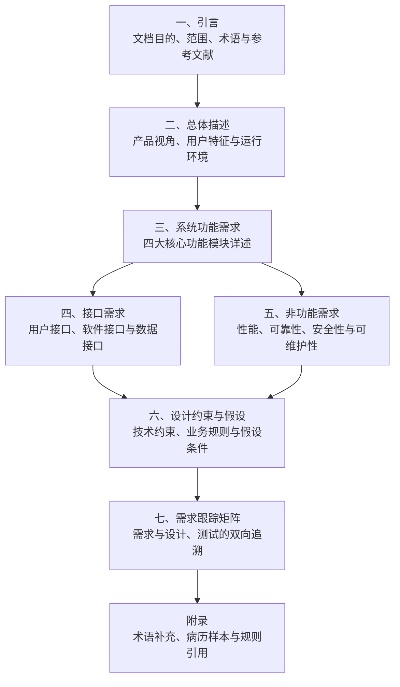
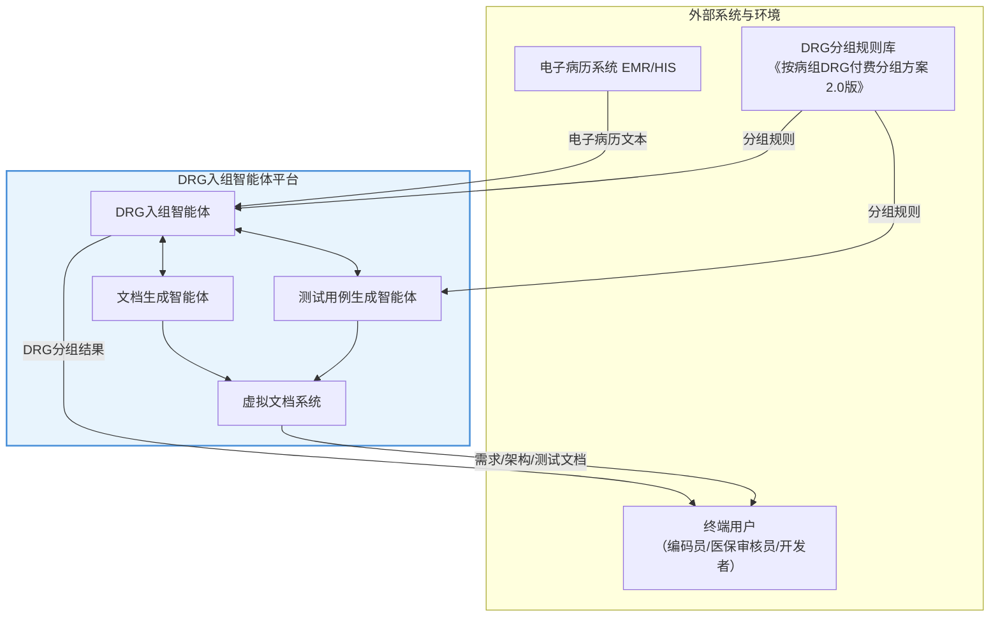
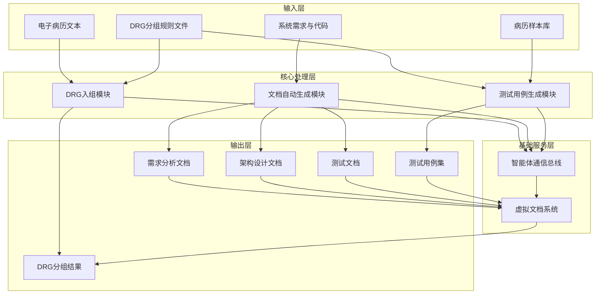
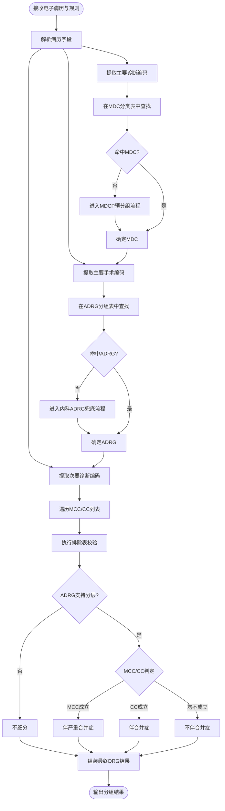
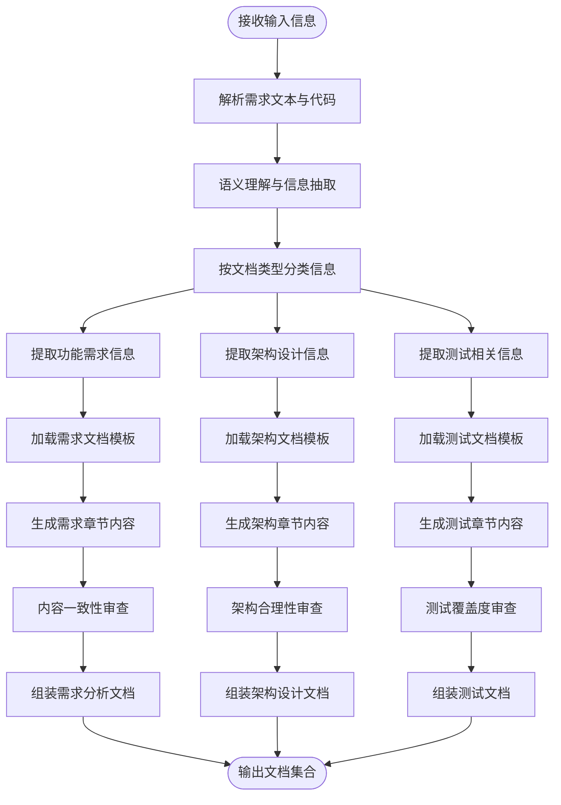
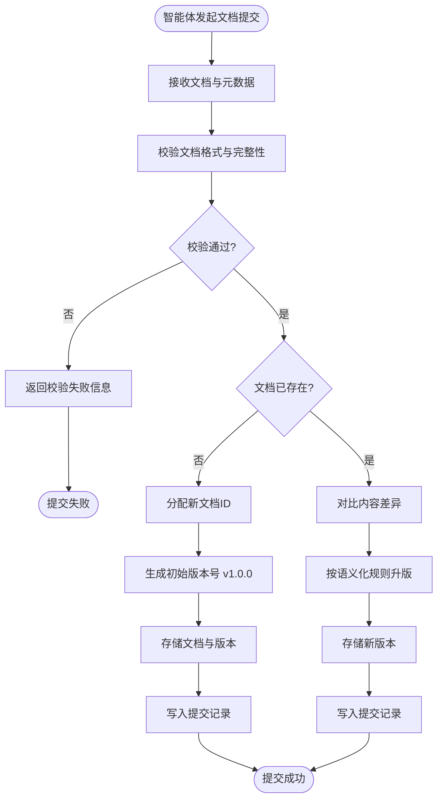
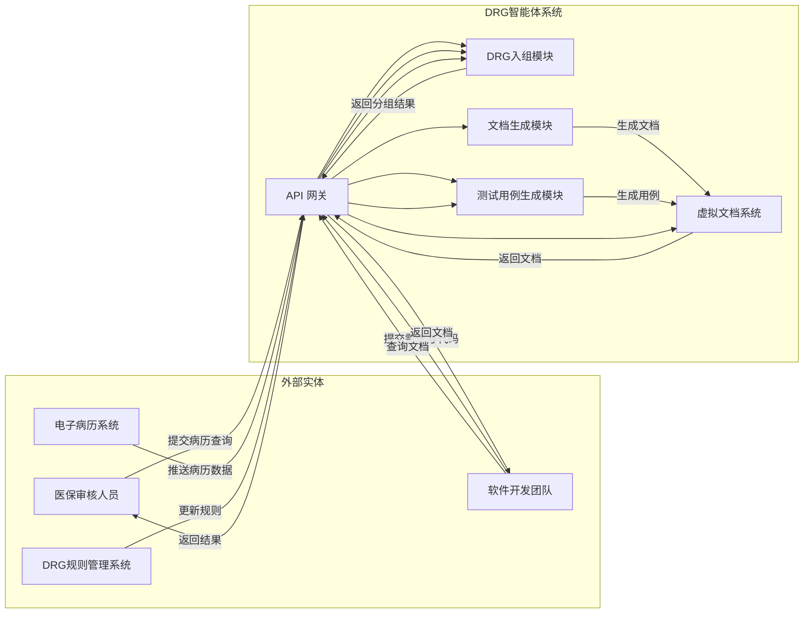
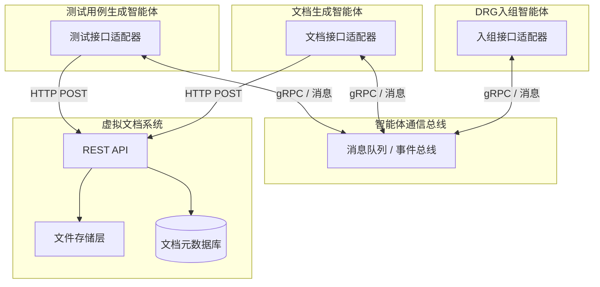
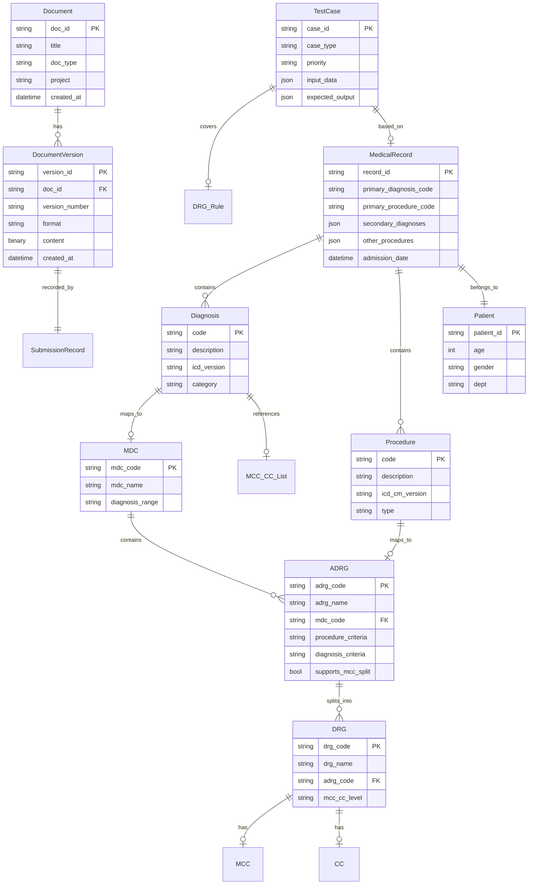
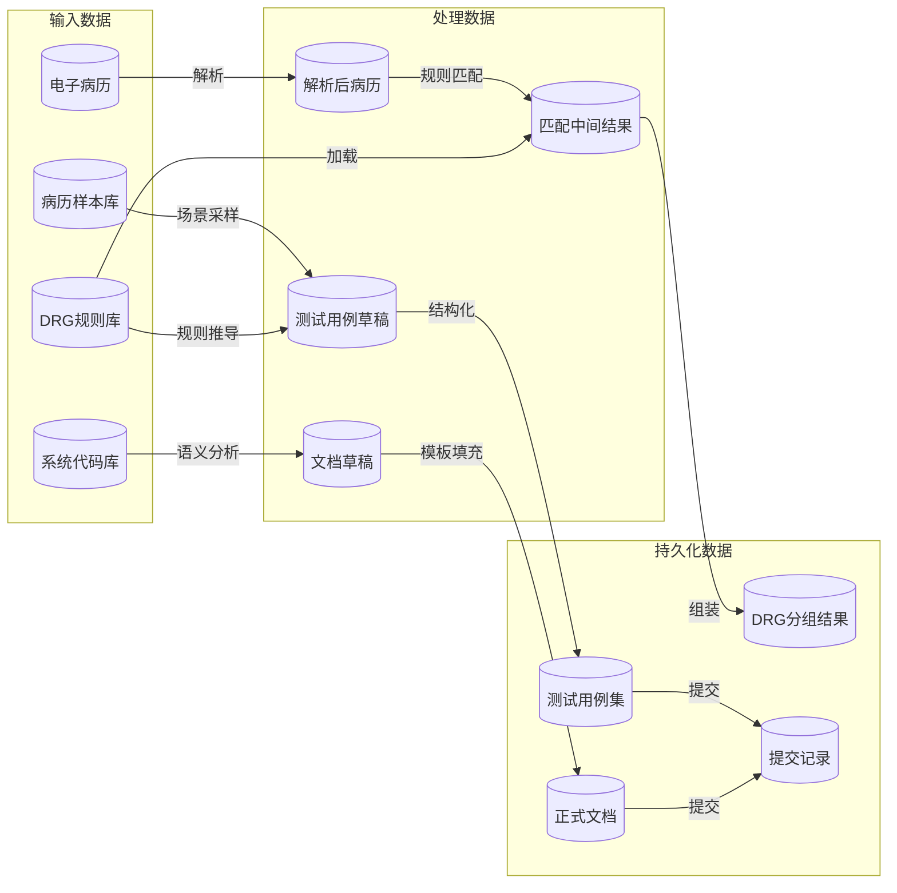

好的，我将作为软件工程文档审校专家，对您提供的文档进行全面的审校和整合。我将严格按照您提供的排版规范和文档结构要求，修正编号、统一格式，并输出一份完整规范的 Markdown 文档。

---

# 需求规格说明书

**项目名称：** DRG入组智能体系统
**版本号：** V1.0
**日期：** 2026-03-28
**状态：** 正式发布

---

## 一、引言

### 1.1 目的

本《需求规格说明书》（Software Requirements Specification, SRS）旨在以清晰、完整、无歧义的方式，系统化地定义**DRG入组智能体系统**的功能需求、非功能需求、接口需求与约束条件。本文档依据 IEEE 830-1998《软件需求规格说明书推荐实践》标准编制，为项目干系人提供统一的需求基线。

本文档的预期读者包括但不限于以下角色：

- **项目需求分析师**：验证需求的完整性、一致性和可追溯性，确保业务目标与技术实现的对应关系；
- **系统架构师**：基于功能需求与非功能约束进行系统架构设计与技术选型；
- **软件开发工程师**：将需求规格转化为可执行的代码实现；
- **测试工程师**：依据需求规格设计测试策略、测试方案和测试用例，开展验证与确认活动；
- **项目经理**：评估项目范围、工作量与资源分配，跟踪需求变更与项目进度；
- **领域专家（DRG/医保）**：审核DRG入组规则的业务正确性与合规性；
- **文档审核方**（如虚拟文档系统管理员）：作为文档自动生成与提交系统的输入源之一。

### 1.2 范围

#### (1) 系统标识

本系统名称为 **DRG入组智能体系统**（DRG Grouper Agent System），是基于大语言模型（Large Language Model, LLM）或智能体框架构建的智能化DRG分组工具。系统接收电子病历文本与DRG分组规则，自动分析并输出DRG分组结果，同时支持测试用例自动生成和文档自动生成与提交。

#### (2) 系统边界与主要功能

系统由以下四个核心功能模块组成：

| 序号 | 功能模块 | 功能描述 |
|:----:|----------|----------|
| 1 | **DRG入组** | 根据电子病历文本（含主要诊断、手术操作、次要诊断等）和DRG分组规则（含MDC分类、ADRG分组、MCC/CC列表），自动匹配并输出DRG组号、组名及入组原因说明 |
| 2 | **文档自动生成** | 基于系统需求、代码和设计信息，自动生成符合IEEE 830/1016/829等标准规范的需求分析文档、架构设计文档和测试文档 |
| 3 | **测试用例生成** | 根据DRG分组规则与病历样本，自动构建测试场景并生成正常场景测试用例、边界测试用例及异常测试用例 |
| 4 | **虚拟文档系统与提交** | 构建虚拟文档管理系统，自动接收其他智能体生成的文档，实现文件的存储、版本管理与提交 |

#### (3) DRG入组业务范围

系统遵循《按病组（DRG）付费分组方案（2.0版）》规范，支持以下分组层次：

- **MDC（主要诊断大类，Major Diagnostic Category）**：依据主要诊断编码进行判定，覆盖全部26个MDC大类；
- **ADRG（核心分组，Adjacent Diagnosis Related Groups）**：依据主要手术操作与主要诊断进行联合判定；
- **DRG（细分组）**：在ADRG基础上，依据合并症/严重合并症（CC/MCC）进行精细分层。

系统所处理的编码体系包括但不限于：

- 疾病诊断编码：ICD-10（国际疾病分类第十版）及医保版编码；
- 手术操作编码：ICD-9-CM-3（国际疾病分类第九版临床修订版第三卷）及医保版编码。

#### (4) 不包含的内容

以下内容明确排除在本系统范围之外：

- **医保费用结算与支付功能**：系统仅输出DRG分组结果，不涉及具体费用计算、医保结算流程或支付金额核定；
- **DRG分组规则的制定与维护**：系统使用既定的分组规则文件（2.0版），不负责规则的创建、修订或版本管理；
- **电子病历系统的数据采集**：系统以结构化或半结构化的电子病历文本为输入，不直接对接医院信息系统（HIS）或电子病历系统（EMR）进行实时数据采集；
- **医疗质量管理与绩效评估**：系统不提供基于DRG指标的医疗质量分析、绩效评估或病案首页质控功能；
- **患者隐私数据的脱敏处理**：输入数据应在进入系统前完成脱敏，系统本身不承担数据脱敏职责。

### 1.3 定义、术语与缩略语

本文档中使用的主要术语、定义及缩略语如下表所示：

**表1：术语与缩略语定义**

| 术语/缩略语 | 英文全称 | 定义 |
|:-----------:|----------|------|
| **DRG** | Diagnosis Related Groups | 按疾病诊断相关分组，将病人按“诊断+治疗方式+个体特征”分到不同组，每组对应一个打包付费标准 |
| **MDC** | Major Diagnostic Category | 主要诊断大类，DRG分组的第一层，根据主要诊断编码划分，共26个大类 |
| **ADRG** | Adjacent Diagnosis Related Groups | 核心分组，DRG分组的第二层，根据主要手术操作与主要诊断联合判定 |
| **CC** | Complication or Comorbidity | 合并症或并发症，用于DRG细分层的判定因素 |
| **MCC** | Major Complication or Comorbidity | 严重合并症或并发症，比CC具有更高的资源消耗权重，影响DRG细分 |
| **ICD-10** | International Classification of Diseases, 10th Revision | 国际疾病分类第十版，用于疾病诊断编码 |
| **ICD-9-CM-3** | International Classification of Diseases, 9th Revision, Clinical Modification, Volume 3 | 国际疾病分类第九版临床修订版第三卷，用于手术操作编码 |
| **主要诊断** | Principal Diagnosis | 经医疗机构诊治确定的导致患者本次住院主要原因的疾病诊断，是DRG分组的关键依据 |
| **次要诊断** | Secondary Diagnosis | 除主要诊断外的其他诊断，包括合并症和并发症，影响DRG细分结果 |
| **主要手术** | Principal Procedure | 本次住院期间实施的最主要的手术或操作，与主要诊断共同决定ADRG分组 |
| **LLM** | Large Language Model | 大语言模型，本系统采用的核心智能推理技术 |
| **Agent** | — | 智能体，具备感知、推理、决策和行动能力的自主软件实体 |
| **SRS** | Software Requirements Specification | 软件需求规格说明书，即本文档 |
| **IEEE** | Institute of Electrical and Electronics Engineers | 电气与电子工程师协会，发布软件工程相关国际标准 |
| **HIS** | Hospital Information System | 医院信息系统 |
| **EMR** | Electronic Medical Record | 电子病历系统 |

### 1.4 参考文献

本需求规格说明书的编制参考了以下标准、规范与文献：

1. **IEEE Std 830-1998** — IEEE Recommended Practice for Software Requirements Specifications. IEEE Computer Society, 1998.
2. **国家医疗保障局** — 《按病组（DRG）付费分组方案（2.0版）》，2024年发布。
3. **国家医疗保障局** — 《疾病诊断相关分组（DRG）付费国家试点技术规范》，2019年。
4. **国家医疗保障局** — 《医疗保障疾病诊断分类与代码》（ICD-10医保版）。
5. **国家医疗保障局** — 《医疗保障手术操作分类与代码》（ICD-9-CM-3医保版）。
6. **World Health Organization** — International Statistical Classification of Diseases and Related Health Problems, 10th Revision (ICD-10), 2019.
7. **IEEE Std 1016-2009** — IEEE Standard for Information Technology — Systems Design — Software Design Descriptions.
8. **IEEE Std 829-2008** — IEEE Standard for Software and System Test Documentation.
9. **ISO/IEC/IEEE 29148:2018** — Systems and Software Engineering — Life Cycle Processes — Requirements Engineering.

### 1.5 文档概述

本需求规格说明书按照以下结构组织，各章节逻辑关系如**图1**所示：



**图1：文档结构概览**

各章节的核心内容说明如下：

- **第二章 总体描述**：从宏观视角描述系统的产品定位、用户角色、运行环境以及与其他系统的关系，为后续详细需求分析建立上下文；
- **第三章 系统功能需求**：详细定义DRG入组、文档自动生成、测试用例生成、虚拟文档系统与提交四大模块的功能需求，辅以用例描述和业务流程说明；
- **第四章 接口需求**：定义系统与外部实体（用户、其他软件系统、数据源）之间的接口规范，包括用户界面、API和数据格式；
- **第五章 非功能需求**：明确系统的性能指标、可靠性要求、安全性约束、可维护性和可扩展性等质量属性；
- **第六章 设计约束与假设**：列出影响系统设计的技术约束、业务规则、政策法规约束以及需求分析过程中所依赖的假设条件；
- **第七章 需求跟踪矩阵**：建立需求条目与后续设计、实现和测试阶段之间的双向追溯关系，确保需求的完整覆盖与变更影响分析；
- **附录**：补充术语详解、病历样本模板、DRG分组规则文件索引等支持性材料。

## 二、总体描述

总体描述从宏观角度定义系统的整体功能、产品视角、用户特征、运行环境、约束条件以及假设与依赖关系，为后续具体需求的展开提供全局性框架。

### 2.1 产品视角

本系统——"DRG入组智能体平台"（以下简称"本系统"）——是一个基于大模型或智能体框架构建的医保DRG分组自动化工具集。系统围绕DRG入组核心任务，整合了入组推理、文档生成、测试用例生成及虚拟文档管理四大功能模块，形成完整的智能体协同工作平台。

本系统不替代医院信息系统（HIS）、电子病历系统（EMR）或医保结算系统，而是作为上述系统之间的智能中间层：接收来自电子病历系统的患者诊疗数据，依据医保管理部门发布的DRG分组规则（《按病组（DRG）付费分组方案（2.0版）》），输出标准化的DRG分组结果及辅助性工程文档。



**图2：系统上下文图 —— DRG入组智能体平台与外部实体关系**

如图2所示，本系统与三类外部实体交互：电子病历系统提供患者诊疗数据输入；DRG分组规则库提供入组判定依据；终端用户消费系统输出的分组结果与工程文档。系统内部四个模块通过智能体间通信协作完成任务。

### 2.2 系统整体功能

本系统从功能上可划分为四大模块，各模块既独立运行又通过智能体协作机制形成整体。

#### (1) DRG入组模块

根据输入的电子病历文本（含主要诊断、次要诊断、主要手术操作等）和DRG分组规则（含MDC分类、ADRG分组、MCC/CC列表及排除表），自动完成三层分组逻辑推理：

- **第一层——MDC（主要诊断大类）归类**：依据患者主要诊断的ICD-10编码，将病例归入对应的主要诊断大类（共26个MDC），例如将"A01.002+G01*（伤寒性脑膜炎）"归入MDCB（神经系统疾病及功能障碍）；
- **第二层——ADRG（核心分组）归类**：结合主要诊断与主要手术操作（ICD-9-CM-3编码），判定病例所属的核心分组，例如"38.1000x002（动脉内膜剥脱术）+ MDCB"命中"BB1（神经系统复合手术组）"；
- **第三层——DRG（细分组）归类**：根据次要诊断中的合并症/严重合并症（CC/MCC）情况，结合排除表校验，进一步细分至最终DRG组，如"BB11（神经系统复合手术，伴严重合并症或并发症）"。

输出内容包括：DRG组号、组名以及入组原因说明（含各层判定依据）。

#### (2) 文档自动生成模块

基于系统需求描述、设计信息及代码实现，自动生成符合IEEE 830等工程标准的软件文档：

- **需求规格说明书**：含系统功能需求、用例描述、非功能需求及接口需求；
- **架构设计文档**：含系统整体结构、模块划分、模块间接口关系及部署视图；
- **测试文档**：含测试策略、测试方案、测试用例及测试结果模板。

该模块以智能体形态运行，能从项目资料中抽取关键信息，按模板填充并生成格式规范的文档。

#### (3) 测试用例生成模块

根据DRG分组规则和病历样本，自动构建测试场景并生成结构化测试用例，覆盖三个维度：

- **正常场景测试用例**：验证不同"主要诊断 + 主要手术操作"组合下的正确入组路径；
- **边界测试用例**：验证合并症有无、MCC/CC判定临界条件、排除表生效边界等场景；
- **异常测试用例**：验证ICD编码错误、关键信息缺失、编码不在规则范围内等异常情况的系统行为。

#### (4) 虚拟文档系统与提交模块

提供一套轻量级的虚拟文档管理环境，支持：

- 自动接收其他智能体（文档生成智能体、测试用例生成智能体）生成的文档；
- 文件的版本化存储、检索与浏览；
- 文档提交记录追踪与状态管理。

#### 功能汇总

**表2：系统功能模块汇总**

| 模块编号 | 模块名称 | 核心功能 | 输入 | 输出 |
|:---:|------|------|------|------|
| M1 | DRG入组 | 三层分组逻辑推理 | 电子病历文本、DRG规则 | DRG组号/组名、入组原因 |
| M2 | 文档自动生成 | 工程文档自动撰写 | 系统需求、设计信息、代码 | 需求/架构/测试文档 |
| M3 | 测试用例生成 | 测试场景构建与用例生成 | DRG规则、病历样本 | 正常/边界/异常测试用例 |
| M4 | 虚拟文档系统 | 文档接收、存储与版本管理 | 各智能体生成的文档 | 文档存储与提交记录 |

### 2.3 用户特征

本系统的目标用户群体涵盖以下角色，各角色具有不同的技术背景、使用场景和交互需求。

**表3：用户角色特征描述**

| 用户角色 | 技术背景 | 主要使用场景 | 关键需求 |
|------|------|------|------|
| 医保编码员 | 医学背景，熟悉ICD-10/ICD-9-CM-3编码规范，熟练操作HIS/EMR系统 | 日常病案首页编码审核与DRG入组确认 | 快速准确的入组结果、清晰的入组原因说明、支持批量处理 |
| 医保审核员 | 医保政策与基金管理背景，了解DRG付费体系 | 医保结算审核、DRG分组结果复核与申诉处理 | 入组过程可追溯、规则依据可查证、异常分组标记 |
| 软件开发工程师 | 计算机科学背景，熟悉智能体框架与大模型技术 | 系统开发、调试、集成与维护 | API接口文档、模块间通信协议、错误日志与诊断信息 |
| 测试工程师 | 软件测试背景，了解DRG分组业务逻辑 | 测试用例设计、执行与回归测试 | 自动生成的测试用例覆盖度、边界与异常场景完备性 |
| 项目经理/需求分析师 | 项目管理与需求工程背景 | 需求跟踪、文档审查、项目进度管理 | 完整的需求/架构/测试文档、版本追溯、变更影响分析 |

所有用户均假定具备基本的计算机操作能力和医疗信息管理基础知识。对于DRG分组业务逻辑的理解深度因角色而异：医保编码员和审核员需深入理解分组规则，开发与测试人员需掌握规则的技术实现，项目经理侧重整体把控。

### 2.4 运行环境

本系统设计为可部署于通用计算环境中的软件系统，具体运行环境要求如下。

**表4：系统运行环境要求**

| 环境要素 | 最低配置/要求 | 推荐配置/要求 |
|------|------|------|
| 操作系统 | Linux（Ubuntu 20.04+ / CentOS 7+）、Windows Server 2019+ | Linux（Ubuntu 22.04 LTS） |
| CPU | 4核 x86_64，2.0GHz+ | 8核及以上，支持AVX2指令集 |
| 内存 | 16 GB | 32 GB及以上 |
| 磁盘 | 50 GB 可用空间（SSD） | 100 GB及以上 SSD |
| GPU（可选） | — | NVIDIA GPU（8GB+显存），用于大模型推理加速 |
| 网络 | 内网连通，支持HTTP/HTTPS | 千兆网络，低延迟 |
| Python环境 | Python 3.9+ | Python 3.11+ |
| 依赖框架 | LangChain / AutoGPT / 其他智能体框架 | 支持多智能体编排的框架 |
| 大模型服务 | 本地部署或云端API（如OpenAI、文心一言、通义千问等） | 支持Function Calling的模型版本 |

系统核心模块（M1-M4）可部署于同一物理或虚拟节点，亦支持分布式部署：大模型推理服务可独立部署于GPU节点，智能体编排层与虚拟文档系统可部署于通用计算节点。系统不强制要求GPU，但在纯CPU环境下大模型推理延迟较高，建议生产环境配置GPU。

### 2.5 约束

本系统在设计、开发和运行过程中需遵循以下约束条件。

#### (1) 政策与法规约束

- **DRG分组规则遵循**：系统必须严格遵循国家医疗保障局发布的《按病组（DRG）付费分组方案（2.0版）》，不得偏离或自行解释分组规则。当规则版本升级时，系统须支持规则库的更新替换；
- **医保数据安全**：系统处理的患者诊疗数据涉及个人健康隐私信息，须符合《中华人民共和国个人信息保护法》《中华人民共和国数据安全法》及国家医疗保障局关于医保数据安全管理的相关规定；
- **ICD编码标准**：诊断编码须遵循ICD-10临床版（国家医保版），手术操作编码须遵循ICD-9-CM-3，编码字典须与国家医保局发布的版本保持一致。

#### (2) 技术约束

- **大模型依赖**：系统核心推理能力依赖大语言模型（LLM），推理结果的准确性受模型能力、提示词设计及上下文窗口大小影响。模型幻觉（hallucination）可能导致错误入组，须设计校验与兜底机制；
- **智能体框架约束**：系统基于智能体框架构建，模块间通信须遵循所选框架的消息格式与调用规范，智能体的自主决策范围须在框架能力边界内；
- **可解释性要求**：DRG入组结果须提供可追溯的推理链（chain-of-thought），使得医保编码员和审核员能够理解每一步判定依据，满足医保审核的可解释性要求；
- **响应时间**：单次DRG入组推理应在合理时间内完成（建议≤30秒），批量处理（如100份病历）应在可接受的时间范围内完成（建议≤15分钟）；
- **输出格式**：文档输出格式须至少支持Markdown、PDF和DOCX三种格式。

#### (3) 设计与实现约束

- **模块化架构**：系统须采用模块化设计，M1-M4各模块可独立开发、测试和部署，模块间通过明确定义的接口通信；
- **语言与国际化**：系统界面、文档输出及日志信息默认使用简体中文，ICD编码和DRG组号等标准术语保持其原始编码形式；
- **版本管理**：DRG分组规则、ICD编码字典及系统自身的配置均须纳入版本管理，支持版本切换与回滚。

#### (4) 项目约束

- **团队规模**：开发团队为4至5人，角色可交叉兼任（如开发者兼任配置管理）；
- **交付期限**：项目交付时间为2026年3月；
- **交付物**：除可运行的软件系统外，须交付需求规格说明书、架构设计文档及测试文档。

### 2.6 假设和依赖关系

本系统的正常运行依赖于以下假设条件成立及相关外部依赖的可用性。

#### (1) 假设条件

- **A-01**：电子病历文本的输入格式遵循国家医保局规定的病案首页数据标准（如《医疗保障基金结算清单填写规范》），包含主要诊断编码、次要诊断编码列表、主要手术操作编码等必要字段，且编码符合ICD-10/ICD-9-CM-3规范；
- **A-02**：DRG分组规则文件以结构化或半结构化格式（如JSON、XML、YAML）提供，规则中的MDC分类表、ADRG分组表、MCC/CC列表及排除表完整且无歧义；
- **A-03**：大模型服务（本地或云端）在系统运行期间持续可用，且模型的推理能力足以完成DRG分组逻辑的语义理解与判定；
- **A-04**：用户提供的病历样本数据已经过初步清洗，不存在编码格式错误或严重数据缺失（异常测试场景除外）；
- **A-05**：系统部署环境满足2.4节所述的运行环境要求，网络连通性良好；
- **A-06**：系统运行期间不会出现因政策突变导致DRG分组规则在未提前通知的情况下发生重大变更。

#### (2) 外部依赖

**表5：系统外部依赖清单**

| 依赖编号 | 依赖项 | 类型 | 描述 | 影响范围 |
|:---:|------|------|------|------|
| D-01 | DRG分组规则文件（2.0版） | 数据 | 国家医保局发布的《按病组（DRG）付费分组方案（2.0版）》结构化数据 | M1 DRG入组、M3 测试用例生成 |
| D-02 | ICD-10编码字典 | 数据 | 国家医保版ICD-10临床版诊断编码及其与MDC的映射关系 | M1 DRG入组 |
| D-03 | ICD-9-CM-3编码字典 | 数据 | 手术操作分类编码字典 | M1 DRG入组 |
| D-04 | 大语言模型服务 | 服务 | 提供推理能力的LLM（本地部署或云端API），需支持Function Calling | M1、M2、M3 |
| D-05 | 智能体框架 | 框架 | LangChain / AutoGPT或其他多智能体编排框架 | 全局（系统架构基础） |
| D-06 | 电子病历数据源 | 数据 | 来自HIS/EMR系统的病历文本或结构化的病案首页数据 | M1 DRG入组 |
| D-07 | 文档模板库 | 数据 | 需求/架构/测试文档的标准化模板（符合IEEE 830等标准） | M2 文档生成 |
| D-08 | Python运行时及第三方库 | 运行时 | Python 3.9+及项目所需的第三方依赖包 | 全局（系统运行基础） |

#### (3) 依赖失效应对策略

当关键外部依赖不可用时，系统须具备降级运行或优雅失败的能力：

- **D-04（LLM服务）不可用**：系统应返回明确的错误提示，而非产生不可靠的推理结果。DRG入组模块可降级为基于规则引擎的确定性匹配模式（不依赖LLM推理）；
- **D-01/D-02/D-03（规则与编码字典）缺失或版本不匹配**：系统应在启动时执行规则完整性校验，发现缺失或不匹配时阻止系统启动并给出明确告警；
- **D-06（病历数据源）格式异常**：系统应进行输入格式校验，对不符合规范的输入返回具体的错误描述，而非静默失败。

## 三、具体需求

本章详细描述 DRG 入组智能体系统的各项具体需求，涵盖功能需求、非功能需求、接口需求、数据需求以及约束条件。各项需求均来源于项目总体目标和业务场景分析，并遵循 IEEE 830-1998《软件需求规格说明书推荐实践》的结构化要求。

### 3.1 功能需求

功能需求定义了系统必须实现的核心能力。本系统包含四个主要功能模块：DRG 入组模块、文档自动生成模块、测试用例生成模块以及虚拟文档系统与提交模块。各模块既可独立运行，也可作为智能体协同工作。

#### (1) 系统整体功能

系统整体功能围绕 DRG 入组智能体构建，以电子病历文本和 DRG 分组规则为输入，经过智能分析和规则匹配，输出 DRG 分组结果；同时支持文档自动生成、测试用例自动构造以及文档的虚拟提交与存储。

##### a. 系统功能总览

图 3 展示了系统整体功能结构及各模块之间的高层数据流关系。



**图3：系统整体功能结构图**

##### b. 功能模块职责总览

表6列出了系统各功能模块的核心职责与关键输入输出。

**表6：功能模块职责总览**

| 模块 | 核心职责 | 关键输入 | 关键输出 |
|------|----------|----------|----------|
| DRG 入组模块 | 根据病历和规则自动匹配 DRG 分组 | 电子病历、DRG 规则 | DRG 组号、组名、入组原因 |
| 文档自动生成模块 | 基于系统信息自动生成规范文档 | 系统需求、代码、设计信息 | 需求分析、架构设计、测试文档 |
| 测试用例生成模块 | 根据 DRG 规则自动构建测试场景 | DRG 规则、病历样本 | 正常/边界/异常测试用例 |
| 虚拟文档系统与提交模块 | 管理文档存储与版本提交 | 各类生成文档 | 文档存储记录、提交状态 |

#### (2) DRG 入组模块

DRG 入组模块是本系统的核心智能体，负责根据电子病历文本和 DRG 分组规则自动完成三层分组匹配，并输出完整的分组结果及入组原因说明。

##### a. 功能描述

DRG 入组模块接收电子病历文本（含主要诊断、手术操作、次要诊断等）和 DRG 分组规则文件（含 MDC 分类、ADRG 分组、MCC/CC 列表），依照《按病组（DRG）付费分组方案（2.0 版）》所定义的三层分组逻辑，依次完成以下处理：

1. **MDC 匹配**：解析病历中的主要诊断编码（ICD-10），在 MDC 分类表中查找对应的主要诊断大类。系统须支持 26 个标准 MDC 分类（MDCA–MDCZ），并正确处理特殊分类（如 MDCP（新生儿疾病）、MDCY（HIV 感染）等）。
2. **ADRG 匹配**：在确定 MDC 后，结合主要手术操作编码（ICD-9-CM-3）和主要诊断编码，在对应 MDC 下的 ADRG 分组表中进行匹配。系统须支持手术组、非手术组和特殊组的区分。
3. **DRG 细分**：在确定 ADRG 后，根据次要诊断中的合并症/严重合并症（CC/MCC）信息，结合排除表和并发症分层规则，判定最终 DRG 细分组。区分"伴严重合并症或并发症""伴合并症或并发症""不伴合并症或并发症"三种情况。

##### b. 输入规格

**表7：DRG 入组模块输入规格**

| 输入项 | 格式 | 说明 | 必填 |
|--------|------|------|------|
| 电子病历文本 | 结构化 JSON 或纯文本 | 含主要诊断编码（ICD-10）、次要诊断编码列表、主要手术编码（ICD-9-CM-3）、其他手术编码列表、患者基本信息 | 是 |
| DRG 分组规则文件 | JSON/XML/数据库表 | 含 MDC 分类表、ADRG 分组表、MCC 列表、CC 列表、排除表、并发症分层规则 | 是 |
| 入组选项 | 键值对 | 如规则版本号、是否启用 MCC 校验等可选配置 | 否 |

##### c. 输出规格

**表8：DRG 入组模块输出规格**

| 输出项 | 格式 | 说明 |
|--------|------|------|
| DRG 组号 | 字符串 | 如 "BB11"，4 位编码 |
| DRG 组名 | 字符串 | 如 "神经系统复合手术，伴严重合并症或并发症" |
| MDC 编码 | 字符串 | 如 "MDCB" |
| ADRG 编码 | 字符串 | 如 "BB1" |
| 入组路径 | 结构化对象 | 描述三层匹配每一步的判定依据和中间结果 |
| 入组原因说明 | 字符串 | 人类可读的入组解释文本 |
| 置信度 | 浮点数（0–1） | 反映入组结果的确定性 |
| 时间戳 | ISO 8601 | 入组处理完成时间 |

##### d. 处理流程

DRG 入组模块的处理流程如图 4 所示。



**图4：DRG 入组处理流程图**

##### e. 异常处理需求

- **编码无法识别**：当主要诊断或手术编码在规则库中不存在时，系统应输出"编码未匹配"状态，并给出最接近的候选 MDC 建议。
- **规则冲突**：当多条规则同时命中时，系统应按优先级规则选择最优匹配，并在入组原因说明中标注冲突情况。
- **信息缺失**：当电子病历中缺少必要字段（如无主要诊断）时，系统应返回明确错误提示，拒绝入组。
- **规则版本不匹配**：当输入的规则文件版本与系统预期不一致时，应给出警告信息。

##### f. 典型用例

**用例 UC-01：标准 DRG 入组**

- **前置条件**：系统已加载 DRG 分组规则（2.0 版），电子病历包含完整的主要诊断、手术操作和次要诊断信息。
- **主流程**：
  1. 用户提交电子病历：主要诊断 "A01.002+G01*"（伤寒性脑膜炎），主要手术 "38.1000x002"（动脉内膜剥脱术），次要诊断 "J96.0"（急性呼吸衰竭）。
  2. 系统解析病历，提取编码。
  3. 系统匹配 MDC：A01.002+G01* → MDCB（神经系统疾病及功能障碍）。
  4. 系统匹配 ADRG：在 MDCB 下，"38.1000x002" → BB1（神经系统复合手术组）。
  5. 系统判定 MCC：J96.0 在 MCC 列表中，经排除表校验未被排除，ADRG BB1 支持分层 → MCC 成立。
  6. 系统输出 DRG：BB11（神经系统复合手术，伴严重合并症或并发症）。
- **后置条件**：系统返回完整分组结果及入组原因说明。

**用例 UC-02：无手术的内科入组**

- **前置条件**：电子病历中无手术操作记录，仅有主要诊断。
- **主流程**：
  1. 用户提交病历：主要诊断 "J15.0"（肺炎克雷伯菌肺炎），无手术记录。
  2. 系统匹配 MDC：J15.0 → MDCE（呼吸系统疾病及功能障碍）。
  3. 系统在 ADRG 中匹配到内科组（如 ES1）。
  4. 系统输出对应 DRG 组号。
- **后置条件**：系统正确识别内科分组路径。

#### (3) 文档自动生成模块

文档自动生成模块是一个智能体，负责基于系统需求描述、代码库和设计信息，自动生成符合 IEEE 830、ISO/IEC/IEEE 42010 等标准规范的软件工程文档。

##### a. 功能描述

该模块接收系统需求文本、系统代码（含注释和类型定义）以及架构设计描述，利用大模型或智能体框架进行语义理解与内容生成，输出三类核心文档：

1. **需求分析文档**：包含系统功能需求、用例图/用例描述、非功能需求、数据需求等完整内容。
2. **架构设计文档**：包含系统整体结构、模块划分与职责、模块间关系、技术选型说明、部署视图等。
3. **测试文档**：包含测试策略、测试方案、测试用例清单、测试环境要求等。

##### b. 输入规格

**表9：文档自动生成模块输入规格**

| 输入项 | 格式 | 说明 | 必填 |
|--------|------|------|------|
| 系统需求描述 | 自然语言文本或结构化 YAML | 系统的功能描述、业务场景、约束条件等 | 是 |
| 系统代码 | 源代码文件或代码仓库路径 | 含主要模块代码、接口定义、类型声明、注释 | 是 |
| 架构设计信息 | 结构化 JSON 或图表描述 | 模块划分、依赖关系、技术栈 | 否 |
| 文档模板 | Markdown/LaTeX 模板 | 各类文档的章节结构与格式模板 | 否 |
| 生成选项 | 键值对 | 如目标文档类型、输出格式（Markdown/PDF/DOCX）、语言偏好 | 否 |

##### c. 输出规格

**表10：文档自动生成模块输出规格**

| 输出项 | 格式 | 说明 |
|--------|------|------|
| 需求分析文档 | Markdown/PDF/DOCX | 含完整章节结构的需求规格说明书 |
| 架构设计文档 | Markdown/PDF/DOCX | 含架构视图和设计说明的架构文档 |
| 测试文档 | Markdown/PDF/DOCX | 含测试策略、方案和用例的测试文档 |
| 文档元数据 | JSON | 含版本号、生成时间、文档间引用关系 |

##### d. 处理流程

图5展示了文档自动生成模块的处理流程。



**图5：文档自动生成处理流程图**

##### e. 质量要求

- **完整性**：生成的文档须覆盖模板定义的全部必填章节，不得出现空节（无法填写时应标注"暂缺"并给出原因）。
- **一致性**：同一项目生成的三类文档之间应保持术语统一、引用一致，例如需求文档中的功能编号应与测试文档中的跟踪编号对应。
- **可追溯性**：需求条目与测试用例之间须建立双向追溯关系，并在文档中以表格或矩阵形式呈现。
- **规范性**：文档格式、图表编号、术语使用须符合软件工程文档标准（IEEE 830、IEEE 1016 等）。

#### (4) 测试用例生成模块

测试用例生成模块是独立的智能体，根据 DRG 分组规则和病历样本库自动构建测试场景，生成覆盖三类场景的结构化测试用例。

##### a. 功能描述

该模块以 DRG 分组规则文件和病历样本为输入，通过规则解析和场景推导，生成以下三类测试用例：

1. **正常场景测试用例**：覆盖不同诊断与手术的合法组合，验证系统在常规输入下能否正确输出 DRG 分组。
2. **边界测试用例**：覆盖合并症有无、多个次要诊断、手术组合边界等临界情况。
3. **异常测试用例**：覆盖编码错误、信息缺失、格式异常、规则冲突等异常输入场景。

##### b. 输入规格

**表11：测试用例生成模块输入规格**

| 输入项 | 格式 | 说明 | 必填 |
|--------|------|------|------|
| DRG 分组规则 | JSON/XML | 含 MDC 表、ADRG 表、MCC/CC 列表、排除表 | 是 |
| 病历样本库 | JSON 数组 | 典型病历样本集合，标注预期分组 | 是 |
| 生成策略配置 | JSON | 如场景覆盖度目标、用例数量上限、优先级规则 | 否 |

##### c. 输出规格

**表12：测试用例生成模块输出规格**

| 输出项 | 格式 | 说明 |
|--------|------|------|
| 正常场景用例集 | JSON 数组 | 每组含输入病历、预期 DRG、用例编号、优先级 |
| 边界用例集 | JSON 数组 | 每组含边界条件描述、输入病历、预期行为 |
| 异常用例集 | JSON 数组 | 每组含异常类型、输入病历、预期错误输出 |
| 用例统计报告 | JSON | 各类用例数量、覆盖度指标、未覆盖规则清单 |

##### d. 测试用例结构

每个测试用例须包含以下字段：

**表13：测试用例字段定义**

| 字段名 | 类型 | 说明 |
|--------|------|------|
| 用例编号 | 字符串 | 如 "TC-N-001"（N=正常/B=边界/E=异常） |
| 用例标题 | 字符串 | 简短描述测试场景 |
| 测试类型 | 枚举 | 正常/边界/异常 |
| 优先级 | 枚举 | P0（核心）/P1（重要）/P2（一般） |
| 输入数据 | 对象 | 电子病历各字段值 |
| 预期输出 | 对象 | 预期的 DRG 组号、MDC、ADRG 等 |
| 预期行为 | 字符串 | 描述系统应表现的行为（尤其是异常用例） |
| 关联规则 | 数组 | 该用例覆盖的 DRG 规则编号或规则描述 |
| 前置条件 | 字符串 | 执行用例前系统应满足的状态 |

##### e. 场景生成策略

- **正常场景**：从病历样本库中按 MDC 分类均匀抽样，确保每个 MDC 大类至少覆盖 2 个 ADRG；对每个 ADRG 生成 MCC/CC/无合并症三种变体。
- **边界场景**：针对 MCC/CC 列表的边界判定（如年龄相关 CC、主要诊断与次要诊断的排除关系边界），以及多手术组合、手术与诊断不匹配等临界情况。
- **异常场景**：构造缺失主诊断、缺失主手术、编码不存在、规则版本不一致、编码格式错误（如缺少星号/剑号）等异常输入。

#### (5) 虚拟文档系统与提交模块

虚拟文档系统是一个轻量级的文档存储和版本管理服务，负责接收其他智能体生成的文档，提供结构化存储、版本管理、查询检索和提交记录追踪功能。

##### a. 功能描述

1. **文档接收**：通过标准化接口接收来自文档自动生成模块和测试用例生成模块的文档，支持 Markdown、PDF、DOCX 等格式。
2. **结构化存储**：按项目、文档类型、版本进行目录化管理，支持文件系统存储。
3. **版本管理**：每次文档提交生成唯一版本号（语义化版本），保留历史版本支持追溯。
4. **提交记录**：记录每次提交的元数据（提交时间、提交来源、文档摘要、变更说明）。
5. **查询检索**：支持按文档类型、版本号、提交时间范围等条件进行检索。

##### b. 接口规格

**表14：虚拟文档系统接口规格**

| 接口 | 方法 | 路径 | 说明 |
|------|------|------|------|
| 提交文档 | POST | `/api/documents` | 提交新文档或更新已有文档 |
| 获取文档 | GET | `/api/documents/{id}` | 获取指定文档的最新版本 |
| 获取文档版本 | GET | `/api/documents/{id}/versions/{version}` | 获取指定版本的文档 |
| 列出文档 | GET | `/api/documents` | 按条件列出文档列表 |
| 获取提交历史 | GET | `/api/documents/{id}/history` | 获取文档的提交历史记录 |

##### c. 数据模型

**表15：虚拟文档系统核心数据模型**

| 实体 | 关键字段 | 说明 |
|------|----------|------|
| Document | id, title, type, project, created_at, updated_at | 文档基本信息 |
| DocumentVersion | id, document_id, version, content, format, created_at | 文档版本内容 |
| SubmissionRecord | id, document_id, version, source, summary, timestamp | 提交记录 |

##### d. 处理流程

图6展示了文档提交的完整处理流程。



**图6：文档提交流程图**

### 3.2 非功能需求

非功能需求定义了系统在性能、安全性、可用性和可维护性方面必须满足的质量属性。这些需求与功能需求同等重要，直接影响系统在实际运行环境中的可靠性和用户体验。

#### (1) 性能需求

##### a. 响应时间

- **DRG 入组处理延迟**：单次 DRG 入组请求（含完整的三层匹配流程）应在 **2 秒** 内完成，对于批量处理（单次提交 100 份病历），总处理时间不超过 **60 秒**。
- **文档生成延迟**：单份需求分析文档或架构设计文档的生成应在 **30 秒** 内完成。测试文档生成（含测试用例）应在 **60 秒** 内完成。
- **虚拟文档系统响应**：文档提交接口的响应时间不超过 **1 秒**，文档查询接口不超过 **500 毫秒**。

##### b. 吞吐量

- **并发 DRG 入组请求**：系统应支持至少 **50 个并发** 入组请求，在此并发下平均响应时间不超过 3 秒。
- **文档存储吞吐**：虚拟文档系统应支持每分钟 **20 次** 以上的文档提交操作。

##### c. 资源消耗

- **内存占用**：系统在空闲状态下内存占用不超过 **512 MB**，峰值处理时不超过 **2 GB**。
- **存储空间**：虚拟文档系统应支持至少 **10 GB** 的文档存储容量。
- **大模型调用**：大模型推理调用应尽可能采用批量处理和缓存策略，减少重复推理开销。

#### (2) 安全需求

##### a. 数据安全

- **医疗数据脱敏**：系统在处理电子病历时，须在日志和中间输出中对患者个人信息（姓名、身份证号、住址、联系电话等）进行脱敏处理，仅保留必要的 ICD 编码和诊疗信息。
- **传输加密**：所有模块间的网络通信须使用 TLS 1.2 及以上协议进行加密传输。
- **数据隔离**：不同项目、不同用户的文档在虚拟文档系统中须实现逻辑隔离，确保数据不交叉泄露。

##### b. 访问控制

- **接口鉴权**：虚拟文档系统的所有接口须进行 Token 或 API Key 鉴权，未经授权的请求一律拒绝。
- **操作审计**：对所有文档的创建、修改和删除操作须记录完整的审计日志，含操作者标识、操作时间、操作类型和操作对象。

##### c. 模型安全

- **提示注入防护**：文档自动生成模块须对输入进行校验和清洗，防止恶意提示注入导致生成不当内容。
- **输出合规检查**：生成的文档内容须经过合规扫描，确保不包含违法或违反政策的信息。

#### (3) 可用性需求

##### a. 易用性

- **接口友好性**：所有模块对外提供 RESTful API，遵循 OpenAPI 3.0 规范，提供完整的接口文档和请求/响应示例。
- **错误信息可读性**：当处理失败时，返回的错误信息应包含明确的错误码、人类可读的错误描述以及建议的修复操作。
- **入组结果可解释性**：DRG 入组模块的输出须包含完整的入组路径说明，使非技术用户（如医保审核人员）能够理解分组依据。

##### b. 可靠性

- **系统可用率**：核心服务（DRG 入组和虚拟文档系统）的可用率不低于 **99.5%**（按月度统计）。
- **故障恢复**：系统在发生故障后应能在 **5 分钟** 内自动或手动恢复。
- **数据持久性**：已提交至虚拟文档系统的文档不得因系统故障而丢失，须实现持久化存储。

##### c. 容错性

- **部分失败处理**：DRG 入组在遇到单个字段解析失败时，应尽可能完成其他字段的解析并给出部分结果和警告，而非完全拒绝处理。
- **重试机制**：大模型调用失败时，系统应自动重试（最多 3 次），采用指数退避策略。

#### (4) 可维护性需求

##### a. 模块化

- **松耦合设计**：各功能模块（DRG 入组、文档生成、测试用例生成、虚拟文档系统）之间应保持松耦合，通过标准化接口通信，每个模块可独立升级和部署。
- **智能体可替换性**：每个智能体模块应遵循统一的 Agent 接口规范，支持在不影响其他模块的情况下替换底层大模型或算法实现。

##### b. 可配置性

- **规则热加载**：DRG 分组规则应支持在不重启系统的情况下进行热加载更新，以适应 DRG 分组方案的版本迭代。
- **模板可定制**：文档自动生成模块的文档模板应支持用户自定义和扩展，不同团队可根据自身规范调整模板。

##### c. 可观测性

- **日志规范**：所有模块应输出结构化日志（JSON 格式），包含时间戳、日志级别、模块标识、请求 ID 等标准字段。
- **监控指标**：系统应暴露关键性能指标（请求量、响应延迟、错误率、大模型调用次数等）供外部监控系统采集。
- **健康检查**：每个模块应提供健康检查端点（`/health`），返回服务状态和依赖组件状态。

### 3.3 接口需求

接口需求定义了系统与外部环境以及系统内部各模块之间的通信规范。本章从外部接口和内部接口两个维度进行描述。

#### (1) 外部接口

外部接口指系统与外部系统或用户之间的交互边界。

##### a. 系统上下文图

图7展示了本系统与外部实体之间的接口关系。



**图7：系统上下文图**

##### b. 外部接口详细规格

**表16：外部接口详细规格**

| 接口编号 | 接口名称 | 提供方 | 消费方 | 协议 | 数据格式 | 说明 |
|----------|----------|--------|--------|------|----------|------|
| EXT-01 | 病历提交接口 | DRG入组模块 | 医保审核人员/电子病历系统 | HTTPS/REST | JSON | 提交电子病历进行 DRG 入组 |
| EXT-02 | 规则更新接口 | DRG入组模块 | DRG规则管理系统 | HTTPS/REST | JSON | 接收规则文件更新 |
| EXT-03 | 需求输入接口 | 文档生成模块 | 软件开发团队 | HTTPS/REST | JSON/Multipart | 提交需求描述和代码 |
| EXT-04 | 文档查询接口 | 虚拟文档系统 | 软件开发团队 | HTTPS/REST | JSON | 查询和下载已生成文档 |
| EXT-05 | 监控数据接口 | 所有模块 | 外部监控系统 | HTTPS | Prometheus 格式 | 暴露性能指标 |

##### c. 外部接口数据格式

**EXT-01 病历提交接口 — 请求体示例：**

```json
{
  "request_id": "req-20260301-001",
  "patient": {
    "patient_id": "P0001234",
    "age": 58,
    "gender": "M"
  },
  "medical_record": {
    "primary_diagnosis": {
      "code": "A01.002+G01*",
      "description": "伤寒性脑膜炎"
    },
    "secondary_diagnoses": [
      {
        "code": "J96.0",
        "description": "急性呼吸衰竭"
      }
    ],
    "primary_procedure": {
      "code": "38.1000x002",
      "description": "动脉内膜剥脱术"
    },
    "other_procedures": []
  }
}
```

**EXT-01 病历提交接口 — 响应体示例：**

```json
{
  "request_id": "req-20260301-001",
  "status": "success",
  "result": {
    "drg_code": "BB11",
    "drg_name": "神经系统复合手术，伴严重合并症或并发症",
    "mdc": "MDCB",
    "adrg": "BB1",
    "grouping_path": {
      "mdc_match": {
        "diagnosis_code": "A01.002+G01*",
        "mdc": "MDCB",
        "mdc_name": "神经系统疾病及功能障碍"
      },
      "adrg_match": {
        "procedure_code": "38.1000x002",
        "adrg": "BB1",
        "adrg_name": "神经系统复合手术组"
      },
      "mcc_cc_check": {
        "secondary_diagnosis": "J96.0",
        "mcc_match": true,
        "excluded": false,
        "final_level": "MCC"
      }
    },
    "explanation": "主诊断A01.002+G01*进入MDCB；主手术38.1000x002命中BB1（神经系统复合手术组）；次要诊断J96.0属于MCC且未被排除，最终入组BB11。",
    "confidence": 0.98,
    "timestamp": "2026-03-01T10:30:00+08:00"
  }
}
```

#### (2) 内部接口

内部接口指系统各模块之间的通信接口。

##### a. 内部通信架构

图8展示了系统内部模块间的接口关系。



**图8：内部通信架构图**

##### b. 内部接口详细规格

**表17：内部接口详细规格**

| 接口编号 | 接口名称 | 提供方 | 消费方 | 通信方式 | 说明 |
|----------|----------|--------|--------|----------|------|
| INT-01 | 文档提交接口 | 虚拟文档系统 | 文档生成模块 | HTTP/REST | 提交生成的文档到虚拟文档系统 |
| INT-02 | 测试用例提交接口 | 虚拟文档系统 | 测试用例生成模块 | HTTP/REST | 提交生成的测试用例 |
| INT-03 | 入组结果通知 | 消息总线 | DRG入组模块 → 其他模块 | 异步消息 | 入组完成后广播结果，供其他模块订阅 |
| INT-04 | 规则变更通知 | 消息总线 | DRG规则管理 → 各模块 | 异步消息 | 规则更新时通知相关模块刷新缓存 |
| INT-05 | 健康检查 | 各模块 | API 网关 | HTTP/心跳 | 各模块定期向网关上报健康状态 |

##### c. 内部消息格式

**INT-03 入组结果通知消息：**

```json
{
  "message_type": "drg.grouping.completed",
  "message_id": "msg-20260301-001",
  "timestamp": "2026-03-01T10:30:00+08:00",
  "source": "drg-grouping-agent",
  "payload": {
    "request_id": "req-20260301-001",
    "drg_code": "BB11",
    "status": "success"
  }
}
```

### 3.4 数据需求

数据需求定义了系统运行所依赖的核心数据结构、数据模型以及数据字典。合理的数据设计是保证系统功能正确性和可扩展性的基础。

#### (1) 数据模型

##### a. 核心实体关系图

图9展示了系统的核心数据实体及其关系。



**图9：核心实体关系图**

##### b. 数据流转图

图10展示了数据在各模块之间的流转路径与状态变化。



**图10：数据流转图**

#### (2) 数据字典

##### a. 电子病历相关数据

**表18：MedicalRecord（电子病历）数据字典**

| 字段名 | 数据类型 | 长度/范围 | 是否必填 | 说明 |
|--------|----------|-----------|----------|------|
| record_id | VARCHAR | 64 | 是 | 病历唯一标识，格式：MR-{YYYYMMDD}-{序号} |
| patient_id | VARCHAR | 32 | 是 | 关联患者标识 |
| primary_diagnosis_code | VARCHAR | 20 | 是 | 主要诊断 ICD-10 编码，支持星剑号格式 |
| primary_diagnosis_desc | VARCHAR | 256 | 否 | 主要诊断中文描述 |
| secondary_diagnosis_codes | JSON Array | — | 否 | 次要诊断编码列表，每项含 code 和 desc |
| primary_procedure_code | VARCHAR | 20 | 否 | 主要手术 ICD-9-CM-3 编码 |
| primary_procedure_desc | VARCHAR | 256 | 否 | 主要手术中文描述 |
| other_procedure_codes | JSON Array | — | 否 | 其他手术编码列表 |
| admission_date | DATE | — | 是 | 入院日期 |
| discharge_date | DATE | — | 否 | 出院日期 |
| dept_code | VARCHAR | 16 | 否 | 就诊科室编码 |

##### b. DRG 规则相关数据

**表19：DRG_Rule（DRG分组规则）数据字典**

| 字段名 | 数据类型 | 长度/范围 | 是否必填 | 说明 |
|--------|----------|-----------|----------|------|
| rule_version | VARCHAR | 16 | 是 | 规则版本号，如 "2.0" |
| mdc_code | VARCHAR | 8 | 是 | MDC 编码，如 "MDCB" |
| mdc_name | VARCHAR | 128 | 是 | MDC 中文名称 |
| diagnosis_range | VARCHAR | 512 | 是 | 诊断范围描述或正则表达式 |
| adrg_code | VARCHAR | 8 | 是 | ADRG 编码，如 "BB1" |
| adrg_name | VARCHAR | 256 | 是 | ADRG 中文名称 |
| procedure_criteria | VARCHAR | 1024 | 否 | 手术匹配条件（手术组适用） |
| diagnosis_criteria | VARCHAR | 1024 | 是 | 诊断匹配条件 |
| supports_mcc_split | BOOLEAN | — | 是 | 是否支持 MCC/CC 细分组 |
| mcc_list | JSON Array | — | 否 | 该 ADRG 下的 MCC 诊断编码列表 |
| cc_list | JSON Array | — | 否 | 该 ADRG 下的 CC 诊断编码列表 |
| exclusion_table | JSON Object | — | 否 | 排除表，键为主诊断编码，值为被排除的 MCC/CC |
| drg_code | VARCHAR | 8 | 是 | 最终 DRG 编码 |
| drg_name | VARCHAR | 256 | 是 | DRG 中文名称 |
| mcc_cc_level | ENUM | — | 是 | 取值：MCC / CC / NONE |

##### c. 文档相关数据

**表20：Document（文档）数据字典**

| 字段名 | 数据类型 | 长度/范围 | 是否必填 | 说明 |
|--------|----------|-----------|----------|------|
| doc_id | VARCHAR | 64 | 是 | 文档唯一标识 |
| title | VARCHAR | 256 | 是 | 文档标题 |
| doc_type | ENUM | — | 是 | 取值：REQUIREMENT / ARCHITECTURE / TEST / TESTCASE |
| project | VARCHAR | 128 | 是 | 所属项目名称 |
| tags | JSON Array | — | 否 | 文档标签列表 |
| created_at | DATETIME | — | 是 | 首次创建时间 |
| updated_at | DATETIME | — | 是 | 最近更新时间 |
| current_version | VARCHAR | 16 | 是 | 当前最新版本号（语义化版本） |
| status | ENUM | — | 是 | 取值：DRAFT / REVIEWED / APPROVED / ARCHIVED |

**表21：DocumentVersion（文档版本）数据字典**

| 字段名 | 数据类型 | 长度/范围 | 是否必填 | 说明 |
|--------|----------|-----------|----------|------|
| version_id | VARCHAR | 64 | 是 | 版本唯一标识 |
| doc_id | VARCHAR | 64 | 是 | 关联文档标识 |
| version_number | VARCHAR | 16 | 是 | 语义化版本号，如 "1.0.0" |
| format | ENUM | — | 是 | 取值：MARKDOWN / PDF / DOCX |
| content | BLOB | — | 是 | 文档内容 |
| content_hash | VARCHAR | 64 | 是 | 内容 SHA-256 哈希值，用于去重和完整性校验 |
| change_summary | VARCHAR | 512 | 否 | 版本变更说明 |
| created_at | DATETIME | — | 是 | 版本创建时间 |
| created_by | VARCHAR | 64 | 是 | 创建来源（智能体标识） |

##### d. 测试用例相关数据

**表22：TestCase（测试用例）数据字典**

| 字段名 | 数据类型 | 长度/范围 | 是否必填 | 说明 |
|--------|----------|-----------|----------|------|
| case_id | VARCHAR | 64 | 是 | 用例唯一标识，如 "TC-N-001" |
| case_title | VARCHAR | 256 | 是 | 用例标题 |
| case_type | ENUM | — | 是 | 取值：NORMAL / BOUNDARY / EXCEPTION |
| priority | ENUM | — | 是 | 取值：P0 / P1 / P2 |
| input_data | JSON | — | 是 | 输入电子病历数据 |
| expected_output | JSON | — | 是 | 预期 DRG 分组结果 |
| expected_behavior | VARCHAR | 1024 | 是 | 预期行为描述 |
| covered_rules | JSON Array | — | 是 | 覆盖的规则编号列表 |
| preconditions | VARCHAR | 512 | 否 | 前置条件 |
| created_at | DATETIME | — | 是 | 生成时间 |
| source_samples | JSON Array | — | 否 | 来源病历样本 ID 列表 |

### 3.5 约束条件

约束条件定义了系统在设计、开发和部署过程中必须遵守的限制条件，涵盖技术、业务和法规三个维度。

#### (1) 技术约束

##### a. 平台与框架

- **大模型/智能体框架**：系统须基于大模型或智能体框架（如 LangChain、AutoGen、Semantic Kernel 等）进行构建。智能体须支持工具调用（Tool Use）、链式推理（Chain-of-Thought）和记忆管理能力。
- **编程语言**：后端服务推荐使用 Python 3.10+（便于与大模型生态集成），或 TypeScript/Java（根据团队技术栈）。模块间的接口须语言无关。
- **通信协议**：模块间同步通信使用 HTTP/REST 或 gRPC；异步通信使用消息队列（如 RabbitMQ、Kafka 或 Redis Streams）。

##### b. 部署环境

- **容器化部署**：所有模块须支持 Docker 容器化部署，提供标准的 Dockerfile 和 docker-compose 编排文件。
- **操作系统**：支持 Linux（Ubuntu 20.04+ 或 CentOS 7+）作为生产运行环境。
- **GPU 支持**：如需本地部署大模型推理，须支持 NVIDIA GPU（CUDA 11.8+），同时提供 CPU-only 回退方案。

##### c. 兼容性

- **规则文件兼容**：系统须兼容《按病组（DRG）付费分组方案》2.0 版规则格式，并预留对未来版本的扩展接口。
- **编码标准兼容**：须同时支持 ICD-10 临床版和医保版编码、ICD-9-CM-3 手术编码，并处理星剑号编码（如 "A01.002+G01*"）的特殊格式。
- **文档标准兼容**：生成的文档须符合 IEEE 830-1998（需求规格）、ISO/IEC/IEEE 42010（架构描述）等标准的结构要求。

#### (2) 业务约束

##### a. 业务流程约束

- **DRG 入组顺序**：入组流程须严格遵循"MDC → ADRG → DRG"的三层顺序，不可跳过或颠倒。MDC 预分组（MDCP）和内科 ADRG 兜底逻辑须按规则文件规定的优先级执行。
- **MCC/CC 判定约束**：MCC 判定优先于 CC 判定；当次要诊断同时匹配 MCC 和 CC 时，以 MCC 为准。排除表校验须先于并发症分层判定执行。
- **文档生成顺序**：在完整项目流程中，需求分析文档应先于架构设计文档生成，架构设计文档应先于测试文档生成，以确保文档之间的引用一致性。

##### b. 数据约束

- **编码完整性**：电子病历中缺少主要诊断编码时，系统应拒绝入组并返回明确错误，不得进行猜测或模糊匹配。
- **病历去重**：同一病历（相同患者 + 相同入院日期 + 相同主要诊断）不应重复入组；若重复提交，系统应返回已有结果。
- **规则时效性**：DRG 入组须标注所使用的规则版本号，当规则更新后，历史入组结果应保留原版本号，不进行回溯修改。

##### c. 文档管理约束

- **版本不可变**：已提交至虚拟文档系统的文档版本一经创建即不可修改，任何更新须生成新版本。
- **文档命名规范**：文档按"{项目名称}-{文档类型}-{版本号}.{格式}"命名，如 "DRG-入组智能体-需求规格说明书-v1.0.0.md"。

#### (3) 法规与政策约束

##### a. 医疗数据保护

- **《个人信息保护法》合规**：系统处理患者个人信息时须遵循《中华人民共和国个人信息保护法》的相关规定，对敏感个人信息（医疗健康信息）实施严格保护。
- **《数据安全法》合规**：医疗数据的存储和传输须符合《中华人民共和国数据安全法》关于重要数据保护的要求。
- **HIPAA 参考**：若系统涉及国际业务或参照国际标准，可参考 HIPAA（健康保险可携性和责任法案）对受保护健康信息（PHI）的安全规则。

##### b. 医保政策遵循

- **DRG 付费政策**：系统的入组逻辑须与国家医保局发布的 DRG 付费分组方案保持一致，不得擅自修改分组规则或判定标准。
- **编码规范**：使用的 ICD 编码须遵循国家卫生健康委发布的《疾病分类与代码》和《手术操作分类与代码》国家标准。
- **审计可追溯**：所有入组结果须保留完整的入组路径和判定依据，以满足医保审核和审计要求。

##### c. 人工智能治理

- **可解释性**：大模型驱动的入组推理过程须具备可解释性，不得出现无法追溯推理步骤的"黑箱"输出。
- **人工复核**：系统应支持人工复核机制，对于置信度低于阈值（如 0.85）的入组结果，应标记为"待人工确认"。
- **公平性**：入组规则和模型不应因患者年龄、性别、地域等非临床因素产生系统性偏差。

## 四、附录

### 附录A 术语表

本术语表定义了本需求规格说明书中使用的关键术语、缩略语及其含义，以确保所有项目干系人对文档内容有一致的理解。

#### A.1 缩略语对照表

**表A-1：缩略语对照表**

| 缩略语 | 英文全称 | 中文名称 | 说明 |
|--------|----------|----------|------|
| ADRG | Adjacent Diagnosis Related Groups | 核心疾病诊断相关分组 | DRG分组方案的第二层，根据主要诊断和主要手术/操作划分 |
| AI | Artificial Intelligence | 人工智能 | 泛指用计算机模拟人类智能行为的技术 |
| API | Application Programming Interface | 应用程序编程接口 | 系统模块间或系统与外部系统间的标准化调用接口 |
| CC | Complications or Comorbidities | 合并症或并发症 | 影响DRG分组细分的次要诊断类别 |
| CHS-DRG | China Healthcare Security Diagnosis Related Groups | 国家医疗保障按病组付费分组方案 | 中国医保局发布的DRG分组标准 |
| DRG | Diagnosis Related Groups | 按疾病诊断相关分组 | 将病人按"诊断+治疗方式+个体特征"分组的病例组合方案 |
| EMR | Electronic Medical Record | 电子病历 | 患者在医疗机构就诊过程中的数字化诊疗记录 |
| ICD-10 | International Classification of Diseases, 10th Revision | 国际疾病分类第十版 | 疾病诊断编码的国际标准 |
| ICD-9-CM-3 | International Classification of Diseases, 9th Revision, Clinical Modification, Volume 3 | 国际疾病分类第九版临床修订版第三卷 | 手术与操作编码的国际标准 |
| JSON | JavaScript Object Notation | JavaScript对象表示法 | 一种轻量级的数据交换格式 |
| LLM | Large Language Model | 大语言模型 | 基于大规模语料训练的深度学习语言模型 |
| MCC | Major Complications or Comorbidities | 严重合并症或并发症 | 比CC更严重的、显著影响医疗资源消耗的次要诊断 |
| MDC | Major Diagnostic Category | 主要诊断大类 | DRG分组方案的第一层，按主要诊断的解剖系统分类 |
| NLP | Natural Language Processing | 自然语言处理 | 使计算机理解、解析和生成人类语言的技术 |
| REST | Representational State Transfer | 表述性状态转移 | 一种主流的Web服务架构风格 |
| SRS | Software Requirements Specification | 需求规格说明书 | 本文档，依据IEEE 830标准编写 |

#### A.2 DRG领域术语

**表A-2：DRG领域术语定义表**

| 术语 | 定义 | 在本系统中的应用 |
|------|------|------------------|
| **DRG入组** | 根据患者的主要诊断、手术操作、个体特征等信息，按照既定规则将病例分配到特定DRG组的过程 | 系统的核心功能，由DRG入组智能体自动执行 |
| **主要诊断** | 经医疗机构确定的、导致患者本次住院就医主要原因的疾病诊断，采用ICD-10编码 | 入组流程的首要输入，用于确定MDC |
| **次要诊断** | 除主要诊断外的其他疾病诊断，包括合并症和并发症，采用ICD-10编码 | 用于DRG细分层的MCC/CC判定 |
| **主要手术/操作** | 患者住院期间接受的最核心的手术或医疗操作，采用ICD-9-CM-3编码 | 与主要诊断共同确定ADRG |
| **MDC分类** | 按主要诊断的解剖系统或疾病性质划分的大类，共26个MDC（MDCA-MDCZ） | 入组流程第一层判定依据 |
| **ADRG分组** | 在MDC内部，按主要诊断类别和主要手术/操作类型进行的进一步细分 | 入组流程第二层判定依据 |
| **DRG细分** | 在ADRG基础上，根据CC/MCC的有无和严重程度进行的最终分组 | 入组流程第三层判定依据 |
| **排除表** | 规定某些次要诊断在特定主诊断下不作为MCC/CC判定的规则表 | 防止MCC/CC误判的关键校验工具 |
| **MCC列表** | 国家医保局发布的严重合并症/并发症诊断编码清单 | 用于判定病例是否存在MCC |
| **CC列表** | 国家医保局发布的合并症/并发症诊断编码清单 | 用于判定病例是否存在CC |
| **分组方案2.0版** | 国家医保局2024年发布的《按病组（DRG）付费分组方案》 | 本系统遵循的核心规则文件 |
| **打包付费** | 医保按DRG组别预先确定的固定金额向医疗机构支付费用的方式 | DRG系统的最终应用目标 |

#### A.3 软件工程与智能体术语

**表A-3：软件工程与智能体术语定义表**

| 术语 | 定义 | 在本系统中的应用 |
|------|------|------------------|
| **智能体 (Agent)** | 具有感知环境、自主决策和执行任务能力的软件实体，通常由大语言模型驱动 | 系统由多个专业化智能体协同工作 |
| **提示工程 (Prompt Engineering)** | 设计和优化输入提示以引导大模型生成期望输出的技术 | 各智能体的核心设计方法 |
| **用例 (Use Case)** | 描述系统与外部参与者之间交互序列的需求建模元素 | 本文档功能需求的组织方式 |
| **需求跟踪矩阵 (RTM)** | 将需求与设计、实现和测试等下游工件进行双向关联的表格 | 见附录B，用于保障需求覆盖完整性 |
| **功能需求** | 描述系统必须完成的功能和行为的需求 | 本文档第3章的核心内容 |
| **非功能需求** | 描述系统质量属性（如性能、安全、可维护性）的需求 | 本文档第3章非功能需求部分 |
| **接口需求** | 描述系统与外部实体交互方式的需求 | 本文档第3章外部接口需求部分 |
| **构件图** | UML中描述系统物理组件及其依赖关系的图 | 架构设计文档中的模块关系描述工具 |
| **测试用例** | 描述输入、执行条件和预期结果的测试规范 | 测试文档和测试用例生成智能体的输出 |

### 附录B 需求跟踪矩阵

本附录提供从需求标识到用例、设计模块、测试用例和实现状态的双向跟踪关系。需求标识编号规则为：**FR** = 功能需求 (Functional Requirement)，**NFR** = 非功能需求 (Non-Functional Requirement)，**IR** = 接口需求 (Interface Requirement)，**DR** = 数据需求 (Data Requirement)。

#### B.1 功能需求跟踪矩阵

**表B-1：功能需求跟踪矩阵**

| 需求ID | 需求描述（摘要） | 优先级 | 关联用例 | 关联模块 | 关联测试用例 | 状态 |
|--------|-----------------|--------|----------|----------|-------------|------|
| **FR-001** | 电子病历文本解析与结构化提取 | 高 | UC-01 | DRG入组智能体—病历解析模块 | TC-FR-001-01~05 | 已定义 |
| **FR-002** | DRG分组规则加载与管理 | 高 | UC-02 | DRG入组智能体—规则引擎模块 | TC-FR-002-01~03 | 已定义 |
| **FR-003** | MDC分类判定 | 高 | UC-03 | DRG入组智能体—MDC分类模块 | TC-FR-003-01~10 | 已定义 |
| **FR-004** | ADRG分组判定 | 高 | UC-04 | DRG入组智能体—ADRG分组模块 | TC-FR-004-01~10 | 已定义 |
| **FR-005** | MCC/CC存在性判定 | 高 | UC-05 | DRG入组智能体—并发症判定模块 | TC-FR-005-01~08 | 已定义 |
| **FR-006** | 排除表校验 | 高 | UC-05 | DRG入组智能体—规则引擎模块 | TC-FR-006-01~05 | 已定义 |
| **FR-007** | DRG细分组判定与结果输出 | 高 | UC-06 | DRG入组智能体—DRG细分模块 | TC-FR-007-01~12 | 已定义 |
| **FR-008** | 入组原因与路径解释 | 中 | UC-07 | DRG入组智能体—解释生成模块 | TC-FR-008-01~05 | 已定义 |
| **FR-009** | 需求分析文档自动生成 | 高 | UC-08 | 文档生成智能体—需求分析模块 | TC-FR-009-01~05 | 已定义 |
| **FR-010** | 架构设计文档自动生成 | 高 | UC-09 | 文档生成智能体—架构设计模块 | TC-FR-010-01~05 | 已定义 |
| **FR-011** | 测试文档自动生成 | 高 | UC-10 | 文档生成智能体—测试文档模块 | TC-FR-011-01~05 | 已定义 |
| **FR-012** | 正常场景测试用例自动生成 | 高 | UC-11 | 测试用例生成智能体—正常场景模块 | TC-FR-012-01~15 | 已定义 |
| **FR-013** | 边界场景测试用例自动生成 | 高 | UC-12 | 测试用例生成智能体—边界场景模块 | TC-FR-013-01~10 | 已定义 |
| **FR-014** | 异常场景测试用例自动生成 | 高 | UC-13 | 测试用例生成智能体—异常场景模块 | TC-FR-014-01~10 | 已定义 |
| **FR-015** | 文档接收与存储 | 中 | UC-14 | 虚拟文档系统—文档接收模块 | TC-FR-015-01~04 | 已定义 |
| **FR-016** | 文档版本管理 | 中 | UC-15 | 虚拟文档系统—版本管理模块 | TC-FR-016-01~04 | 已定义 |
| **FR-017** | 文档提交与检索 | 低 | UC-16 | 虚拟文档系统—提交检索模块 | TC-FR-017-01~04 | 已定义 |
| **FR-018** | 批量病历处理 | 中 | UC-18 | DRG入组智能体—批处理模块 | TC-FR-018-01~04 | 已定义 |
| **FR-019** | 入组结果导出 | 低 | UC-19 | DRG入组智能体—结果导出模块 | TC-FR-019-01~03 | 已定义 |
| **FR-020** | 规则版本切换与兼容 | 中 | UC-20 | DRG入组智能体—规则管理模块 | TC-FR-020-01~04 | 已定义 |

#### B.2 非功能需求跟踪矩阵

**表B-2：非功能需求跟踪矩阵**

| 需求ID | 需求描述（摘要） | 质量属性类别 | 关联模块 | 验证方式 | 状态 |
|--------|-----------------|-------------|----------|----------|------|
| **NFR-001** | DRG入组响应时间 ≤ 3秒/例 | 性能 | DRG入组智能体 | 压力测试 | 已定义 |
| **NFR-002** | 入组准确率 ≥ 99%（与人工审核比） | 准确性 | DRG入组智能体 | 准确性测试 | 已定义 |
| **NFR-003** | 系统支持并发请求 ≥ 50例/秒 | 性能 | 全局 | 并发测试 | 已定义 |
| **NFR-004** | 文档生成时间 ≤ 60秒/份 | 性能 | 文档生成智能体 | 计时测试 | 已定义 |
| **NFR-005** | 系统可用性 ≥ 99.5% | 可靠性 | 全局 | 持续监控 | 已定义 |
| **NFR-006** | 患者数据全程加密存储与传输 | 安全性 | 全局 | 安全审计 | 已定义 |
| **NFR-007** | 支持DRG规则版本向前兼容 | 可维护性 | DRG入组智能体 | 兼容性测试 | 已定义 |
| **NFR-008** | API接口响应格式符合RESTful规范 | 标准化 | 全局 | 接口测试 | 已定义 |
| **NFR-009** | 日志记录覆盖全部入组流程节点 | 可审计性 | DRG入组智能体 | 日志审查 | 已定义 |
| **NFR-010** | 系统支持水平扩展至200并发 | 可扩展性 | 全局 | 扩展性测试 | 已定义 |

#### B.3 接口需求跟踪矩阵

**表B-3：接口需求跟踪矩阵**

| 需求ID | 接口名称 | 接口类型 | 关联方 | 数据流向 | 状态 |
|--------|----------|----------|--------|----------|------|
| **IR-001** | 病历输入接口 | REST API | 外部HIS/EMR系统 | 入站 | 已定义 |
| **IR-002** | 规则文件加载接口 | 文件导入 | DRG分组方案文件 | 入站 | 已定义 |
| **IR-003** | 入组结果输出接口 | REST API | 外部DRG付费系统 | 出站 | 已定义 |
| **IR-004** | 文档提交接口 | REST API | 智能体→虚拟文档系统 | 内部 | 已定义 |
| **IR-005** | 测试用例导出接口 | REST API | 测试用例生成智能体→测试框架 | 出站 | 已定义 |
| **IR-006** | 日志推送接口 | Syslog | 全局→监控系统 | 出站 | 已定义 |
| **IR-007** | 用户认证接口 | OAuth 2.0 | 统一身份认证系统 | 入站 | 已定义 |

#### B.4 数据需求跟踪矩阵

**表B-4：数据需求跟踪矩阵**

| 需求ID | 数据实体 | 关键字段 | 关联功能 | 存储方式 | 状态 |
|--------|----------|----------|----------|----------|------|
| **DR-001** | 电子病历 | 主要诊断编码、次要诊断列表、主要手术编码、患者基本信息 | FR-001 | 关系数据库 + 文档存储 | 已定义 |
| **DR-002** | DRG规则库 | MDC映射表、ADRG映射表、MCC列表、CC列表、排除表 | FR-002 | 版本化文件存储 | 已定义 |
| **DR-003** | 入组结果 | DRG组号、组名、入组路径、置信度、时间戳 | FR-007/FR-008 | 关系数据库 | 已定义 |
| **DR-004** | 生成文档 | 文档类型、内容、版本号、生成时间、生成者标识 | FR-009~011 | 虚拟文档系统 | 已定义 |
| **DR-005** | 测试用例 | 用例ID、场景类型、输入数据、预期结果、优先级 | FR-012~014 | 结构化文件 | 已定义 |
| **DR-006** | 操作日志 | 操作类型、操作时间、操作者、操作对象、结果状态 | NFR-009 | 日志存储 | 已定义 |

### 附录C 参考资料

本附录列出需求规格说明书编写过程中引用的全部参考文献、标准和资料。

#### C.1 标准与规范

1. **IEEE Std 830-1998** — IEEE Recommended Practice for Software Requirements Specifications. Institute of Electrical and Electronics Engineers, 1998.
2. **国家医疗保障局** — 《按病组（DRG）付费分组方案（2.0版）》，2024年发布。
3. **国家医疗保障局** — 《按病组（DRG）付费分组方案（2.0版）——MDC/ADRG/DRG编码及名称》，2024年发布。
4. **国家医疗保障局** — 《医保疾病诊断、手术操作分类与代码》标准库。
5. **WHO** — International Statistical Classification of Diseases and Related Health Problems, 10th Revision (ICD-10), World Health Organization, 2019.
6. **ISO/IEC/IEEE 29148:2018** — Systems and software engineering — Life cycle processes — Requirements engineering.
7. **ISO/IEC 25010:2011** — Systems and software engineering — Systems and software Quality Requirements and Evaluation (SQuaRE) — System and software quality models.

#### C.2 技术参考文献

8. **OpenAI** — GPT-4 Technical Report, arXiv:2303.08774, 2023.
9. **LangChain Documentation** — https://python.langchain.com/docs/, Version 0.2, 2024.
10. **AutoGen: Enabling Next-Gen LLM Applications via Multi-Agent Conversation** — Wu, Q., et al., arXiv:2308.08155, 2023.
11. **RESTful API Design: Best Practices** — Fielding, R.T., "Architectural Styles and the Design of Network-based Software Architectures", Doctoral Dissertation, UC Irvine, 2000.
12. **OAuth 2.0 Authorization Framework** — RFC 6749, IETF, 2012.

#### C.3 领域参考文献

13. **国家医疗保障局** — 《国家医疗保障疾病诊断相关分组（CHS-DRG）分组与付费技术规范》，2019年发布。
14. **国家医疗保障局** — 《医疗保障基金结算清单填写规范（修订版）》，2021年发布。
15. **中国医院协会** — 《DRG支付方式下医院管理指南》，2022年。
16. **国家卫生健康委员会** — 《电子病历基本架构与数据标准（试行）》，2009年发布。
17. **国家卫生健康委员会** — 《电子病历系统应用水平分级评价管理办法（试行）》及《电子病历系统应用水平分级评价标准（试行）》，2018年发布。
18. **Fetter, R.B., et al.** — "Case Mix Definition by Diagnosis-Related Groups", Medical Care, Vol. 18, No. 2, pp. 1-53, 1980.

#### C.4 软件工程参考

19. **Sommerville, I.** — "Software Engineering", 10th Edition, Pearson, 2016.
20. **Pressman, R.S. & Maxim, B.R.** — "Software Engineering: A Practitioner's Approach", 9th Edition, McGraw-Hill, 2019.
21. **Cockburn, A.** — "Writing Effective Use Cases", Addison-Wesley, 2001.
22. **Gamma, E., et al.** — "Design Patterns: Elements of Reusable Object-Oriented Software", Addison-Wesley, 1994.

### 附录D 假设与依赖

本附录记录在需求分析过程中做出的关键假设、识别的外部依赖以及已知的约束条件。这些内容应在项目各阶段持续审查和更新。

#### D.1 假设列表

**表D-1：关键假设清单**

| 编号 | 假设内容 | 影响范围 | 风险等级 | 验证方式 | 假设提出日期 |
|------|---------|----------|----------|----------|-------------|
| **AS-01** | 输入的电子病历文本已按ICD-10和ICD-9-CM-3标准编码 | FR-001, FR-003 | 高 | 与数据提供方确认编码规范 | 2026年3月 |
| **AS-02** | DRG分组规则文件以结构化格式（JSON/XML/CSV）提供 | FR-002, FR-020 | 中 | 获取规则文件样本并验证格式 | 2026年3月 |
| **AS-03** | 电子病历至少包含一条主要诊断编码 | FR-001, FR-003 | 高 | 输入校验机制 | 2026年3月 |
| **AS-04** | 大语言模型可通过API稳定调用，延迟可控 | FR-009~014 | 高 | API连通性测试和基准测试 | 2026年3月 |
| **AS-05** | DRG分组规则2.0版在项目周期内不会发生重大变更 | FR-002, FR-020 | 中 | 持续关注政策发布 | 2026年3月 |
| **AS-06** | 系统用户（医保审核人员）具备DRG基础理论知识 | 全部FR | 低 | 用户培训计划 | 2026年3月 |
| **AS-07** | 虚拟文档系统支持标准文档格式（Markdown/PDF/DOCX）存储 | FR-015~017 | 中 | 格式兼容性测试 | 2026年3月 |
| **AS-08** | 病历样本数据脱敏后可合法用于系统开发和测试 | FR-012~014 | 高 | 数据合规审查 | 2026年3月 |
| **AS-09** | 各智能体运行环境具备足够的GPU/CPU算力资源 | 全部FR | 高 | 资源评估与基准测试 | 2026年3月 |
| **AS-10** | MCC/CC列表和排除表可由规则引擎程序化解析 | FR-005, FR-006 | 中 | 规则引擎原型验证 | 2026年3月 |

#### D.2 外部依赖

**表D-2：外部依赖清单**

| 编号 | 依赖项 | 依赖类型 | 提供方 | 接口/格式 | 可用性要求 | 降级方案 |
|------|--------|----------|--------|-----------|-----------|----------|
| **DP-01** | 大语言模型推理服务 | 运行时 | LLM服务提供商 | REST API (OpenAI兼容) | ≥99.5% | 本地模型热备 |
| **DP-02** | DRG分组方案规则文件 | 配置 | 国家医保局 | 结构化数据文件 | 单次获取 | 内置默认规则集 |
| **DP-03** | ICD-10编码标准库 | 配置 | WHO/国家卫健委 | 标准编码表 | 单次获取 | 内置编码库 |
| **DP-04** | ICD-9-CM-3编码标准库 | 配置 | 国家卫健委 | 标准编码表 | 单次获取 | 内置编码库 |
| **DP-05** | 电子病历数据源 | 运行时 | 医院HIS/EMR系统 | REST API / HL7 FHIR | ≥99.0% | 文件批量导入 |
| **DP-06** | 统一身份认证服务 | 运行时 | 基础设施 | OAuth 2.0 | ≥99.9% | 本地账户降级 |
| **DP-07** | 日志收集与监控系统 | 运行时 | 基础设施 | Syslog / ELK | ≥99.5% | 本地日志缓存 |
| **DP-08** | 对象存储服务 | 运行时 | 云基础设施 | S3兼容API | ≥99.9% | 本地文件系统 |
| **DP-09** | Python运行环境 ≥ 3.10 | 开发/运行 | 开源社区 | — | — | — |
| **DP-10** | 智能体框架（LangChain / AutoGen） | 开发 | 开源社区 | Python包 | — | 自研轻量框架 |

#### D.3 约束条件

**表D-3：约束条件清单**

| 编号 | 约束类别 | 约束内容 | 影响范围 | 来源 |
|------|----------|----------|----------|------|
| **CN-01** | 技术约束 | 系统需基于Python 3.10+开发，确保与大模型SDK兼容 | 全部模块 | 技术选型决策 |
| **CN-02** | 技术约束 | 大模型调用需支持OpenAI兼容的API协议 | 智能体模块 | LLM服务商兼容性 |
| **CN-03** | 法规约束 | 系统处理的患者数据须符合《个人信息保护法》和《数据安全法》要求 | 数据存储与传输 | 法律法规 |
| **CN-04** | 法规约束 | 医保相关数据须符合《医疗保障基金使用监督管理条例》 | 数据处理全流程 | 法律法规 |
| **CN-05** | 业务约束 | DRG入组结果仅供参考，最终分组结果须由具有资质的编码员审核确认 | FR-003~007 | 医保政策 |
| **CN-06** | 业务约束 | DRG规则版本需与医保局最新发布版本保持一致 | FR-002, FR-020 | 医保政策 |
| **CN-07** | 项目约束 | 项目交付时间为2026年6月，含文档和可运行原型 | 全部模块 | 项目计划 |
| **CN-08** | 项目约束 | 团队成员4-5人，含需求分析、架构设计、开发、测试和配置管理角色 | 全部活动 | 项目要求 |
| **CN-09** | 质量约束 | 生成的文档须符合IEEE 830（需求）、IEEE 1016（设计）、IEEE 829（测试）标准 | 文档生成模块 | 质量标准 |
| **CN-10** | 运行约束 | 系统须支持在Linux服务器环境部署，最低配置：8核CPU、32GB内存 | 部署架构 | 运行环境 |

#### D.4 待确认事项

以下事项在需求分析阶段尚未最终确定，需在后续阶段持续跟进：

**表D-4：待确认事项清单**

| 编号 | 待确认事项 | 责任人 | 计划确认时间 | 优先级 |
|------|-----------|--------|-------------|--------|
| **TB-01** | DRG规则文件的最终交付格式及版本号 | 需求分析师 | 2026年3月底 | 高 |
| **TB-02** | 电子病历样本数据的获取渠道和脱敏方案 | 需求分析师/数据管理员 | 2026年3月底 | 高 |
| **TB-03** | 大模型选型（GPT-4 / Claude / 国产模型）及成本预算 | 架构师 | 2026年4月初 | 高 |
| **TB-04** | 虚拟文档系统的部署方式和存储后端选型 | 架构师 | 2026年4月初 | 中 |
| **TB-05** | 用户界面的形式（Web界面/命令行/API Only） | 需求分析师/架构师 | 2026年4月中旬 | 中 |
| **TB-06** | 入组结果置信度阈值的业务定义 | 领域专家/需求分析师 | 2026年4月中旬 | 中 |
| **TB-07** | 多诊断、多手术的复合入组策略优先级 | 领域专家 | 2026年4月底 | 低 |
| **TB-08** | 生成文档的模板格式和风格指南 | 需求分析师 | 2026年4月底 | 低 |

### 附录E 修订记录

**表E-1：文档修订记录**

| 版本号 | 修订日期 | 修订人 | 修订内容 | 审核人 | 审核日期 |
|--------|----------|--------|----------|--------|----------|
| V0.1 | 2026-03-10 | 需求分析团队 | 初始草案，完成引言和总体描述章节 | — | — |
| V0.2 | 2026-03-15 | 需求分析团队 | 完成具体需求章节初稿 | 项目经理 | 2026-03-16 |
| V0.3 | 2026-03-20 | 需求分析团队 | 完成全部功能需求和非功能需求描述 | 项目经理 | 2026-03-21 |
| V0.4 | 2026-03-25 | 需求分析团队 | 补充外部接口需求，完成需求跟踪矩阵 | 架构师 | 2026-03-26 |
| V1.0 | 2026-03-28 | 需求分析团队 | 正式发布版，完成全量评审 | 项目经理/架构师 | 2026-03-29 |

### 附录F 备注说明

1. **需求优先级定义**：本文档中需求的优先级分为三级——**高**（必须在初始版本中实现）、**中**（应在初始版本中实现，但可延后至迭代版本）、**低**（可在后续版本中实现）。

2. **需求状态说明**：跟踪矩阵中"已定义"表示需求已完成分析和描述，"已分配"表示已指定负责人，"已实现"表示已编码完成，"已验证"表示已通过测试。

3. **图表编号约定**：本文档中的图表编号遵循全局统一编号规则。图编号格式为“图{数字}：{标题}”，表编号格式为“表{数字}：{标题}”。

4. **文档评审流程**：本需求规格说明书需经过需求分析师自审、项目经理审核、架构师技术评审和干系人正式评审四个阶段，评审通过的版本方可基线化。

5. **变更控制**：文档基线化后的任何修改须通过变更控制流程，填写变更申请单并获批准后方可执行修订。

6. **信息补充说明**：本附录中的需求跟踪矩阵将随项目推进持续更新。当前版本（V1.0）的跟踪矩阵覆盖至需求定义阶段，后续将补充设计映射和实现映射列。若后续阶段发现新的需求或约束，应通过变更控制流程补充至本文档对应章节及本附录。

---

*本文档由文档审校专家基于多片段拼接、修整及格式统一后生成。*