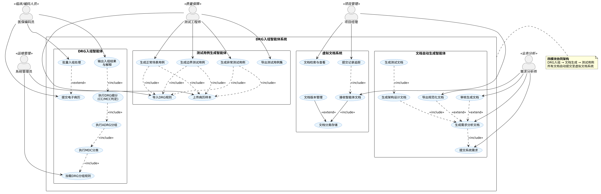
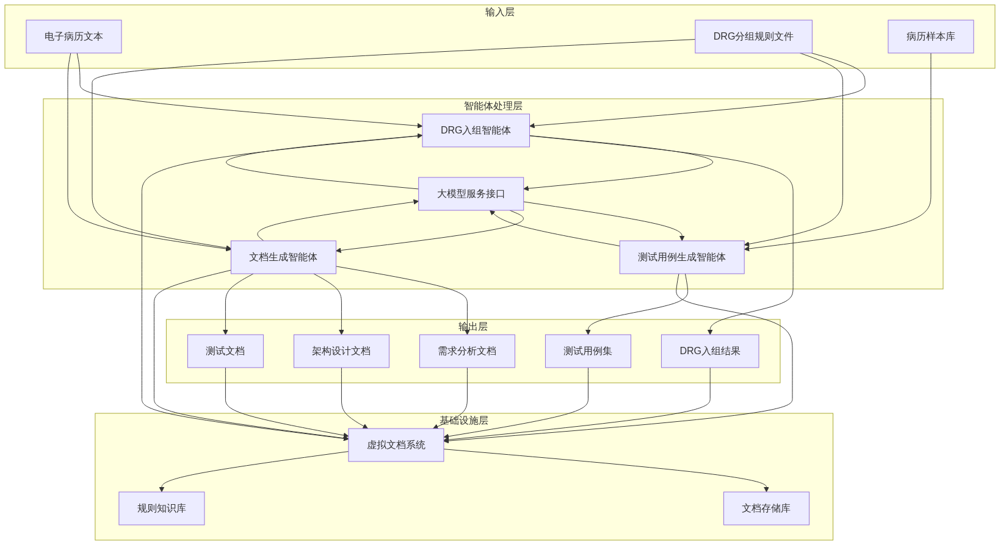
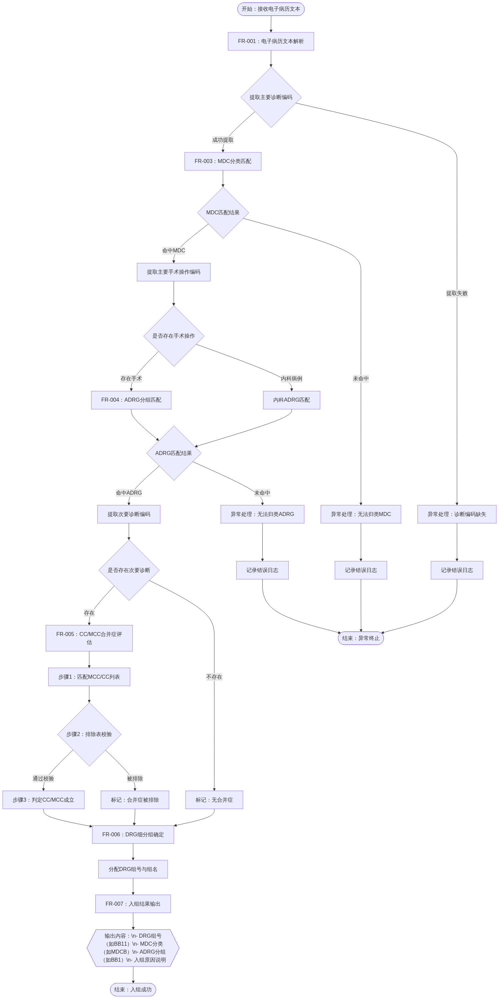
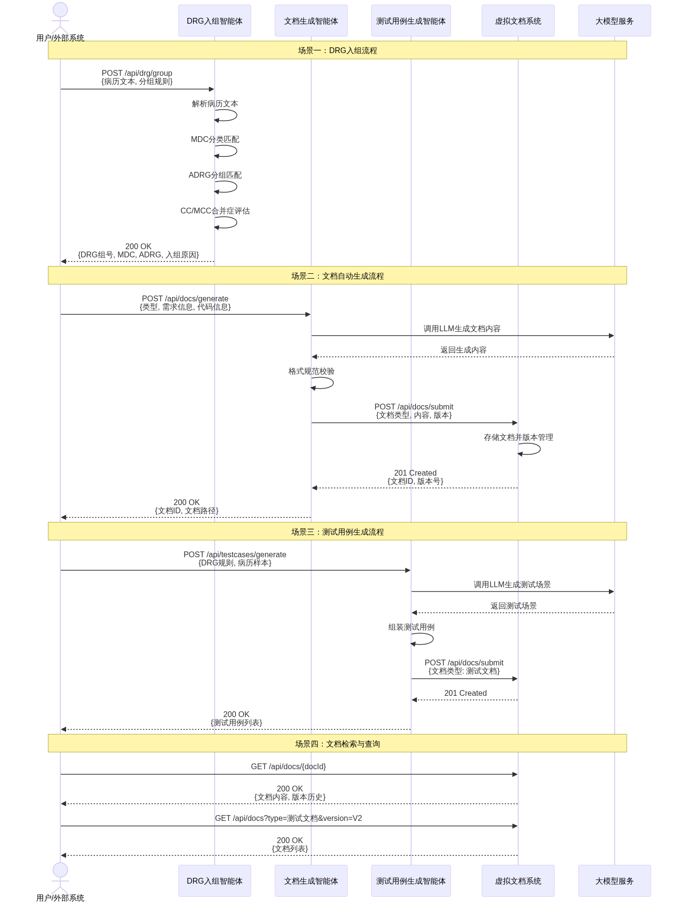
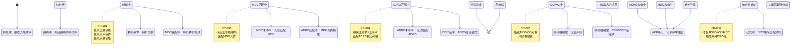
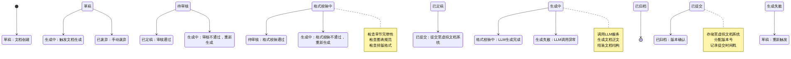

# 需求规格说明书

**文档编号：SRS-DRG-AGENT-V1.0**
**版本号：V1.0**
**编制日期：2026年3月**
**文档状态：正式发布**

## 一、引言

### 1.1 目的

本《软件需求规格说明书》（Software Requirements Specification, SRS）旨在全面、准确地定义"DRG入组智能体系统"的功能需求、性能需求、接口需求与约束条件，为项目的后续设计、开发、测试、部署及维护活动提供统一的依据与基准。

本文档的核心目的包括以下几个方面：

(1) **明确系统边界与功能范围**：通过结构化的需求描述，界定DRG入组智能体系统所涵盖的功能模块（DRG入组、文档自动生成、测试用例生成、虚拟文档系统），以及各模块之间的交互关系，避免在开发过程中出现范围蔓延或功能遗漏。

(2) **为设计与开发提供基准**：架构设计师可依据本文档的功能分解与接口定义，制定系统的模块划分方案与技术选型；开发人员可依据用例描述与数据定义，编写符合预期的代码实现。

(3) **支撑测试验证活动**：测试团队可依据本文档中定义的功能需求、性能指标与约束条件，设计测试用例并验证系统是否满足既定目标。本文档与《测试文档》形成"需求—验证"的闭环追溯关系。

(4) **作为项目验收的依据**：在项目交付阶段，本文档作为甲方（或课程评审方）与乙方（开发团队）共同确认的需求基线，用于判定交付物是否满足合同或任务书的要求。

本文档的预期读者包括以下角色：

(1) **需求分析师**：负责需求的获取、分析与确认，使用本文档作为需求管理过程的输出物与沟通媒介。

(2) **架构设计师**：依据本文档进行系统架构设计，确保架构能够覆盖全部功能需求与非功能需求。

(3) **开发人员**：依据本文档中的用例描述、数据定义与接口规范进行编码实现。

(4) **测试人员**：依据本文档制定测试策略、设计测试用例并执行验证。

(5) **项目经理**：通过本文档跟踪需求实现进度，管理需求变更与风险。

(6) **课程评审教师**：作为大作业成果的核心评审材料之一，评估团队对软件工程流程的理解与应用水平。

(7) **系统运维人员**：了解系统功能范围与运行约束，为后续部署与维护提供参考。

本文档的编制遵循IEEE Std 830-1998《IEEE Recommended Practice for Software Requirements Specifications》的推荐结构与内容要求，并结合本项目"基于大模型或智能体框架构造DRG入组智能体"的具体特点进行了适当裁剪与定制。

### 1.2 范围

#### 1.2.1 系统范围概述

DRG入组智能体系统是一个面向医疗保险DRG（Diagnosis Related Groups，疾病诊断相关分组）付费场景的智能化辅助平台。系统以大语言模型（LLM）或智能体框架为核心引擎，实现以下四类核心能力：

(1) **DRG智能入组**：接收电子病历文本（含主要诊断、手术操作、次要诊断等信息）与DRG分组规则，自动完成从MDC（主要诊断大类）到ADRG（核心疾病诊断相关分组）再到DRG细分组的三层入组推理，输出分组结果及入组原因说明。

(2) **文档自动生成**：基于系统需求描述、设计信息与代码实现，自动生成符合软件工程规范的需求分析文档、架构设计文档与测试文档，实现"代码—文档"的自动化同步与规范化输出。

(3) **测试用例智能生成**：根据DRG分组规则与病历样本，自动构建测试场景并生成正常场景、边界场景与异常场景的测试用例，覆盖不同诊断与手术组合、合并症有无、编码错误与信息缺失等情况。

(4) **虚拟文档系统与自动提交**：构建一个虚拟的文档存储与管理环境，支持其他智能体模块自动提交生成的文档，实现文档的版本化存储、检索与归档。

#### 1.2.2 系统包含的主要功能

(1) **电子病历解析模块**：从非结构化或半结构化的电子病历文本中提取关键信息，包括主要诊断编码（ICD-10）、次要诊断编码、主要手术操作编码（ICD-9-CM-3）、患者基本信息（年龄、性别、住院天数等）。

(2) **DRG规则引擎模块**：加载并解析《按病组（DRG）付费分组方案（2.0版）》中的分组规则，包括MDC分类表、ADRG分组表、MCC/CC列表、排除表等，支持规则的结构化存储与高效检索。

(3) **三层入组推理模块**：按照"MDC → ADRG → DRG"的层级顺序执行分组逻辑，依据主要诊断确定MDC大类，依据主要手术操作确定ADRG核心分组，依据次要诊断中的MCC/CC情况确定DRG细分组。

(4) **入组结果解释模块**：生成包含MDC编码、ADRG编码、DRG编码、DRG组名及入组原因说明的结构化输出，并标注推理链条中的关键决策节点。

(5) **文档模板管理模块**：维护需求分析文档、架构设计文档、测试文档的模板结构，定义各章节的必填字段与格式规范。

(6) **文档内容生成模块**：基于系统需求、代码分析结果与设计信息，调用大语言模型填充文档模板，生成符合规范的章节内容。

(7) **测试场景构建模块**：解析DRG分组规则中的条件组合，自动生成覆盖正常流程、边界条件与异常情况的测试场景矩阵。

(8) **测试用例输出模块**：将测试场景转化为结构化的测试用例文本，包含用例编号、前置条件、输入数据、预期输出、测试类型等字段。

(9) **虚拟文档库模块**：提供文档的存储、索引、版本管理与检索功能，支持按文档类型、生成时间、版本号等维度进行查询。

(10) **自动提交接口模块**：对外暴露标准化的文档提交接口（如RESTful API），支持其他智能体模块通过编程方式提交生成的文档。

#### 1.2.3 系统不包含的内容

为明确系统边界，避免需求范围的不当扩展，特此声明以下内容不属于本系统的功能范围：

(1) **实时医保结算**：本系统仅提供DRG入组的分组推理功能，不涉及与医保结算系统的实时对接、费用计算或报销流程处理。

(2) **电子病历系统（EMR）开发**：本系统不包含电子病历的录入、编辑与管理功能，仅以已有的电子病历文本作为输入。

(3) **医疗诊断或临床决策支持**：本系统的DRG入组结果为编码分组推理，不构成对患者病情的诊断建议或治疗方案推荐，不具备临床决策支持的法律效力。

(4) **DRG分组规则的自主制定与维护**：本系统使用国家医疗保障局发布的《按病组（DRG）付费分组方案（2.0版）》作为规则依据，不提供规则的自定义编辑或版本管理功能（规则更新通过规则文件替换实现）。

(5) **多语言病历处理**：当前版本仅支持中文电子病历文本的解析与入组，不包含英文或其他语言病历的处理能力。

(6) **用户权限管理与认证系统**：本系统作为大作业项目，不包含复杂的用户角色权限模型、单点登录（SSO）或身份认证体系。

(7) **大规模并发处理与分布式部署**：系统以满足课程演示与验证为目标，不针对生产环境级别的高并发、高可用场景进行架构设计。

### 1.3 定义、缩写词和术语

本节列出本文档中使用的专业术语、缩写词及其定义，以消除歧义，确保所有读者对关键概念有一致的理解。术语按字母顺序排列。

**表1-1：术语与缩写词定义表**

| 缩写/术语 | 英文全称 | 中文全称 | 定义 |
|:---:|:---:|:---:|:---|
| ADRG | Adjacent Diagnosis Related Groups | 核心疾病诊断相关分组 | DRG分组体系的第二层，依据主要诊断和主要手术操作进行划分，是DRG分组过程中的核心分类单元。 |
| CC | Complication or Comorbidity | 合并症或并发症 | 伴随主要诊断存在的其他病症，可能影响医疗资源消耗，用于DRG细分组的判定。 |
| CM-3 | — | 手术操作编码 | 基于ICD-9-CM-3的手术操作分类编码体系，用于标识患者在住院期间接受的手术或操作类型。 |
| DRG | Diagnosis Related Groups | 疾病诊断相关分组 | 将住院患者按"主要诊断 + 治疗方式 + 个体特征"分入不同组别的付费分类体系，每组对应一个打包付费标准。 |
| EMR | Electronic Medical Record | 电子病历 | 医疗机构以电子化方式记录的患者诊疗信息，包含诊断、手术、检查、用药等数据。 |
| ICD-10 | International Classification of Diseases, 10th Revision | 国际疾病分类第十版 | 世界卫生组织（WHO）发布的疾病与健康问题分类编码体系，用于统一标识诊断类别。 |
| ICD-9-CM-3 | International Classification of Diseases, 9th Revision, Clinical Modification, Volume 3 | 国际疾病分类第九版临床修订版第三卷 | 用于手术操作编码的国际分类体系，是中国医保DRG分组中手术操作编码的标准依据。 |
| LLM | Large Language Model | 大语言模型 | 基于大规模语料训练的人工智能语言模型，具备文本理解、生成与推理能力，是本系统的核心智能引擎。 |
| MCC | Major Complication or Comorbidity | 严重合并症或并发症 | 比一般CC消耗更多医疗资源的合并症或并发症，对DRG细分组的判定具有决定性影响。 |
| MDC | Major Diagnostic Category | 主要诊断大类 | DRG分组体系的第一层，以解剖学或生理学系统为主要分类依据，将诊断划分为若干大类（如MDCB为神经系统疾病及功能障碍）。 |
| NLP | Natural Language Processing | 自然语言处理 | 计算机科学中致力于使计算机理解、解析和生成人类语言的技术领域。 |
| RESTful API | Representational State Transfer API | 表述性状态传递接口 | 一种基于HTTP协议的Web服务接口设计风格，用于系统模块之间的数据交互。 |
| SRS | Software Requirements Specification | 软件需求规格说明书 | 描述软件系统功能需求、性能需求、接口需求与约束条件的正式文档，是软件工程过程中的关键制品。 |

除上述术语外，本文档中涉及的其他DRG分组相关术语（如"排除表""合并症列表""分组方案"等）均以国家医疗保障局《按病组（DRG）付费分组方案（2.0版）》中的定义为准。

### 1.4 参考资料

本文档的编制参考了以下文件、标准与资料。当以下参考资料与本项目产生内容冲突时，以国家医疗保障局发布的官方文件为准。

(1) **国家医疗保障局.《按病组（DRG）付费分组方案（2.0版）》**：本项目DRG入组模块的核心规则依据，包含MDC分类表、ADRG分组逻辑、MCC/CC列表及排除规则。该文件定义了DRG三层分组体系的标准结构和入组判定条件。

(2) **IEEE Std 830-1998.《IEEE Recommended Practice for Software Requirements Specifications》**：本文档的结构框架与内容组织的参考标准。IEEE 830定义了SRS应包含的章节结构（引言、总体描述、具体需求、附录等）以及各章节的推荐内容要素，本SRS在其基础上结合项目实际进行了适当裁剪与调整。

(3) **世界卫生组织.《国际疾病分类第十版（ICD-10）》**：本系统电子病历解析模块中诊断编码的标准依据。ICD-10定义了疾病诊断的编码体系与分类逻辑，是DRG分组的基础数据标准。

(4) **国家卫生健康委员会.《国际疾病分类第九版临床修订版第三卷（ICD-9-CM-3）》**：本系统手术操作编码的标准依据，用于电子病历中手术操作信息的编码与解析。

(5) **ISO/IEC/IEEE 29148:2018.《Systems and Software Engineering — Life Cycle Processes — Requirements Engineering》**：需求工程过程的国际标准，为本文档的需求获取、分析与验证活动提供了方法论指导。

(6) **国家医疗保障局.《国家医疗保障疾病诊断相关分组（CHS-DRG）分组与付费技术规范》**：DRG付费分组的技术规范文件，为分组逻辑的设计与验证提供了技术参考。

(7) **华东理工大学自然语言处理与大数据挖掘实验室.《软件工程大作业——DRG入组智能体项目任务书（2026年3月）》**：本项目的直接来源文件，定义了项目的总体目标、具体需求、交付要求与评价标准。

## 二、总体描述

总体描述从宏观角度给出 DRG 入组智能体系统的全景视图，阐明系统要解决的核心问题、系统边界、用户角色、约束条件以及系统所依赖的外部条件。本章为后续具体需求的展开提供上下文框架，使读者在深入细节之前能够建立对系统的整体认知。

### 2.1 系统整体功能

DRG 入组智能体系统是一个面向医疗医保领域的智能化软件平台，其核心使命是：**利用大模型与智能体技术，实现从电子病历到 DRG 分组结果的自动化映射，并基于系统需求与代码信息自动生成符合软件工程规范的需求分析、架构设计和测试文档，最终将全部文档自动提交至虚拟文档管理系统**。

系统围绕四大核心智能体模块构建，形成"业务处理—文档生成—测试验证—成果管理"的完整闭环：

(1) **DRG 入组智能体**：作为系统的业务核心，该模块接收电子病历文本（含主要诊断、手术操作、次要诊断等信息）和 DRG 分组规则（含 MDC 分类、ADRG 分组、MCC/CC 列表），按照《按病组（DRG）付费分组方案（2.0 版）》规定的三层分组逻辑（MDC → ADRG → DRG），自动完成分组判定并输出 DRG 组号、组名及入组原因说明。

(2) **文档自动生成智能体**：该模块以系统需求说明、系统代码和设计信息为输入，利用大模型的语言生成能力，自动产出符合 IEEE 830 等软件工程标准的结构化文档，包括需求分析文档（含系统功能需求与用例描述）、架构设计文档（含整体结构、模块关系与接口定义）和测试文档（含测试策略与测试方案）。

(3) **测试用例生成智能体**：该模块根据 DRG 分组规则和病历样本库，自动构建覆盖正常场景、边界场景和异常场景的测试用例矩阵。正常场景覆盖不同诊断与手术的排列组合，边界场景聚焦合并症有无对分组结果的影响，异常场景涵盖编码错误、信息缺失等容错路径。

(4) **虚拟文档系统**：该模块模拟企业级文档管理系统的核心功能，提供文档接收接口、版本控制、分类存储和检索查询能力，使上述三个智能体生成的各类文档能够被统一收纳、追踪和审阅，支撑团队协作与配置管理。

以下用例图从参与者与系统交互的角度，全面展示了各模块的功能边界及用例之间的依赖关系。



**图2-1：DRG入组智能体系统总体用例图**

从用例图可以看出，系统将五类参与者与四个功能模块有机衔接：

(1) **DRG 入组智能体**面向医保编码员，提供从病历提交、规则加载到三级分组（MDC → ADRG → DRG）的完整处理链路。其中，"执行 MDC 分类"依赖于规则加载，"执行 ADRG 分组"依赖于 MDC 分类结果，"执行 DRG 细分"则进一步依赖 ADRG 分组。这种<<include>>依赖链确保了分组流程的逻辑严格性。"批量入组处理"作为"提交电子病历"的扩展用例（<<extend>>），支持大批量病历的高效处理。

(2) **文档自动生成智能体**面向需求分析师，以"提交系统需求"为基础用例，"生成需求分析文档"依赖于此输入。架构设计文档的生成进一步依赖需求分析文档的输出，测试文档则依赖架构设计文档，形成渐进式文档生成流水线。"审核生成文档"和"导出规范化文档"作为扩展用例，为需求分析师提供人工审校与格式导出能力。

(3) **测试用例生成智能体**面向测试工程师，以"导入 DRG 规则"和"上传病历样本"作为两类基础数据输入，三类测试用例（正常场景、边界场景、异常场景）的生成均同时依赖这两类输入，确保用例生成的规则驱动性和数据真实性。

(4) **虚拟文档系统**面向项目经理和系统管理员，提供文档接收、自动分类存储、版本管理和检索追踪功能。文档提交时自动触发分类存储（<<include>>），版本管理作为存储的扩展（<<extend>>）提供进阶的变更管控能力。

### 2.2 用户特征

本系统面向多种角色类型的用户，各类用户在专业背景、技术水平和操作模式上存在显著差异。系统设计需充分考虑这些差异，为不同用户提供与其技能水平相匹配的交互方式。

#### 2.2.1 医保编码员（DRG 入组智能体的主要用户）

医保编码员是 DRG 入组智能体的直接操作者。该角色通常具备以下特征：

(1) **专业背景**：医学或卫生信息管理相关专业，熟悉 ICD-10-CM 疾病分类编码体系和 ICD-9-CM-3 手术操作分类编码体系，理解 DRG 分组的基本原理和三层分组逻辑，但对软件系统的内部实现机制了解有限。

(2) **技术水平**：能够熟练使用医院信息系统（HIS）和医保结算系统，具备基本的计算机操作能力，但不具备编程或系统配置能力。对命令行操作、配置文件编辑等技术性操作接受度较低，偏好图形化界面和向导式操作流程。

(3) **典型操作模式**：
a. 单份病历录入：逐份输入或粘贴电子病历文本，查看分组结果和入组原因；
b. 批量处理：上传包含多份病历的结构化文件（如 CSV、JSON），批量获取分组结果；
c. 规则查询：在不确定分组逻辑时，查询特定诊断或手术对应的 MDC/ADRG 归属；
d. 结果导出：将分组结果导出为 Excel 或 PDF 格式，用于医保结算或内部审核。

(4) **使用频率**：日常高频使用，单日可能处理数十至数百份病历，对响应速度和操作效率有较高要求。

#### 2.2.2 需求分析师（文档自动生成智能体的主要用户）

需求分析师是文档自动生成智能体的核心用户。该角色在软件工程团队中承担需求获取、分析和规约的职责：

(1) **专业背景**：软件工程、计算机科学或信息管理相关专业，熟悉需求工程方法论（如用例驱动开发、用户故事映射），理解 IEEE 830《软件需求规格说明书推荐实践》等文档标准，但可能对 DRG 医保支付领域的业务细节不够深入。

(2) **技术水平**：能够编写结构化的需求文档，理解 UML 用例图和活动图，具备基本的代码阅读能力（用于理解系统需求与代码之间的映射关系）。对 AI 辅助文档生成工具持开放态度，但倾向于对生成结果进行人工审核和修订。

(3) **典型操作模式**：
a. 需求输入：将系统需求以自然语言或结构化格式提交给智能体；
b. 迭代生成：根据生成结果反复调整输入描述，直至文档满足质量要求；
c. 审核修订：在线审阅生成的文档，标注修改意见并触发重新生成；
d. 格式导出：选择目标文档模板（如国标模板、企业模板），导出最终文档。

(4) **使用频率**：项目阶段性高频使用，在需求分析阶段、架构设计阶段和测试规划阶段分别集中使用，其余时间使用频率较低。

#### 2.2.3 测试工程师（测试用例生成智能体的主要用户）

测试工程师负责系统质量保障，是测试用例生成智能体的直接使用者：

(1) **专业背景**：软件测试或计算机相关专业，熟悉黑盒测试、白盒测试、边界值分析、等价类划分等测试设计方法，理解测试用例的结构要素（前置条件、测试步骤、预期结果），但对 DRG 分组规则和 ICD 编码体系的细节可能了解有限。

(2) **技术水平**：能够编写自动化测试脚本，使用测试管理工具（如 TestLink、JIRA），理解测试覆盖率的概念和度量方法。期望测试用例生成工具能够提供可复用的、参数化的测试用例模板。

(3) **典型操作模式**：
a. 规则导入：加载 DRG 分组规则文件，供智能体解析和提取测试参数；
b. 样本管理：上传和管理用于生成测试用例的病历样本库；
c. 场景配置：指定需要生成的测试场景类型（正常/边界/异常）和覆盖范围；
d. 用例审查：审核自动生成的测试用例，标记需要人工修正的条目；
e. 批量导出：将测试用例集导出为测试管理工具兼容的格式。

(4) **使用频率**：与需求分析师类似，呈阶段性高频特征，在 DRG 规则更新或系统版本迭代时集中使用。

#### 2.2.4 项目经理（虚拟文档系统的主要用户）

项目经理负责项目的整体规划、进度控制和交付管理，是虚拟文档系统的核心用户：

(1) **专业背景**：项目管理或软件工程相关专业，熟悉敏捷开发（Scrum）或传统瀑布模型，了解配置管理的基本理念（如基线建立、变更控制），但通常不直接参与编码或详细设计工作。

(2) **技术水平**：熟练使用项目管理工具（如 Microsoft Project、JIRA、禅道），能够阅读和理解需求文档和架构设计文档，但技术深度有限。关注文档的完整性、一致性和可追溯性，而非技术实现细节。

(3) **典型操作模式**：
a. 文档检索：按文档类型、版本号或生成日期检索所需文档；
b. 版本比对：比较同一文档不同版本之间的差异，追踪变更历史；
c. 提交审核：审查各智能体提交的文档，确认文档完整性和合规性；
d. 基线管理：在关键里程碑节点建立文档基线，冻结特定版本的文档集合。

(4) **使用频率**：项目全周期持续性使用，在里程碑评审和交付节点使用频率显著增高。

#### 2.2.5 系统管理员（全系统运维管理）

系统管理员负责系统的部署、配置和日常运维：

(1) **专业背景**：系统运维或网络管理相关专业，熟悉服务器部署、数据库管理和安全策略配置，对 DRG 业务逻辑和软件工程文档规范的了解相对有限。

(2) **技术水平**：具备较强的技术能力，能够进行系统参数调优、日志分析和故障排查，熟悉容器化部署（如 Docker、Kubernetes）和持续集成/持续部署（CI/CD）流水线。

(3) **典型操作模式**：
a. 系统部署：在目标服务器上部署各个智能体模块和虚拟文档系统；
b. 规则更新：在 DRG 分组方案更新时，替换系统中的规则文件；
c. 性能监控：监控各模块的资源消耗和响应时间，及时调整配置；
d. 权限管理：为不同用户角色分配系统访问权限。

(4) **使用频率**：日常监控为持续性工作，部署和更新为阶段性工作。

### 2.3 约束条件

系统的设计、开发和运行受到多方面的约束限制。本节从技术选型、运行环境、政策法规、时间资源等维度梳理这些约束条件。

#### 2.3.1 技术选型约束

(1) **大模型/智能体框架**：系统必须基于大模型或智能体框架构建。可选的技术路线包括但不限于 LangChain、AutoGPT、MetaGPT 等多智能体协作框架，或直接基于 OpenAI GPT、Claude、通义千问、文心一言等大语言模型的 API 进行封装。技术选型须综合考虑模型的推理能力、中文医疗文本理解水平、API 调用成本及响应延迟。

(2) **编程语言**：建议采用 Python 作为主要开发语言。Python 在 AI/LLM 生态中具有最丰富的工具链支持（如 LangChain、LlamaIndex、Semantic Kernel 等），同时便于快速原型开发和迭代。若团队具备 Java 或 TypeScript 技术栈优势，亦可考虑对应语言的智能体框架。

(3) **文档生成标准**：需求分析文档须参照 IEEE 830-1998《IEEE Recommended Practice for Software Requirements Specifications》的结构框架；架构设计文档须参照 ISO/IEC 42010:2022《Software, systems and enterprise — Architecture description》的描述规范；测试文档须参照 IEEE 829-2008《IEEE Standard for Software and System Test Documentation》的模板要求。

(4) **DRG 分组规则**：分组逻辑必须严格遵循国家医疗保障局发布的《按病组（DRG）付费分组方案（2.0 版）》，包括 26 个 MDC 分类、376 个 ADRG 核心分组及对应 DRG 细分组的完整规则体系。系统不得自行修改或简化分组逻辑。

#### 2.3.2 运行环境约束

(1) **部署模式**：系统支持本地化部署和云端部署两种模式。本地化部署要求服务器配备 GPU（推荐 NVIDIA A10 或同等算力以上）以支撑大模型推理；云端部署可依赖第三方大模型 API，但需确保网络连接稳定。

(2) **操作系统**：服务端优先支持 Linux（Ubuntu 20.04 LTS 或 CentOS 8 及以上），兼容 Windows Server 2019 及以上版本。

(3) **数据库**：虚拟文档系统需配备关系型数据库（推荐 PostgreSQL 14+ 或 MySQL 8.0+）用于存储文档元数据和版本信息，同时支持文件系统或对象存储（如 MinIO）用于存储文档正文内容。

(4) **并发处理能力**：DRG 入组智能体须支持至少 10 个并发请求，单次入组响应时间不超过 30 秒（含大模型推理时间）。批量处理模式下，100 份病历的批量入组完成时间不超过 10 分钟。

#### 2.3.3 政策法规约束

(1) **医保数据安全**：系统处理的电子病历包含患者个人健康信息（PHI），须遵守《中华人民共和国数据安全法》《中华人民共和国个人信息保护法》及《医疗保障基金使用监督管理条例》中关于医疗数据安全和个人隐私保护的相关规定。禁止将病历数据上传至境外服务器或未经授权的第三方平台。

(2) **数据脱敏要求**：在调用第三方大模型 API 进行推理时，须对病历中的患者姓名、身份证号、住院号等个人标识信息进行脱敏处理，仅保留诊断编码、手术编码和年龄/性别等临床特征信息。

(3) **分组结果合规性**：DRG 入组结果作为医保结算的依据之一，必须与官方分组器的输出结果保持一致。系统应提供入组原因的详细解释和规则引用，以便在医保审核中追溯和举证。

#### 2.3.4 时间与资源约束

(1) **开发周期**：项目整体开发周期预计为 2026 年 3 月至 2026 年 6 月（约 16 周），涵盖需求分析、架构设计、编码实现、集成测试和文档交付全过程。

(2) **团队规模**：项目团队由 4 至 5 名成员组成，角色可交叉兼任，包括项目经理（需求分析师）、架构师（配置管理）、开发工程师和测试工程师。

(3) **预算限制**：若采用第三方大模型 API，单月 API 调用费用须控制在合理范围内（建议不超过人民币 2000 元/月）。开发环境和测试环境优先使用免费或开源工具。

### 2.4 假设与依赖

系统的正常运行依赖于以下外部条件和假设。若这些假设不成立，系统功能可能受到不同程度的影响。

#### 2.4.1 外部数据依赖

(1) **DRG 分组规则文件**：系统假设《按病组（DRG）付费分组方案（2.0 版）》的完整规则文件（含 MDC 分类表、ADRG 分组表、MCC/CC 列表及排除表）以结构化或半结构化格式（如 Excel、CSV、JSON 或 XML）提供，且规则内容准确、无歧义。若规则文件存在版本更新，系统需支持规则的快速替换。

(2) **ICD 编码字典**：系统假设拥有完整的 ICD-10-CM 疾病分类编码字典和 ICD-9-CM-3 手术操作分类编码字典，用于病历编码的校验和规则匹配。编码字典的版本须与 DRG 分组方案所引用的编码版本保持一致。

(3) **病历样本库**：系统假设测试用例生成智能体能够访问一定数量的真实或仿真电子病历样本（建议不少于 200 份），覆盖各主要 MDC 分类和常见诊断-手术组合，以支撑充分的测试场景构建。

#### 2.4.2 第三方服务依赖

(1) **大模型 API 服务**：若系统采用云端大模型 API（而非本地部署模型），则依赖于第三方 API 服务的可用性和响应性能。系统应具备服务降级策略，在 API 不可用时向用户明确提示，而非静默失败。

(2) **文档模板库**：文档自动生成智能体假设存在预定义的文档模板（如需求规格说明书模板、架构设计文档模板、测试计划模板），模板中已定义章节结构、排版规范和内容占位符。模板的质量直接影响生成文档的规范性。

#### 2.4.3 硬件资源假设

(1) **GPU 算力**：若采用本地部署的大模型，假设服务器配备至少 1 块 NVIDIA A10（24GB 显存）或同等算力的 GPU，以支撑模型的推理计算。若 GPU 资源无法满足，系统可降级使用 CPU 推理，但响应时间将显著增加。

(2) **存储空间**：虚拟文档系统假设至少提供 50GB 可用存储空间，用于存储生成的文档正文、版本快照和日志文件。实际存储需求将随文档数量的增长而线性增加。

#### 2.4.4 业务假设

(1) **病历格式规范**：系统假设输入的电子病历文本包含必要的信息字段（主要诊断编码、主要手术编码、次要诊断列表），且编码格式符合 ICD 编码规范。对于信息缺失的病历，系统将触发异常处理流程，而非输出错误的分组结果。

(2) **分组规则稳定性**：系统假设在单个项目周期内，DRG 分组规则不发生重大变更。若国家医保局在项目进行期间发布新版分组方案，需评估对系统的影响范围并决定是否纳入当前版本。

(3) **用户配合度**：系统假设目标用户（医保编码员、需求分析师、测试工程师）具备基本的计算机操作能力，并愿意接受 AI 辅助的工作模式。对于技术接受度较低的用户，系统应提供充分的操作引导和帮助文档。

(4) **文档审校环节**：系统假设由智能体自动生成的文档将经过人工审核和修订后才作为正式交付物。自动生成功能旨在提升文档初稿的编写效率，而非完全替代人工的文档编写工作。

## 三、具体需求

本章详细描述DRG入组智能体系统的各项具体需求，涵盖功能需求、性能需求、安全性需求、可靠性需求、可维护性需求、外部接口需求、业务状态模型及设计约束。每条需求均以可验证的方式描述，确保开发团队和测试团队能够明确理解和执行。

### 3.1 功能需求

本节按系统四大模块组织功能需求：DRG入组智能体（FR-001～FR-007）、文档自动生成智能体（FR-008～FR-011）、测试用例生成智能体（FR-012～FR-014）及虚拟文档系统（FR-015～FR-017）。每条功能需求包含功能描述、输入规格、处理流程、输出规格和异常处理五部分。系统整体数据流如下图所示。



**图3-1：系统数据流总览图**

#### 3.1.1 DRG入组功能

DRG入组功能是本系统的核心业务能力，负责接收电子病历文本和DRG分组规则，经过多层匹配逻辑，输出最终的DRG分组结果。DRG入组的完整业务流程如下图所示。



**图3-2：DRG入组核心业务活动图**

##### 3.1.1.1 FR-001：电子病历文本解析

**功能描述**

系统接收非结构化或半结构化的电子病历文本，利用大模型（LLM）的自然语言理解能力，从中提取入组所需的关键医学信息字段。解析结果包括：主要诊断编码及名称、次要诊断编码及名称列表、主要手术操作编码及名称、其他手术操作编码及名称列表、患者基本信息（年龄、性别、住院天数、离院方式等）。解析过程需兼容不同医院信息系统（HIS）导出的多种病历文本格式。

**输入规格**

(1) 电子病历文本（string，必填）：包含患者本次住院的完整诊疗记录，可为纯文本或结构化JSON。

(2) 解析配置参数（object，可选）：指定输出字段集合、编码标准版本（如ICD-10-CM、ICD-9-CM-3）等。

**处理流程**

(1) 文本预处理：对输入的电子病历文本进行清洗，去除无关字符、统一编码格式（UTF-8），检测文本语言和编码标准。

(2) 字段识别：调用LLM进行命名实体识别（NER）和关系抽取，识别诊断描述、手术描述、合并症描述等关键段落。

(3) 编码映射：将识别出的诊断描述和手术描述映射为标准ICD编码。系统内置ICD-10（诊断）和ICD-9-CM-3（手术操作）编码库，支持模糊匹配和语义相似度匹配。

(4) 主次判定：依据医保DRG入组规范，自动判定主要诊断（本次住院首要原因）、次要诊断（其他并存疾病）、主要手术（与主要诊断对应的核心治疗操作）。

(5) 结果组装：将解析结果组装为结构化数据对象，包含所有必填字段和可选字段。

**输出规格**

结构化电子病历对象，包含以下字段：

**表3-1：电子病历解析输出字段**

| 字段名称 | 类型 | 必填 | 说明 |
|--------|------|------|------|
| primary_diagnosis_code | string | 是 | 主要诊断ICD-10编码 |
| primary_diagnosis_name | string | 是 | 主要诊断中文名称 |
| secondary_diagnoses | array | 否 | 次要诊断列表，每项含code和name |
| primary_procedure_code | string | 否 | 主要手术ICD-9-CM-3编码 |
| primary_procedure_name | string | 否 | 主要手术中文名称 |
| secondary_procedures | array | 否 | 其他手术操作列表 |
| patient_age | integer | 否 | 患者年龄（岁） |
| patient_gender | string | 否 | 患者性别（M/F） |
| length_of_stay | integer | 否 | 住院天数 |
| discharge_type | string | 否 | 离院方式代码 |

**异常处理**

(1) 若病历文本为空或无法解析任何有效字段，返回错误码E001（病历解析失败），附带详细原因说明。

(2) 若诊断描述无法映射到有效ICD编码，标记为"未匹配"，在输出中保留原始描述文本并附加警告标记。

(3) 若病历中明确标注多个"主要诊断"，按医保规范优先级排序（消耗医疗资源最多者优先），并在入组原因中注明判定依据。

##### 3.1.1.2 FR-002：DRG分组规则加载与管理

**功能描述**

系统加载并管理《按病组（DRG）付费分组方案（2.0版）》规定的完整分组规则体系，包括MDC分类表、ADRG分组规则表、MCC列表、CC列表、排除表等核心规则数据。支持规则的版本化管理、热更新和完整性校验。

**输入规格**

(1) 规则文件（file/string，必填）：符合DRG 2.0版规范的规则定义文件，支持JSON、XML或CSV格式。

(2) 规则版本号（string，可选）：用于标识规则版本，默认读取最新版本。

**处理流程**

(1) 规则解析：根据文件格式调用对应的解析器，将MDC分类、ADRG分组、MCC/CC列表、排除表等分别解析为内存数据结构。

(2) 完整性校验：校验规则数据完整性，包括：MDC编码唯一性、ADRG编码唯一性、MDC与ADRG的映射关系完整性、MCC/CC列表编码格式正确性、排除表双向引用有效性。

(3) 索引构建：为各规则表构建高效查询索引（哈希索引或前缀树索引），确保入组匹配时O(1)或O(log n)的查询复杂度。

(4) 版本管理：将规则数据持久化至规则知识库，记录版本号、加载时间、校验结果等元信息。

(5) 热更新：支持在不中断服务的情况下切换规则版本，旧版本规则在无活跃入组任务后自动卸载。

**输出规格**

规则加载状态报告，包含以下字段：

**表3-2：规则加载状态报告字段**

| 字段名称 | 类型 | 说明 |
|--------|------|------|
| version | string | 规则版本号 |
| mdc_count | integer | 加载的MDC分类数 |
| adrg_count | integer | 加载的ADRG分组数 |
| mcc_count | integer | MCC编码条目数 |
| cc_count | integer | CC编码条目数 |
| exclusion_count | integer | 排除表条目数 |
| validation_status | string | 校验状态（PASS/FAIL） |
| load_timestamp | datetime | 加载时间戳 |

**异常处理**

(1) 若规则文件格式不合法或无法解析，返回错误码E002（规则加载失败），停止加载并回滚。

(2) 若完整性校验不通过（如存在孤立ADRG编码），返回警告信息并列出所有校验失败项，允许管理员强制加载或修正后重新加载。

(3) 若新版本规则与当前正在执行的入组任务存在冲突，系统等待当前任务完成后执行切换，最长等待时间为30秒。

##### 3.1.1.3 FR-003：MDC分类匹配

**功能描述**

根据电子病历解析出的主要诊断ICD-10编码，在MDC分类表中进行匹配，确定患者归属的主要诊断大类（MDC）。MDC分类遵循DRG 2.0版规范的26个大类划分，涵盖从MDCA（先期分组疾病及相关操作）到MDCZ（多发性重要创伤）的完整分类体系。

**输入规格**

(1) 主要诊断编码（string，必填）：符合ICD-10编码规范的诊断编码。

(2) 主要诊断名称（string，必填）：诊断的中文描述文本，用于辅助匹配。

**处理流程**

(1) 编码预处理：对输入的主要诊断编码进行标准化处理（去除分隔符、统一大小写、补齐位数）。

(2) MDC表查询：在MDC分类表中以主要诊断编码为键进行精确匹配。MDC分类表以ICD-10编码范围或前缀定义归属关系。

(3) 模糊匹配：若精确匹配失败，使用诊断名称进行语义相似度匹配，在MDC分类描述中检索最相似的大类。

(4) 特殊MDC处理：判断是否属于MDCA（先期分组，如器官移植、呼吸机使用等需优先分组的病例），若命中MDCA则直接进入先期分组流程。

(5) 结果确定：返回匹配到的MDC编码（如"MDCB"）和名称（如"神经系统疾病及功能障碍"）。

**输出规格**

MDC匹配结果对象：

**表3-3：MDC匹配结果字段**

| 字段名称 | 类型 | 说明 |
|--------|------|------|
| mdc_code | string | MDC编码 |
| mdc_name | string | MDC中文名称 |
| match_type | string | 匹配方式（EXACT/FUZZY/SPECIAL） |
| confidence | float | 匹配置信度（0.0～1.0） |

**异常处理**

(1) 若主要诊断编码无法匹配任何MDC分类，返回错误码E003（MDC匹配失败），并列出匹配过程中尝试的所有候选MDC。

(2) 若主要诊断编码同时匹配多个MDC（如跨大类编码），按DRG规范优先级规则自动选择（MDCA优先于其他MDC），并在入组原因中注明。

(3) 若主要诊断编码为特殊编码（如带有星号*或剑号†的联合编码），按照医保编码规范解析主码进行匹配。

##### 3.1.1.4 FR-004：ADRG分组匹配

**功能描述**

在确定MDC大类后，根据主要诊断编码和主要手术操作编码（如有），在对应的ADRG分组规则表中进行匹配，确定核心疾病诊断相关分组（ADRG）。ADRG分组是DRG三层分组结构的中间层，共约400余个分组，是确定付费标准的核心依据。

**输入规格**

(1) MDC编码（string，必填）：FR-003输出的MDC编码。

(2) 主要诊断编码（string，必填）：患者主要诊断ICD-10编码。

(3) 主要手术操作编码（string，可选）：患者主要手术ICD-9-CM-3编码。

(4) 所有手术操作编码列表（array，可选）：患者全部手术操作编码，用于复合手术判定。

**处理流程**

(1) 手术存在性判定：若存在主要手术操作编码，进入外科ADRG匹配流程；若不存在手术操作，进入内科ADRG匹配流程。

(2) 外科ADRG匹配：在MDC对应的外科ADRG规则中，以手术操作编码为键进行匹配。系统依次执行以下匹配策略：

a. 精确手术匹配：手术编码与ADRG定义的手术列表精确匹配。

b. 手术范围匹配：手术编码落入ADRG定义的手术编码范围。

c. 复合手术匹配：当存在多个手术操作时，判断是否命中复合手术组（如BB1神经系统复合手术组）。

(3) 内科ADRG匹配：在MDC对应的内科ADRG规则中，以主要诊断编码为键进行匹配，依据诊断的亚目、细目层级逐级匹配。

(4) 匹配优先级：同一MDC内多个可能ADRG时，按以下优先级选择：手术组优先于操作组、操作组优先于内科组、复合手术组优先于单一手术组。

**输出规格**

ADRG匹配结果对象：

**表3-4：ADRG匹配结果字段**

| 字段名称 | 类型 | 说明 |
|--------|------|------|
| adrg_code | string | ADRG编码（如"BB1"） |
| adrg_name | string | ADRG中文名称（如"神经系统复合手术"） |
| category | string | 分组类别（SURGICAL/MEDICAL/COMPLEX） |
| matched_rule | string | 命中的具体规则描述 |

**异常处理**

(1) 若在MDC内无法匹配任何ADRG，返回错误码E004（ADRG匹配失败），输出该MDC下所有候选ADRG及其未命中原因。

(2) 若手术编码在MDC对应的ADRG规则中不存在，但有相似编码（如同目不同细目），输出警告并建议人工复核。

(3) 若主要诊断和手术操作分别命中不同ADRG，按优先级规则自动选择，并在入组原因中注明冲突及解决方式。

##### 3.1.1.5 FR-005：CC/MCC合并症评估

**功能描述**

在确定ADRG后，评估患者的次要诊断中是否存在合并症或并发症（CC）或严重合并症或并发症（MCC），并通过排除表校验判断该合并症是否与主要诊断存在排除关系。CC/MCC评估结果直接影响DRG细分组（有无合并症、伴CC或伴MCC），进而影响付费权重。

**输入规格**

(1) ADRG编码（string，必填）：FR-004输出的ADRG编码。

(2) 主要诊断编码（string，必填）：患者主要诊断ICD-10编码。

(3) 次要诊断列表（array，必填）：所有次要诊断的编码和名称。

(4) MCC列表（hash set，必填）：DRG 2.0版规定的MCC编码集合。

(5) CC列表（hash set，必填）：DRG 2.0版规定的CC编码集合。

(6) 排除表（mapping，必填）：主要诊断与MCC/CC的排除关系映射表。

**处理流程**

(1) 次要诊断遍历：逐一取出次要诊断编码，依次执行MCC匹配和CC匹配。

(2) MCC匹配：将次要诊断编码在MCC列表中查询，若命中则标记为MCC候选。

(3) CC匹配：若未命中MCC，在CC列表中查询，若命中则标记为CC候选。

(4) 排除表校验：对每个MCC/CC候选，在排除表中查询该次要诊断是否被主要诊断所排除。排除逻辑为：若排除表中存在"主诊断A → 排除MCC/CC B"的映射关系，且当前主诊断为A、次要诊断为B，则该合并症不成立。

(5) 最高级别判定：在所有通过排除表校验的CC/MCC候选中，取最高级别（MCC > CC > 无），作为最终合并症等级。

(6) ADRG分层支持校验：判断当前ADRG是否支持按合并症分层（部分ADRG不区分CC/MCC），若不支持分层，则合并症评估结果不影响DRG细分。

**输出规格**

CC/MCC评估结果对象：

**表3-5：CC/MCC评估结果字段**

| 字段名称 | 类型 | 说明 |
|--------|------|------|
| comorbidity_level | string | 合并症等级（MCC/CC/NONE） |
| matched_cc_list | array | 命中的CC/MCC编码及名称列表 |
| excluded_cc_list | array | 被排除表排除的CC/MCC列表 |
| exclusion_reasons | array | 各排除项的具体原因 |
| adrg_supports_split | boolean | ADRG是否支持合并症分层 |

**异常处理**

(1) 若次要诊断列表为空，直接返回合并症等级为NONE，不触发异常。

(2) 若次要诊断编码在MCC和CC列表中均无法匹配，可能是编码不在2.0版列表内，输出INFO级别日志，标记为NONE。

(3) 若排除表查询时发现循环引用或数据不一致，触发错误码E005（排除表校验异常），暂停评估并通知管理员。

##### 3.1.1.6 FR-006：DRG细分组确定

**功能描述**

综合ADRG匹配结果和CC/MCC评估结果，按照DRG 2.0版规范的细分规则，确定最终的DRG细分组。DRG细分组以ADRG编码为基础，添加后缀数字表示合并症等级（如"1"表示伴MCC，"3"表示无合并症，"5"表示不区分），形成完整的DRG组号。

**输入规格**

(1) ADRG匹配结果（object，必填）：FR-004输出的ADRG匹配结果。

(2) CC/MCC评估结果（object，必填）：FR-005输出的合并症评估结果。

(3) 细分规则表（mapping，必填）：ADRG到DRG的细分映射规则。

**处理流程**

(1) 细分后缀判定：根据合并症等级确定DRG后缀数字。DRG 2.0版后缀约定如下：后缀"1"表示伴MCC、后缀"3"表示伴CC、后缀"5"表示无合并症或不区分。

(2) ADRG分层校验：若ADRG不支持合并症分层（adrg_supports_split为false），则无论合并症等级如何，统一使用"5"后缀（不区分）。

(3) DRG组号组装：ADRG编码 + 后缀数字 → 完整DRG组号（如ADRG"BB1" + 后缀"1" = DRG"BB11"）。

(4) 组名生成：根据DRG组号和规则表，生成完整的DRG组名（如"神经系统复合手术，伴严重合并症或并发症"）。

(5) 权重关联：关联DRG组对应的相对权重（RW, Relative Weight），用于后续费用计算参考。

**输出规格**

DRG细分组结果对象：

**表3-6：DRG细分组结果字段**

| 字段名称 | 类型 | 说明 |
|--------|------|------|
| drg_code | string | DRG组号（如"BB11"） |
| drg_name | string | DRG组名 |
| relative_weight | float | 相对权重（RW值） |
| split_basis | string | 细分依据（MCC/CC/NONE/NOT_SPLIT） |

**异常处理**

(1) 若细分规则表中不存在对应的ADRG到DRG映射，返回错误码E006（DRG细分失败），输出原始ADRG和合并症信息供人工处理。

(2) 若组装的DRG组号与规则表中任何DRG组均不匹配，触发数据一致性告警，回退到ADRG级别输出。

##### 3.1.1.7 FR-007：入组结果输出

**功能描述**

将DRG入组的完整过程和最终结果组装为标准化输出格式，包含MDC分类、ADRG分组、DRG细分组三级结果，以及详细的入组原因说明和中间过程追溯信息。输出结果可供医保结算系统、病案管理系统等下游系统直接消费。

**输入规格**

(1) MDC匹配结果（object，必填）：FR-003输出。

(2) ADRG匹配结果（object，必填）：FR-004输出。

(3) CC/MCC评估结果（object，必填）：FR-005输出。

(4) DRG细分组结果（object，必填）：FR-006输出。

(5) 原始病历解析结果（object，必填）：FR-001输出。

**处理流程**

(1) 结果对象组装：将四级结果按照统一的DRG入组结果模型进行组装。

(2) 入组原因生成：自动生成人类可读的入组原因说明文本，详细描述每一步的匹配逻辑和判定依据。格式为：

a. "主诊断为{诊断名称}（{编码}）→ 进入{MDC名称}（{MDC编码}）"

b. "主手术为{手术名称}（{编码}）→ 命中{ADRG名称}（{ADRG编码}）"

c. "次要诊断{诊断名称}（{编码}）属于{MCC/CC}列表 → 经排除表校验{通过/不通过} → MCC/CC判定{成立/不成立}"

d. "综合判定 → 进入{DRG组号} {DRG组名}"

(3) 置信度评分：对整个入组过程进行置信度评分（0.0～1.0），综合考量各环节的匹配精确度。

(4) 序列化输出：将结果对象序列化为JSON格式，支持美化输出和紧凑输出两种模式。

**输出规格**

完整DRG入组结果JSON对象：

**表3-7：DRG入组完整结果字段**

| 字段名称 | 类型 | 说明 |
|--------|------|------|
| request_id | string | 入组请求唯一标识 |
| timestamp | datetime | 入组完成时间戳 |
| drg_result.drg_code | string | DRG组号 |
| drg_result.drg_name | string | DRG组名 |
| drg_result.mdc_code | string | MDC编码 |
| drg_result.mdc_name | string | MDC名称 |
| drg_result.adrg_code | string | ADRG编码 |
| drg_result.adrg_name | string | ADRG名称 |
| drg_result.comorbidity_level | string | 合并症等级 |
| grouping_reason | string | 入组原因说明文本 |
| confidence_score | float | 综合置信度评分 |
| trace | object | 各环节详细匹配过程追溯 |

**异常处理**

(1) 若入组过程中任何环节出现异常，输出中包含partial_result字段，记录已完成的匹配步骤和失败步骤的详细信息。

(2) 若置信度评分低于阈值（默认0.6），在输出中标记requires_review为true，提示需人工复核。

#### 3.1.2 文档自动生成功能

##### 3.1.2.1 FR-008：需求分析文档生成

**功能描述**

基于系统需求描述、功能列表和用例场景等输入信息，利用大模型自动生成符合IEEE 830标准的需求规格说明书（SRS）。生成的文档需包含引言、总体描述、具体需求、附录等完整章节结构，内容详实、格式规范，达到可独立审阅的深度。

**输入规格**

(1) 系统需求描述（string，必填）：以自然语言描述的系统需求概要或详细说明。

(2) 功能模块列表（array，必填）：系统各功能模块的名称、描述和边界定义。

(3) 用例场景（array，可选）：关键用例的参与者和事件流描述。

(4) 文档模板（string，可选）：指定的文档模板结构定义，默认使用IEEE 830标准模板。

(5) 生成配置（object，可选）：包括目标篇幅（页数）、语言风格（正式/半正式）、章节粒度等。

**处理流程**

(1) 需求信息预处理：对输入的需求信息进行结构化整理，提取关键概念、功能边界、约束条件等。

(2) 章节大纲规划：根据文档模板和生成配置，规划文档的章节大纲和各章节篇幅分配。

(3) 分段生成：将文档大纲按章节拆分为多个生成任务，依次调用LLM生成各章节内容。生成过程中注入领域知识（DRG政策、ICD编码规范等）以提升专业度。

(4) 交叉引用处理：在各章节间建立交叉引用关系，确保图表编号、术语使用的一致性。

(5) 文档组装：将各章节内容按照大纲顺序组装为完整的Markdown文档。

(6) 格式校验：调用FR-011的格式校验功能，确保生成的文档符合排版规范。

**输出规格**

完整的需求规格说明书Markdown文档，包含元数据行（文档编号、版本号、编制日期、文档状态）和所有必填章节。

**异常处理**

(1) 若输入需求信息不足以支撑完整文档生成，返回警告并生成部分章节，缺失章节标注"待补充"。

(2) 若LLM调用超时或返回异常内容，执行重试策略（最多3次），每次重试间隔递增。3次均失败则返回错误码E008（文档生成失败）。

##### 3.1.2.2 FR-009：架构设计文档生成

**功能描述**

基于系统代码仓库、模块依赖关系和部署配置等信息，利用大模型自动生成符合IEEE 1471标准的架构设计文档。文档需包含系统总体架构、模块划分、组件关系、数据流设计、部署架构等核心内容，并附带架构决策记录（ADR）。

**输入规格**

(1) 系统代码信息（object，可选）：代码目录结构、模块依赖图、关键类/接口定义等。

(2) 设计信息（string，必填）：架构设计思路、技术选型说明、非功能性需求约束等。

(3) 部署配置（object，可选）：部署拓扑、容器编排配置、网络策略等。

(4) 架构文档模板（string，可选）：指定的模板结构，默认使用面向智能体系统的架构模板。

**处理流程**

(1) 代码结构分析：若提供代码信息，解析目录结构、依赖关系和模块边界，构建模块关系图。

(2) 架构模式识别：利用LLM分析系统采用的架构模式（如分层架构、微服务、事件驱动等）。

(3) 组件图生成：基于模块依赖关系自动生成组件图（Component Diagram），标注接口和依赖方向。

(4) 架构文档生成：按模板结构生成各章节，包括：架构概述、架构视图（逻辑视图、开发视图、部署视图、过程视图）、关键技术决策、质量属性分析等。

(5) 文档组装和格式校验：同FR-008。

**输出规格**

完整的架构设计文档Markdown文档。

**异常处理**

同FR-008的异常处理策略。

##### 3.1.2.3 FR-010：测试文档生成

**功能描述**

基于系统需求规格、接口定义和DRG规则等输入信息，利用大模型自动生成符合IEEE 829标准的测试文档。文档需包含测试策略、测试方案、测试用例规格、测试数据设计和测试环境要求等内容。

**输入规格**

(1) 需求规格文档（string，必填）：FR-008生成的需求规格说明书内容。

(2) 接口定义（object，必填）：系统各模块的API接口定义。

(3) DRG分组规则（object，必填）：完整的DRG分组规则数据。

(4) 测试范围说明（string，可选）：指定测试重点和排除范围。

**处理流程**

(1) 需求可测试性分析：分析需求规格中的每条功能需求，提取可测试的条件和验收标准。

(2) 测试策略制定：根据系统特点制定测试策略，包括测试级别（单元测试、集成测试、系统测试、验收测试）、测试类型（功能测试、性能测试、安全测试等）和测试优先级。

(3) 测试用例生成：调用FR-012至FR-014的测试用例生成功能，为每个功能需求生成对应的测试用例。

(4) 测试文档组装：按IEEE 829标准模板组装测试文档各章节。

(5) 格式校验：同FR-008。

**输出规格**

完整的测试文档Markdown文档。

**异常处理**

同FR-008的异常处理策略。

##### 3.1.2.4 FR-011：文档格式规范校验

**功能描述**

对生成的文档进行自动化格式校验，确保文档符合预设的排版布局规范（见output_layout.json）。校验范围包括：字体规范、标题层级、编号规则、图表格式、表格样式、段落缩进、页边距等所有视觉格式约束。

**输入规格**

(1) 待校验文档（string，必填）：Markdown格式的文档全文。

(2) 排版规范（object，必填）：排版布局规范定义，包含页面设置、字体设置、标题规范、图表规范等。

**处理流程**

(1) 标题层级校验：检查标题嵌套是否正确，编号是否连续，编号风格是否符合规范（中文大写、十进制、括号等）。

(2) 图表规范校验：检查每张图和表是否有紧跟的粗体标题行，编号格式是否正确（图{章}-{序号}、表{章}-{序号}），图表是否居中。

(3) 段落格式校验：检查正文首行缩进、行距、对齐方式等。

(4) 表格格式校验：检查表格列名和单元格是否居中，表格是否有标题行。

(5) 列表格式校验：检查是否使用了禁止的无序列表格式，列表项是否正确使用编号格式。

(6) 元数据校验：检查文档开头是否有完整的元数据行（文档编号、版本号、编制日期、文档状态）。

(7) 校验报告生成：汇总所有校验发现的问题，按严重程度（ERROR/WARNING/INFO）分级输出。

**输出规格**

校验报告对象：

**表3-8：格式校验报告字段**

| 字段名称 | 类型 | 说明 |
|--------|------|------|
| overall_status | string | 整体校验状态（PASS/WARNING/FAIL） |
| error_count | integer | ERROR级别问题数 |
| warning_count | integer | WARNING级别问题数 |
| issues | array | 问题详情列表，每项含位置、严重程度、描述、修复建议 |

**异常处理**

(1) 若文档为空或非Markdown格式，返回错误码E011（格式校验失败）。

(2) ERROR级别问题超过阈值（默认10个）时，整体状态判定为FAIL，阻止文档提交。

#### 3.1.3 测试用例生成功能

##### 3.1.3.1 FR-012：正常场景测试用例生成

**功能描述**

根据DRG分组规则，自动构建正常业务场景并生成对应的测试用例。正常场景覆盖不同诊断编码与手术操作编码的典型组合，验证系统在标准输入下能否正确完成MDC分类、ADRG分组和DRG细分。测试用例需包含：用例编号、测试场景描述、输入数据、预期输出、验证要点。

**输入规格**

(1) DRG分组规则（object，必填）：完整的MDC分类表、ADRG分组表、MCC/CC列表和排除表。

(2) 病历样本库（array，必填）：已验证的正确入组病历样本集合，每条样本包含病历文本和正确的DRG分组结果。

(3) 生成数量（integer，可选）：指定生成的测试用例数量，默认覆盖所有MDC大类，每个MDC至少1个用例。

**处理流程**

(1) 规则覆盖分析：分析DRG分组规则，提取所有MDC、ADRG和DRG组合，计算规则覆盖矩阵。

(2) 样本映射：将病历样本库中的样本按MDC和ADRG维度归类，识别覆盖缺口。

(3) 缺口用例生成：对未覆盖的DRG组合，利用LLM根据规则构造合理的病历文本（诊断+手术组合），并推导正确的预期分组结果。

(4) 用例组装：按统一模板组装测试用例，包含结构化输入数据和预期输出。

(5) 用例编号分配：按"TC-N-{MDC}-{序号}"格式分配唯一编号。

**输出规格**

正常场景测试用例集，每条用例包含以下结构：

**表3-9：正常场景测试用例结构**

| 字段名称 | 类型 | 说明 |
|--------|------|------|
| case_id | string | 用例编号（如TC-N-MDCB-001） |
| category | string | 用例类别（NORMAL） |
| scenario | string | 测试场景描述 |
| input.medical_record | string | 输入病历文本 |
| input.rules_version | string | 使用的规则版本 |
| expected.mdc_code | string | 预期MDC编码 |
| expected.adrg_code | string | 预期ADRG编码 |
| expected.drg_code | string | 预期DRG组号 |
| expected.drg_name | string | 预期DRG组名 |
| verification_points | array | 验证要点列表 |

**异常处理**

(1) 若病历样本库为空或无法覆盖任何DRG组合，返回警告并使用LLM全量构造测试用例，但这些用例需标记为"未经验证"。

(2) 若生成的病历文本中的编码在规则表中不存在，标记该用例为"待复核"，输出警告日志。

##### 3.1.3.2 FR-013：边界测试用例生成

**功能描述**

针对DRG入组过程中的关键判定边界，自动生成边界测试用例。重点覆盖合并症有无的临界状态、MCC与CC的边界区分、手术操作编码的亚目边界、排除表的边界条件等，验证系统在边界条件下的判定准确性。

**输入规格**

(1) DRG分组规则（object，必填）：同FR-012。

(2) 病历样本库（array，必填）：同FR-012。

(3) 边界类型配置（object，可选）：指定需要重点覆盖的边界类型。

**处理流程**

(1) 边界点识别：自动分析DRG分组规则，识别以下边界类型：

a. 合并症边界：存在MCC与仅存在CC的临界区分、存在CC与无合并症的临界区分。

b. 排除表边界：次要诊断恰好被排除与恰好不被排除的临界编码。

c. 手术编码边界：同一类目下不同亚目的手术编码区分。

d. 诊断编码边界：MDC分类边界的诊断编码临界值。

(2) 边界用例构造：针对每类边界，构造2个以上测试用例（边界两侧各至少1个），验证系统的边界判定逻辑。

(3) 用例组装和编号：同FR-012，编号格式为"TC-B-{类型}-{序号}"。

**输出规格**

边界测试用例集，结构同表3-9，类别标记为BOUNDARY。

**异常处理**

同FR-012的异常处理策略。

##### 3.1.3.3 FR-014：异常测试用例生成

**功能描述**

针对DRG入组过程中可能出现的异常输入场景，自动生成异常测试用例。覆盖编码错误（无效ICD编码）、信息缺失（缺少主要诊断、缺少手术编码）、格式异常（编码格式不规范）、逻辑冲突（诊断与手术不对应）等异常场景，验证系统的容错能力和异常处理逻辑。

**输入规格**

(1) DRG分组规则（object，必填）：同FR-012。

(2) 异常类型配置（object，可选）：指定需要覆盖的异常类型及其参数。

**处理流程**

(1) 异常场景枚举：系统内置以下异常类型：

a. 编码错误：使用不存在的ICD-10编码（如"A99.999"）、使用格式错误的编码。

b. 信息缺失：缺少主要诊断字段、缺少主要手术字段（外科病例）、病历文本为空。

c. 编码冲突：主要诊断为内科诊断但存在不相关的手术编码。

d. 超范围编码：使用DRG 2.0版规则中未定义的编码。

e. 特殊编码：使用带有星号（*）或剑号（†）的联合编码。

(2) 异常用例构造：针对每种异常类型，构造病历文本并明确标注预期错误码和错误行为。

(3) 用例组装和编号：同FR-012，编号格式为"TC-E-{类型}-{序号}"。

**输出规格**

异常测试用例集，结构同表3-9，类别标记为EXCEPTION，expected字段包含预期的错误码和错误信息。

**异常处理**

此功能本身不产生额外异常，所有异常场景均为预期的测试输入。

#### 3.1.4 虚拟文档系统功能

##### 3.1.4.1 FR-015：文档接收与存储

**功能描述**

虚拟文档系统接收来自其他智能体（文档生成智能体、测试用例生成智能体等）提交的文档，进行格式校验和完整性检查后，将文档持久化存储。系统支持多种文档格式（Markdown、PDF、HTML），并为每份文档分配唯一标识符。

**输入规格**

(1) 文档内容（string/binary，必填）：文档的完整内容或二进制数据。

(2) 文档元数据（object，必填）：包含文档类型、来源智能体标识、生成时间等。

**表3-10：文档元数据字段**

| 字段名称 | 类型 | 必填 | 说明 |
|--------|------|------|------|
| doc_type | string | 是 | 文档类型（SRS/ARCHITECTURE/TEST） |
| source_agent | string | 是 | 来源智能体标识 |
| format | string | 是 | 文档格式（MD/PDF/HTML） |
| title | string | 是 | 文档标题 |
| version | string | 是 | 文档版本号 |
| generated_at | datetime | 是 | 生成时间戳 |
| tags | array | 否 | 文档标签 |

**处理流程**

(1) 请求验证：验证提交请求的完整性和合法性。检查必填字段是否存在，文档格式是否支持。

(2) 格式校验：若文档为Markdown格式，调用FR-011进行格式规范校验。校验不通过则拒绝接收并返回详细问题列表。

(3) 文档ID生成：为文档分配全局唯一的文档标识符（UUID v4）。

(4) 持久化存储：将文档内容和元数据分别存储。文档内容存入文件存储系统（本地文件系统或对象存储），元数据存入元数据库。

(5) 索引更新：更新文档索引，使文档可通过ID、类型、标签等维度检索。

**输出规格**

文档存储确认对象：

**表3-11：文档存储确认字段**

| 字段名称 | 类型 | 说明 |
|--------|------|------|
| doc_id | string | 文档唯一标识 |
| storage_path | string | 文档存储路径 |
| status | string | 存储状态（STORED/REJECTED） |
| stored_at | datetime | 存储时间戳 |

**异常处理**

(1) 若文档格式不支持，返回错误码E015（不支持的文档格式），列出支持的格式列表。

(2) 若存储空间不足，返回错误码E016（存储空间不足），通知管理员清理空间。

(3) 若格式校验不通过，返回错误码E017（文档格式校验失败），附带校验报告详情。

##### 3.1.4.2 FR-016：文档版本管理

**功能描述**

对存储的文档进行版本控制，支持文档的版本创建、版本追溯、版本比对和版本回退。系统采用语义化版本号（SemVer）管理文档版本，确保文档变更历史的完整可追溯性。

**输入规格**

(1) 文档ID（string，必填）：目标文档的唯一标识。

(2) 新版本内容（string/binary，必填）：新版本的文档内容。

(3) 变更说明（string，必填）：描述本次变更的内容和原因。

(4) 版本递增策略（string，可选）：MAJOR/MINOR/PATCH，默认根据变更说明自动判断。

**处理流程**

(1) 原文档定位：根据文档ID检索当前最新版本的文档。

(2) 版本号计算：根据变更说明自动判断版本递增策略，或使用指定的策略。规则为：

a. MAJOR：文档结构或主要内容发生重大变更。

b. MINOR：新增章节或功能描述，向后兼容。

c. PATCH：修正错误、格式调整等小幅变更。

(3) 差异比对：执行新旧版本内容差异比对（基于文本diff算法），生成变更摘要。

(4) 新版本存储：存储新版本内容，更新版本链表，记录变更元数据（变更说明、变更时间、变更摘要）。

(5) 版本索引更新：更新文档的版本索引，确保最新版本可快速定位。

**输出规格**

版本管理确认对象：

**表3-12：版本管理确认字段**

| 字段名称 | 类型 | 说明 |
|--------|------|------|
| doc_id | string | 文档唯一标识 |
| old_version | string | 旧版本号 |
| new_version | string | 新版本号 |
| change_summary | string | 变更摘要 |
| version_chain | array | 完整版本链（从初版到当前版本） |

**异常处理**

(1) 若文档ID不存在，返回错误码E018（文档不存在）。

(2) 若版本号计算出现冲突（如新版本号已存在），返回错误码E019（版本号冲突），建议使用不同的递增策略。

##### 3.1.4.3 FR-017：文档提交与检索

**功能描述**

提供文档的提交确认和检索查询接口。提交确认将文档标记为正式提交状态（区别于临时存储），检索查询支持按文档ID、类型、版本、标签、时间范围等多维度组合查询。

**输入规格**

**提交接口：**

(1) 文档ID（string，必填）：待提交的文档标识。

(2) 提交说明（string，可选）：提交备注信息。

**检索接口：**

(1) 查询条件（object，必填）：多维度查询条件组合。

**表3-13：查询条件字段**

| 字段名称 | 类型 | 必填 | 说明 |
|--------|------|------|------|
| doc_type | string | 否 | 按文档类型过滤 |
| version | string | 否 | 按版本号过滤 |
| tags | array | 否 | 按标签过滤（AND逻辑） |
| date_from | datetime | 否 | 时间范围起始 |
| date_to | datetime | 否 | 时间范围结束 |
| keyword | string | 否 | 全文关键词搜索 |
| page | integer | 否 | 分页页码（默认1） |
| page_size | integer | 否 | 每页条数（默认20） |

**处理流程**

**提交流程：**

(1) 状态校验：检查文档当前状态是否允许提交（存储状态为STORED）。

(2) 状态转换：将文档状态从STORED转换为SUBMITTED，记录提交时间戳。

(3) 提交确认：生成提交确认凭证。

**检索流程：**

(1) 查询解析：解析查询条件，构建查询语句。

(2) 索引查询：在文档索引中执行多条件组合查询。

(3) 结果排序：按相关度或时间戳排序。

(4) 分页处理：对查询结果进行分页截取。

(5) 结果组装：组装查询结果和分页信息。

**输出规格**

**提交输出：** 提交确认对象（含doc_id、submitted_at、status）。

**检索输出：** 分页查询结果对象：

**表3-14：检索结果字段**

| 字段名称 | 类型 | 说明 |
|--------|------|------|
| total | integer | 命中总数 |
| page | integer | 当前页码 |
| page_size | integer | 每页条数 |
| results | array | 文档摘要列表（含doc_id、title、type、version、submitted_at） |

**异常处理**

(1) 若文档ID不存在或状态不允许提交，返回错误码E020（提交条件不满足）。

(2) 若查询条件全部为空，返回错误码E021（查询条件无效），要求至少指定一个查询维度。

### 3.2 性能需求

本节定义系统在响应时间、吞吐量、并发处理能力和资源占用方面的量化性能指标。性能指标基于大模型智能体系统的典型负载特征制定。

##### 3.2.1.1 响应时间

(1) DRG入组请求响应时间：单次DRG入组请求的端到端响应时间（从接收请求到返回完整入组结果）应满足以下指标：

a. P50（中位数）：不超过3秒。

b. P95（95分位）：不超过8秒。

c. P99（99分位）：不超过15秒。

(2) 文档生成请求响应时间：文档自动生成请求的端到端响应时间应满足以下指标：

a. 需求分析文档（目标35～45页）：P95不超过120秒。

b. 架构设计文档：P95不超过90秒。

c. 测试文档：P95不超过90秒。

(3) 测试用例生成请求响应时间：单次测试用例批量生成（50个用例）的响应时间P95不超过60秒。

(4) 虚拟文档系统操作响应时间：文档存储、检索、版本管理等操作的单次响应时间P95不超过500毫秒。

##### 3.2.1.2 吞吐量

(1) DRG入组吞吐量：系统应支持每分钟至少处理20次DRG入组请求（在LLM服务并发能力充足的前提下）。

(2) 文档生成吞吐量：系统应支持同时进行至少5个文档生成任务。

(3) 虚拟文档系统吞吐量：系统应支持每分钟至少处理200次文档检索请求和50次文档存储请求。

##### 3.2.1.3 并发用户数

(1) 系统应支持至少50个并发用户同时提交DRG入组请求。

(2) 系统应支持至少10个并发文档生成任务同时执行。

(3) 虚拟文档系统应支持至少100个并发查询连接。

##### 3.2.1.4 资源占用

(1) 内存占用：系统在空闲状态下内存占用不超过512MB，在满载状态下内存占用不超过4GB。

(2) 磁盘占用：虚拟文档系统存储空间应支持至少10,000份文档（平均每份2MB），预留存储容量不少于20GB。

(3) CPU占用：系统在空闲状态下CPU占用率不超过5%，在满载状态下不超过80%。

##### 3.2.1.5 LLM调用优化

(1) 系统应实现LLM调用的结果缓存机制，对于相同输入参数的LLM请求，在缓存有效期内（默认24小时）直接返回缓存结果，避免重复调用。

(2) 系统应支持LLM调用的超时控制，单次LLM调用的超时时间默认设置为30秒，超时后执行重试策略。

(3) 系统应支持LLM调用的流式输出（Streaming），在文档生成等长文本场景中逐步返回结果，提升用户感知的响应速度。

### 3.3 安全性需求

本节定义系统在身份认证、权限控制、数据安全和审计方面的安全需求。考虑到本系统处理的医保相关数据具有高度敏感性，安全性需求按较高标准制定。

##### 3.3.1.1 身份认证

(1) 系统应实现基于令牌（Token）的身份认证机制。所有API请求必须在HTTP请求头中携带有效的Bearer Token。

(2) Token的有效期默认设置为2小时，过期后需通过刷新令牌（Refresh Token）获取新Token。Refresh Token的有效期为7天。

(3) 系统应支持多租户隔离，不同租户（如不同医疗机构）的Token互不通用，数据严格隔离。

##### 3.3.1.2 权限控制

(1) 系统应实现基于角色的访问控制（RBAC），至少包含以下角色：

a. 管理员（Admin）：拥有系统全部权限，包括规则管理、用户管理、系统配置等。

b. 操作员（Operator）：可提交DRG入组请求、生成文档和测试用例、查询文档。

c. 审计员（Auditor）：可查看所有操作日志和审计记录，不可修改数据。

d. 只读用户（Viewer）：仅可查询文档和入组结果，不可提交新请求。

(2) 所有API接口应根据角色进行权限校验，未授权访问应返回HTTP 403 Forbidden。

##### 3.3.1.3 数据安全

(1) 传输安全：所有对外API接口必须使用HTTPS/TLS 1.2及以上协议进行加密传输，禁止明文HTTP通信。

(2) 存储安全：存储的病历文本、入组结果、文档内容等敏感数据，在数据库中应以加密形态存储（AES-256-GCM算法）。

(3) 敏感数据脱敏：在日志输出和调试信息中，患者个人信息（姓名、身份证号、住院号等）必须进行脱敏处理（显示首尾字符，中间用星号替代）。

(4) 数据隔离：不同租户的数据在存储层面应实现物理或逻辑隔离，禁止跨租户数据访问。

##### 3.3.1.4 审计日志

(1) 系统应记录完整的操作审计日志，包含以下信息：操作时间、操作者标识、操作类型、操作对象、操作结果、请求来源IP地址。

(2) 审计日志至少保留180天，支持按时间范围和操作类型查询。

(3) 审计日志应写入独立的、不可篡改的日志存储（如只追加文件或专用审计数据库），禁止普通管理员删除或修改审计日志。

##### 3.3.1.5 LLM安全

(1) 发送至LLM的病历文本应去除直接标识患者身份的信息（姓名、身份证号、联系电话等），仅保留医学信息。

(2) 系统应对LLM的输出内容进行安全过滤，检测并拦截可能包含恶意代码、不当内容或敏感信息泄露的生成结果。

### 3.4 可靠性需求

本节定义系统在可用性、故障恢复和数据完整性方面的可靠性指标。

##### 3.4.1.1 系统可用性

(1) 系统整体可用性应达到99.5%（月度统计口径），即每月计划外停机时间不超过3.6小时。

(2) 核心入组功能（DRG入组智能体）的可用性应达到99.9%，即月度不可用时间不超过43分钟。

##### 3.4.1.2 故障恢复

(1) 系统应实现自动故障检测和恢复机制。当检测到服务不可用时，应在30秒内自动尝试重启服务。

(2) 系统故障恢复时间（MTTR, Mean Time to Recovery）应控制在10分钟以内。

(3) 系统平均故障间隔时间（MTBF, Mean Time Between Failures）应不少于720小时（30天）。

(4) 系统应支持优雅关闭（Graceful Shutdown），在关闭信号触发后，等待当前正在处理的请求完成（最长等待60秒），再释放资源并退出。

##### 3.4.1.3 数据可靠性

(1) 虚拟文档系统应实现数据冗余存储，所有文档至少保存2个副本（主副本和备份副本），存储在不同的物理介质上。

(2) 系统应定期（每日）对元数据库执行自动备份，备份文件保留30天。

(3) 在发生数据损坏时，系统应支持从备份中恢复数据，数据恢复点目标（RPO）不超过24小时。

(4) 所有数据库写操作应使用事务机制，确保数据一致性。对于跨表操作，使用分布式事务或补偿事务确保最终一致性。

##### 3.4.1.4 容错与降级

(1) 当LLM服务不可用时，DRG入组功能应降级为基于规则引擎的纯规则匹配模式（不依赖LLM），确保核心入组功能不中断。

(2) 当虚拟文档系统部分存储节点故障时，系统应自动切换至备用节点，切换过程对用户透明。

(3) 系统应实现请求限流机制，当并发请求数超过系统容量时，对超出部分的请求返回HTTP 429 Too Many Requests，并附带Retry-After头信息。

### 3.5 可维护性需求

本节定义系统在日志监控、配置管理、模块化和可扩展性方面的可维护性需求。

##### 3.5.1.1 日志管理

(1) 系统应使用结构化日志格式（JSON），每条日志至少包含：时间戳、日志级别（DEBUG/INFO/WARNING/ERROR/FATAL）、服务名称、请求追踪ID（Trace ID）、日志消息。

(2) 日志级别应支持动态调整，无需重启服务即可在运行时切换日志级别。

(3) 系统应支持日志轮转（Log Rotation），单个日志文件大小上限为100MB，保留最近30天的日志文件。

(4) 所有ERROR及以上级别的日志应触发告警通知（邮件或即时消息），通知系统管理员。

##### 3.5.1.2 健康检查与监控

(1) 系统应暴露健康检查端点（GET /api/health），返回各子系统（DRG入组智能体、文档生成智能体、虚拟文档系统、LLM服务连接）的健康状态。

(2) 系统应暴露Prometheus格式的监控指标端点（GET /api/metrics），至少包含以下指标：请求总数、请求延迟分布、错误率、LLM调用次数和延迟、活跃任务数、内存和CPU使用率。

(3) 系统应支持分布式追踪（Distributed Tracing），在跨智能体的调用链中传递Trace ID，便于问题定位和性能分析。

##### 3.5.1.3 配置管理

(1) 系统所有可配置参数（LLM服务地址、超时时间、日志级别、限流阈值等）应通过统一的配置文件或环境变量管理，禁止硬编码。

(2) 配置文件应支持热加载（Hot Reload），在不重启服务的情况下应用新的配置值。

(3) 配置变更应有版本记录，支持配置回滚。

##### 3.5.1.4 模块化设计

(1) 系统各智能体（DRG入组、文档生成、测试用例生成）应设计为独立模块，模块间通过定义良好的API接口通信，降低耦合度。

(2) 每个模块应可独立开发、测试、部署和扩展。模块内部遵循单一职责原则（SRP）。

(3) 新增智能体模块（如未来新增的"费用预测智能体"）应可通过插件机制集成，无需修改核心框架代码。

##### 3.5.1.5 代码质量

(1) 代码应遵循统一的编码规范（如PEP 8 for Python），并通过静态代码分析工具（如Pylint、SonarQube）检查。

(2) 核心业务逻辑的单元测试覆盖率应不低于80%。

(3) 所有对外API接口应有完整的接口文档（如OpenAPI/Swagger规范），文档与代码同步更新。

### 3.6 外部接口需求

#### 3.6.1 用户界面

本系统主要以RESTful API提供服务，面向程序化调用和智能体间通信。面向人工操作的场景，系统提供以下用户界面：

##### 3.6.1.1 Web管理控制台

(1) DRG入组测试页面：提供病历文本输入框和规则选择器，支持提交入组请求并实时查看入组结果。结果展示区包含：DRG组号、入组路径树状图、各环节匹配详情、置信度评分。

(2) 文档管理页面：提供文档列表（表格形式，支持排序和筛选）、文档详情查看（Markdown渲染预览）、版本历史查看（时间线形式）、文档下载（Markdown/PDF格式）。

(3) 规则管理页面：提供DRG规则版本列表、规则上传入口、规则完整性校验结果展示、规则切换操作。

(4) 系统监控仪表盘：展示系统健康状态、请求量趋势图、响应时间分布图、错误率趋势图、LLM调用统计等关键监控指标。

##### 3.6.1.2 界面技术要求

(1) 界面应采用响应式设计，支持主流浏览器（Chrome 90+、Firefox 90+、Edge 90+）和屏幕分辨率（1920×1080及以上为最佳体验，1366×768为最低支持分辨率）。

(2) 界面操作响应时间：页面加载时间不超过3秒，交互操作（点击、搜索、提交）响应时间不超过1秒。

(3) 界面应提供清晰的错误提示和操作引导，所有可能产生副作用的操作（删除、提交）应有二次确认机制。

#### 3.6.2 软件接口

系统间通信全部通过RESTful API实现，使用JSON格式作为数据交换格式。以下定义各智能体模块和虚拟文档系统对外暴露的核心API接口。接口调用的完整时序如下图所示。



**图3-3：系统API接口调用时序图**

##### 3.6.2.1 DRG入组智能体API

(1) **POST /api/drg/group** —— 提交DRG入组请求

**表3-15：DRG入组请求参数**

| 参数名称 | 位置 | 类型 | 必填 | 说明 |
|--------|------|------|------|------|
| medical_record | Body | string | 是 | 电子病历文本 |
| rules_version | Body | string | 否 | 指定规则版本，默认使用最新版本 |
| output_detail | Body | boolean | 否 | 是否输出详细追溯信息，默认true |

**响应（200 OK）：**

```json
{
  "request_id": "req-abc123",
  "timestamp": "2026-03-15T10:30:00Z",
  "drg_result": {
    "drg_code": "BB11",
    "drg_name": "神经系统复合手术，伴严重合并症或并发症",
    "mdc_code": "MDCB",
    "mdc_name": "神经系统疾病及功能障碍",
    "adrg_code": "BB1",
    "adrg_name": "神经系统复合手术",
    "comorbidity_level": "MCC"
  },
  "grouping_reason": "主诊断为A01.002+G01*（伤寒性脑膜炎）→ 进入MDCB...",
  "confidence_score": 0.95,
  "trace": { ... }
}
```

(2) **POST /api/drg/batch-group** —— 批量DRG入组

支持一次提交最多100份病历进行批量入组，返回每份病历的入组结果列表。请求体为medical_records数组，响应为results数组。

(3) **GET /api/drg/rules** —— 获取当前加载的规则版本信息

返回当前系统加载的DRG规则版本号、加载时间、MDC/ADRG/MCC/CC统计数据。

##### 3.6.2.2 文档生成智能体API

(1) **POST /api/docs/generate** —— 提交文档生成请求

**表3-16：文档生成请求参数**

| 参数名称 | 位置 | 类型 | 必填 | 说明 |
|--------|------|------|------|------|
| doc_type | Body | string | 是 | 文档类型（SRS/ARCHITECTURE/TEST） |
| requirements | Body | object | 是 | 系统需求信息（结构依doc_type而异） |
| template | Body | string | 否 | 文档模板标识 |
| auto_submit | Body | boolean | 否 | 生成后是否自动提交至虚拟文档系统，默认true |

**响应（200 OK）：**

```json
{
  "task_id": "gen-task-xyz789",
  "status": "PROCESSING",
  "estimated_time": 90,
  "doc_id": null
}
```

(2) **GET /api/docs/generate/{task_id}** —— 查询文档生成任务状态

返回任务状态（PROCESSING/COMPLETED/FAILED）、进度百分比、预估剩余时间、生成完成后返回doc_id。

(3) **GET /api/docs/generate/{task_id}/stream** —— 流式获取生成进度

以Server-Sent Events（SSE）协议流式推送生成进度和部分内容。

##### 3.6.2.3 测试用例生成智能体API

(1) **POST /api/testcases/generate** —— 提交测试用例生成请求

**表3-17：测试用例生成请求参数**

| 参数名称 | 位置 | 类型 | 必填 | 说明 |
|--------|------|------|------|------|
| rules | Body | object | 是 | DRG分组规则数据 |
| samples | Body | array | 是 | 病历样本库（至少1条） |
| categories | Body | array | 否 | 生成类别（NORMAL/BOUNDARY/EXCEPTION），默认全部 |
| count_per_category | Body | integer | 否 | 每类用例数量，默认10 |

**响应（200 OK）：**

```json
{
  "task_id": "tc-task-def456",
  "status": "PROCESSING",
  "total_expected": 30,
  "generated_so_far": 0
}
```

(2) **GET /api/testcases/generate/{task_id}** —— 查询测试用例生成任务状态

##### 3.6.2.4 虚拟文档系统API

(1) **POST /api/docs/submit** —— 提交文档

接收文档内容和元数据，返回文档ID和存储确认。

(2) **GET /api/docs/{doc_id}** —— 获取文档

返回指定ID的文档内容、元数据和版本信息。支持通过查询参数version指定版本号。

(3) **GET /api/docs** —— 检索文档列表

支持多条件组合查询和分页，查询参数包括doc_type、version、tags、date_from、date_to、keyword、page、page_size。

(4) **PUT /api/docs/{doc_id}** —— 更新文档（创建新版本）

提交新版本内容，系统自动进行版本管理。

(5) **GET /api/docs/{doc_id}/versions** —— 获取文档版本历史

返回文档的完整版本链和每个版本的变更摘要。

##### 3.6.2.5 通信协议与数据格式要求

(1) 所有API请求和响应均使用HTTP/1.1或HTTP/2协议，Content-Type为application/json，字符编码为UTF-8。

(2) 请求Body的JSON最大尺寸为10MB（单次请求），超过限制返回HTTP 413 Payload Too Large。

(3) 所有响应均包含统一的响应信封：

**表3-18：统一响应信封结构**

| 字段名称 | 类型 | 说明 |
|--------|------|------|
| code | integer | 业务状态码（0表示成功） |
| message | string | 状态描述信息 |
| data | object/null | 响应数据载荷 |
| request_id | string | 请求追踪ID |

(4) 错误响应格式：业务状态码非0时，data字段为null，message字段包含错误描述，同时在errors数组中列出详细的错误项。

(5) 系统应支持CORS（跨域资源共享），允许配置可信任的来源域名列表。

(6) 系统应支持API版本化，通过URL路径前缀标识版本（如/api/v1/drg/group），确保API演进的向后兼容性。

### 3.7 业务状态模型

本节描述系统核心业务对象的状态生命周期和状态转移规则。重点覆盖DRG入组任务和文档生成任务两个核心对象。

#### 3.7.1 DRG入组任务状态模型

DRG入组任务是系统的核心业务对象，其状态从创建到完成经历多个处理阶段。状态转移如下图所示。



**图3-4：DRG入组任务状态转移图**

##### 3.7.1.1 状态定义

**表3-19：DRG入组任务状态定义**

| 状态名称 | 状态码 | 说明 |
|--------|------|------|
| 待处理 | PENDING | 入组请求已接收，等待处理 |
| 解析中 | PARSING | 正在解析电子病历文本（FR-001） |
| MDC匹配中 | MDC_MATCHING | 正在执行MDC分类匹配（FR-003） |
| ADRG匹配中 | ADRG_MATCHING | 正在执行ADRG分组匹配（FR-004） |
| CC评估中 | CC_EVALUATING | 正在执行CC/MCC合并症评估（FR-005） |
| 细分组确定 | DRG_FINALIZING | 正在确定最终DRG分组（FR-006） |
| 已完成 | COMPLETED | 入组成功完成，结果已输出 |
| 解析异常 | PARSE_ERROR | 病历解析阶段发生异常 |
| MDC未命中 | MDC_NOT_FOUND | 主要诊断无法匹配任何MDC |
| ADRG未命中 | ADRG_NOT_FOUND | 无法在MDC内匹配ADRG |
| 异常终止 | TERMINATED | 发生不可恢复错误，任务终止 |

##### 3.7.1.2 状态转移规则

(1) PENDING → PARSING：系统调度器分配任务，开始解析病历文本。触发条件：任务被工作线程拾取。

(2) PARSING → MDC_MATCHING：病历解析成功完成，提取到有效的主要诊断编码。触发条件：FR-001返回成功。

(3) PARSING → PARSE_ERROR：病历解析失败（文本为空、无法提取诊断编码等）。触发条件：FR-001返回错误。

(4) MDC_MATCHING → ADRG_MATCHING：MDC分类匹配成功。触发条件：FR-003返回有效MDC编码。

(5) MDC_MATCHING → MDC_NOT_FOUND：主要诊断无法匹配任何MDC大类。触发条件：FR-003匹配失败。

(6) ADRG_MATCHING → CC_EVALUATING：ADRG分组匹配成功。触发条件：FR-004返回有效ADRG编码。

(7) ADRG_MATCHING → ADRG_NOT_FOUND：无法在MDC内匹配ADRG。触发条件：FR-004匹配失败。

(8) CC_EVALUATING → DRG_FINALIZING：CC/MCC评估完成（无论是否命中合并症）。触发条件：FR-005返回评估结果。

(9) DRG_FINALIZING → COMPLETED：DRG细分组确定并分配组号。触发条件：FR-006成功确定DRG组号。

(10) PARSE_ERROR / MDC_NOT_FOUND / ADRG_NOT_FOUND → TERMINATED：异常信息记录完成，任务终止。触发条件：错误日志写入完成。

##### 3.7.1.3 状态超时规则

(1) 任务在任意非终态停留超过300秒（5分钟），系统自动将任务标记为TERMINATED，原因为"处理超时"。

(2) 超时终止前30秒，系统发出告警通知，记录当前状态和已执行步骤的中间结果。

#### 3.7.2 文档生成任务状态模型

文档生成任务的状态生命周期如下图所示。



**图3-5：文档生成任务状态转移图**

##### 3.7.2.1 状态定义

**表3-20：文档生成任务状态定义**

| 状态名称 | 状态码 | 说明 |
|--------|------|------|
| 草稿 | DRAFT | 任务已创建，尚未触发生成 |
| 生成中 | GENERATING | LLM正在生成文档内容 |
| 格式校验中 | VALIDATING | 正在校验生成文档的格式规范 |
| 待审核 | PENDING_REVIEW | 格式校验通过，等待人工审核（可选） |
| 已定稿 | FINALIZED | 文档内容已确认 |
| 已提交 | SUBMITTED | 文档已提交至虚拟文档系统 |
| 已归档 | ARCHIVED | 文档版本已确认归档 |
| 生成失败 | GENERATION_FAILED | LLM调用异常，生成失败 |
| 已废弃 | DISCARDED | 任务被手动废弃 |

##### 3.7.2.2 状态转移规则

(1) DRAFT → GENERATING：用户或系统触发文档生成。触发条件：POST /api/docs/generate请求。

(2) GENERATING → VALIDATING：LLM完成文档内容生成。触发条件：LLM返回完整文档内容。

(3) VALIDATING → PENDING_REVIEW：格式校验通过（状态为PASS或WARNING）。触发条件：FR-011返回overall_status非FAIL。

(4) VALIDATING → GENERATING：格式校验不通过（状态为FAIL且问题可自动修复）。触发条件：FR-011返回FAIL，系统尝试重新生成问题章节。

(5) PENDING_REVIEW → FINALIZED：人工审核通过（或配置为自动定稿）。触发条件：审核操作确认。

(6) PENDING_REVIEW → GENERATING：人工审核不通过，返回重新生成。触发条件：审核驳回。

(7) FINALIZED → SUBMITTED：文档成功提交至虚拟文档系统。触发条件：FR-015返回存储成功。

(8) SUBMITTED → ARCHIVED：版本确认归档。触发条件：FR-016版本管理确认完成。

(9) GENERATING → GENERATION_FAILED：LLM调用异常且重试耗尽。触发条件：LLM调用连续失败3次。

(10) GENERATION_FAILED → DRAFT：用户重新触发生成。触发条件：用户手动操作。

(11) 任意非终态 → DISCARDED：用户手动废弃任务。触发条件：用户取消操作。

### 3.8 设计约束

本节定义系统设计和实现过程中必须遵守的技术约束和规范要求。

##### 3.8.1.1 编程语言与框架

(1) 后端服务推荐使用Python 3.10及以上版本，以充分利用大模型生态（LangChain、LlamaIndex等框架）和异步编程特性。

(2) Web框架推荐使用FastAPI（Python），因其原生支持异步处理、自动生成OpenAPI文档和类型校验。

(3) 若团队技术栈为Java，可使用Spring Boot 3.x + Spring AI框架；若为TypeScript/Node.js，可使用NestJS + LangChain.js。

##### 3.8.1.2 大模型服务

(1) 系统应通过统一的LLM抽象层调用大模型服务，屏蔽不同LLM提供商（OpenAI、Anthropic、本地部署模型等）的接口差异。

(2) 推荐优先使用支持Function Calling（工具调用）能力的模型，以便智能体可靠地调用系统内部API。

(3) LLM调用应支持模型降级策略：当主模型不可用时，自动切换至备用模型（如GPT-4 → GPT-3.5-Turbo → 本地模型）。

##### 3.8.1.3 数据存储

(1) 结构化数据（文档元数据、入组结果、规则数据）推荐使用关系型数据库（PostgreSQL 14+或MySQL 8.0+）。

(2) 文档文件内容推荐使用对象存储（MinIO、AWS S3或本地文件系统），在数据库中仅存储文件路径和元数据。

(3) 缓存数据推荐使用Redis 7.0+，用于LLM结果缓存、会话管理和分布式锁。

##### 3.8.1.4 部署与运行环境

(1) 系统推荐使用Docker容器化部署，每个智能体模块独立打包为Docker镜像。

(2) 容器编排推荐使用Docker Compose（开发/测试环境）或Kubernetes（生产环境）。

(3) 运行环境最低要求：4核CPU、8GB内存、50GB可用磁盘空间（不含LLM模型存储）。

(4) 操作系统要求：Linux（Ubuntu 20.04+、CentOS 8+）或macOS 12+。

##### 3.8.1.5 文档与编码标准

(1) 生成的文档遵循IEEE标准：需求规格说明书遵循IEEE 830-1998，架构设计文档遵循IEEE 1471-2000，测试文档遵循IEEE 829-2008。

(2) ICD编码标准：诊断编码遵循ICD-10（国际疾病分类第十版），手术操作编码遵循ICD-9-CM-3（国际疾病分类第九版临床修订版第三卷）。

(3) DRG分组规则严格依据国家医疗保障局发布的《按病组（DRG）付费分组方案（2.0版）》。

##### 3.8.1.6 开发方法

(1) 项目开发采用敏捷迭代方法，每个迭代周期为2周。

(2) 版本控制使用Git，分支策略推荐Git Flow或GitHub Flow。主分支（main/master）的代码应始终处于可部署状态。

(3) 持续集成/持续部署（CI/CD）流水线应包含：代码静态检查、单元测试、集成测试、安全扫描、Docker镜像构建等阶段。

## 七、附录

### 7.1 需求跟踪矩阵

需求跟踪矩阵（Requirements Traceability Matrix, RTM）建立功能需求与原始用户需求之间的双向映射关系，确保每项用户需求均有对应的功能实现，同时每项功能需求均可追溯至其业务来源。本矩阵遵循IEEE 830-1998标准中关于需求可追溯性的要求，覆盖DRG入组智能体系统的四大核心模块：DRG入组、文档自动生成、测试用例生成及虚拟文档系统。

**表7-1：原始用户需求标识表**

| **需求ID** |
|:---:|:---:|:---:|:---:| **需求名称** | **需求来源** | **优先级** |
| UR-01 | DRG入组功能 | 项目总体目标——具体需求·DRG入组 | 高 |
| UR-02 | 文档自动生成功能 | 项目总体目标——具体需求·文档自动生成 | 高 |
| UR-03 | 测试用例生成功能 | 项目总体目标——具体需求·测试用例生成 | 中 |
| UR-04 | 虚拟文档系统与提交功能 | 项目总体目标——具体需求·虚拟文档系统与提交 | 高 |
| UR-05 | 智能体协作架构 | 项目总体目标——利用大模型或智能体框架构造 | 高 |
| UR-06 | 大模型驱动能力 | 项目总体目标——总体目标描述 | 高 |

**表7-2：功能需求与用户需求跟踪矩阵（DRG入组模块）**

| **功能需求ID** |
|:---:|:---:|:---:|:---:|:---:|:---:|:---:| **功能需求名称** | **功能需求描述** | **关联用户需求** | **优先级** | **验证方法** | **状态** |
| FR-DRG-01 | 电子病历文本解析 | 系统应支持解析自由文本格式的电子病历，提取结构化字段（主要诊断、次要诊断、手术操作等），兼容ICD-10及ICD-9-CM-3编码体系 | UR-01, UR-06 | 高 | 单元测试、集成测试 | 已确认 |
| FR-DRG-02 | 主要诊断识别与MDC分类 | 系统应根据主要诊断的ICD-10编码，依据《按病组（DRG）付费分组方案（2.0版）》进行MDC大类判定，支持全部26个MDC分类 | UR-01 | 高 | 功能测试、对照测试 | 已确认 |
| FR-DRG-03 | 手术操作识别与ADRG分组 | 系统应根据主要手术操作的ICD-9-CM-3编码，结合主要诊断，匹配相应ADRG核心分组，支持神经系统复合手术组(BB1)等全量ADRG | UR-01 | 高 | 功能测试、对照测试 | 已确认 |
| FR-DRG-04 | MCC/CC并发症判定 | 系统应根据次要诊断编码，对照MCC列表和CC列表进行并发症等级判定，并依据排除表校验并发症是否被主诊断排除 | UR-01 | 高 | 功能测试、边界测试 | 已确认 |
| FR-DRG-05 | DRG细分组确定 | 系统应在ADRG基础上结合MCC/CC判定结果，确定最终DRG细分组（如BB11、BB15等），输出DRG组号与组名 | UR-01 | 高 | 功能测试、回归测试 | 已确认 |
| FR-DRG-06 | 入组原因说明生成 | 系统应生成可解释的入组过程说明，包含MDC判定依据、ADRG匹配逻辑、MCC/CC判定过程及最终分组结论 | UR-01, UR-06 | 中 | 人工评审、自动化校验 | 已确认 |
| FR-DRG-07 | DRG分组规则加载与管理 | 系统应支持加载《按病组（DRG）付费分组方案（2.0版）》规则文件，解析MDC分类表、ADRG分组表、MCC/CC列表及排除表，并支持规则版本管理 | UR-01, UR-05 | 高 | 配置测试、版本测试 | 已确认 |

**表7-3：功能需求与用户需求跟踪矩阵（文档自动生成模块）**

| **功能需求ID** |
|:---:|:---:|:---:|:---:|:---:|:---:|:---:| **功能需求名称** | **功能需求描述** | **关联用户需求** | **优先级** | **验证方法** | **状态** |
| FR-DOC-01 | 需求分析文档自动生成 | 系统应根据输入的系统需求和设计信息，自动生成符合IEEE 830规范的需求规格说明书，包含功能需求、用例描述、非功能需求等完整章节 | UR-02, UR-05, UR-06 | 高 | 文档完整性检查、模板匹配验证 | 已确认 |
| FR-DOC-02 | 架构设计文档自动生成 | 系统应根据系统代码和设计信息，自动生成架构设计文档，包含整体结构图、模块关系图、接口定义、数据模型等 | UR-02, UR-05, UR-06 | 高 | 文档完整性检查、架构一致性验证 | 已确认 |
| FR-DOC-03 | 测试文档自动生成 | 系统应根据测试策略和测试方案输入，自动生成测试文档，包含测试用例、测试场景、预期结果等 | UR-02, UR-05 | 中 | 文档完整性检查、用例覆盖率分析 | 已确认 |
| FR-DOC-04 | 文档格式规范化 | 系统应确保生成的文档符合预设排版规范（字体、字号、编号、图表格式等），支持PDF格式输出 | UR-02 | 中 | 格式校验工具、人工审核 | 已确认 |
| FR-DOC-05 | 文档内容一致性校验 | 系统应对生成文档进行内部一致性检查，确保章节间引用正确、编号连续、图表索引完整 | UR-02 | 中 | 自动化校验脚本 | 已确认 |

**表7-4：功能需求与用户需求跟踪矩阵（测试用例生成模块）**

| **功能需求ID** |
|:---:|:---:|:---:|:---:|:---:|:---:|:---:| **功能需求名称** | **功能需求描述** | **关联用户需求** | **优先级** | **验证方法** | **状态** |
| FR-TEST-01 | 正常场景测试用例生成 | 系统应根据DRG分组规则，自动构建不同诊断与手术组合的正常入组场景，生成对应的测试用例及预期分组结果 | UR-03, UR-01 | 高 | 用例覆盖度分析、对照验证 | 已确认 |
| FR-TEST-02 | 边界测试用例生成 | 系统应针对合并症有无、年龄边界、住院天数临界值等边界条件，自动生成边界测试用例 | UR-03, UR-01 | 高 | 边界值分析、等价类验证 | 已确认 |
| FR-TEST-03 | 异常测试用例生成 | 系统应针对编码错误、必填信息缺失、规则冲突等异常情况，自动生成异常测试用例，验证系统的鲁棒性 | UR-03, UR-01 | 中 | 异常注入测试、错误恢复验证 | 已确认 |
| FR-TEST-04 | 病历样本管理 | 系统应支持病历样本的导入、标注、分类管理，建立标准病历样本库以支撑测试用例生成 | UR-03 | 中 | 样本库完整性检查 | 已确认 |
| FR-TEST-05 | 测试用例导出 | 系统应支持将生成的测试用例导出为标准化格式（如CSV、JSON、Excel），便于集成到外部测试框架 | UR-03 | 低 | 格式兼容性测试 | 已确认 |

**表7-5：功能需求与用户需求跟踪矩阵（虚拟文档系统模块）**

| **功能需求ID** |
|:---:|:---:|:---:|:---:|:---:|:---:|:---:| **功能需求名称** | **功能需求描述** | **关联用户需求** | **优先级** | **验证方法** | **状态** |
| FR-VDS-01 | 文档自动接收接口 | 系统应提供标准化API接口，自动接收其他智能体（文档生成智能体、测试用例生成智能体等）提交的文档文件 | UR-04, UR-05 | 高 | 接口测试、集成测试 | 已确认 |
| FR-VDS-02 | 文档存储管理 | 系统应提供结构化的文档存储机制，支持按项目、模块、版本、日期等多维度组织文档目录结构 | UR-04 | 高 | 存储完整性测试、检索测试 | 已确认 |
| FR-VDS-03 | 文档版本管理 | 系统应支持文档的版本控制，记录每次提交的版本号、变更说明、提交时间及提交者信息 | UR-04 | 高 | 版本回溯测试、变更日志验证 | 已确认 |
| FR-VDS-04 | 文档提交与归档 | 系统应提供文档提交确认机制，支持文档归档操作，确保已归档文档的不可篡改性 | UR-04 | 中 | 归档完整性测试、权限测试 | 已确认 |
| FR-VDS-05 | 文档检索与浏览 | 系统应提供文档检索功能（按关键词、日期范围、文档类型等），支持在线浏览已提交文档 | UR-04 | 低 | 检索准确性测试、性能测试 | 已确认 |

**表7-6：功能需求与用户需求跟踪矩阵（智能体协作与基础设施）**

| **功能需求ID** |
|:---:|:---:|:---:|:---:|:---:|:---:|:---:| **功能需求名称** | **功能需求描述** | **关联用户需求** | **优先级** | **验证方法** | **状态** |
| FR-AGT-01 | 智能体间消息传递 | 系统应支持智能体之间的标准化消息传递机制，实现DRG入组结果到文档生成、测试用例生成的自动流转 | UR-05 | 高 | 集成测试、端到端测试 | 已确认 |
| FR-AGT-02 | 大模型调用接口 | 系统应封装大模型（LLM）调用接口，支持Prompt管理、上下文窗口控制、响应解析等基础能力 | UR-06 | 高 | 接口测试、响应质量评估 | 已确认 |
| FR-AGT-03 | 智能体配置管理 | 系统应提供各智能体的独立配置项（模型参数、规则路径、输出目录等），支持运行时动态调整 | UR-05 | 中 | 配置变更测试 | 已确认 |
| FR-AGT-04 | 任务编排与调度 | 系统应支持按预设工作流编排多个智能体的执行顺序，实现"入组→测试→文档→提交"的全流程自动化 | UR-05 | 高 | 流程测试、异常恢复测试 | 已确认 |
| FR-AGT-05 | 执行日志与监控 | 系统应记录每个智能体的执行日志，包含输入、输出、耗时、异常信息，支持任务执行状态监控 | UR-05, UR-06 | 中 | 日志完整性检查、监控面板测试 | 已确认 |

**表7-7：需求覆盖度统计**

| **用户需求ID** |
|:---:|:---:|:---:|:---:| **关联功能需求数** | **覆盖状态** | **备注** |
| UR-01 | 7 (FR-DRG-01~07) | 完全覆盖 | DRG入组全流程功能已分解 |
| UR-02 | 5 (FR-DOC-01~05) | 完全覆盖 | 三种文档类型均覆盖 |
| UR-03 | 5 (FR-TEST-01~05) | 完全覆盖 | 正常/边界/异常三类用例均覆盖 |
| UR-04 | 5 (FR-VDS-01~05) | 完全覆盖 | 接收-存储-版本-归档-检索全覆盖 |
| UR-05 | 5 (FR-AGT-01~05) | 完全覆盖 | 智能体协作基础设施已定义 |
| UR-06 | 4 (FR-DRG-01, FR-DRG-06, FR-DOC-01~02, FR-AGT-02, FR-AGT-05) | 完全覆盖 | 大模型能力已嵌入各模块 |

**覆盖度结论**：全部6项用户需求均实现100%功能需求覆盖，无遗漏项。需求跟踪矩阵共包含27项功能需求，其中高优先级17项、中优先级8项、低优先级2项。

---

### 7.2 待定需求清单

以下需求在当前阶段尚未完全明确或存在争议，需在后续迭代中进一步讨论、细化或确认。本清单将在项目评审会议上逐项审议。

**表7-8：待定需求清单**

| **编号** | **待定需求描述** | **不确定因素** | **影响范围** | **建议处理方式** | **优先级** |
|:---:|:---:|:---:|:---:|:---:|:---:|
| TBD-01 | 电子病历多语言支持：系统是否需要支持英文、法文等非中文电子病历的解析与入组 | ICD编码体系在多语言环境下的映射规则尚未明确；多语言NLP解析准确率待评估 | FR-DRG-01（电子病历解析）、FR-DRG-02（诊断识别） | 建议V1.0版本仅支持中文病历；V1.1版本评估多语言需求可行性 | 低 |
| TBD-02 | 实时DRG规则在线更新：当国家医保局发布新版DRG分组方案时，系统是否需要支持规则的在线热更新而不中断服务 | 在线更新的技术方案（增量更新vs全量替换）未定；规则版本兼容性策略待讨论 | FR-DRG-07（规则管理）、FR-AGT-03（配置管理） | 建议V1.0采用离线更新模式（停服升级）；在线更新列入V2.0规划 | 中 |
| TBD-03 | 医院信息系统(HIS)集成接口：系统是否需要与医院现有HIS/EMR系统对接，实现病历数据的自动拉取 | 接口标准（HL7 FHIR vs 自定义API）未定；医院信息系统异构性强，适配成本高 | FR-DRG-01（病历解析）、FR-AGT-04（任务编排） | 建议V1.0采用文件导入方式；HIS集成接口作为可选扩展模块另行评估 | 中 |
| TBD-04 | 批量病历并发处理能力：系统是否需要支持单次提交批量病历（如1000份以上）的并发入组处理 | 并发处理的技术架构（多线程 vs 异步队列）未定；大模型API的并发限制和成本需评估 | FR-DRG-01~06（全流程）、FR-AGT-02（大模型调用接口） | 建议V1.0支持串行批处理；V1.1引入异步队列实现并发处理 | 中 |
| TBD-05 | 人工审核工作流：对于置信度低于阈值的入组结果，是否引入人工审核环节 | 审核触发条件（置信度阈值）未定；人工审核界面的交互设计待明确 | FR-DRG-06（入组原因说明）、FR-AGT-04（任务编排） | 建议V1.0仅标注低置信度结果但不阻断流程；人工审核工作流列入V1.2 | 低 |
| TBD-06 | 历史入组数据的统计分析与报表：是否需要提供按科室、病种、时间段维度的DRG入组统计分析功能 | 统计分析的具体维度和指标体系未定义；报表输出格式待确认 | FR-VDS-05（文档检索与浏览） | 建议作为独立需求评估，不纳入当前DRG入组智能体核心范围 | 低 |
| TBD-07 | 用户角色与权限管理：是否需要区分管理员、编码员、审核员等不同角色的操作权限 | 角色定义和权限矩阵未确定；是否需要对接统一身份认证系统 | FR-VDS-04（文档归档）、FR-AGT-03（配置管理） | 建议V1.0采用简易权限模型（管理员+普通用户）；细粒度权限列入V1.2 | 低 |
| TBD-08 | 诊断编码智能推荐：当主要诊断编码存在歧义或缺失时，系统是否利用大模型根据病历描述推荐可能的ICD编码 | 编码推荐的准确率目标未设定；错误推荐的医疗风险责任界定需法律评估 | FR-DRG-02（MDC分类）、UR-06（大模型驱动） | 建议V1.0仅做编码格式校验，不做智能推荐；该功能需医疗专家组评审后决策 | 高 |
| TBD-09 | DRG分组结果的对标验证：是否需要接入国家医保局官方分组结果查询接口，实现系统分组与官方分组的一致性自动比对 | 官方接口可用性和调用规范未确认；不同地区DRG政策的差异性处理方案 | FR-DRG-05（DRG细分组确定） | 建议V1.0采用离线对标（手工比对样本）；在线对标列入V2.0 | 中 |
| TBD-10 | 病历脱敏处理：对于用于测试用例生成的病历样本，是否需要自动进行患者隐私信息脱敏处理 | 脱敏规则（姓名、身份证号、住院号等）的完整性和合规性要求需明确 | FR-TEST-04（病历样本管理） | 建议必须纳入V1.0，但脱敏具体规则需与医院信息科确认后细化 | 高 |

**表7-9：待定需求优先级分布**

| **优先级** | **数量** | **编号列表** |
|:---:|:---:|:---:|
| 高 | 2 | TBD-08（诊断编码智能推荐）、TBD-10（病历脱敏处理） |
| 中 | 4 | TBD-02（实时规则更新）、TBD-03（HIS集成）、TBD-04（批量并发）、TBD-09（对标验证） |
| 低 | 4 | TBD-01（多语言支持）、TBD-05（人工审核）、TBD-06（统计分析）、TBD-07（权限管理） |

**处理建议**：TBD-08和TBD-10为高优先级待定项，建议在项目启动阶段优先组织专题讨论，尽快形成明确决策，以避免对V1.0核心功能造成阻塞。其余待定项可在迭代计划中按优先级逐步澄清，不阻塞主版本交付。