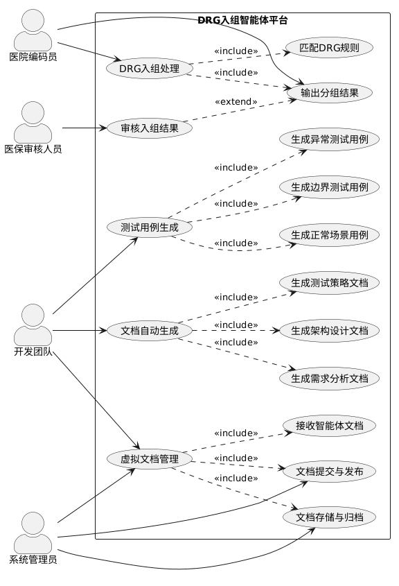
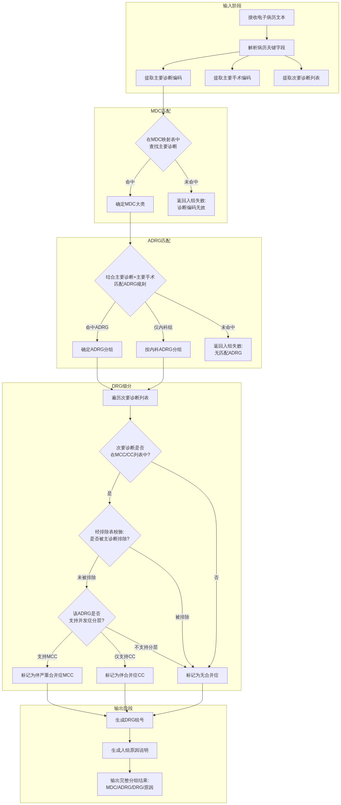
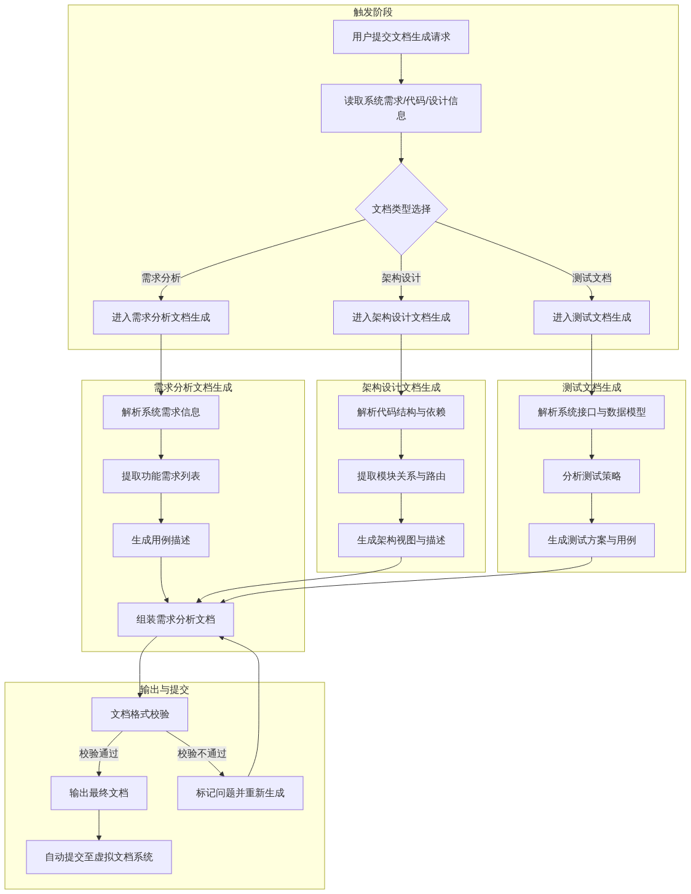
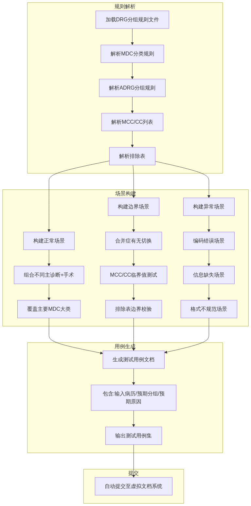
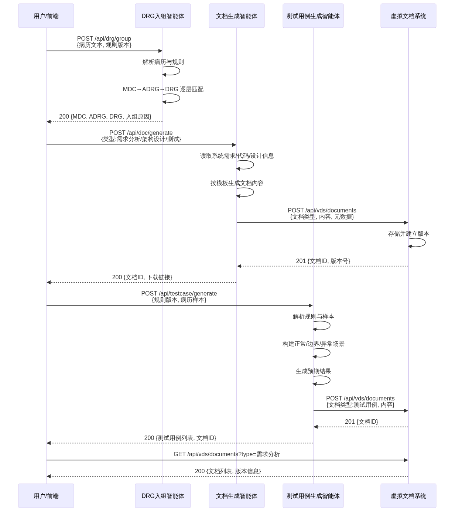
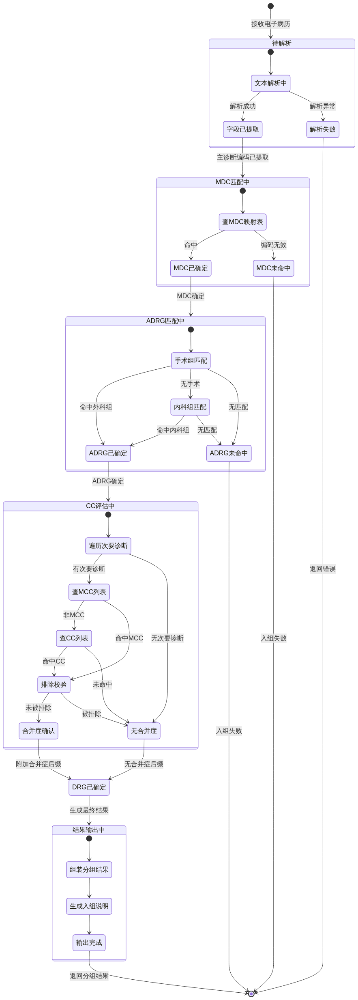
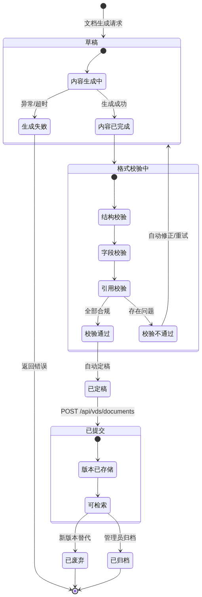

# 需求规格说明书

**文档编号**：SRS-DRG-AGENT-V1.0  
**版本号**：V1.0  
**编制日期**：2026年3月  
**文档状态**：正式发布  

## 一、引言

### 1.1 目的

本文档为《医保 DRG 入组智能体系统需求规格说明书》（Software Requirements Specification，SRS），旨在完整、准确地定义医保 DRG 入组智能体及其附属子系统（文档自动生成智能体、测试用例生成智能体、虚拟文档系统）的功能需求、性能约束与接口规范。

本说明书的编写服务于以下核心目的：

a. 为项目团队（需求分析师、架构设计师、开发工程师、测试工程师及配置管理员）提供统一的功能基线，确保各方对系统目标与边界有一致的理解；
b. 为后续的架构设计、模块开发、集成测试与系统验收提供可追溯的依据；
c. 作为项目干系人（包括课程指导教师、评审人员及团队内部管理层）评审系统完整性与可行性的正式参考文档。

预期读者及其使用方式如下：

a. **需求分析师与项目经理**：依据本文档跟踪需求实现状态，管理需求变更；
b. **架构设计师**：以功能需求为输入，设计系统整体结构与模块划分；
c. **开发工程师**：依据功能规格与接口定义进行编码实现；
d. **测试工程师**：依据用例描述与约束条件设计测试方案与测试用例；
e. **配置管理员**：依据文档版本与基线规划进行文档与代码的版本控制；
f. **课程评审人员**：依据本文档评估项目的需求分析完整性与工程规范性。

### 1.2 范围

#### 1.2.1 系统边界

本系统定位于一个基于大模型或智能体框架构造的医保 DRG 入组辅助工具链，涵盖从电子病历输入、DRG 规则匹配、分组结果输出，到相关工程文档自动生成与虚拟提交的全流程。系统由以下四个核心子系统构成：

a. **DRG 入组智能体**：接收电子病历文本与 DRG 分组规则，自动完成 MDC 分类、ADRG 分组及 DRG 细分组匹配，输出分组结果与入组原因说明；
b. **文档自动生成智能体**：基于系统需求、设计信息与代码，自动生成符合规范的需求分析文档、架构设计文档与测试文档；
c. **测试用例生成智能体**：根据 DRG 分组规则与病历样本，自动构建正常场景、边界场景与异常场景的测试用例；
d. **虚拟文档系统与提交**：提供虚拟文档存储与管理能力，自动接收各智能体生成的文档，完成文件存储与版本提交。

#### 1.2.2 主要功能

系统需实现以下核心功能：

a. 电子病历文本的解析与关键字段（主要诊断、次要诊断、主要手术操作等）的自动提取；
b. 基于《按病组（DRG）付费分组方案（2.0版）》规则的三层分组逻辑（MDC → ADRG → DRG）的自动执行；
c. MCC/CC 列表的匹配与排除表校验，支持合并症/并发症层级的自动判定；
d. DRG 分组结果的格式化输出，包含 DRG 组号、组名、入组路径及原因说明；
e. 基于系统元信息（需求、代码、设计）的工程文档自动生成，输出格式符合 IEEE 等标准规范；
f. 基于 DRG 规则与病历样本的测试用例自动生成，覆盖正常、边界与异常三类场景；
g. 虚拟文档系统的文件接收、存储、版本管理与提交能力。

#### 1.2.3 不包含的内容

本系统明确不包含以下功能与能力：

a. 真实的医院信息系统（HIS）或电子病历系统（EMR）的接口对接——系统以文本或结构化文件作为输入；
b. 真实医保结算与支付功能——系统仅输出分组结果，不涉及实际费用计算与医保理赔流程；
c. 生产环境级别的安全认证、权限管理与审计日志——本系统定位于教学与原型验证场景；
d. 自然语言病历的深度语义理解与歧义消解——病历输入假设为已结构化或半结构化的标准格式文本；
e. 多语言支持——系统仅处理中文病历与中文规则文件。

### 1.3 定义、缩写词和术语

本说明书中使用的专业术语、缩写词及其定义按字母顺序列于下表。

**表1-1：术语与缩写词定义表**

| 序号 | 术语/缩写 | 全称 | 定义 |
| :---: | :--- | :--- | :--- |
| 1 | ADRG | Adjacent Diagnosis Related Groups | 核心疾病诊断相关分组，DRG 三层分组结构中的第二层，根据主要诊断与主要手术操作进行划分 |
| 2 | CC | Complication or Comorbidity | 合并症或并发症，指在主要诊断之外存在的、对医疗资源消耗有中度影响的病症 |
| 3 | DRG | Diagnosis Related Groups | 按疾病诊断相关分组，将病例按“诊断 + 治疗方式 + 个体特征”划分到不同组别，每组对应一个打包付费标准 |
| 4 | ICD | International Classification of Diseases | 国际疾病分类标准，本系统涉及的诊断编码与手术编码均基于 ICD 编码体系 |
| 5 | MCC | Major Complication or Comorbidity | 严重合并症或并发症，指对医疗资源消耗有重度影响的病症，在 DRG 细分组中用于区分严重程度层级 |
| 6 | MDC | Major Diagnostic Category | 主要诊断大类，DRG 三层分组结构中的第一层，根据主要诊断所属的解剖系统或疾病类别进行划分 |
| 7 | SRS | Software Requirements Specification | 软件需求规格说明书，即本文档所属的文档类型，依据 IEEE 830 标准结构编写 |
| 8 | 主要诊断 | Principal Diagnosis | 经医疗机构确认的、导致患者本次住院主要原因的诊断，是 DRG 入组的核心判断依据 |
| 9 | 主要手术 | Principal Procedure | 患者住院期间接受的最核心的手术或操作，与主要诊断共同决定 ADRG 分组 |
| 10 | 次要诊断 | Secondary Diagnosis | 除主要诊断外，患者同时存在的其他诊断，用于判定是否存在合并症或并发症（CC/MCC） |
| 11 | 入组规则 | Grouping Rules | DRG 分组方案中定义的、用于将病例从诊断和手术信息映射到具体 DRG 组别的逻辑规则集合 |
| 12 | 排除表 | Exclusion List | DRG 规则中用于判定某个次要诊断是否应被主诊断排除、从而不纳入 CC/MCC 判定的对照表 |
| 13 | 智能体 | Agent | 基于大语言模型或智能体框架构建的、具备自主感知、推理与行动能力的软件模块，本项目中的各子系统均以智能体形式实现 |
| 14 | 病历样本 | Medical Record Sample | 用于测试用例生成的模拟电子病历数据，包含主要诊断、次要诊断、手术操作等字段 |

### 1.4 参考资料

本说明书的编写依据或参考了以下文献、标准与项目文件：

a. 国家医疗保障局.《按病组（DRG）付费分组方案（2.0版）》. 2025. —— 本系统 DRG 入组规则的核心依据，定义了 MDC 分类表、ADRG 分组表、MCC/CC 列表及排除规则；
b. IEEE Std 830-1998. *IEEE Recommended Practice for Software Requirements Specifications*. IEEE Computer Society, 1998. —— 本文档结构与内容组织的参考标准；
c. GB/T 8567-2006.《计算机软件文档编制规范》. 中华人民共和国国家质量监督检验检疫总局, 2006. —— 软件文档编制规范的国内标准参考；
d. GB/T 14396-2016.《疾病分类与代码》. 中华人民共和国国家卫生和计划生育委员会, 2016. —— 疾病诊断 ICD 编码的国内标准，用于病历诊断编码的规范性校验；
e. GB/T 38327-2019.《手术操作分类与代码》. 国家市场监督管理总局, 2019. —— 手术操作编码的国内标准，用于手术编码的规范性校验；
f. 华东理工大学自然语言处理与大数据挖掘实验室.《软件工程大作业——医保 DRG 入组智能体项目需求说明》. 2026. —— 本项目的总体目标与需求源文档。

## 二、总体描述

本章从宏观角度描述 DRG 入组智能体系统的整体功能、用户特征、约束条件与外部依赖关系，为后续具体需求分析提供全局视角。

### 2.1 系统整体功能

DRG 入组智能体系统是一个基于大语言模型（LLM）与智能体框架构建的医疗信息自动化平台。系统围绕"按疾病诊断相关分组（DRG）入组"这一核心业务场景，将入组匹配、文档生成、测试用例构建及文档管理四个环节全部交由智能体协同完成，实现从电子病历输入到 DRG 分组结果输出、从需求分析到测试文档全流程的自动化闭环。

系统的高层能力可概括为以下四个方面：

（a）**DRG 智能入组**：接收电子病历文本（含主要诊断、次要诊断、手术操作等临床信息）与 DRG 分组规则文件，自动完成"主要诊断大类（MDC）→ 核心分组（ADRG）→ 细分组（DRG）"三层匹配，输出 DRG 组号、组名及入组原因说明。系统须精确处理合并症/严重合并症（CC/MCC）判定逻辑，包括排除表校验与并发症分层。

（b）**文档自动生成**：基于系统需求描述、设计信息与源代码，自动生成符合软件工程规范的需求分析文档（含系统功能需求与用例）、架构设计文档（含整体结构与模块关系）以及测试文档（含测试策略与测试方案），并将生成的文档自动提交至虚拟文档系统。

（c）**测试用例智能生成**：根据 DRG 分组规则与病历样本，自动构建三类测试场景——正常场景（不同诊断与手术组合）、边界场景（合并症有无等临界条件）、异常场景（编码错误、关键信息缺失等），并输出结构化的测试用例集。

（d）**虚拟文档管理与提交**：构建一个轻量级虚拟文档系统，提供文档接收、存储、版本管理等功能，作为各智能体产出物的统一汇聚与追溯平台。

系统的整体用例模型如图 2-1 所示，展示了各参与者与系统能力之间的对应关系。

**图2-1：系统整体用例图**



### 2.2 用户特征

本系统的预期用户为软件工程团队中的各类角色，各自具有不同的技术水平与使用模式，具体如下：

（a）**需求分析师（可兼任项目经理）**。需求分析师负责定义系统需求边界，主导 DRG 入组规则的梳理与验证。其典型操作包括：向文档生成智能体输入系统需求描述，审阅自动生成的需求分析文档；向 DRG 入组智能体提供病历样本以验证入组逻辑正确性。该角色需具备医疗信息化领域基础知识与 ICD 编码常识，但对智能体内部实现无需深入了解。技能等级：中级至高级业务分析能力。

（b）**架构师**。架构师负责系统整体技术方案设计与模块划分。其典型操作包括：向文档生成智能体提供架构设计参数与约束，审阅并修订自动生成的架构设计文档；定义智能体之间的接口契约与数据流。该角色需精通大模型应用框架（如 LangChain、AutoGPT 等）、分布式系统设计与 RESTful API 规范。技能等级：高级技术架构能力。

（c）**程序员**。程序员负责各智能体的编码实现与单元测试。其典型操作包括：基于架构设计文档实现 DRG 入组逻辑、文档生成逻辑、测试用例生成逻辑；利用虚拟文档系统进行代码与文档的协同管理。该角色需掌握 Python 或 TypeScript 开发语言，熟悉 LLM API 调用与提示工程（Prompt Engineering）。技能等级：中级至高级开发能力。

（d）**测试人员**。测试人员负责系统集成测试与验收测试。其典型操作包括：向测试用例生成智能体输入 DRG 规则与病历样本，获取自动生成的测试用例集并执行测试；对 DRG 入组结果进行对照验证。该角色需具备软件测试方法论基础与医疗编码校验经验。技能等级：中级测试工程能力。

（e）**配置管理员**。配置管理员负责虚拟文档系统的运维与版本控制。其典型操作包括：管理文档的存储结构、版本号与访问权限；确保各智能体生成的文档按规范格式提交并归档。该角色需掌握版本控制系统（如 Git）与文档管理流程。技能等级：初级至中级配置管理能力。

各用户角色的特征汇总如表 2-1 所示。

**表2-1：用户角色特征汇总**

| 用户角色 | 技术等级 | 典型操作 | 核心技能要求 |
| --- | --- | --- | --- |
| 需求分析师/项目经理 | 中高级 | 需求定义、入组规则验证、文档审阅 | 医疗信息化知识、ICD编码常识 |
| 架构师 | 高级 | 技术方案设计、接口定义、文档审阅 | 大模型框架、分布式系统设计 |
| 程序员 | 中高级 | 智能体实现、单元测试、文档协同 | Python/TypeScript、LLM API、提示工程 |
| 测试人员 | 中级 | 测试用例执行、入组结果验证 | 测试方法论、医疗编码校验 |
| 配置管理员 | 初/中级 | 文档存储管理、版本控制、权限管理 | Git、文档管理流程 |

### 2.3 约束条件

本系统的设计、开发与运行受到以下强制性约束条件的限制：

（a）**技术选型约束**。系统须基于大语言模型（LLM）或智能体框架（如 LangChain、AutoGPT、Semantic Kernel 等）进行构建，不得使用传统规则引擎单独实现 DRG 入组逻辑。智能体间的通信与编排须采用标准化接口协议。

（b）**DRG 规则版本约束**。DRG 入组规则须以国家医疗保障局发布的《按病组（DRG）付费分组方案（2.0 版）》为唯一依据，不得混用其他版本或自定义规则。规则中包含的 MDC 分类表、ADRG 分组表、MCC/CC 列表及排除表须完整加载。

（c）**开发周期与交付约束**。项目整体交付时间为 2026 年 3 月（华东理工大学 2025–2026 学年第二学期），团队规模为 4 至 5 人。在有限时间与人力的约束下，须优先保证核心功能（DRG 入组、测试用例生成、文档生成）的完整实现与验证。

（d）**运行平台约束**。系统须能够在通用计算环境（个人计算机或云服务器）上运行，支持 Windows / Linux / macOS 操作系统。虚拟文档系统须支持本地文件存储，不强制依赖外部数据库或云存储服务。

（e）**输入数据格式约束**。电子病历输入须包含至少以下字段：主要诊断编码及名称、次要诊断编码及名称（可多个）、主要手术操作编码及名称。编码体系须遵循 ICD-10（国际疾病分类第十版）与 ICD-9-CM-3（手术操作分类）标准。

（f）**文档输出规范约束**。自动生成的需求分析、架构设计与测试文档须符合软件工程文档规范（参考 IEEE 830 标准及项目自定义模板），文档格式须采用 Markdown，并支持转换为 PDF 等可交付格式。

（g）**集成与协作约束**。各智能体之间的数据交换须通过虚拟文档系统完成，不得绕过文档系统进行直接数据传递。虚拟文档系统须提供统一的文档提交接口与版本追溯能力。

### 2.4 假设与依赖

系统的正常运行依赖于以下外部条件与假设前提，若其中任意一项不满足，系统功能可能受到不同程度的影响：

（a）**DRG 规则文件的可用性与完整性假设**。假设《按病组（DRG）付费分组方案（2.0 版）》规则文件以结构化或半结构化格式（如 JSON、XML 或 CSV）提供，且内容完整、编码准确。若规则文件仅以 PDF 或纸质形式提供，则须额外的 OCR 或结构化提取前置处理。

（b）**电子病历数据质量假设**。假设输入的电子病历文本中，诊断编码与手术编码的格式符合 ICD-10 与 ICD-9-CM-3 标准，且编码与名称之间存在正确的对应关系。若编码缺失、编码格式错误或编码与名称不匹配，系统应具备一定的容错与提示能力，但入组结果的准确性可能下降。

（c）**大语言模型可用性依赖**。系统依赖于外部大语言模型 API（如 OpenAI GPT 系列、阿里云通义千问等）或本地部署模型进行语义理解、逻辑推理与文本生成。若 API 服务不可用、响应延迟过高或调用配额不足，系统的核心功能将无法正常执行。

（d）**智能体框架稳定性依赖**。系统依赖选定的智能体框架（如 LangChain）提供多智能体编排、工具调用与记忆管理能力。若框架存在重大缺陷或版本不兼容问题，可能影响智能体的协作效率与任务执行可靠性。

（e）**ICD 编码标准的普遍适用性假设**。假设项目所使用的 ICD-10 与 ICD-9-CM-3 编码版本与 DRG 2.0 版规则文件中的编码版本一致。若存在版本不匹配（如使用 ICD-11 编码），则入组匹配逻辑须进行适配，否则将产生错误的分组结果。

（f）**虚拟文档系统的单实例运行假设**。假设在项目范围内，虚拟文档系统以单实例方式运行，不涉及分布式一致性、跨节点同步等复杂场景。文档并发提交量较低（同一时间不超过 5 个请求），存储容量需求在 GB 级别以内。

（g）**团队技能假设**。假设团队成员具备基本的 Python 编程能力、对大模型 API 调用有一定了解，且至少有一人熟悉软件工程文档规范（如 IEEE 830）。若团队成员需要从零学习相关技术栈，开发进度可能受到影响。

## 三、具体需求

### 3.1 功能需求

本节按系统四大模块组织功能需求，每条需求使用 FR-{模块缩写}-{序号} 编号，确保可独立测试与验证。

#### 3.1.1 DRG 入组核心流程

DRG 入组是本系统的核心业务能力。整体流程分为四个阶段：病历解析、MDC 匹配、ADRG 匹配、DRG 细分（含 CC/MCC 评估）。以下活动图展示完整流程中各阶段的执行顺序与决策分支。

**图3-1：DRG 入组核心流程活动图**



---

**(1) FR-DRG-001：电子病历解析**

**功能描述**：系统接收电子病历文本后，自动提取关键字段，包括主要诊断编码、主要手术操作编码、次要诊断编码列表及其他辅助信息（如性别、年龄、出院方式等），为后续入组匹配提供结构化数据。

**输入**：
a. 电子病历文本（自由文本或半结构化格式）
b. 病历元数据（就诊号、入院日期、出院日期等）

**处理流程**：
a. 对病历文本进行分词与实体识别，定位诊断和手术相关段落
b. 提取主要诊断编码（ICD-10 格式），若文本中未明确标注"主要诊断"，则取第一条诊断作为默认
c. 提取主要手术操作编码（ICD-9-CM-3 格式），若无手术记录则标记为内科病例
d. 提取所有次要诊断编码，生成次要诊断列表
e. 校验编码格式合法性（ICD-10 编码规则：首字母 + 两位数字 + 可选分隔符 + 扩展位）

**输出**：结构化的病历字段对象，含主要诊断编码、主要手术编码（可为空）、次要诊断编码列表、患者基本信息

**异常处理**：
a. 无法提取任何诊断编码时，返回 FR-DRG-001-E01："病历中未检测到有效诊断编码，请检查输入"
b. 编码格式异常时，记录告警日志并尝试模糊匹配，若仍无法匹配则返回 FR-DRG-001-E02："诊断编码格式不合法"

---

**(2) FR-DRG-002：MDC 大类匹配**

**功能描述**：根据主要诊断编码在 MDC 映射表中查找对应的大类，MDC 分类遵循《按病组（DRG）付费分组方案（2.0版）》定义。

**输入**：主要诊断编码（ICD-10）

**处理流程**：
a. 将主要诊断编码与 MDC 映射表进行精确匹配
b. 若精确匹配失败，尝试前缀匹配（去除小数点后扩展位）
c. 匹配成功则返回 MDC 编码与名称（如 MDCB — 神经系统疾病及功能障碍）
d. 记录匹配路径用于入组原因追溯

**输出**：MDC 编码与名称

**异常处理**：
a. 诊断编码不在任何 MDC 范围内时，返回 FR-DRG-002-E01："主要诊断编码不在已知 MDC 分类范围内，入组失败"
b. 诊断编码对应多个 MDC 时（交叉分类），按规则优先级选择并记录告警

---

**(3) FR-DRG-003：ADRG 核心分组匹配**

**功能描述**：结合主要诊断和主要手术操作，在 ADRG 规则表中匹配核心分组。外科组以手术为核心，内科组以诊断为核心。

**输入**：
a. 主要诊断编码
b. 主要手术编码（可为空）
c. 已确定的 MDC

**处理流程**：
a. 若存在主要手术编码，优先在外科 ADRG 表中匹配（手术 + 诊断联合条件）
b. 若无手术编码或外科匹配失败，转向内科 ADRG 表（仅诊断条件）
c. 在所属 MDC 范围内查找，限制跨 MDC 误匹配
d. 匹配成功则返回 ADRG 编码与名称（如 BB1 — 神经系统复合手术组）

**输出**：ADRG 编码与名称、分组路径（外科/内科）

**异常处理**：
a. 既无手术又无匹配内科组时，返回 FR-DRG-003-E01："无法匹配任何 ADRG 分组"
b. 手术编码存在但不在系统中时，降级为内科匹配并记录告警

---

**(4) FR-DRG-004：MCC/CC 合并症评估与 DRG 细分**

**功能描述**：在 ADRG 已确定的基础上，遍历次要诊断列表，依次判定是否存在严重合并症或并发症（MCC）或一般合并症或并发症（CC），并经过排除表校验后最终确定 DRG 细分组。

**输入**：
a. 次要诊断编码列表
b. 已确定的 ADRG 编码
c. MCC/CC 列表与排除表（来自分组方案 2.0 版）

**处理流程**：
a. 遍历次要诊断列表，逐一在 MCC 列表中查找
b. 命中 MCC 的诊断，进入排除表校验：检查该 MCC 是否被主要诊断或当前 ADRG 所排除
c. 若未被排除，且当前 ADRG 支持 MCC 分层，则标记为"伴严重合并症或并发症"
d. 若未命中 MCC，继续在 CC 列表中查找，同样经过排除校验
e. 若未命中任何 CC/MCC 或全部被排除，标记为"无合并症"
f. 根据合并症标记附加 DRG 后缀（如 BB11 为伴 MCC，BB13 为无合并症）

**输出**：最终 DRG 组号、组名、合并症评估详情

**异常处理**：
a. ADRG 不支持任何合并症分层时，直接返回基础 DRG 组号，并说明"该 ADRG 不支持并发症细分"
b. 次要诊断列表为空时，直接标记为"无合并症"，不进入 MCC/CC 遍历

---

**(5) FR-DRG-005：入组结果输出**

**功能描述**：汇总 MDC、ADRG、DRG 三级分组结果，生成结构化的入组输出，包含组号、组名、入组路径及原因说明。

**输入**：MDC、ADRG、DRG 确定结果及中间匹配记录

**处理流程**：
a. 组装 JSON 格式的分组结果对象
b. 生成人类可读的入组原因说明文本（如"主要诊断 A01.002+G01* 进入 MDCB → 主要手术 38.1000x002 命中 BB1 → 次要诊断 J96.0 属于 MCC 且未被排除 → 最终入组 BB11"）
c. 附加匹配置信度评分（精确匹配/模糊匹配/降级匹配）

**输出**：
a. DRG 组号（如 BB11）
b. 组名（如"神经系统复合手术，伴严重合并症或并发症"）
c. MDC 编码与名称
d. ADRG 编码与名称
e. 入组原因说明
f. 匹配置信度

**异常处理**：任何前置阶段失败时，本阶段不执行，直接传递上游错误信息。

---

#### 3.1.2 文档自动生成流程

文档自动生成智能体负责根据系统需求、代码和设计信息自动生成符合规范的需求分析文档、架构设计文档和测试文档，并自动提交至虚拟文档系统。

**图3-2：文档自动生成流程活动图**



---

**(6) FR-DOC-001：需求分析文档生成**

**功能描述**：基于系统需求信息（用户故事、功能列表、约束条件等），自动生成符合 IEEE 830 标准的需求规格说明书。

**输入**：
a. 系统需求信息（结构化或半结构化格式）
b. 文档模板配置（章节结构、格式要求）

**处理流程**：
a. 解析输入的需求信息，提取功能需求、非功能需求、接口需求等类别
b. 按 IEEE 830 模板逐章节填充内容：引言、总体描述、具体需求、附录
c. 自动生成用例描述和功能编号
d. 生成必要的图表（活动图、状态图等）
e. 执行文档格式校验（结构完整性、字段一致性、引用有效性）

**输出**：完整的需求规格说明书文档（Markdown/PDF 格式）

**异常处理**：
a. 输入信息不足以填充必填章节时，标注"待确认"并记录缺失项清单
b. 格式校验不通过时，自动修正并重新生成，最多重试 3 次

---

**(7) FR-DOC-002：架构设计文档生成**

**功能描述**：基于系统代码结构、模块依赖、部署配置等信息，自动生成架构设计文档。

**输入**：
a. 系统代码目录结构与依赖关系
b. 模块路由与数据模型
c. 部署配置文件

**处理流程**：
a. 扫描代码仓库，提取目录结构、模块依赖关系
b. 解析接口定义文件，提取 API 路由和参数
c. 读取数据模型定义，生成实体关系图
d. 按架构文档模板组织：架构视图、模块关系、部署方案、技术选型
e. 生成架构图和部署拓扑图

**输出**：完整的架构设计文档（含架构视图、模块描述、部署方案）

**异常处理**：
a. 代码仓库不可访问时，返回 FR-DOC-002-E01 并提示检查路径与权限
b. 部分模块依赖解析失败时，标注"待确认"继续生成其余部分

---

**(8) FR-DOC-003：测试文档生成**

**功能描述**：基于系统接口定义、数据模型和现有测试用例，自动生成测试文档（含测试策略、测试方案、测试用例）。

**输入**：
a. 系统接口定义（API 规范）
b. 数据模型定义
c. 现有测试文件（可选）
d. CI/CD 配置（可选）

**处理流程**：
a. 分析接口定义，确定测试范围和优先级
b. 制定测试策略：单元测试、集成测试、端到端测试的覆盖目标
c. 为每个 API 端点生成正向和反向测试方案
d. 组装测试文档（策略 + 方案 + 用例矩阵）

**输出**：完整的测试文档

**异常处理**：
a. 接口定义不完整时，标注"待补充"并基于已有信息生成可生成部分

---

#### 3.1.3 测试用例生成流程

测试用例生成智能体根据 DRG 分组规则自动构建测试场景并生成三类测试用例：正常场景、边界场景和异常场景。

**图3-3：测试用例生成流程活动图**



---

**(9) FR-TC-001：正常场景测试用例生成**

**功能描述**：根据 DRG 分组规则，组合不同诊断编码与手术编码，自动生成覆盖各主要 MDC 和 ADRG 的正常入组测试用例。

**输入**：
a. DRG 分组规则（MDC 映射表、ADRG 规则表）
b. 病历样本库（可选，用于参考真实编码组合）

**处理流程**：
a. 遍历 MDC 大类列表，每个 MDC 选取 2–3 个典型诊断编码
b. 对每个诊断编码，选择合适的典型手术编码形成外科测试对
c. 同时为每个诊断生成无手术的内科测试对
d. 对每个测试对，通过 DRG 入组引擎计算预期分组结果
e. 生成结构化测试用例：{输入病历, 预期 MDC, 预期 ADRG, 预期 DRG}

**输出**：正常场景测试用例集（≥ 50 条用例，覆盖所有 MDC）

**异常处理**：
a. 某些 MDC 缺乏典型手术组合时，仅生成内科用例并标注

---

**(10) FR-TC-002：边界场景测试用例生成**

**功能描述**：针对合并症判定逻辑，自动生成边界测试用例，覆盖 MCC/CC 有无切换、排除表边界、并发症分层边界等场景。

**输入**：
a. MCC/CC 列表与排除表
b. ADRG 分层支持配置

**处理流程**：
a. 选取同一 ADRG 的基础用例，分别附加 MCC 诊断、CC 诊断、无合并症三种情况
b. 构造"MCC 被排除表排除"的边界场景，验证排除逻辑正确性
c. 构造"ADRG 不支持分层"的场景，验证降级处理
d. 构造"多个次要诊断同时命中 MCC 和 CC"的优先级测试

**输出**：边界场景测试用例集（≥ 20 条）

**异常处理**：若某个 ADRG 无可用分层配置，跳过该 ADRG 的边界测试并记录

---

**(11) FR-TC-003：异常场景测试用例生成**

**功能描述**：自动生成异常输入场景的测试用例，包括编码错误、信息缺失、格式不规范等情况，验证系统的容错能力。

**输入**：DRG 分组规则与系统错误码定义

**处理流程**：
a. 构造编码错误场景：无效 ICD-10 编码、不存在的编码、编码格式错误
b. 构造信息缺失场景：无主要诊断、无次要诊断、无手术记录（对外科 ADRG）
c. 构造格式不规范场景：编码含特殊字符、大小写混用、分隔符异常
d. 对每个异常场景，定义预期错误码或预期行为

**输出**：异常场景测试用例集（≥ 15 条）

**异常处理**：无额外异常处理，异常场景本身即为测试目标

---

#### 3.1.4 虚拟文档系统功能

**(12) FR-VDS-001：文档接收与存储**

**功能描述**：接收其他智能体生成的文档，进行格式校验后存储，并建立版本记录。

**输入**：
a. 文档内容（Markdown/JSON 格式）
b. 文档元数据（类型、版本号、生成时间、来源智能体标识）

**处理流程**：
a. 校验文档格式合法性（Markdown 结构完整性检查）
b. 分配唯一文档 ID（UUID v4）
c. 提取文档摘要和索引信息
d. 存储文档内容至持久化存储
e. 建立版本记录（版本号、时间戳、变更摘要）
f. 返回文档 ID 与版本信息

**输出**：201 Created，含文档 ID 与版本号

**异常处理**：
a. 格式校验失败时返回 400 及具体错误描述
b. 存储空间不足时返回 507 Insufficient Storage

---

**(13) FR-VDS-002：文档检索与查询**

**功能描述**：支持按文档类型、版本、时间范围等条件检索已存储的文档。

**输入**：查询参数（文档类型、版本范围、时间范围、关键词）

**处理流程**：
a. 解析查询参数，构建查询条件
b. 在文档索引中执行全文检索或元数据过滤
c. 返回匹配的文档列表（含摘要和版本信息）
d. 支持分页和排序

**输出**：匹配文档列表（含文档 ID、类型、版本、摘要、创建时间）

**异常处理**：
a. 查询参数无效时返回 400
b. 无匹配结果时返回 200 及空列表

---

**(14) FR-VDS-003：文档下载与导出**

**功能描述**：支持按文档 ID 和版本号下载原始文档或导出为 PDF 格式。

**输入**：文档 ID、版本号（可选，默认最新版本）、导出格式（Markdown/PDF）

**处理流程**：
a. 根据文档 ID 和版本号定位目标文档
b. 若格式为 Markdown，直接返回原始内容
c. 若格式为 PDF，调用渲染引擎将 Markdown 转换为 PDF
d. 设置 Content-Disposition 头，触发浏览器下载

**输出**：文件流（Markdown 文本或 PDF 二进制流）

**异常处理**：
a. 文档 ID 不存在时返回 404
b. 版本号不存在时返回 404 并列出可用版本

---

**(15) FR-VDS-004：文档版本管理**

**功能描述**：对同一文档的多次提交自动建立版本链，支持版本对比和历史回溯。

**输入**：
a. 文档 ID
b. 新版本文档内容
c. 变更说明

**处理流程**：
a. 查找该文档 ID 的当前最新版本
b. 执行版本号递增（主版本或次版本，按变更程度自动判定）
c. 存储新版本并链接至前一版本
d. 生成版本差异摘要（新增/修改/删除章节数量）

**输出**：新版本号、版本差异摘要

**异常处理**：
a. 新版本内容与前一版本完全相同时，返回 200 并提示"无变更，版本未递增"

---

### 3.2 性能需求

**(1) PR-001：DRG 入组响应时间**

单次 DRG 入组请求（含病历解析到结果输出全过程）的响应时间应在以下范围内：
a. 正常场景：95% 的请求在 2 秒内完成
b. 复杂场景（次要诊断 ≥ 10 条）：95% 的请求在 5 秒内完成
c. 超时阈值：单次请求最长执行时间为 30 秒，超时返回 503

**(2) PR-002：文档生成吞吐量**

文档自动生成智能体应满足：
a. 单份文档生成时间 ≤ 60 秒（含格式校验与图表生成）
b. 支持同时处理 ≥ 5 个文档生成任务（并发能力）

**(3) PR-003：虚拟文档系统吞吐量**

虚拟文档系统应满足：
a. 文档存储写入延迟 ≤ 500 毫秒（不含大文件 PDF 渲染）
b. 文档检索响应时间 ≤ 300 毫秒（索引查询 + 结果组装）
c. 支持 ≥ 100 并发读请求

**(4) PR-004：资源占用**

系统在生产环境下：
a. 内存占用 ≤ 2 GB（单实例）
b. CPU 持续使用率 ≤ 70%（正常负载下）
c. 磁盘存储：单文档 ≤ 10 MB（含渲染后的 PDF），总存储容量支持 ≥ 10,000 份文档

---

### 3.3 安全性需求

**(1) SR-001：身份认证**

a. 所有 API 端点均需通过基于 Token 的身份认证（JWT 或 API Key）
b. Token 有效期 ≤ 24 小时，支持刷新机制
c. 虚拟文档系统的管理接口（删除、归档）需额外管理员权限

**(2) SR-002：权限控制**

a. 文档生成智能体仅能读取系统需求和代码信息，不可写入原始代码仓库
b. 测试用例生成智能体仅能读取 DRG 规则和病历样本，不可读取患者隐私信息
c. 虚拟文档系统的文档写入权限仅授予已注册的智能体，每个智能体有独立的 API Key

**(3) SR-003：数据加密**

a. 所有 API 通信必须通过 HTTPS/TLS 1.2 或更高版本加密
b. 存储的病历文本和分组结果，其敏感字段（患者姓名、身份证号）须经脱敏处理或 AES-256 加密存储

**(4) SR-004：审计日志**

a. 所有文档提交、查询、下载操作须记录审计日志，包含：操作时间、操作者（智能体标识）、操作类型、目标文档 ID
b. 审计日志保留期 ≥ 180 天，不可篡改

---

### 3.4 可靠性需求

**(1) RR-001：系统可用性**

a. 系统整体可用性目标为 99.5%（月度统计，不含计划内维护窗口）
b. 计划内维护时间窗口不超每月 4 小时，且提前 48 小时通知

**(2) RR-002：故障恢复**

a. 单节点故障后，服务应在 60 秒内自动切换至备用节点（若部署为高可用模式）
b. 数据持久化存储应支持每日自动备份，备份保留 ≥ 30 天
c. 从备份恢复完整系统的 RTO（恢复时间目标） ≤ 4 小时

**(3) RR-003：容错能力**

a. DRG 入组过程中，单条规则匹配失败不影响其他规则匹配，返回部分结果并标注未匹配项
b. 文档生成过程中，单个章节生成失败不影响其他章节，最终文档标注"部分章节待确认"
c. 虚拟文档系统存储操作失败时，自动重试 3 次（指数退避），最终失败则返回明确错误码

---

### 3.5 可维护性需求

**(1) MR-001：日志与监控**

a. 所有智能体须输出结构化日志（JSON 格式），至少包含：时间戳、日志级别、模块名、操作类型、耗时、结果状态
b. 日志级别分为 DEBUG、INFO、WARN、ERROR，生产环境默认 INFO
c. 提供健康检查端点 `/health`，返回各模块运行状态和依赖服务连通性

**(2) MR-002：模块解耦**

a. 四大模块（DRG 入组、文档生成、测试用例生成、虚拟文档系统）之间仅通过 RESTful API 通信，不共享数据库
b. 每个模块可独立部署、独立扩缩容、独立升级
c. DRG 分组规则应从代码中抽离为独立的配置文件或数据库表，支持热更新而不需重启服务

**(3) MR-003：配置管理**

a. 所有环境相关配置（数据库连接、API 端点、密钥等）通过环境变量或配置中心注入，禁止硬编码
b. 配置变更须有版本记录，支持回滚

**(4) MR-004：代码与文档一致性**

a. API 接口定义须采用 OpenAPI 3.0 规范编写，作为接口文档和客户端代码生成的单一事实来源
b. 核心算法（DRG 入组规则引擎）须有对应的设计文档和行内注释

---

### 3.6 外部接口需求

#### 3.6.1 用户界面

本系统为纯 API 服务架构，不提供图形用户界面。用户（或上层应用）通过 RESTful API 与各智能体交互。若后续需要可视化操作界面，应另行定义 UI 需求。

#### 3.6.2 软件接口

各智能体之间及与外部系统之间通过 RESTful API 通信，数据格式统一为 JSON。以下时序图展示关键 API 的调用流程。

**图3-4：智能体间 API 交互时序图**



---

**表3-1：DRG 入组智能体 API**

| 接口名称 | Method | Endpoint | 说明 |
| --------- | -------- | ---------- | ------ |
| DRG 入组 | POST | `/api/v1/drg/group` | 提交病历文本进行 DRG 分组 |
| 规则查询 | GET | `/api/v1/drg/rules` | 查询当前生效的分组规则版本 |
| 健康检查 | GET | `/api/v1/drg/health` | 返回模块运行状态 |

**POST `/api/v1/drg/group` 请求体**：

```json
{
  "medical_record": "主要诊断：A01.002+G01*（伤寒性脑膜炎）\n次要诊断：J96.0（急性呼吸衰竭）\n主要手术：38.1000x002（动脉内膜剥脱术）",
  "rule_version": "2.0",
  "options": {
    "include_reasoning": true,
    "confidence_threshold": 0.8
  }
}
```

**POST `/api/v1/drg/group` 响应体**：

```json
{
  "code": 200,
  "data": {
    "mdc": { "code": "MDCB", "name": "神经系统疾病及功能障碍" },
    "adrg": { "code": "BB1", "name": "神经系统复合手术组" },
    "drg": { "code": "BB11", "name": "神经系统复合手术，伴严重合并症或并发症" },
    "reasoning": "主诊断 A01.002+G01* → MDCB → 主手术 38.1000x002 命中 BB1 → 次要诊断 J96.0 属 MCC 且未被排除 → BB11",
    "confidence": 0.98,
    "cc_assessment": { "level": "MCC", "diagnosis": "J96.0", "excluded": false }
  }
}
```

---

**表3-2：文档生成智能体 API**

| 接口名称 | Method | Endpoint | 说明 |
| --------- | -------- | ---------- | ------ |
| 文档生成 | POST | `/api/v1/doc/generate` | 提交生成请求 |
| 任务状态 | GET | `/api/v1/doc/tasks/{task_id}` | 查询异步任务进度 |
| 文档预览 | GET | `/api/v1/doc/preview/{doc_id}` | 预览已生成文档 |
| 健康检查 | GET | `/api/v1/doc/health` | 返回模块运行状态 |

**POST `/api/v1/doc/generate` 请求体**：

```json
{
  "doc_type": "requirement_spec",
  "source_info": {
    "requirements": ["..."],
    "code_repo": "/path/to/repo",
    "design_docs": ["..."]
  },
  "template_version": "ieee830",
  "output_format": "markdown"
}
```

**POST `/api/v1/doc/generate` 响应体**：

```json
{
  "code": 202,
  "data": {
    "task_id": "task-abc123",
    "status": "processing",
    "estimated_completion": "2026-03-15T10:05:00Z"
  }
}
```

---

**表3-3：测试用例生成智能体 API**

| 接口名称 | Method | Endpoint | 说明 |
| --------- | -------- | ---------- | ------ |
| 用例生成 | POST | `/api/v1/testcase/generate` | 提交测试用例生成请求 |
| 任务状态 | GET | `/api/v1/testcase/tasks/{task_id}` | 查询异步任务进度 |
| 健康检查 | GET | `/api/v1/testcase/health` | 返回模块运行状态 |

**POST `/api/v1/testcase/generate` 请求体**：

```json
{
  "rule_version": "2.0",
  "sample_records": [
    { "diag_main": "A01.002+G01*", "diag_secondary": ["J96.0"], "surgery": "38.1000x002" }
  ],
  "scenario_types": ["normal", "boundary", "exception"],
  "target_count": { "normal": 50, "boundary": 20, "exception": 15 }
}
```

---

**表3-4：虚拟文档系统 API**

| 接口名称 | Method | Endpoint | 说明 |
| --------- | -------- | ---------- | ------ |
| 文档提交 | POST | `/api/v1/vds/documents` | 提交新文档 |
| 文档列表 | GET | `/api/v1/vds/documents` | 检索文档列表 |
| 文档详情 | GET | `/api/v1/vds/documents/{doc_id}` | 获取文档详情 |
| 文档下载 | GET | `/api/v1/vds/documents/{doc_id}/download` | 下载文档文件 |
| 版本列表 | GET | `/api/v1/vds/documents/{doc_id}/versions` | 查询文档版本历史 |
| 版本对比 | GET | `/api/v1/vds/documents/{doc_id}/diff` | 对比两个版本差异 |
| 健康检查 | GET | `/api/v1/vds/health` | 返回模块运行状态 |

**POST `/api/v1/vds/documents` 请求体**：

```json
{
  "doc_type": "requirement_spec",
  "title": "医保DRG入组智能体需求规格说明书",
  "content": "# 需求规格说明书\n\n...",
  "metadata": {
    "author": "doc-gen-agent",
    "version": "1.0.0",
    "tags": ["DRG", "需求分析"]
  }
}
```

**POST `/api/v1/vds/documents` 响应体**：

```json
{
  "code": 201,
  "data": {
    "doc_id": "550e8400-e29b-41d4-a716-446655440000",
    "version": "1.0.0",
    "created_at": "2026-03-15T10:00:00Z",
    "storage_path": "/docs/2026/03/550e8400-e29b-41d4-a716-446655440000-v1.0.0.md"
  }
}
```

---

**(1) 通信协议与数据格式约定**

a. 所有 API 基于 HTTP/1.1 协议，使用 RESTful 风格
b. 请求与响应 Content-Type 为 `application/json; charset=utf-8`
c. 字符编码统一为 UTF-8
d. 所有响应体包含统一外层结构：`{ "code": <HTTP状态码>, "data": <业务数据>, "message": "<可选的提示信息>" }`
e. 认证方式：请求头 `Authorization: Bearer <token>`（JWT 格式）

**(2) 错误响应格式**

```json
{
  "code": 400,
  "message": "诊断编码格式不合法: A01.002+G01*",
  "error_code": "FR-DRG-001-E02",
  "timestamp": "2026-03-15T10:00:00Z"
}
```

---

### 3.7 业务状态模型

本节描述系统核心业务对象的状态生命周期和转移规则。

#### 3.7.1 DRG 入组状态模型

DRG 入组请求从接收到返回结果，经历解析、MDC 匹配、ADRG 匹配、CC 评估、结果输出等多个状态。以下状态图描述了完整的生命周期。

**图3-5：DRG 入组状态转移图**



**状态说明**：

**(1) 待解析**：系统已接收病历文本但尚未开始处理。触发条件：POST 请求到达 `/api/v1/drg/group`。

**(2) 文本解析中**：正在对病历文本进行分词、实体识别和字段提取。若解析异常（如文本为空、无法识别编码）则进入"解析失败"终态。

**(3) 字段已提取**：病历关键字段已成功提取，进入 MDC 匹配阶段。

**(4) MDC 匹配中**：根据主要诊断编码查找 MDC 映射表。若命中则进入"MDC 已确定"；若编码无效则进入"MDC 未命中"终态。

**(5) ADRG 匹配中**：结合主要诊断和手术操作进行外科/内科分组匹配。若命中则进入"ADRG 已确定"；若完全无匹配则进入"ADRG 未命中"终态。

**(6) CC 评估中**：遍历次要诊断列表，依次判定 MCC/CC 并校验排除表。根据评估结果分别进入"合并症确认"（命中且未被排除）或"无合并症"子状态。

**(7) DRG 已确定**：最终 DRG 组号已确定，进入结果输出阶段。

**(8) 结果输出中**：组装完整的分组结果 JSON 对象并生成入组原因说明。

**(9) 输出完成**：响应已返回给调用方，请求生命周期结束。

---

#### 3.7.2 文档生命周期状态模型

文档从生成请求到最终归档/废弃，经历草稿、校验、定稿、提交、存档等阶段。

**图3-6：文档生命周期状态图**



**状态说明**：

**(1) 草稿**：文档生成请求已提交，内容正在由智能体生成。子状态"内容生成中"→"内容已完成"。若生成异常则进入"生成失败"终态。

**(2) 格式校验中**：对已生成的文档内容进行结构校验、字段校验和引用校验。若全部合规则进入"校验通过"；若存在问题则回退至"草稿"状态并触发自动修正。

**(3) 已定稿**：文档内容已通过校验，等待提交至虚拟文档系统。

**(4) 已提交**：文档已成功提交至虚拟文档系统，版本已存储且可检索。子状态"版本已存储"→"可检索"。

**(5) 已归档**：管理员对文档执行归档操作，文档进入只读保护状态。

**(6) 已废弃**：文档被新版本替代后，旧版本标记为废弃，不再作为主要参考版本。

---

### 3.8 设计约束

**(1) DC-001：编程语言**

a. 后端服务主体使用 Python 3.10 及以上版本，与主流大模型框架（LangChain、AutoGen 等）生态兼容
b. 性能敏感模块（如规则引擎）可使用 Cython 或 Rust 扩展优化

**(2) DC-002：框架与库**

a. 大模型/智能体框架：优先基于 LangChain 或 AutoGen 构建智能体协作逻辑
b. Web 框架：使用 FastAPI 构建 RESTful API 服务（异步支持、自动 OpenAPI 文档生成）
c. 文档渲染：使用 Pandoc 或 WeasyPrint 进行 Markdown 到 PDF 的转换
d. 图表生成：使用 Mermaid CLI 或 PlantUML 渲染架构图和流程图

**(3) DC-003：数据存储**

a. 结构化数据（文档元数据、DRG 规则、审计日志）使用 PostgreSQL 14 及以上版本
b. 文档文件（Markdown、PDF）使用对象存储或本地文件系统，路径按日期与 UUID 组织
c. DRG 分组规则支持从 CSV/JSON 文件导入，运行时以内存缓存加速匹配

**(4) DC-004：开发方法**

a. 采用敏捷迭代开发，每两周一个 Sprint
b. 代码版本控制使用 Git，分支策略采用 Git Flow（main / develop / feature / hotfix）
c. 所有 API 接口在编码前须完成 OpenAPI 规范定义
d. 核心算法（DRG 规则引擎）须有单元测试覆盖，覆盖率 ≥ 85%

**(5) DC-005：部署环境**

a. 支持 Linux 服务器（Ubuntu 22.04 LTS 或 CentOS 8+）部署
b. 容器化部署：提供 Dockerfile 与 docker-compose.yml，支持单机一键启动
c. 生产环境建议使用 Kubernetes 集群编排，各智能体作为独立 Deployment 运行

**(6) DC-006：合规性**

a. DRG 分组规则须严格遵循国家医保局发布的《按病组（DRG）付费分组方案（2.0版）》
b. 规则版本更新后，系统须在 5 个工作日内完成适配与新版本规则加载
c. 涉及患者数据的处理须符合《个人信息保护法》和《数据安全法》相关要求

## 六、附录

### 6.1 需求跟踪矩阵

需求跟踪矩阵用于建立功能需求与原始用户需求之间的双向映射关系，确保每项用户需求均有对应的功能需求予以实现，同时每项功能需求均可追溯至其来源。本矩阵覆盖 DRG 入组智能体系统全部四个核心模块。

**表6-1：需求跟踪矩阵**

| 需求ID | 功能需求描述 | 原始用户需求来源 | 优先级 | 所属模块 | 验证方式 |
| --- | --- | --- | --- | --- | --- |
| FR-DRG-01 | 电子病历文本解析：系统应能接收并解析电子病历文本，提取主要诊断、次要诊断、主要手术操作及其他治疗信息 | REQ-001 DRG入组功能——输入电子病历文本（含主要诊断、手术操作、次要诊断等） | 高 | DRG入组智能体 | 单元测试 / 集成测试 |
| FR-DRG-02 | DRG分组规则解析：系统应能加载并解析《按病组（DRG）付费分组方案（2.0版）》规则文件，提取MDC分类表、ADRG分组表、MCC/CC列表及排除表 | REQ-001 DRG入组功能——输入DRG分组规则（含MDC分类、ADRG分组、MCC/CC列表） | 高 | DRG入组智能体 | 单元测试 / 规则校验 |
| FR-DRG-03 | MDC分类匹配：系统应根据主要诊断编码自动匹配至对应的主要诊断大类（MDC），支持26个MDC分类的完整匹配 | REQ-001 DRG入组功能——MDC（主要诊断大类）：根据主要诊断判断 | 高 | DRG入组智能体 | 功能测试 |
| FR-DRG-04 | ADRG分组匹配：系统应根据主要诊断和主要手术操作编码自动匹配至对应的核心分组（ADRG） | REQ-001 DRG入组功能——ADRG（核心分组）：根据主要手术 + 主要诊断判断 | 高 | DRG入组智能体 | 功能测试 |
| FR-DRG-05 | MCC/CC判定：系统应根据次要诊断编码，结合MCC列表、CC列表及排除表，判定是否存在严重合并症（MCC）或合并症（CC） | REQ-001 DRG入组功能——DRG（细分组）：考虑合并症/严重合并症（CC/MCC） | 高 | DRG入组智能体 | 功能测试 / 边界测试 |
| FR-DRG-06 | DRG细分组输出：系统应在ADRG基础上结合MCC/CC判定结果，输出最终DRG组号与组名 | REQ-001 DRG入组功能——输出DRG组号、组名（如"GD15""阑尾切除术，无合并症"） | 高 | DRG入组智能体 | 功能测试 / 端到端测试 |
| FR-DRG-07 | 入组原因说明生成：系统应生成可解释的入组路径说明，包含MDC判定依据、ADRG命中规则、MCC/CC判定逻辑及排除表校验结果 | REQ-001 DRG入组功能——输出入组原因说明等 | 中 | DRG入组智能体 | 功能测试 / 可解释性验证 |
| FR-DOC-01 | 需求分析文档生成：系统应根据输入的系统需求信息，自动生成符合IEEE 830标准的需求分析文档 | REQ-002 文档自动生成——输出需求分析文档，含系统功能需求、用例等 | 中 | 文档自动生成智能体 | 文档审核 |
| FR-DOC-02 | 架构设计文档生成：系统应根据系统代码与设计信息，自动生成含整体结构、模块关系、部署视图的架构设计文档 | REQ-002 文档自动生成——输出架构设计文档，含整体结构、模块关系等 | 中 | 文档自动生成智能体 | 文档审核 |
| FR-DOC-03 | 测试文档生成：系统应根据测试策略与用例信息，自动生成含测试策略、测试方案的测试文档 | REQ-002 文档自动生成——输出测试文档，含测试策略、测试方案 | 中 | 文档自动生成智能体 | 文档审核 |
| FR-TEST-01 | 正常场景测试用例生成：系统应根据DRG规则自动生成覆盖不同诊断与手术组合的正常场景测试用例 | REQ-003 测试用例生成——正常场景测试用例（不同诊断 + 手术组合） | 高 | 测试用例生成智能体 | 用例覆盖率分析 |
| FR-TEST-02 | 边界测试用例生成：系统应自动生成合并症有无变化、年龄临界值、住院天数阈值等边界场景测试用例 | REQ-003 测试用例生成——边界测试用例（合并症有无等） | 高 | 测试用例生成智能体 | 用例覆盖率分析 |
| FR-TEST-03 | 异常测试用例生成：系统应自动生成编码错误、信息缺失、规则冲突等异常场景测试用例 | REQ-003 测试用例生成——异常测试用例（编码错误、信息缺失等） | 中 | 测试用例生成智能体 | 用例覆盖率分析 |
| FR-VDS-01 | 文档接收接口：虚拟文档系统应提供标准化的文档接收API，支持其他智能体通过接口提交生成的文档 | REQ-004 虚拟文档系统与提交——自动接收其他智能体生成的文档 | 高 | 虚拟文档系统 | 接口测试 |
| FR-VDS-02 | 文件存储管理：虚拟文档系统应提供结构化的文件存储能力，支持按项目、文档类型、版本等维度组织存储 | REQ-004 虚拟文档系统与提交——文件存储与提交 | 高 | 虚拟文档系统 | 功能测试 |
| FR-VDS-03 | 文档版本提交：虚拟文档系统应支持文档的版本控制与提交追溯，记录每次提交的元数据（时间、来源、版本号） | REQ-004 虚拟文档系统与提交——文件存储与提交 | 中 | 虚拟文档系统 | 功能测试 |

**表6-2：原始需求覆盖统计**

| 原始需求ID | 原始需求描述 | 覆盖的功能需求数 | 覆盖状态 |
| --- | --- | --- | --- |
| REQ-001 | DRG入组功能：根据电子病历和入组规则自动匹配输出DRG分组结果 | 7（FR-DRG-01至FR-DRG-07） | 完全覆盖 |
| REQ-002 | 文档自动生成：基于系统需求、代码和设计信息自动生成符合规范的文档 | 3（FR-DOC-01至FR-DOC-03） | 完全覆盖 |
| REQ-003 | 测试用例生成：根据DRG规则自动构建测试场景并生成测试用例 | 3（FR-TEST-01至FR-TEST-03） | 完全覆盖 |
| REQ-004 | 虚拟文档系统与提交：构建虚拟文档系统，自动接收文档并存储提交 | 3（FR-VDS-01至FR-VDS-03） | 完全覆盖 |

---

### 6.2 待定需求清单

本节记录在需求分析阶段已识别但尚未最终确认的需求项。这些需求或因用户意图不明确、或因技术可行性待验证、或因优先级待协商而暂未纳入正式功能需求列表。各项需求将在后续迭代中逐一确认或排除。

**表6-3：待定需求清单**

| 编号 | 待定需求描述 | 待定原因 | 影响范围 | 建议确认方式 | 建议确认节点 | 提出日期 |
| --- | --- | --- | --- | --- | --- | --- |
| TBD-001 | DRG分组规则自动更新：系统是否需支持在线获取并解析最新版DRG分组方案，实现规则热更新而不需重新部署 | 用户未明确规则更新频率与获取渠道；需评估国家医保局规则发布机制与接口可行性 | DRG入组智能体——规则解析模块 | 与用户确认规则更新策略：手动导入还是自动同步 | 架构设计阶段 | 2026年3月 |
| TBD-002 | 电子病历结构化程度：输入病历文本的格式是否为完全非结构化自然语言，还是包含一定结构化字段（如HL7 FHIR格式） | 用户仅描述为"电子病历文本"，未说明具体格式；不同格式对应不同的解析策略 | DRG入组智能体——病历解析模块 | 收集真实病历样本并确认输入格式规范 | 需求细化阶段 | 2026年3月 |
| TBD-003 | 批量入组处理能力：系统是否需要支持批量病历同时入组，以及对应的并发性能要求 | 用户仅描述单次入组场景，未提及批量处理需求 | DRG入组智能体——整体架构 | 与用户确认生产环境的实际使用模式 | 架构设计阶段 | 2026年3月 |
| TBD-004 | ICD编码版本兼容：系统需支持的ICD编码版本范围（ICD-10、ICD-11、医保版ICD-10等） | DRG 2.0版分组方案基于医保版ICD-10编码，但病历可能使用其他版本编码 | DRG入组智能体——编码匹配模块 | 确认上游病历系统的编码标准，评估编码映射需求 | 需求细化阶段 | 2026年3月 |
| TBD-005 | 文档模板可定制化：自动生成的文档是否需支持用户自定义模板，还是使用系统预设的标准模板 | 用户需求中提到"符合规范的文档"，但未说明规范的具体模板要求 | 文档自动生成智能体 | 与用户确认文档规范标准和模板灵活度需求 | 原型评审阶段 | 2026年3月 |
| TBD-006 | 测试用例优先级标注：生成的测试用例是否需自动标注优先级（P0/P1/P2） | 用户未明确测试用例的管理粒度要求 | 测试用例生成智能体 | 与测试团队确认用例管理规范 | 原型评审阶段 | 2026年3月 |
| TBD-007 | 虚拟文档系统的用户界面：虚拟文档系统是否需要提供Web可视化界面，还是仅通过API交互 | 用户描述为"虚拟文档系统"，未明确交互方式 | 虚拟文档系统 | 与用户确认系统使用场景与交互需求 | 架构设计阶段 | 2026年3月 |
| TBD-008 | 文档提交审批流程：虚拟文档系统是否需要内置文档审核与审批流程 | 用户仅描述"提交"，未提及审批环节 | 虚拟文档系统 | 与用户确认文档管理流程的完整链路 | 需求细化阶段 | 2026年3月 |
| TBD-009 | 多智能体协作机制：四个智能体之间的通信方式是同步调用、异步消息队列还是共享数据总线 | 需求描述为"四个模块可以设计成智能体"，但未明确协作架构 | 系统整体架构 | 架构设计阶段进行技术选型评估 | 架构设计阶段 | 2026年3月 |
| TBD-010 | 异常处理与降级策略：当DRG规则解析失败或病历信息不完整时，系统应采取何种降级策略（拒绝入组/人工复核标记/概率入组） | 用户未提及异常场景的处理方式 | DRG入组智能体——异常处理 | 与用户确认业务容错要求 | 需求细化阶段 | 2026年3月 |
| TBD-011 | 入组结果置信度输出：系统是否需要输出入组结果的置信度评分，为人工复核提供参考 | 需求中仅提到"入组原因说明"，未提及置信度 | DRG入组智能体——输出模块 | 评估临床实际需求后与用户确认 | 原型评审阶段 | 2026年3月 |
| TBD-012 | 病历样本数据集：测试用例生成智能体所需的病历样本来源与规模 | 用户提到"病历样本"作为输入，但未明确样本格式与覆盖范围 | 测试用例生成智能体 | 协调获取脱敏病历数据集或构建合成病历生成规则 | 测试规划阶段 | 2026年3月 |

**表6-4：待定需求优先级评估矩阵**

| 编号 | 对核心功能影响度 | 技术不确定性 | 建议处理策略 |
| --- | --- | --- | --- |
| TBD-001 | 低（离线规则可满足基础需求） | 中 | 纳入后续版本规划，当前版本使用静态规则文件 |
| TBD-002 | 高（直接影响解析策略设计） | 低 | 优先确认，需求细化阶段必须明确 |
| TBD-003 | 中（影响架构选型） | 低 | 架构设计前必须确认 |
| TBD-004 | 高（影响编码匹配准确性） | 中 | 优先确认并评估编码映射方案 |
| TBD-005 | 低（预设模板可满足基础需求） | 低 | 可在原型评审阶段确认 |
| TBD-006 | 低（默认策略可满足基础需求） | 低 | 可后续迭代补充 |
| TBD-007 | 中（影响系统交互设计） | 低 | 架构设计前确认 |
| TBD-008 | 低（基础版可省略审批流程） | 低 | 纳入后续版本规划 |
| TBD-009 | 高（影响整体系统架构） | 中 | 架构设计阶段必须决策 |
| TBD-010 | 中（影响系统健壮性） | 低 | 需求细化阶段确认 |
| TBD-011 | 低（原因说明可满足基础需求） | 低 | 可后续迭代补充 |
| TBD-012 | 中（影响测试用例质量） | 中 | 测试规划阶段确认 |

以上待定需求将在各确认节点逐一评审，确认通过的需求将补充至正式功能需求列表并更新需求跟踪矩阵，确认排除的需求将在此清单中标注排除原因及决策日期。