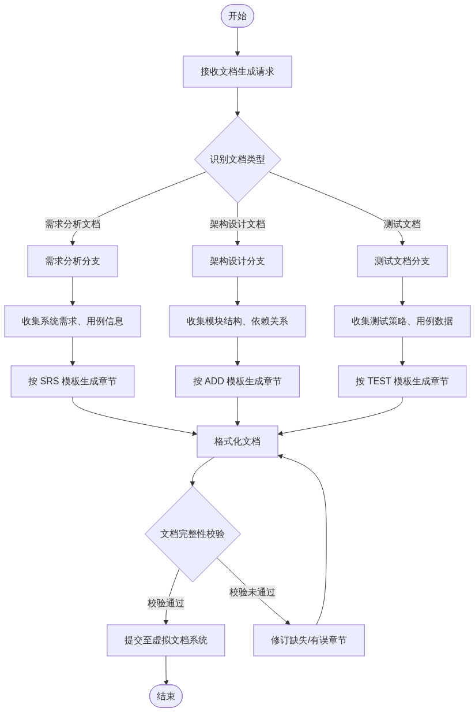
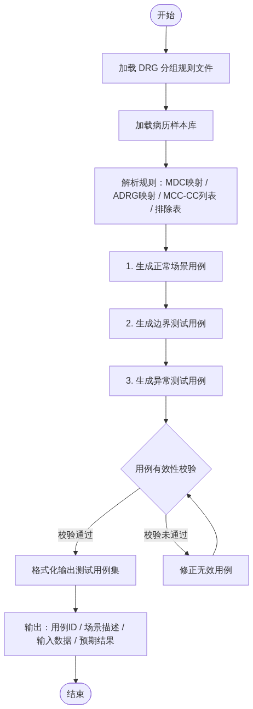
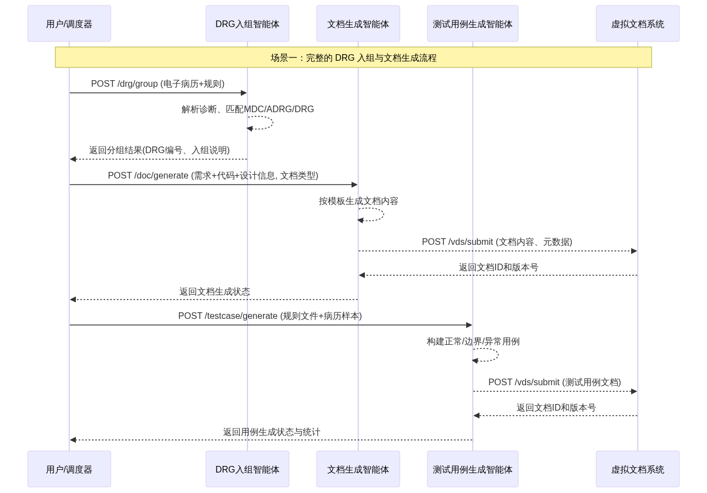
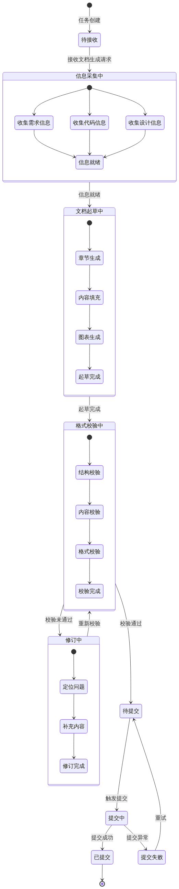
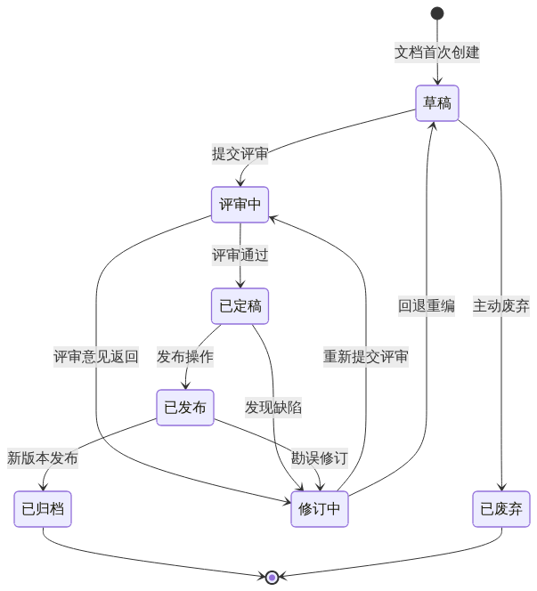

# 需求规格说明书

**文档编号**：SRS-DRG-AGENT-V1.0  
**版本号**：V1.0  
**编制日期**：2026年3月  
**文档状态**：正式发布  

## 一、引言

### 1.1 目的

本需求规格说明书（Software Requirements Specification，SRS）旨在完整、准确地定义**医保 DRG 入组智能体系统**的功能需求、性能需求、接口需求与约束条件，为后续的架构设计、编码实现、测试验证及项目验收提供统一的基线依据。

本说明书预期面向以下读者群体：

a. **需求分析师与产品经理**：验证系统功能是否完整覆盖医保 DRG 入组业务的全流程，并确保与《按病组（DRG）付费分组方案（2.0版）》规则体系的一致性；

b. **架构师与开发工程师**：依据功能需求与接口定义进行系统模块划分、技术选型与代码实现，明确各智能体之间的数据交互方式；

c. **测试工程师与质量保证人员**：基于用例描述与验收标准编制测试计划、设计测试用例，并对系统进行功能验证与回归测试；

d. **项目经理与配置管理员**：跟踪需求变更、评估项目进度，并管理文档与代码的版本迭代；

e. **终端用户与业务专家**：确认系统行为是否符合医保 DRG 入组的实际操作流程，并对人机交互方式提出优化建议。

本说明书采用 IEEE 830-1998 推荐的结构框架，结合项目实际特点进行裁减与适配，确保文档在专业性、可读性与可维护性之间取得平衡。

### 1.2 范围

#### 1.2.1 系统范围

本系统定位为基于大模型或智能体框架构建的**医保 DRG 入组智能体平台**，其核心功能涵盖以下四个模块：

a. **DRG 入组智能体**：接收电子病历文本（含主要诊断、手术操作、次要诊断等），依据《按病组（DRG）付费分组方案（2.0版）》中的 MDC 分类规则、ADRG 分组规则、MCC/CC 列表及排除表，自动完成从主要诊断大类到核心分组再到细分组的逐层匹配，并输出 DRG 组号、组名及入组原因说明。

b. **文档自动生成智能体**：基于系统需求描述、设计信息与代码仓库内容，自动生成符合软件工程规范的需求分析文档、架构设计文档与测试文档。

c. **测试用例生成智能体**：根据 DRG 分组规则的结构化表示与病历样本数据，自动构建正常场景、边界场景与异常场景的测试用例，覆盖不同诊断与手术组合、合并症有无、编码错误与信息缺失等情形。

d. **虚拟文档系统与提交智能体**：提供文档的接收、存储、版本管理与提交能力，支持其他智能体生成的文档自动归档至虚拟文档库。

#### 1.2.2 系统边界

本系统明确包含的内容：

a. DRG 分组的全流程自动化（从病历解析到分组结果输出）；

b. 将 DRG 分组规则（2.0版）的结构化建模与推理机制；

c. 软件工程文档的自动生成能力（需求分析、架构设计、测试文档）；

d. 测试用例的自动构造与场景覆盖；

e. 虚拟文档系统的存储、检索与提交功能。

本系统明确不包含的内容：

a. 电子病历的录入与编辑界面（系统假定病历文本已由外部系统或人工方式提供）；

b. 实际医保结算与支付接口的对接（系统仅输出分组结果，不涉及真实的费用结算流程）；

c. 医保政策的实时更新与同步（系统基于固定的 DRG 2.0 版规则运行，规则版本更新需人工介入）；

d. 患者隐私数据的加密存储与合规审计（系统在开发与测试阶段使用脱敏或模拟数据，生产环境的隐私保护措施不在本版本范围内）；

e. 医院信息系统（HIS）或电子病历系统（EMR）的集成接口开发。

### 1.3 定义、缩写词和术语

本说明书中使用的关键术语、缩写及其定义见下表。

**表1-1：术语与缩写定义表**

| 序号 | 术语/缩写 | 英文全称 | 定义 |
| :---: | :---: | :---: | :---: |
| 1 | ADRG | Adjacent Diagnosis Related Groups | 核心疾病诊断相关分组，DRG 三层分组结构的中间层，依据主要诊断与主要手术操作进行划分 |
| 2 | CC | Complication or Comorbidity | 合并症或并发症，指在主要诊断之外、对医疗资源消耗有显著影响的次要诊断 |
| 3 | DRG | Diagnosis Related Groups | 按疾病诊断相关分组，一种将患者按"诊断+治疗方式+个体特征"进行分组的病例组合方案，用于医保打包付费 |
| 4 | ICD-10 | International Classification of Diseases, 10th Revision | 国际疾病分类第十版，本系统中用于编码主要诊断与次要诊断 |
| 5 | ICD-9-CM-3 | International Classification of Diseases, 9th Revision, Clinical Modification, Volume 3 | 国际疾病分类第九版临床修订版第三卷，本系统中用于编码手术操作 |
| 6 | MCC | Major Complication or Comorbidity | 严重合并症或并发症，指对医疗资源消耗有重大影响的次要诊断，在细分组层面用于区分 DRG 组别 |
| 7 | MDC | Major Diagnostic Category | 主要诊断大类，DRG 三层分组结构的顶层，依据主要诊断的解剖学或病因学类别进行划分（如 MDCB：神经系统疾病及功能障碍） |
| 8 | SRS | Software Requirements Specification | 软件需求规格说明书，即本文档 |
| 9 | 主要诊断 | Principal Diagnosis | 患者本次住院的主要疾病或健康问题，是 DRG 入组的首要判断依据 |
| 10 | 次要诊断 | Secondary Diagnosis | 患者除主要诊断之外的其他疾病或健康问题，用于判断是否存在 CC 或 MCC |
| 11 | 主要手术 | Principal Procedure | 患者本次住院期间实施的核心手术操作，与主要诊断共同决定 ADRG 分组 |
| 12 | 排除表 | Exclusion List | 用于判定某并发症是否被主诊断排除的规则表，若并发症在排除表中被主诊断排除，则该并发症不参与 MCC/CC 判定 |
| 13 | 病历样本 | Medical Record Sample | 用于测试用例生成的电子病历文本实例，包含主要诊断、次要诊断、手术操作等结构化或半结构化信息 |

### 1.4 参考资料

本需求规格说明书的编制依据以下参考文献、标准与项目文件：

a. 国家医疗保障局.《按病组（DRG）付费分组方案（2.0版）》. 2025.

b. IEEE Computer Society. *IEEE Std 830-1998: IEEE Recommended Practice for Software Requirements Specifications*. IEEE, 1998.

c. 世界卫生组织（WHO）. *International Statistical Classification of Diseases and Related Health Problems, 10th Revision (ICD-10)*. 2016.

d. 国家卫生健康委员会.《国际疾病分类第九版临床修订本手术与操作分类（ICD-9-CM-3）》. 2011.

e. 华东理工大学自然语言处理与大数据挖掘实验室.《软件工程大作业——医保 DRG 入组智能体》项目需求文档. 2026.

f. ISO/IEC/IEEE 29148:2018. *Systems and Software Engineering — Life Cycle Processes — Requirements Engineering*. ISO/IEC/IEEE, 2018.

## 二、总体描述

本章从宏观角度描述 DRG 入组智能体平台的整体功能定位、目标用户群体、系统设计与实现所面临的约束条件，以及系统运行所依赖的外部假设与前置条件，为后续具体需求的展开提供全局性上下文。

### 2.1 系统整体功能

DRG 入组智能体平台旨在解决医疗保险领域中按疾病诊断相关分组（Diagnosis Related Groups, DRG）人工入组效率低、规则匹配易出错、配套文档产出滞后等核心问题。系统以大模型或智能体框架为技术底座，将 DRG 入组规则引擎、文档自动生成、测试用例自动生成以及虚拟文档管理四个核心能力封装为可协同工作的智能体模块，构建一个覆盖"入组—验证—文档—交付"全链路的自动化工具链。

系统的高层功能全景可概括如下：

a. **DRG 入组处理**：接收电子病历文本（含主要诊断、次要诊断、手术操作等结构化或半结构化信息），依据《按病组（DRG）付费分组方案（2.0版）》所定义的三层分组规则（MDC → ADRG → DRG），自动完成诊断大类匹配、核心分组判定以及合并症/并发症（CC/MCC）分层校验，最终输出 DRG 组号、组名及入组推理说明。

b. **文档自动生成**：基于系统需求描述、架构设计信息和功能代码，自动生成符合软件工程规范的需求分析文档、架构设计文档和测试策略文档，减少人工编写文档的重复性劳动，确保文档与系统实现的一致性。

c. **测试用例自动生成**：以 DRG 分组规则和病历样本为输入，自动构建覆盖正常场景（不同诊断与手术组合）、边界场景（合并症有无、严重程度变化）和异常场景（编码错误、信息缺失、规则冲突）的测试用例集，支撑 DRG 入组功能的全面验证。

d. **虚拟文档系统与提交**：构建一个轻量级虚拟文档管理系统，能够自动接收各智能体生成的文档，提供文档存储、浏览、归档和提交发布功能，作为项目交付物的统一管理入口。

**图2-1：DRG入组智能体平台系统用例图**

系统用例图（图2-1）展示了四类参与者与平台四个核心用例模块之间的交互关系。医院编码员主要使用 DRG 入组处理功能完成病历的分组匹配与结果查询；医保审核人员对分组结果进行复核与审核；开发团队（含需求分析师、架构师、程序员、测试人员）使用文档自动生成、测试用例生成和虚拟文档管理功能完成项目文档与测试资产的产出和浏览；系统管理员负责文档的存储归档与最终提交发布。

### 2.2 用户特征

本系统的预期用户分为以下四类角色，各类用户在技术水平、业务领域知识和使用模式上存在显著差异：

**表2-1：系统用户角色与特征描述**

| 用户角色 | 业务领域知识 | 技术水平 | 典型操作 | 使用频率 |
| :---: | :---: | :---: | :---: | :---: |
| 医院编码员 | 精通 ICD-10/ICD-9-CM-3 编码规范，熟悉 DRG 分组流程与医保结算规则 | 中（熟练使用医院信息系统的编码模块，具备基础计算机操作能力） | 提交电子病历进行 DRG 入组，查看分组结果及入组原因说明 | 高（日常工作频繁使用） |
| 医保审核人员 | 熟悉国家及地方 DRG 付费政策，了解 MCC/CC 排除规则和分组逻辑 | 中（熟练使用医保审核系统，能读懂分组结果和规则说明） | 审核 DRG 入组结果，复核分组合理性，对异议分组进行标注 | 中（定期审核） |
| 开发团队 | 具备软件工程全生命周期知识，了解 DRG 业务领域基础概念 | 高（精通大模型/智能体框架开发、软件架构设计、自动化测试技术） | 输入需求与代码信息触发文档生成，输入规则与样本触发测试用例生成，浏览和管理生成的文档 | 中（项目开发阶段集中使用） |
| 系统管理员 | 了解文档管理和版本控制基本概念 | 高（具备系统运维、存储管理和权限控制能力） | 管理虚拟文档系统的存储空间，执行文档归档与提交发布操作 | 低（按项目里程碑操作） |

上述四类用户中，医院编码员和医保审核人员属于业务端用户，其操作模式以查询和审核为主，对系统的响应速度和结果可解释性有较高要求；开发团队和系统管理员属于工程端用户，其操作模式以批量任务触发和资源管理为主，对系统的自动化程度和输出规范性有较高要求。

### 2.3 约束条件

系统在设计、开发和运行过程中须遵循以下约束条件，这些约束来源于项目需求、技术选型方案和交付要求：

a. **技术架构约束**：系统须基于大模型或智能体框架构建，四个核心模块（DRG 入组、文档自动生成、测试用例生成、虚拟文档系统）可分别设计为独立智能体，各智能体之间通过约定的接口或消息机制协同工作。

b. **DRG 规则版本约束**：DRG 入组和测试用例生成模块须严格依据《按病组（DRG）付费分组方案（2.0版）》所定义的 MDC 分类、ADRG 分组逻辑、MCC/CC 列表及排除表进行规则匹配与推理，不得使用其他版本或自行简化的规则。

c. **输入数据格式约束**：电子病历输入须包含符合 ICD-10 编码规范的主要诊断编码和次要诊断编码，以及符合 ICD-9-CM-3 编码规范的手术操作编码；编码格式错误或信息缺失将触发系统的异常处理流程。

d. **团队规模与交付约束**：项目团队规模为 4 至 5 人，可灵活配置项目经理、需求分析师、架构师、配置管理员、程序员和测试人员等角色；项目交付物须包含需求规格说明书、架构设计文档和测试文档，且文档须通过虚拟文档系统提交。

e. **时间约束**：项目周期以 2026 年 3 月为基准里程碑，须在此期限内完成系统设计、开发、测试和文档产出。

f. **运行平台约束**：系统各智能体模块须能够在通用计算环境中运行，支持通过 API 或命令行方式触发任务；虚拟文档系统须支持文件级存储和基本的文档版本标识。

g. **输出规范约束**：所有自动生成的文档须符合软件工程文档规范（如 IEEE 830 等标准的基本要求），包含必要的章节结构、图表编号、版本标识等元数据信息。

### 2.4 假设与依赖

系统设计基于以下关键假设和外部依赖，若其中任何一项不成立或发生变化，可能对系统功能和性能产生显著影响：

a. **大模型能力假设**：假设所选用的大模型或智能体框架具备足够的自然语言理解与推理能力，能够正确解析电子病历文本中的诊断和手术编码，准确匹配 DRG 分组规则中的 MDC/ADRG/MCC/CC 条件，并生成符合规范的自然语言说明。

b. **DRG 规则完整性假设**：假设《按病组（DRG）付费分组方案（2.0版）》规则文件中的 MDC 分类表、ADRG 分组表、MCC/CC 列表和排除表是完整且自洽的，不存在规则冲突或覆盖空白。若规则存在歧义或矛盾，系统将按预定义的优先策略处理，但结果可能需要人工复核。

c. **电子病历编码规范性依赖**：系统依赖输入电子病历中的诊断编码和手术编码严格遵循 ICD-10 和 ICD-9-CM-3 编码标准。若输入编码不规范（如使用非标准扩展码、编码格式变形），可能导致规则匹配失败或分组结果偏差。

d. **病历样本可用性依赖**：测试用例生成模块依赖足够数量和覆盖度的病历样本。若样本数量不足或覆盖的诊断/手术组合有限，生成的测试用例集可能无法充分覆盖边界和异常场景。

e. **虚拟文档系统存储容量假设**：假设虚拟文档系统具备足够的存储空间容纳项目全生命周期产生的需求分析文档、架构设计文档、测试文档及其修订版本。存储容量不足时需由系统管理员执行清理或扩容操作。

f. **第三方服务可用性依赖**：若系统部署依赖外部大模型 API 服务（如云端推理接口），则系统的可用性和响应延迟将受该第三方服务的服务质量（SLA）约束。在服务不可用期间，DRG 入组和文档生成功能可能降级或暂停。

g. **开发团队 DRG 领域知识依赖**：系统设计和规则工程的质量依赖于开发团队对 DRG 分组逻辑、ICD 编码体系和医保付费政策的理解深度。若团队缺乏相关领域知识，可能导致规则建模偏差或测试用例设计不充分。

## 三、具体需求

本章详细描述医保 DRG 入组智能体系统的各项需求，按功能需求、性能需求、安全性需求、可靠性需求、可维护性需求、外部接口需求、业务状态模型和设计约束共八个维度展开。所有需求条目均采用可验证的表述方式，便于后续测试与评审。

### 3.1 功能需求

本节按系统四大核心模块组织功能需求，分别为 DRG 入组模块、文档自动生成模块、测试用例生成模块和虚拟文档系统模块。每条功能需求采用 **FR-{模块}-{序号}** 格式编号，并逐一说明功能描述、输入、处理流程、输出和异常处理。

**表3-1：功能需求清单汇总**

| 编号 | 功能名称 | 所属模块 | 优先级 |
| :---: | :---: | :---: | :---: |
| FR-DRG-001 | 电子病历接收与解析 | DRG入组 | 高 |
| FR-DRG-002 | MDC 主要诊断大类匹配 | DRG入组 | 高 |
| FR-DRG-003 | ADRG 核心分组匹配 | DRG入组 | 高 |
| FR-DRG-004 | CC/MCC 合并症与并发症评估 | DRG入组 | 高 |
| FR-DRG-005 | DRG 细分组分配与结果输出 | DRG入组 | 高 |
| FR-DOC-001 | 需求分析文档自动生成 | 文档自动生成 | 高 |
| FR-DOC-002 | 架构设计文档自动生成 | 文档自动生成 | 高 |
| FR-DOC-003 | 测试文档自动生成 | 文档自动生成 | 高 |
| FR-TEST-001 | 正常场景测试用例生成 | 测试用例生成 | 高 |
| FR-TEST-002 | 边界测试用例生成 | 测试用例生成 | 中 |
| FR-TEST-003 | 异常测试用例生成 | 测试用例生成 | 中 |
| FR-VDS-001 | 文档接收与存储 | 虚拟文档系统 | 高 |
| FR-VDS-002 | 文档版本管理 | 虚拟文档系统 | 中 |
| FR-VDS-003 | 文档检索与查询 | 虚拟文档系统 | 中 |

#### 3.1.1 DRG 入组模块

DRG 入组模块是本系统的核心功能模块，负责根据电子病历文本和 DRG 分组规则自动完成疾病诊断相关分组。其业务流程覆盖从病历接收到最终 DRG 细分组输出的完整链路。

**图3-1：DRG 入组核心业务流程活动图**

##### (1) FR-DRG-001：电子病历接收与解析

**功能描述**  
系统接收用户提交的电子病历文本，提取主要诊断编码、次要诊断编码列表和主要手术操作编码，形成结构化病历数据对象，供后续分组流程使用。

**输入**  
a. 电子病历文本：包含主要诊断描述及 ICD 编码（如 `A01.002+G01* 伤寒性脑膜炎`）、次要诊断列表（如 `J96.0 急性呼吸衰竭`）、主要手术操作描述及编码（如 `38.1000x002 动脉内膜剥脱术`）；  
b. 输入格式：JSON 结构化文本或自由文本（系统需支持两种格式的自动识别）。

**处理流程**  
a. 接收输入文本，判断格式类型（JSON 或自由文本）；  
b. 若为自由文本，调用命名实体识别（NER）模块提取诊断编码和手术编码字段；若为 JSON，直接解析对应字段；  
c. 校验 ICD 编码格式的合法性（符合 ICD-10 及 ICD-9-CM-3 编码规范）；  
d. 将提取结果组装为结构化对象：`{主要诊断, 次要诊断列表, 主要手术操作}`；  
e. 若存在编码歧义或多条主要诊断，标记为“待人工确认”并记录。

**输出**  
结构化病历数据对象，包含：  
a. `primary_diagnosis`：主要诊断编码及描述；  
b. `secondary_diagnoses`：次要诊断编码及描述列表；  
c. `primary_procedure`：主要手术操作编码及描述（可为空）；  
d. `parse_status`：解析状态（成功 / 待确认 / 部分解析）。

**异常处理**  
a. 若输入文本为空或无法解析任何诊断编码，返回错误码 `E-DRG-001`（输入为空或不可解析），并附详细说明；  
b. 若 ICD 编码格式不合法，返回错误码 `E-DRG-002`（ICD 编码格式错误），并在返回体中指明具体问题字段；  
c. 若自由文本解析置信度低于阈值，标记 `parse_status = "待确认"` 并继续流程，同时返回警告信息。

##### (2) FR-DRG-002：MDC 主要诊断大类匹配

**功能描述**  
根据已解析的主要诊断编码，对照 DRG 分组规则中的 MDC（主要诊断大类）映射表，确定患者所属的 MDC 分类。

**输入**  
a. 结构化病历数据对象（来自 FR-DRG-001 输出）；  
b. DRG 分组规则文件中的 MDC 映射表（含诊断编码到 MDC 的映射关系）。

**处理流程**  
a. 提取主要诊断编码的前缀和完整编码；  
b. 在 MDC 映射表中执行精确匹配，若精确匹配失败则执行前缀模糊匹配；  
c. 确定所属 MDC 类别（如 MDCB：神经系统疾病及功能障碍）；  
d. 记录匹配方式（精确匹配 / 模糊匹配）和置信度。

**输出**  
a. `mdc_code`：MDC 编码（如 `MDCB`）；  
b. `mdc_name`：MDC 名称（如 `神经系统疾病及功能障碍`）；  
c. `match_method`：匹配方式标识；  
d. `confidence`：匹配置信度（0.0~1.0）。

**异常处理**  
a. 若主要诊断编码在 MDC 映射表中无任何匹配，返回错误码 `E-DRG-003`（诊断无法匹配 MDC），流程终止；  
b. 若存在多个候选 MDC（编码跨类），按规则优先级选定其一，并在结果中标注“多候选”。

##### (3) FR-DRG-003：ADRG 核心分组匹配

**功能描述**  
在确定 MDC 后，结合主要诊断编码和主要手术操作编码，匹配 ADRG（核心疾病诊断相关分组）分组。

**输入**  
a. 结构化病历数据对象及已确定的 MDC 信息；  
b. DRG 分组规则文件中的 ADRG 映射表（含诊断-手术组合到 ADRG 的映射关系）。

**处理流程**  
a. 判断是否存在主要手术操作编码；  
b. 若有手术操作：在 ADRG 外科分组表中，以（MDC + 主要诊断 + 主要手术）为条件进行匹配；  
c. 若无手术操作：在 ADRG 内科分组表中，以（MDC + 主要诊断）为条件进行匹配；  
d. 确定 ADRG 编码（如 `BB1`：神经系统复合手术组）；  
e. 记录该 ADRG 是否支持 CC/MCC 分层。

**输出**  
a. `adrg_code`：ADRG 编码（如 `BB1`）；  
b. `adrg_name`：ADRG 名称（如 `神经系统复合手术组`）；  
c. `supports_complication_split`：是否支持合并症/并发症分层分组的标志。

**异常处理**  
a. 若在 ADRG 映射表中无匹配，返回错误码 `E-DRG-004`（无法匹配 ADRG），终止流程；  
b. 若存在多个候选 ADRG，按规则优先级（精确匹配优先于范围匹配）选定。

##### (4) FR-DRG-004：CC/MCC 合并症与并发症评估

**功能描述**  
在确定 ADRG 后，逐一检查次要诊断列表，结合 MCC 列表、CC 列表和排除表，判定患者是否伴有严重合并症或并发症（MCC）、一般合并症或并发症（CC），或二者皆无。

**输入**  
a. 结构化病历数据对象中的次要诊断列表；  
b. DRG 分组规则文件中的 MCC 列表、CC 列表和排除表；  
c. 当前 ADRG 的 CC/MCC 分层支持标志。

**处理流程**  
a. 若 ADRG 不支持 CC/MCC 分层，直接标记为“不适用”；  
b. 遍历次要诊断列表，逐一检查是否命中 MCC 列表；  
c. 对命中的疑似 MCC 诊断，逐项在排除表中校验：若该并发症被主要诊断排除，则不计为 MCC；  
d. 若 MCC 判定成立（至少一条次要诊断命中 MCC 且未被排除），标记为 MCC，流程结束；  
e. 若 MCC 不成立，遍历次要诊断列表检查是否命中 CC 列表（同样经排除表校验）；  
f. 若 CC 判定成立，标记为 CC；否则标记为“无合并症/并发症”。

**输出**  
a. `complication_level`：取值为 `MCC` / `CC` / `NONE`；  
b. `matched_complications`：命中且有效的次要诊断编码列表；  
c. `excluded_complications`：命中但被排除的次要诊断编码列表（用于审计追溯）。

**异常处理**  
a. 若排除表数据缺失或不完整，标记 `complication_level` 为 `INDETERMINATE`，返回警告信息并在结果中注明不确定性。

##### (5) FR-DRG-005：DRG 细分组分配与结果输出

**功能描述**  
综合 MDC、ADRG 和 CC/MCC 评估结果，确定最终的 DRG 细分组，并生成完整的分组结果输出。

**输入**  
a. MDC 匹配结果（FR-DRG-002）；  
b. ADRG 匹配结果（FR-DRG-003）；  
c. CC/MCC 评估结果（FR-DRG-004）；  
d. DRG 分组规则文件中的 DRG 细分组映射表。

**处理流程**  
a. 以（ADRG + complication_level）为条件，在 DRG 细分组映射表中查询；  
b. 确定 DRG 组号（如 `BB11`）和组名（如 `神经系统复合手术，伴严重合并症或并发症`）；  
c. 汇总入组路径信息（MDC → ADRG → CC/MCC 判定 → DRG）；  
d. 生成入组原因说明文本，描述每一步的判定依据。

**输出**  
a. `drg_code`：DRG 组号（如 `BB11`）；  
b. `drg_name`：DRG 组名；  
c. `grouping_path`：完整入组路径摘要；  
d. `reasoning`：入组原因说明（自然语言文本，含各步骤判定依据）；  
e. `timestamp`：入组时间戳。

**异常处理**  
a. 若 DRG 细分组映射表中无匹配记录，返回错误码 `E-DRG-005`（DRG 细分组无法分配），并在结果中包含已完成的各步骤信息供人工排查。

---

#### 3.1.2 文档自动生成模块

文档自动生成模块负责根据系统需求、代码和设计信息，自动生成符合规范的需求分析文档、架构设计文档和测试文档，并自动提交至虚拟文档系统。

**图3-2：文档自动生成流程活动图**

##### (1) FR-DOC-001：需求分析文档自动生成

**功能描述**  
基于输入的系统需求描述和用例信息，自动生成符合 SRS 标准模板的需求分析文档，涵盖引言、总体描述、具体需求等章节。

**输入**  
a. 系统需求描述文本（含功能列表、用户故事等）；  
b. 用例场景信息（含参与者、前置条件、基本流、备选流）；  
c. 目标文档模板（SRS 标准模板）；  
d. 可选：现有需求文档片段作为参考。

**处理流程**  
a. 解析输入的需求描述，提取功能点、约束条件和业务规则；  
b. 依据 SRS 模板结构，依次生成：引言章节（目的、范围、定义）、总体描述章节（产品视角、用户特征、假设与依赖）、具体需求章节（功能需求、接口需求、非功能需求）；  
c. 对每条功能需求自动分配编号并补全描述细节；  
d. 生成用例表和用例图（如适用）；  
e. 执行文档内部一致性检查（交叉引用、术语一致性）。

**输出**  
a. 完整的需求分析文档（Markdown 格式）；  
b. 文档元数据（含生成时间、输入来源、版本号）；  
c. 一致性检查报告（含警告和潜在问题项）。

**异常处理**  
a. 若输入的需求描述信息量不足（如功能点少于 3 条），返回警告并生成骨架文档，标注“待补充”区域；  
b. 若模板加载失败，返回错误码 `E-DOC-001`（模板不可用）。

##### (2) FR-DOC-002：架构设计文档自动生成

**功能描述**  
基于系统代码结构、模块依赖关系和设计信息，自动生成符合 ADD 标准模板的架构设计文档，涵盖架构视图、模块设计、数据设计等章节。

**输入**  
a. 系统代码目录结构与依赖关系（如模块导入图、包结构）；  
b. 系统设计信息（含架构风格、设计模式、关键技术选型）；  
c. 可选：部署配置信息、中间件列表。

**处理流程**  
a. 解析代码目录结构，构建模块树和依赖图；  
b. 依据 ADD 模板生成：架构概述、逻辑视图（模块划分与职责）、物理视图（部署拓扑）、数据视图（数据模型概要）；  
c. 对每个模块生成概要描述，包含职责、接口和依赖关系；  
d. 生成组件图或部署图（如适用）。

**输出**  
a. 完整的架构设计文档（Markdown 格式）；  
b. 模块依赖关系图（Mermaid 格式）；  
c. 文档元数据。

**异常处理**  
a. 若代码目录结构无法解析，返回错误码 `E-DOC-002`（代码结构解析失败）；  
b. 若模块依赖关系存在循环依赖，在文档中标注警告。

##### (3) FR-DOC-003：测试文档自动生成

**功能描述**  
基于测试策略、测试用例数据和系统需求，自动生成符合 TEST 标准模板的测试文档，涵盖测试策略、测试方案、测试用例和执行记录模板。

**输入**  
a. 测试策略描述（测试范围、测试级别、测试方法）；  
b. 测试用例数据（由测试用例生成智能体产出或人工提供）；  
c. 系统需求文档（用于追溯矩阵生成）。

**处理流程**  
a. 解析测试策略信息，确定测试范围和覆盖目标；  
b. 依据测试文档模板生成：测试策略章节、测试方案章节（含测试环境、测试数据）、测试用例章节、需求追溯矩阵章节；  
c. 将测试用例按模块和类型分类编排；  
d. 生成需求-用例追溯表。

**输出**  
a. 完整的测试文档（Markdown 格式）；  
b. 需求追溯矩阵（表格）；  
c. 文档元数据。

**异常处理**  
a. 若测试用例数据为空，生成骨架文档并标注“待填充测试用例”；  
b. 若需求文档不可用，追溯矩阵生成失败但不阻塞文档主体生成，在文档中标注。

---

#### 3.1.3 测试用例生成模块

测试用例生成模块负责根据 DRG 分组规则自动构建测试场景并生成测试用例，覆盖正常场景、边界场景和异常场景。

**图3-3：测试用例生成流程活动图**

##### (1) FR-TEST-001：正常场景测试用例生成

**功能描述**  
基于 DRG 分组规则和病历样本库，自动生成覆盖不同诊断与手术组合的正常场景测试用例，验证系统在标准输入下的分组正确性。

**输入**  
a. DRG 分组规则文件（含 MDC、ADRG、MCC/CC 映射表）；  
b. 病历样本库（含多组已验证分组结果的典型病历）。

**处理流程**  
a. 遍历病历样本库，提取每组（诊断 + 手术）组合；  
b. 为每个组合生成一条测试用例，包含：用例 ID、场景描述、输入数据（诊断编码、手术编码）、预期 DRG 结果；  
c. 优先覆盖高频 MDC 和 ADRG 组合（按规则文件中的频率权重排序）；  
d. 为每条用例标注覆盖的规则条目。

**输出**  
a. 正常场景测试用例集，每条包含：
   (1) `case_id`：用例编号（如 `TC-NORMAL-001`）；
   (2) `scenario`：场景描述；
   (3) `input`：结构化输入数据；
   (4) `expected_output`：预期 DRG 结果（MDC + ADRG + DRG）；
   (5) `covered_rules`：覆盖的规则条目标识。

**异常处理**  
a. 若病历样本库为空，返回警告并回退至基于规则的组合枚举生成方式。

##### (2) FR-TEST-002：边界测试用例生成

**功能描述**  
围绕合并症有无、编码边界等条件，自动生成边界测试用例，验证系统在临界条件下的分组行为。

**输入**  
a. DRG 分组规则文件中的 MCC/CC 列表和排除表；  
b. 正常场景用例集（来自 FR-TEST-001）。

**处理流程**  
a. 为每个 ADRG 分组，构造以下边界变体：有 MCC 且未被排除、有 MCC 但被排除、有 CC、无任何合并症；  
b. 构造编码边界用例：编码前缀匹配边界（如跨类编码）、编码长度边界；  
c. 每条边界用例包含：边界条件说明、输入数据、预期行为描述。

**输出**  
边界测试用例集，格式同正常场景用例，编号前缀为 `TC-BOUNDARY-XXX`。

**异常处理**  
a. 若某 ADRG 不支持 CC/MCC 分层，跳过该 ADRG 的合并症边界用例生成。

##### (3) FR-TEST-003：异常测试用例生成

**功能描述**  
针对编码错误、信息缺失等异常场景，自动生成异常测试用例，验证系统的容错和错误处理能力。

**输入**  
a. DRG 分组规则文件；  
b. 常见错误模式库（如无效 ICD 编码、缺失主要诊断、缺失主要手术等）。

**处理流程**  
a. 按错误类型生成异常用例：
   (1) 编码格式错误（如无效 ICD-10 编码）；
   (2) 主要诊断缺失；
   (3) 主要手术编码在规则中不存在；
   (4) 次要诊断编码格式错误；
   (5) 输入数据完全为空；
b. 每条异常用例包含：错误注入描述、输入数据、预期错误码或异常行为。

**输出**  
异常测试用例集，编号前缀为 `TC-ERROR-XXX`。

**异常处理**  
a. 若错误模式库为空，使用内置默认错误模式集生成。

---

#### 3.1.4 虚拟文档系统模块

虚拟文档系统模块作为文档的统一存储与版本管理中心，接收各智能体生成的文档，提供存储、版本管理和检索功能。

##### (1) FR-VDS-001：文档接收与存储

**功能描述**  
接收来自文档生成智能体和测试用例生成智能体提交的文档内容，进行格式校验后存储至虚拟文档库。

**输入**  
a. 文档内容（Markdown 格式）；  
b. 文档元数据：标题、类型（需求分析 / 架构设计 / 测试文档）、来源智能体标识、生成时间；  
c. 可选：目标路径或分类标签。

**处理流程**  
a. 接收提交请求，校验请求格式完整性；  
b. 校验文档内容是否为有效 Markdown 格式（至少包含一级标题）；  
c. 生成唯一文档 ID 和初始版本号 `V1.0`；  
d. 存储文档内容和元数据；  
e. 返回文档 ID 和版本信息。

**输出**  
a. `document_id`：文档唯一标识；  
b. `version`：版本号（如 `V1.0`）；  
c. `storage_path`：存储路径；  
d. `status`：存储状态（成功 / 失败）。

**异常处理**  
a. 若文档内容为空或格式无效，返回错误码 `E-VDS-001`（文档内容无效）；  
b. 若元数据缺失必填字段，返回错误码 `E-VDS-002`（元数据不完整）。

##### (2) FR-VDS-002：文档版本管理

**功能描述**  
支持文档的版本更新、版本历史追溯和版本回退，确保文档演进过程可追溯。

**输入**  
a. 目标文档 ID；  
b. 更新后的文档内容；  
c. 变更说明（可选）。

**处理流程**  
a. 校验目标文档 ID 是否存在；  
b. 对比新旧内容，计算差异；  
c. 生成新版本号（按语义化版本规则递增）；  
d. 存储新版本内容，保留旧版本；  
e. 更新版本链指针。

**输出**  
a. `document_id`：文档 ID；  
b. `new_version`：新版本号；  
c. `diff_summary`：变更摘要。

**异常处理**  
a. 若文档 ID 不存在，返回错误码 `E-VDS-003`（文档不存在）；  
b. 若内容无实质性变更，返回提示并保持版本号不变。

##### (3) FR-VDS-003：文档检索与查询

**功能描述**  
提供基于文档类型、来源、时间范围和关键词的检索查询功能。

**输入**  
a. 查询条件：文档类型、来源智能体、创建时间范围、关键词（可选组合）；  
b. 分页参数（页码、每页条数）。

**处理流程**  
a. 解析查询条件，构建查询表达式；  
b. 在文档索引中执行检索；  
c. 按相关度或时间排序；  
d. 返回分页结果。

**输出**  
a. `total_count`：匹配文档总数；  
b. `results`：文档摘要列表（含 ID、标题、版本、创建时间、来源）；  
c. `page_info`：分页信息。

**异常处理**  
a. 若查询条件无效（如时间范围起止矛盾），返回错误码 `E-VDS-004`（查询条件无效）。

---

### 3.2 性能需求

以下性能指标基于系统典型运营场景推断，若实际部署环境有差异，应在项目启动阶段与运营方确认。

(1) **DRG 入组响应时间**：单次 DRG 入组请求（含病历解析、MDC/ADRG/DRG 全链路匹配）的端到端处理时间应不超过 5 秒（P95），在病历文本长度不超过 5000 字符的条件下；P99 应不超过 10 秒。

(2) **文档生成吞吐量**：单份需求分析或架构设计文档（约 20~40 页当量）的生成时间应不超过 60 秒；测试文档（含 50 条以上用例）生成时间应不超过 120 秒。

(3) **并发处理能力**：系统应支持至少 10 个并发 DRG 入组请求同时处理，在并发条件下平均响应时间退化不超过单请求场景的 2 倍。

(4) **测试用例生成吞吐量**：针对含 100 条以上规则的 DRG 规则文件，正常场景用例生成应在 30 秒内完成全部用例产出。

(5) **文档存储吞吐量**：虚拟文档系统应支持每秒至少 5 次文档提交流，单文档大小上限为 10 MB。

(6) **资源占用**：单智能体实例在空闲状态下内存占用不超过 512 MB，处理峰值状态下不超过 2 GB。

---

### 3.3 安全性需求

鉴于系统处理医疗相关数据（ICD 编码和病历摘要），安全性要求如下：

(1) **数据传输加密**：所有智能体间的 API 通信和虚拟文档系统交互应使用 TLS 1.2 及以上协议加密传输。

(2) **身份认证**：各智能体调用 API 时须携带有效认证令牌（API Key 或 JWT），虚拟文档系统应在接收文档提交前验证调用方身份。

(3) **访问控制**：虚拟文档系统应基于文档类型和来源智能体实现最小权限控制；DRG 入组智能体不应具备修改已提交文档的权限。

(4) **审计日志**：系统应记录以下安全相关事件的审计日志，包含时间戳、操作主体、操作类型和结果：
a. DRG 入组请求（含请求来源、输入摘要、分组结果）；  
b. 文档提交和版本更新操作；  
c. 认证失败事件。

(5) **输入校验与注入防护**：所有接收外部输入的接口（电子病历文本、文档内容提交）应进行输入长度限制和特殊字符过滤，防止注入攻击。

(6) **敏感信息脱敏**：审计日志中的患者诊断编码和手术编码应在必要时进行部分脱敏处理（如仅保留编码前缀），避免完整病历信息在非必要场景泄露。

---

### 3.4 可靠性需求

(1) **系统可用性**：核心 DRG 入组服务和虚拟文档系统的目标可用性为 99.5%（月度统计口径），计划内维护窗口不计入。

(2) **故障恢复时间（RTO）**：单智能体实例故障后，应在 30 秒内完成故障检测和重启或切换；虚拟文档系统存储故障的恢复时间目标为 5 分钟。

(3) **数据持久性**：虚拟文档系统中已提交的文档数据应持久化存储，目标数据持久性不低于 99.99%（年度统计口径），即年度数据丢失概率不超过 0.01%。

(4) **容错能力**：DRG 入组流程中，若 MCC/CC 排除表加载失败，系统应降级为不区分合并症分层的模式继续输出 ADRG 级别结果，不得整体崩溃。

(5) **输入容错**：对于格式存在轻微瑕疵的电子病历输入（如多余空格、大小写差异），系统应在解析阶段自动纠正常见格式问题，不应直接拒绝处理。

---

### 3.5 可维护性需求

(1) **结构化日志**：每个智能体应将运行日志按统一格式输出（含时间戳、日志级别、模块标识、消息内容、追踪 ID），日志级别至少支持 DEBUG、INFO、WARN、ERROR 四档。

(2) **配置外部化**：DRG 分组规则文件路径、智能体服务端口、虚拟文档系统地址等配置项应从外部配置文件或环境变量读取，不支持硬编码。

(3) **模块解耦**：四个智能体模块应通过明确定义的 API 接口通信，模块间不得直接共享数据库或内存状态；任一模块的启停不应影响其他模块的核心功能。

(4) **DRG 规则热更新**：DRG 分组规则文件应支持在不停机的情况下热加载更新（如通过文件监听或手动触发的重载接口），更新后新入组请求立即使用新规则。

(5) **健康检查接口**：每个智能体应暴露 `/health` 健康检查端点，返回服务状态、依赖组件状态（如规则文件是否加载成功）和最近错误计数。

(6) **文档模板可扩展**：文档自动生成模块的模板结构应支持通过模板文件扩展或替换，不应将模板逻辑硬编码在生成代码中。

---

### 3.6 外部接口需求

#### 3.6.1 用户界面

本系统以 API 服务形态对外提供能力，不强制要求图形用户界面（GUI）。若未来需要可视化前端，应实现以下基础界面：

(1) **DRG 入组交互面板**：提供电子病历文本输入区域（支持自由文本和结构化 JSON 两种模式）、入组触发按钮、分组结果展示区（含 MDC、ADRG、DRG 三级结果卡片和入组原因说明）。

(2) **文档列表与查看页**：展示虚拟文档系统中已存储的文档列表，支持按类型筛选、按版本展开，提供文档内容在线预览（Markdown 渲染）。

(3) **响应式布局**：前端界面应适配主流桌面浏览器（Chrome、Edge、Firefox 近两个大版本），移动端适配为可选项。

上述界面需求为可选实现，当前版本以 API 接口为交付主体。

#### 3.6.2 软件接口

各智能体模块通过 RESTful API 对外暴露服务，使用 JSON 作为数据交换格式。以下定义了核心 API 接口及其调用时序。

**图3-4：智能体间 API 调用时序图**

##### (1) DRG 入组接口

**表3-2：表格说明**

| 属性 | 说明 |
| :---: | :---: |
| **Endpoint** | `POST /api/v1/drg/group` |
| **Method** | POST |
| **Content-Type** | application/json |
| **Authentication** | Bearer Token（Header: `Authorization: Bearer <token>`） |

**Request Body：**

**表3-2：表格说明**

| 字段 | 类型 | 必填 | 说明 |
| :---: | :---: | :---: | :---: |
| `emr_text` | string | 否（与 `emr_structured` 二选一） | 自由文本格式的电子病历 |
| `emr_structured` | object | 否（与 `emr_text` 二选一） | 结构化的病历数据 |
| `emr_structured.primary_diagnosis` | string | 是（结构化模式下） | 主要诊断 ICD 编码 |
| `emr_structured.secondary_diagnoses` | string[] | 否 | 次要诊断 ICD 编码列表 |
| `emr_structured.primary_procedure` | string | 否 | 主要手术操作 ICD 编码 |
| `rule_version` | string | 否 | 指定规则版本，默认使用当前最新版 |

**Response Body（成功，HTTP 200）：**

**表3-2：表格说明**

| 字段 | 类型 | 说明 |
| :---: | :---: | :---: |
| `drg_code` | string | DRG 组号（如 `BB11`） |
| `drg_name` | string | DRG 组名 |
| `mdc_code` | string | MDC 编码 |
| `adrg_code` | string | ADRG 编码 |
| `complication_level` | string | 合并症等级（`MCC` / `CC` / `NONE`） |
| `grouping_path` | string | 入组路径摘要 |
| `reasoning` | string | 入组原因说明 |
| `request_id` | string | 请求追踪 ID |

**Response Body（失败）：**

**表3-2：表格说明**

| 字段 | 类型 | 说明 |
| :---: | :---: | :---: |
| `error_code` | string | 错误码（如 `E-DRG-003`） |
| `error_message` | string | 错误描述 |
| `request_id` | string | 请求追踪 ID |

##### (2) 文档生成接口

**表3-2：表格说明**

| 属性 | 说明 |
| :---: | :---: |
| **Endpoint** | `POST /api/v1/doc/generate` |
| **Method** | POST |
| **Content-Type** | application/json |
| **Authentication** | Bearer Token |

**Request Body：**

**表3-2：表格说明**

| 字段 | 类型 | 必填 | 说明 |
| :---: | :---: | :---: | :---: |
| `doc_type` | string | 是 | 文档类型：`SRS` / `ADD` / `TEST` |
| `source_info` | object | 是 | 文档生成的源信息（结构依类型而定） |
| `submit_to_vds` | boolean | 否 | 生成后是否自动提交至虚拟文档系统（默认 true） |
| `template_version` | string | 否 | 指定模板版本 |

**Response Body（成功，HTTP 200）：**

**表3-2：表格说明**

| 字段 | 类型 | 说明 |
| :---: | :---: | :---: |
| `doc_id` | string | 文档 ID（若提交至 VDS） |
| `version` | string | 版本号 |
| `content_preview` | string | 文档内容前 500 字符预览 |
| `generation_time_ms` | number | 生成耗时（毫秒） |

##### (3) 测试用例生成接口

**表3-2：表格说明**

| 属性 | 说明 |
| :---: | :---: |
| **Endpoint** | `POST /api/v1/testcase/generate` |
| **Method** | POST |
| **Content-Type** | application/json |
| **Authentication** | Bearer Token |

**Request Body：**

**表3-2：表格说明**

| 字段 | 类型 | 必填 | 说明 |
| :---: | :---: | :---: | :---: |
| `rule_file_path` | string | 是 | DRG 规则文件路径或内容标识 |
| `sample_count` | integer | 否 | 期望生成的正常场景用例数量（默认全部覆盖） |
| `include_boundary` | boolean | 否 | 是否生成边界用例（默认 true） |
| `include_error` | boolean | 否 | 是否生成异常用例（默认 true） |

**Response Body（成功，HTTP 200）：**

**表3-2：表格说明**

| 字段 | 类型 | 说明 |
| :---: | :---: | :---: |
| `normal_case_count` | integer | 正常场景用例数 |
| `boundary_case_count` | integer | 边界测试用例数 |
| `error_case_count` | integer | 异常测试用例数 |
| `cases` | array | 测试用例列表（分页返回，默认每页 20 条） |

##### (4) 虚拟文档系统提交接口

**表3-2：表格说明**

| 属性 | 说明 |
| :---: | :---: |
| **Endpoint** | `POST /api/v1/vds/submit` |
| **Method** | POST |
| **Content-Type** | application/json |
| **Authentication** | Bearer Token |

**Request Body：**

**表3-2：表格说明**

| 字段 | 类型 | 必填 | 说明 |
| :---: | :---: | :---: | :---: |
| `title` | string | 是 | 文档标题 |
| `doc_type` | string | 是 | 文档类型：`SRS` / `ADD` / `TEST` |
| `content` | string | 是 | Markdown 文档内容 |
| `source_agent` | string | 是 | 来源智能体标识 |
| `tags` | string[] | 否 | 分类标签 |

**Response Body（成功，HTTP 201）：**

**表3-2：表格说明**

| 字段 | 类型 | 说明 |
| :---: | :---: | :---: |
| `document_id` | string | 分配的文档唯一 ID |
| `version` | string | 初始版本号 |
| `created_at` | string | 创建时间戳（ISO 8601） |

##### (5) 虚拟文档系统查询接口

**表3-2：表格说明**

| 属性 | 说明 |
| :---: | :---: |
| **Endpoint** | `GET /api/v1/vds/documents` |
| **Method** | GET |
| **Authentication** | Bearer Token |

**Query Parameters：**

**表3-2：表格说明**

| 参数 | 类型 | 必填 | 说明 |
| :---: | :---: | :---: | :---: |
| `doc_type` | string | 否 | 按文档类型筛选 |
| `source_agent` | string | 否 | 按来源智能体筛选 |
| `keyword` | string | 否 | 关键词搜索（匹配标题和内容摘要） |
| `from_date` | string | 否 | 起始日期（ISO 8601） |
| `to_date` | string | 否 | 截止日期 |
| `page` | integer | 否 | 页码（默认 1） |
| `page_size` | integer | 否 | 每页条数（默认 20，上限 100） |

##### (6) 健康检查接口（各智能体通用）

**表3-2：表格说明**

| 属性 | 说明 |
| :---: | :---: |
| **Endpoint** | `GET /health` |
| **Method** | GET |
| **Authentication** | 无 |

**Response Body（HTTP 200）：**

**表3-2：表格说明**

| 字段 | 类型 | 说明 |
| :---: | :---: | :---: |
| `status` | string | `healthy` / `degraded` / `unhealthy` |
| `version` | string | 服务版本号 |
| `dependencies` | object | 依赖组件状态（如 `rules_loaded: true`） |
| `recent_error_count` | integer | 最近 5 分钟内错误计数 |

---

### 3.7 业务状态模型

本节使用状态图描述系统中核心业务对象的状态生命周期和状态转移规则。以下覆盖三个核心对象：DRG 入组任务、文档生成任务和文档版本。

#### 3.7.1 DRG 入组任务状态

DRG 入组任务从接收电子病历开始，经历诊断解析、MDC 匹配、ADRG 匹配、CC/MCC 评估和 DRG 细分分配等阶段，最终到达入组完成或判定失败状态。

**图3-5：DRG 入组任务状态图**

状态说明：

(1) **待入组**：初始状态，任务已创建但尚未开始处理。包含内部子状态“诊断解析中”→解析完成后进入“MDC 匹配中”。

(2) **MDC 判定失败**：主要诊断无法匹配任何 MDC 大类时的终止状态。系统记录失败原因（如“诊断编码不在 MDC 映射表中”）后任务结束。

(3) **ADRG 匹配中**：MDC 命中后的状态。内部包含子过程：有手术操作时走外科匹配路径，无手术时走内科匹配路径；匹配成功后进入“CC 评估中”。

(4) **CC 评估中**：对次要诊断进行合并症/并发症评估。内部包含 MCC 检查→排除表校验→CC 检查的子流程，最终确定评估结果为 MCC、CC 或无并发症。

(5) **细分 DRG 分配**：根据 ADRG 和 CC/MCC 结果分配最终 DRG 细分组，成功后立即转移至“入组完成”。入组完成为终态。

#### 3.7.2 文档生成任务状态

文档生成任务从创建到最终提交至虚拟文档系统，经历信息采集、文档起草、格式校验、可选修订和提交流程。

**图3-6：文档生成任务状态图**

状态说明：

(1) **待接收**：任务创建后的初始状态，等待系统分配资源和接收输入。

(2) **信息采集中**：并行收集需求信息、代码信息和设计信息；所有信息就绪后进入“文档起草中”。

(3) **文档起草中**：按模板生成各章节、填充内容、生成图表，完成后进入“格式校验中”。

(4) **格式校验中**：依次执行结构校验、内容校验和格式校验。校验通过则进入“待提交”，未通过则进入“修订中”。

(5) **修订中**：定位问题章节、补充缺失内容后重新进入“格式校验中”。

(6) **待提交**：等待触发提交操作。

(7) **提交中**：向虚拟文档系统发起提交请求；成功进入“已提交”，失败返回“待提交”等待重试。

(8) **已提交**：终态，文档已成功存储至虚拟文档系统。

#### 3.7.3 文档版本状态

文档在虚拟文档系统中的版本状态流转覆盖从草稿到最终归档的完整生命周期。

**图3-7：文档版本状态图**

状态说明：

(1) **草稿**：文档首次创建时的初始状态。可提交评审或由作者主动废弃。

(2) **评审中**：文档已提交评审，等待评审意见。评审通过进入“已定稿”，有修改意见进入“修订中”。

(3) **修订中**：根据评审意见进行修改。修改完成后可重新提交评审或回退至“草稿”重编。

(4) **已定稿**：评审通过后的稳定状态。可执行发布操作进入“已发布”；若后续发现缺陷，可返回“修订中”。

(5) **已发布**：文档正式对外发布的当前有效版本。新版本发布后当前版本进入“已归档”；也可因勘误需要返回“修订中”。

(6) **已归档**：历史版本的终态，保留用于追溯。

(7) **已废弃**：草稿被主动放弃的终态。

---

### 3.8 设计约束

本节列出系统设计与实现过程中必须遵守的技术约束。

(1) **编程语言**：智能体核心逻辑优先采用 Python 3.10 及以上版本开发，与主流大模型框架（如 LangChain、AutoGen 等）和 NLP 工具链兼容。虚拟文档系统可采用 Python 或 Go 实现。

(2) **大模型/智能体框架**：DRG 入组、文档生成和测试用例生成智能体应基于现有大模型或智能体框架构建。框架选型需支持工具调用（Function Calling）和多智能体协作编排，推荐 LangChain、AutoGen 或等效框架。不得从零实现大模型推理引擎。

(3) **接口协议**：所有智能体间通信统一使用 RESTful API over HTTP/HTTPS，数据交换格式为 JSON。不支持 SOAP 或 gRPC（除非未来明确需求变更）。

(4) **DRG 规则数据格式**：DRG 分组规则文件应采用结构化格式存储（推荐 YAML 或 JSON），包含 MDC 映射表、ADRG 映射表、MCC 列表、CC 列表和排除表五个逻辑分区，字段命名遵循《按病组（DRG）付费分组方案（2.0 版）》中的术语体系。

(5) **文档模板规范**：自动生成的文档应遵循 IEEE 830（SRS）、IEEE 1471/ISO 42010（架构描述）和 IEEE 829（测试文档）等标准的结构框架，以 Markdown 作为输出格式。

(6) **版本控制**：所有生成的文档和测试用例应纳入虚拟文档系统的版本管理，版本号采用语义化版本规范（`V{主版本}.{次版本}`），如 `V1.0`、`V1.1`、`V2.0`。

(7) **运行环境**：系统应能在 Linux 服务器环境（Ubuntu 20.04+ 或 CentOS 7+）中部署运行，依赖容器化部署（Docker），并提供 Docker Compose 编排文件。

(8) **字符编码**：所有输入输出统一使用 UTF-8 编码，确保中文 ICD 编码描述和文档内容的正确处理。

## 五、附录

### 5.1 需求跟踪矩阵

需求跟踪矩阵用于建立功能需求与原始用户需求之间的双向映射关系，确保每项用户需求均有对应的功能需求予以覆盖，同时每条功能需求均可追溯至其来源，避免范围蔓延与需求遗漏。

**表5-1：需求跟踪矩阵——DRG入组智能体**

| 功能需求ID | 功能需求描述 | 原始用户需求ID | 原始用户需求描述 | 优先级 | 验证方法 |
| :---: | :---: | :---: | :---: | :---: | :---: |
| FR-DRG-001 | 电子病历文本解析：支持从电子病历中提取主要诊断、次要诊断、主要手术操作等字段，兼容ICD-10及ICD-9-CM-3编码体系 | UR-01 | DRG入组——根据电子病历和入组规则自动匹配输出DRG分组结果 | 高 | 单元测试：构造含不同编码格式的病历文本，验证解析准确性 |
| FR-DRG-002 | DRG分组规则加载与解析：支持加载《按病组（DRG）付费分组方案（2.0版）》规则文件，解析MDC分类表、ADRG分组表、MCC/CC列表及排除表 | UR-01 | DRG入组——根据电子病历和入组规则自动匹配输出DRG分组结果 | 高 | 集成测试：使用规则文件样例验证解析完整性与正确性 |
| FR-DRG-003 | MDC分类匹配：依据主要诊断编码，在MDC分类表中查找所属主要诊断大类，处理多对一映射及编码歧义情况 | UR-01 | DRG入组——根据电子病历和入组规则自动匹配输出DRG分组结果 | 高 | 单元测试：覆盖全部MDC大类，验证边界诊断编码的匹配结果 |
| FR-DRG-004 | ADRG分组匹配：结合主要诊断与主要手术操作，在ADRG分组规则中匹配核心分组，处理内科组（无手术）与外科组的区分逻辑 | UR-01 | DRG入组——根据电子病历和入组规则自动匹配输出DRG分组结果 | 高 | 集成测试：构造不同诊断+手术组合，验证ADRG匹配逻辑 |
| FR-DRG-005 | MCC/CC判定与DRG细分：遍历次要诊断列表，与MCC/CC列表比对，执行排除表校验，最终判定并发症等级并确定DRG细分组 | UR-01 | DRG入组——根据电子病历和入组规则自动匹配输出DRG分组结果 | 高 | 单元测试：覆盖MCC成立、CC成立、无并发症三种场景及排除表逻辑 |
| FR-DRG-006 | 入组结果输出：结构化输出DRG组号、组名、MDC编码、ADRG编码及入组原因说明（含各环节判定依据） | UR-01 | DRG入组——根据电子病历和入组规则自动匹配输出DRG分组结果 | 高 | 验收测试：对照已知入组案例比对输出结果 |
| FR-DOC-001 | 需求分析文档生成：基于系统需求描述，自动生成符合规范的需求规格说明书（含功能需求、用例、非功能需求等章节） | UR-02 | 文档自动生成——基于系统需求、代码和设计信息自动生成符合规范的文档 | 中 | 验收测试：人工审阅生成文档的完整性、规范性和准确性 |
| FR-DOC-002 | 架构设计文档生成：基于系统代码与设计信息，自动生成架构设计文档（含整体结构、模块关系、数据流、部署视图等） | UR-02 | 文档自动生成——基于系统需求、代码和设计信息自动生成符合规范的文档 | 中 | 验收测试：对照实际代码结构验证文档描述的准确性 |
| FR-DOC-003 | 测试文档生成：基于DRG规则与系统接口，自动生成测试文档（含测试策略、测试方案、测试用例集等） | UR-02 | 文档自动生成——基于系统需求、代码和设计信息自动生成符合规范的文档 | 中 | 验收测试：验证测试文档对核心功能的覆盖率 |
| FR-TEST-001 | 正常场景测试用例生成：基于DRG规则自动构建不同诊断与手术组合的正常入组测试场景及对应用例 | UR-03 | 测试用例生成——根据DRG规则自动构建测试场景并生成测试用例 | 高 | 验收测试：验证生成的测试用例覆盖主要ADRG分组路径 |
| FR-TEST-002 | 边界测试用例生成：针对合并症有无、CC/MCC临界判定、编码边界值等场景自动生成边界测试用例 | UR-03 | 测试用例生成——根据DRG规则自动构建测试场景并生成测试用例 | 高 | 单元测试：验证边界用例覆盖MCC列表边界、排除表边界等 |
| FR-TEST-003 | 异常测试用例生成：针对编码错误、信息缺失、规则冲突等异常场景自动生成异常测试用例 | UR-03 | 测试用例生成——根据DRG规则自动构建测试场景并生成测试用例 | 中 | 单元测试：验证异常用例对错误处理路径的覆盖 |
| FR-VDS-001 | 文档接收接口：提供标准化API接口，接收其他智能体生成的各类文档（需求、架构、测试文档）并完成格式校验 | UR-04 | 虚拟文档系统与提交——构建虚拟文档系统，自动接收其他智能体生成的文档 | 高 | 接口测试：模拟各智能体调用接收接口，验证响应正确性 |
| FR-VDS-002 | 文档存储管理：将接收的文档按类型、版本、时间戳进行结构化存储，支持文档元数据索引与检索 | UR-04 | 虚拟文档系统与提交——文件存储与提交 | 高 | 集成测试：验证文档存储、检索、版本管理的正确性 |
| FR-VDS-003 | 文档提交与版本管理：支持文档的提交操作（标记为定稿状态），维护文档版本链，提供版本比对与回滚能力 | UR-04 | 虚拟文档系统与提交——文件存储与提交 | 中 | 集成测试：验证多版本提交场景下的版本链完整性与一致性 |

**表5-2：需求覆盖度汇总**

| 原始用户需求ID | 原始用户需求描述 | 覆盖功能需求数量 | 覆盖状态 | 备注 |
| :---: | :---: | :---: | :---: | :---: |
| UR-01 | DRG入组——根据电子病历和入组规则自动匹配输出DRG分组结果 | 6（FR-DRG-001至FR-DRG-006） | 完全覆盖 | 覆盖从输入解析、规则匹配到结果输出的完整链路 |
| UR-02 | 文档自动生成——基于系统需求、代码和设计信息自动生成符合规范的文档 | 3（FR-DOC-001至FR-DOC-003） | 完全覆盖 | 覆盖三类目标文档的自动生成 |
| UR-03 | 测试用例生成——根据DRG规则自动构建测试场景并生成测试用例 | 3（FR-TEST-001至FR-TEST-003） | 完全覆盖 | 覆盖正常、边界、异常三类测试场景 |
| UR-04 | 虚拟文档系统与提交——构建虚拟文档系统，自动接收其他智能体生成的文档，文件存储与提交 | 3（FR-VDS-001至FR-VDS-003） | 完全覆盖 | 覆盖接收、存储、提交三大核心能力 |

### 5.2 待定需求清单

以下需求在需求分析阶段被识别，但因信息不充分、存在争议或超出当前迭代范围等原因尚未最终确认，列入待定需求清单以供后续评审与决策。

(1) **DRG规则热更新机制**  
(1) 描述：当国家医保局发布新版DRG分组方案（如2.1版、3.0版）时，系统应支持在不中断服务的情况下动态加载新规则文件，并支持规则版本的并行运行与灰度切换。  
(2) 待定原因：当前项目聚焦2.0版规则，尚未明确后续版本发布节奏与兼容策略；规则热更新的技术方案（如规则引擎选型）需架构设计阶段进一步评估。  
(3) 影响评估：若缺乏该能力，未来规则升级将导致系统停机维护，影响服务连续性。  
(4) 建议处理阶段：架构设计阶段明确技术路线，迭代二期实现。

(2) **多语言病历支持**  
(1) 描述：电子病历中的诊断描述与手术操作名称可能为中文或中英文混合，系统需具备多语言识别与标准化映射能力。  
(2) 待定原因：当前病历样本均为中文编码体系（ICD-10中文版），英文病历的实际业务需求尚未确认；多语言NLP模块将显著增加开发成本。  
(3) 影响评估：若后续业务扩展至国际医疗场景，需重构病历解析模块。  
(4) 建议处理阶段：待业务方明确多语言需求后再行评估。

(3) **与医院HIS/EMR系统的实时集成**  
(1) 描述：系统当前设计为独立运行的批处理式智能体，若需嵌入医院现有信息系统中，需开发HL7/FHIR等标准接口，实现与HIS（医院信息系统）或EMR（电子病历系统）的实时数据交互。  
(2) 待定原因：项目定位为教学演示型智能体系统，实时集成需求超出当前范围；HL7/FHIR接口开发需额外领域知识与工程投入。  
(3) 影响评估：不影响核心DRG入组逻辑，但限制了系统的实际部署场景。  
(4) 建议处理阶段：作为远期扩展目标，本次仅预留接口设计点。

(4) **批量病历处理与性能优化**  
(1) 描述：支持单次提交多份病历进行批量DRG入组，并满足特定吞吐量要求（如每分钟处理≥100份病历）。  
(2) 待定原因：当前未明确性能指标与并发量要求；批量处理的调度策略与资源管理方案需运维团队协同定义。  
(3) 影响评估：单病历处理模式在批量场景下可能存在性能瓶颈。  
(4) 建议处理阶段：非功能需求章节补充性能指标后，架构设计阶段给出方案。

(5) **入组结果人工复核与修正工作流**  
(1) 描述：提供入组结果的人工审核界面，支持审核人员对自动入组结果进行确认、修正或驳回，并记录修正日志用于后续模型优化。  
(2) 待定原因：人工审核工作流涉及角色权限、审核规则、UI设计等多方面，需求细节尚未与领域专家讨论。  
(3) 影响评估：纯自动入组结果缺乏人工校验环节，可能存在合规风险。  
(4) 建议处理阶段：需求评审阶段邀请医保编码专家参与讨论，明确审核流程后补充需求。

(6) **DRG入组解释性报告生成**  
(1) 描述：除结构化输出DRG组号外，生成面向临床医生与医保审核人员的自然语言解释报告，说明每一步判定依据（如"该诊断进入MDCB的原因是..."）。  
(2) 待定原因：解释性报告的详细程度与受众定位尚未明确；自然语言生成模块的开发工作量较大。  
(3) 影响评估：当前FR-DRG-006已包含入组原因说明，但格式为结构化数据而非自然语言报告。  
(4) 建议处理阶段：根据用户反馈决定是否在后续迭代中增强。

(7) **MCC/CC列表的自定义扩展能力**  
(1) 描述：允许医疗机构在国家标准MCC/CC列表基础上，根据本机构临床实践增补或调整并发症判定规则。  
(2) 待定原因：涉及DRG分组规则的权威性问题——自定义扩展可能与国家标准产生冲突，需政策层面确认可行性。  
(3) 影响评估：若不允许自定义扩展，部分机构特色病种的DRG分组可能不够精准。  
(4) 建议处理阶段：待医保政策明确后决定是否纳入需求。

(8) **入组结果统计分析看板**  
(1) 描述：提供DRG入组结果的可视化统计看板，展示各MDC/ADRG/DRG组的入组分布、CMI（病例组合指数）趋势、费用偏差分析等指标。  
(2) 待定原因：统计分析属于数据应用层需求，超出核心入组功能范围；看板的具体指标与呈现方式需业务用户确认。  
(3) 影响评估：不影响核心入组流程，但可提升系统的业务洞察价值。  
(4) 建议处理阶段：作为增值功能列入产品路线图远期规划。
